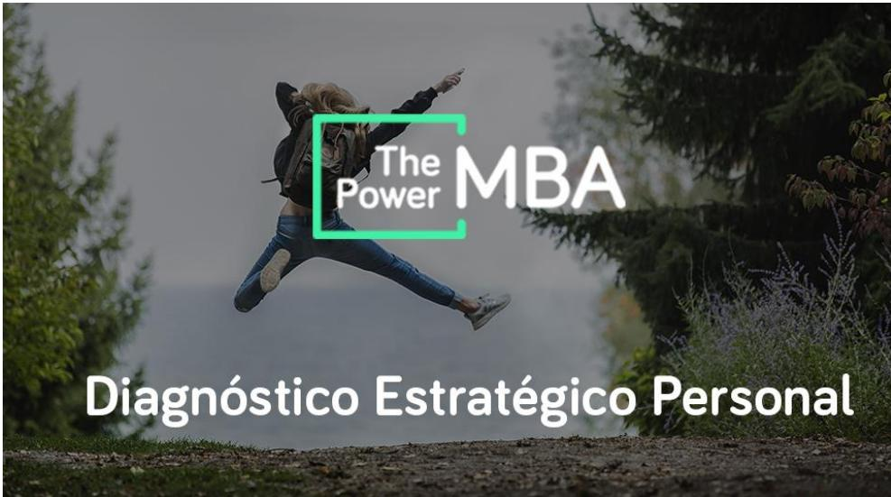
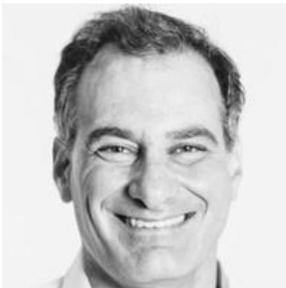

# Diagnóstico Estratégico Personal

Desarrollo Personal

Todas las empresas tenemos una visión, unos objetivos, unos planes para alcanzarlos y unos KPls para monitorizar la evolución. Sin embargo, a nivel personal muy pocas veces hacemos lo mismo. No tenemos planes y nos dejamos llevar por la corriente.

Cuando no tienes claros los objetivos, tus fortalezas, debilidades y motivaciones, es mucho más difícil alcanzar el ÉxItO.

## ¿QUÉ DEBERÍAMOS CONSEGUIR?

1. Tener muy claro a dónde queremos llegar.

2. Tener muy claras nuestras fortalezas, debilidades y motivaciones.

3. Ser conscientes de si nuestra situación laboral y profesional está alineada con nuestros objetivos y con nuestras capacidades.

4. Entender mejor nuestra personalidad y la de los de alrededor.

Para ello vamos a utilizar una serie de herramientas sencillas y prácticas que nos van a guiar en el camino. Somos conscientes de que existe mucho escepticismo alrededor de estas metodologías, sin embargo, son las herramientas utilizadas por los mejores coaches a nivel mundial. Así que te aconsejamos que afrontes este curso con la mente abierta y con ilusión.

  
EXPERTO INVITADO Carlos Puig Sagi - Vela

CEO de Nexus People, speaker y experto en metodologías de Desarrollo Profesional, Finanzas Personales y otras áreas de conocimiento.

“Debemos buscar una situación laboral I profesional que esté alineada con nuestras motivaciones y fortalezas, que colme nuestras expectativas y nos haga más felices."

Carlos Puig Sagi-Vela

## Clases

1. ANEXO: Herramientas utilizadas

2. La visión y objetivos

3. Nuestras fortalezas, debilidades y motivaciones

4. Descubre tus “superpoderes"

5. Qué tipo de personalidad tienes: test de los cuatro colores