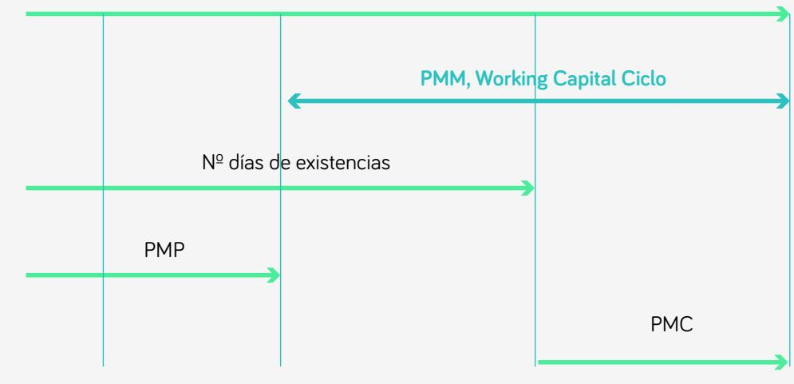

## RATIOS ANÁLISIS ESTADOS FINANCIEROS

<table><tr><td>SOLVENCIA</td><td>LIQUIDEZ</td></tr><tr><td>La solvencia es la capacidad de poder atender l los s pagos de deudas a largo</td><td>La liquidez es la capacidad de generar tesorería para poder atender los pagos de deudas a a corto</td></tr><tr><td>ACTIVOS LARGO PLAZO</td><td>TESORERÍA CORTO PLAZO</td></tr></table>

<table><tr><td rowspan=2 colspan=2>RATIOS DE SOLVENCIADeuda con costePasivo + Patrimonio Neto</td></tr><tr><td rowspan=1 colspan=1></td></tr><tr><td rowspan=1 colspan=1>Ratio Endeudamiento CP</td><td rowspan=1 colspan=1>Deudas a CPPasivo + Patrimonio Neto</td></tr><tr><td rowspan=1 colspan=1>Ratio Endeudamiento LP</td><td rowspan=1 colspan=1>Deudas a LPPasivo + Patrimonio Neto</td></tr><tr><td rowspan=1 colspan=1>Ratio Solvencia</td><td rowspan=1 colspan=1>Activo TotalPasivo Total</td></tr></table>

RATIOS DE LIQUIDEZ
<table><tr><td>Ratio de liquidez ratio de fondo de maniobra</td><td>Activo Corriente Pasivo Corriente</td></tr><tr><td>Acid Test</td><td>Activo corriente - existencias Pasivo corriente</td></tr><tr><td>Ratio de tesorería</td><td>Tesorería Pasivo corriente</td></tr><tr><td colspan="2" rowspan="1">MARGEN SOBRE VENTAS</td></tr><tr><td colspan="1" rowspan="1">Margen bruto</td><td colspan="1" rowspan="1">Margen BrutoVentas</td></tr><tr><td colspan="1" rowspan="1">Margen EBITDA</td><td colspan="1" rowspan="1">Margen EBITDAVentas</td></tr><tr><td colspan="1" rowspan="1">Margen EBIT</td><td colspan="1" rowspan="1">Margen EBITVentas</td></tr><tr><td colspan="1" rowspan="1">Margen Neto</td><td colspan="1" rowspan="1">Beneficios NetoVentas</td></tr></table>

## MARGEN SOBRE VENTAS POR SECTORES, PATRONES

<table><tr><td rowspan=1 colspan=1></td><td rowspan=1 colspan=1>Margen alto</td><td rowspan=1 colspan=1>Margen bajo</td></tr><tr><td rowspan=1 colspan=1>Volumen Ventas</td><td rowspan=1 colspan=1>Bajo</td><td rowspan=1 colspan=1>Alto</td></tr><tr><td rowspan=1 colspan=1>Ventaja competitiva</td><td rowspan=1 colspan=1>Diferenciación</td><td rowspan=1 colspan=1>Economías escala,Liderazgo en coste</td></tr><tr><td rowspan=1 colspan=1>Sensibilidad al precio</td><td rowspan=1 colspan=1>Baja</td><td rowspan=1 colspan=1>Alta</td></tr><tr><td rowspan=1 colspan=1>Valor añadido</td><td rowspan=1 colspan=1>Alto</td><td rowspan=1 colspan=1>Bajo</td></tr></table>

## RATIOS DE ACTIVIDAD-ROTACIÓN

<table><tr><td>Rotación del activo</td><td>Ventas Total activo</td></tr><tr><td></td><td></td></tr><tr><td>Rotación de existencias o inventario</td><td>Coste mercancías vendidas Existencias medias</td></tr></table>

## NECESIDADES OPERATIVAS DE FONDOS

Necesidades operativas de fondos

Ciclo de working capital / fondo de maniobra Periodo medio de maduración

\+ Existencias

\+ Clientes

\- Proveedores

## NOF

\+ Nº días Existencias

\+ Período medio de cobro

\- Periodo medio de pago

Ciclo Working Capital (días)

PAGO A PROVEEDORES

COMPRA DE ESTANCIAS

VENTA (SALIDA DE EXISTENCIAS)  
COBRO  
