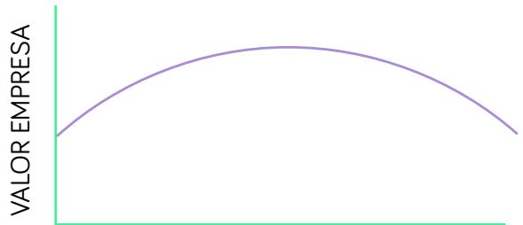

# CONCEPTOS CLAVE: FINANZAS

## VALOR ACTUAL / VALOR PRESENTE

QUE ÉS Valor en el momento actual de uno o varios Cash Flows futuros.

COMO SE CALCULA Descontando / actualizando esos flujos

## DESCONTAR / ACTUALIZAR

“Mover” un flujo de caja al presente, con el objetivo de calcular el valor presente de ese flujo/s.

Valor presente / Actual

Cash Flow

VALOR PRESENTE ACTUAL

CF FUTURO

(1 + I) n

## VALOR FUTURO

QUÉ ES Valor en un momento específico del futuro de uno o varios Flujos de Caja.

CÓMO SE CALCULA Capitalizando esos flujos

## CAPITALIZAR

“Mover” un flujo de caja al futuro, con el objetivo de calcular el valor de ese flujo en un momento futuro.

Cash Flow

Valor futuro

VALOR FUTURO = CF x (1 + I) n

Capitalizamos los flujos utilizando un interés simple:

• Los intereses se calculan sobre el capital inicial, no se acumulan.

• Solo genera intereses el capital inicial.

VALOR FUTURO = VALOR PRESENTE $\textsf { x } ( 1 + ( \textsf { l x n } )$

Capitalizamos los flujos utilizando un interés compuesto:

• Los intereses se calculan sobre el capital más los intereses acumulados

VALOR FUTURO = VALOR PRESENTE $\mathsf { x } \left( 1 + \mathsf { I } \right) \mathsf { n }$

## QUE ES

Es la tasa o tipo de interés que utilizamos para actualizar o descontar flujos futuros. Se representa habitualmente con la letra “k”. Otras veces con ${ \vec { \mathsf { I } } } ^ { n } \circ { \mathsf { \Omega } } ^ { \prime \prime } { \mathsf { d } } ^ { n }$

$$
{ \mathsf { V A L O R P R E S E N T E A C T U A L } } = \begin{array} { l l } { \frac { \mathsf { C F F U T U R O } } { ( 1 + k ) ^ { n } } } \end{array}
$$

## DE QUE DEPENDE

La tasa de descuento depende de la rentabilidad exigida a esa inversión.

DE QUE DEPENDE LA RENTABILIDAD EXIGIDA EN UNA INVERSIÓN:

<table><tr><td rowspan="2">TASA DESCUENTO =</td><td rowspan="2">INTERÉS SIN RIESGO</td><td rowspan="2">+ RIESGO</td></tr><tr><td>PRIMA</td></tr></table>

CÓMO AFECTA AL VALOR ACTUAL

• Si descontamos los flujos futuros a una mayor tasa de descuento, el Valor Actual de una inversión disminuye.

• Si descontamos los flujos futuros a una menor tasa de descuento, el Valor Actual de una inversión aumenta.

PARA QUE ENTIENDAS LA LÓGICA DETRÁS DE ESTA FÓRMULA…

$$
{ \mathsf { V A L O R P R E S E N T E A C T U A L } } = { \begin{array} { l l } { } & { { \frac { { \mathsf { C F F U T U R O } } } { ( 1 + 1 ) ^ { n } } } } \\ { } & { { \begin{array} { r l } { ( 1 + 1 ) ^ { n } } & { } \end{array} } } \end{array} }
$$

Vamos a ponernos en una situación ficticia:

Tienes que valorar dos inversiones en dos empresas distintas:

o Empresa de Real Estate, con poco riesgo

o Startup, con mucho riesgo

Como puedes ver a continuación, los Cash Flows futuros y previsibles son iguales

<table><tr><td rowspan="2">VAN = REAL STATE</td><td>100</td><td>100</td><td>100</td></tr><tr><td>(1 + k) 1</td><td>+ (1 + k)²2</td><td>+ (1 + k) 3</td></tr><tr><td rowspan="2">VAN STARTUP</td><td>100</td><td>100</td><td>100</td></tr><tr><td>(1 + k) 1</td><td>+ (1 + k)²</td><td>+ (1 + k) 3</td></tr></table>

Quiero que hagas la siguiente reflexión: “¿Qué vale más, 100k anuales con mucho riesgo, o 100k anuales con un riesgo muy bajo? ¿Por cuál estarías dispuesto a invertir más?”

La respuesta es sencilla.

## Repasemos:

1. Si el riesgo es mayor

2. Tenemos que exigir una rentabilidad mayor

3. Y descontaremos los CF futuros a una tasa mayor. Es lo que denominamos el $" { \mathsf { C O S t e } } ^ { \prime \prime }$ de esos fondos

4. Y por esta razón, el Valor Actual será menor

## VAN

## QUÉ ES

El VAN es el Valor Actual Neto de los Flujos de Caja que la inversión va a generar, descontados a una tasa de descuento (k) representativa de la rentabilidad exigida.

El VAN es un valor absoluto, medido en unidades monetarias. ES decir, no es un indicador de la rentabilidad (%)

## FÓRMULA

$$
\forall \mathsf { A N } \quad = \quad \mathsf { C F } _ { 0 } \quad + \quad \frac { \mathsf { C F } _ { 1 } } { ( 1 + \mathsf { k } ) ^ { 1 } } \quad + \frac { \mathsf { C F } _ { 2 } } { ( 1 + \mathsf { k } ) ^ { 2 } } \quad + \quad \ldots \quad + \quad \frac { \mathsf { C F } _ { n } } { ( 1 + \mathsf { k } ) ^ { n } } \quad
$$

## CUANDO SE UTILIZA

Indicador utilizado para valorar inversiones.

## CÓMO SE INTEPRETAN LOS RESULTADOS

• Si el VAN es >0 la rentabilidad esperada es superior a la exigida. El VAN es el valor económico creado “por encima” de la rentabilidad exigida.

• Si el VAN = 0 la rentabilidad esperada es igual a la exigida

• Si el VAN < 0 la rentabilidad es inferior a la exigida.

## TIR

## QUÉ ES

La TIR es la rentabilidad esperada (no la exigida) de una inversión.

## CÓMO SE CALCULA

1. Se proyectan los CF de una inversión

2. Se calcula la tasa de descuento que hace que el VAN sea cero, es decir, se calcula la rentabilidad de esa inversión.

$$
\begin{array} { r } { \boxed { \begin{array} { r c c c c c c c c c c c c c } { \boxed { } } & & & & & { = } & { - 1 } & { + } & { \displaystyle { \frac { \mathsf { C F } _ { 1 } } { ( 1 + \mathsf { T } | { \mathbb { R } } ) ^ { 1 } } } } & { + } & { \displaystyle { \frac { \mathsf { C F } _ { 2 } } { ( 1 + \mathsf { T } | { \mathbb { R } } ) ^ { 2 } } } } & { + } & { \ldots } & { + } & { \displaystyle { \frac { \mathsf { C F } _ { \mathsf { n } } } { ( 1 + \mathsf { T } | { \mathbb { R } } ) ^ { \mathsf { n } } } } } & { = } & { 0 } & \\ & & & & & & & & \end{array} } } \end{array}
$$

TIR

O visto desde otra perspectiva:

$$
\mathrm { ~ I ~ \ = ~ \ } \frac { C F _ { 1 } } { ( 1 + \mathsf { T } \mathsf { I } \mathsf { R } ) ^ { 1 } } + \frac { C F _ { 2 } } { ( 1 + \mathsf { T } \mathsf { I } \mathsf { R } ) ^ { 2 } } + \ \ldots + \frac { C F _ { n } } { ( 1 + \mathsf { T } \mathsf { I } \mathsf { R } ) ^ { n } }
$$

## CÓMO SE INTERPRETA

• Debes comparar la TIR con la rentabilidad exigida para la inversión. TIR vs k.

• Además, la TIR es un indicador de rentabilidad (%) que nos permite comparar inversiones.

## VAN vs TIR

Si el VAN >0, la rentabilidad es superior a la exigida, $\mathsf { T } | \mathsf { R } > \mathsf { K }$

Si el VAN =0, la rentabilidad es igual a la exigida, TIR = K

Si el VAN <0, la rentabilidad es mejor a la exigida, TIR < K

Es preciso tenerlo en cuenta porque hay métodos de valoración que estiman el Enterprise Value y otros el Equity Value (como el PER, por ejemplo).

ENTERPRISE VALUE = EQUITY VALUE + DEUDA

EQUITY VALUE = ENTERPRISE VALUE - DEUDA

Es posible que te resulte “contraintuitivo” que el Valor de una Empresa sea igual al valor de los Fondos Propios más el Valor de la Deuda Financiera Neta.

Quizás te ayude este razonamiento: “Imagina que obtienes 100 millones más de deuda, y por lo tanto tienes 100 millones más en Activos, ¿no crees que la empresa vale 100 millones más?”

## ENTERPRISE VALUE

Podemos realizar una clasificación de los métodos en 3 enfoques a partir de los cuales se puede estimar el valor de una empresa:

1. A partir del valor de sus Activos.

2. A partir del valor en el mercado de empresas comparables

3. A partir de los Cash Flows que va a generar

## EN QUÉ CONSISTE

Método de valoración que estima el valor de una empresa teniendo únicamente en cuenta el valor de los activos de la empresa.

## CÓMO SE CALCULA

A partir del sumatorio del valor de todos sus activos, al que podemos llegar a través de distintos métodos:

\- Valor Contable o Valor en Libros.

\- Valor Contable Neto (de Pasivos)

\- Valor Ajustado. En este caso ajustamos los valores contables al valor en el mercado, por ejemplo, si algunos activos no están contabilizados a su valor en el mercado.

\- Net Asset Value. Valor en el mercado de los activos neto de deudas.

## INCOVENIENTES

\- Aporta una perspectiva limitada, porque no tiene en cuenta lo que va a ocurrir en el futuro.

## VALORACIÓN POR MÚLTIPLOS

## EN QUÉ CONSISTE

Método de valoración que estima el valor de una empresa a partir del valor de compañías comparables en el mercado. Es decir, se estima el valor “por comparación en el mercado”.

## QUÉ SON LOS MÚLTIPLOS

Los múltiplos relacionan el valor con alguno de los principales indicadores de la empresa como las ventas, el EBITDA, Beneficio Neto, etc.

Algunos de los más importantes son:

Múltiplos sobre el Valor de la Empresa:

• EV / Ventas

• EV / EBITDA

Múltiplos sobre el Valor de los Fondos Propios:

• PER : Precio / Beneficio Neto

• Precio / Valor Contable

• Precio / Flujo de Caja

Cuando se habla de Precio se refiere a la cotización en empresas cotizadas.

## CÓMO SE HACE

\- Debes conocer cuales son los múltiplos que se utilizan en tu sector, es decir, ¿cómo se valoran las empresas en tu sector?

\- Analiza la valoración2 de empresas comparables

\- Valor Contable Neto (de Pasivos)

\- Valor Ajustado. En este caso ajustamos los valores contables al valor en el mercado, por ejemplo, si algunos activos no están contabilizados a su valor en el mercado.

\- Net Asset Value. Valor en el mercado de los activos neto de deudas.

## INCOVENIENTES

\- Aporta una perspectiva limitada, porque no tiene en cuenta lo que va a ocurrir en el futuro.

## ESTRUCTURA DEL CAPITAL

La estructura del capital determina la empresa financia su actividad y la proporción entre Equity y Deuda financiera.

## RATIO DEL

## APALANCAMIENTO

<table><tr><td>RATIO DE APALANCAMIENTO</td><td>Deuda</td></tr><tr><td>= (%)</td><td>Deuda + Equity</td></tr></table>

Acerca de la Deuda:   
- La genera intereses a un tipo de interés (i)   
- Los intereses son deducibles fiscalmente, por lo que nos beneficiamos de un escudo fiscal.   
- El coste para la empresa es i x (1-T)

## Acerca del Equity

- Incrementar el Equity no afecta al Cash Flow directamente.   
- Al Equity se le remunera con dividendos, pero no son contractuales.

## CÓMO AFECTA LA ESTRUCTURA DEL CAPITAL AL ROE O RENTABILIDAD DEL EQUITY

El incremento del apalancamiento incrementa el ROE debido al efecto del apalancamiento financiero. A mayor apalancamiento, mayor ROE.

Para que esto se cumpla la rentabilidad sobre los activos o de las inversiones que realicemos deberá ser superior al coste de la deuda.

## APALANCAMIENTO FINANCIERO

Efecto positivo sobre el ROE al incrementar la deuda

## CÓMO AFECTA LA ESTRUCTURA DEL CAPITAL AL RIESGO

La deuda genera un riesgo mientras que el equity no. Por lo tanto, a medida que incrementa el Ratio de Apalancamiento, incrementa el riesgo.

## CÓMO AFECTA LA ESTRUCTURA DEL CAPITAL A LA VALORACIÓN

La valoración de la empresa crece si incrementa el apalancamiento, hasta superar un punto en el que tanto el Equity (socios) como la Deuda (bancos), perciben que el riesgo es excesivo.

> **Figura**: Curva en forma de U invertida que relaciona el Valor de la Empresa (eje
> vertical) con el nivel de Apalancamiento (eje horizontal). El valor crece a medida
> que aumenta el apalancamiento (por el escudo fiscal de la deuda) hasta alcanzar un
> punto óptimo (máximo de la curva); a partir de ahí, más apalancamiento reduce el
> valor porque tanto el Equity (socios) como la Deuda (bancos) perciben un riesgo
> excesivo. Ilustra que existe una estructura de capital óptima.
APALANCAMIENTO

## EN QUÉ CONSISTE

Se estima el Valor de la Empresa o del Equity a partir de los Flujos de Caja que previsiblemente va a generar, descontados a una tasa de descuento que denominamos coste del capital.

$$
\mathsf { D C F } \quad = \quad \mathsf { C F } _ { 0 } \quad + \quad \frac { \mathsf { C F } _ { 1 } } { ( 1 + \mathsf { k } ) ^ { 1 } } \quad + \quad \frac { \mathsf { C F } _ { 2 } } { ( 1 + \mathsf { k } ) ^ { 2 } } \quad + \quad \ldots \quad + \quad \mathsf { V R }
$$

Son los fondos generados por una empresa, después de haber realizado las reinversiones necesarias en activos fijos y en necesidades operativas de fondos, considerando que no existe deuda, ni intereses.

Con el Free Cash Flow la empresa remunera a la estructura del capital:

\- Devolución de la Deuda y pago de los intereses

\- Y después a los accionistas con el pago de dividendos.

El CF de los accionistas son los fondos que quedan disponibles para los accionistas, después de haber hecho todas las reinversiones necesarias, haber devuelto la deuda, pagado los intereses, etc.

Estimamos el Valor de la Empresa descontando los FCF a una tasa de descuento representativa del coste medio ponderado de la estructura del capital, es decir, del Equity y la Deuda.

$$
\mathsf { E V } \qquad = \qquad \mathsf { F C F } _ { 0 } \ + \ \mathsf { \Gamma } \frac { \mathsf { F C F } _ { 1 } } { ( 1 + \mathsf { W A C C } ) ^ { 1 } } + \frac { \mathsf { F C F } _ { 2 } } { ( 1 + \mathsf { W A C C } ) ^ { 2 } } + \ \cdots + \qquad \mathsf { V R }
$$

El WACC pondera el coste del capital, es decir, del Equity (ke) y de la Deuda (kd X (1-T)) por el peso que tiene cada uno.

$$
W A C C = \frac { E } { D + E } ( K _ { e } ) + \frac { D } { D + E } ( K _ { e } ) ( 1 - t )\tag{KE}
$$

Coste de los Fondos Propios

KD

Coste de la Deuda

Estimamos el Valor de los Fondos Propios descontando los CF de los accionistas a una tasa de descuento representativa del coste o rentabilidad exigida por los accionistas (ke)

$$
\begin{array} { c c c c c c c c c c c c c c c c c c } { { \mathsf { E Q U I T Y } } } & { { } } & { { } } & { { } } & { { } } & { { } } & { { } } & { { } } & { { \mathsf { C F a c c } _ { 1 } } } & { { } } & { { } } & { { } } & { { } } & { { } } & { { } } & { { } } & { { } } & { { } } & { { } } & { { } } & { { } } & { { } } & { { } } & { { } } & { { } } & { { } } & { { } } & { { } } & { { } } & { { } } & { { } } & { { } } & { { } } & { { } } & { { } } & { { } } & { { } } & { { } } & { { } } & { { } } & { { } } & { { } } & { { } } & { { } } & { { } } & { { } } & { { } } & { { } } & { { } } & { { } } & { { } } & { { } } & { { } } & { { } } & { { } } & { { } } & { { } } & { { } } & { { } } & { { } } & { { } } & { { } } & { { } } & { { } } & { { } } & { { } } & { { } } & { { } } & { { } } & { { } } & { { } } & { { } } & { { } } & { { } } & { { } } & { { } } & { { } } & { { } } & { { } } & { { } } & { { } } & { { } } & { { } } & { { } } & { { } } & { { } } & { { } } & { { } } & { { } } & { { } } & { { } } & { { } } & { { } } & { { } } & { { } } & { { } } & { { } } & { { } } & { { } } & { { } } & { { } } & { { } } & { { } } & { { } } & { { } } & { } & { { } } & { } & { { } } & { } &   \end{array}
$$