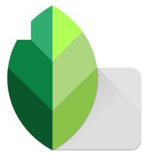
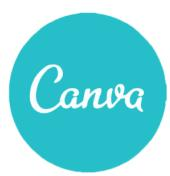
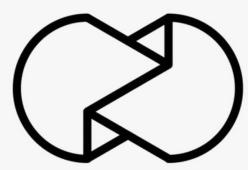
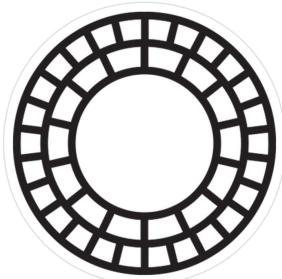
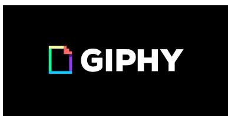
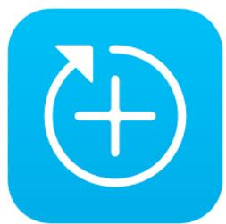

# Herramientas de creación de contenido para RRSS

## Infogr.am

infogr.am

## Snapseed

La herramienta además tiene preestablecidos varios temas que puedes ir personalizando. Si tu perfi l es sobre educación tienes tus propias características que irás poco a poco guardandolas y personalizándonas.

Una de las mejores aplicaciones apps para crear contenidos de redes sociales es infogr.am. Aplicación gratuita para crear infografías. Este tipo de contenido puede ser muy útil para por ejemplo explicar un proceso o dar ciertos datos. Infogr.am te ayuda gratuitamente a crear estas infografi as.

Snapseed es un editor de fotografías móvil disponible tanto en Android como Iphone, esta aplicación es de mis preferidas; con unas pocas modifi caciones podemos mejorar las fotografías, cuenta con una gran variedad de fi ltros y herramientas para sacar el mayor potencial de nuestras fotos. Google es el dueño de esta app, la cual en mi opinión es una gran opción para tener en tu teléfono siempre a mano.

## Canva

Desde aquí podrás diseñar presentaciones, gráfi cas, encabezados para Twitter o Facebook y mucho más. Una vez completado el registro pone a tu disposición multitud de imágenes, fi ltros para fotos, iconos y cientos de tipografías de forma gratuita. Tan sólo tendrás que combinar los diferentes elementos para hacer de tus gráfi cas e imágenes algo atractivo para tus seguidores.

Con esta herramienta diseñar gráfi cas es mucho más sencillo.

## Unfold

Unfold es una herramienta que nos ayudará desde nuestro dispositivo móvil a crear «historias», estos contenidos llegaron para quedarse y sirven para estar en contacto con nuestra audiencia. Son una forma fácil de compartir pensamientos y cada vez más personalidades de Instagram y Facebook se las ingenian para hacerlas sumamente llamativas, muchas de estas personas utilizan precisamente Unfold para lograr estos resultados.

## Vsco

Es uno de los editores de fotos más utilizados. Es una herramienta que tiene unos fi ltros adaptados a los estilos de edición actuales. Además, te permite trabajar efectos de luz, saturación o contraste entre otras opciones.

Y ahora pensareis pero si Instagram ya tiene las mismas opciones. Es que simplemente los efectos de VSCO Cam dan mejores resultados que los propios de Instagram.

VSCO Cam te permite crear fotografías de calidad a través de tu móvil de una manera sencilla, esa es una de sus mejores características.

## UN UM

## Unum

UNUM es una herramienta exclusiva de Instagram. Además de programar las publicaciones te asesora para que optimices el feed de tu cuenta. Muchas marcas o infl uencers tienen un feed de Instagram donde los colores están en orden y parece que todas las imágenes están en sintonía. Esto se debe a herramientas como UNUM, te permite editar tu feed y subir todas las fotos siguiendo el mismo estilo.

## Giphy

Giphy es un buscador de GIFs, que funciona indexando los GIFs más populares en la Web. Algo así como Google, pero solo de GIFs. Esos millones de imágenes dinámicas son organizadas para que los usuarios los encuentren y compartan fácilmente.

El sitio también permite diseñar tus propios GIFs. Además, presenta el trabajo de algunos artistas creadores de GIFs y trabaja con marcas para crear y promover contenido original.

Los GIFs se pueden compartir a través de Facebook, Twitter, Instagram, Pinterest, LinkedIn y otras redes sociales. Además, se pueden incluir en blogs, webs, correos electrónicos y hasta presentaciones de Power Point.

## Studio

Es una app de diseño. Te ayudará a crear composiciones bonitas y creativas. Tiene increíbles posibilidades pero deberás darle a la imaginación.

Es una app parecida a Canva pero en el móvil. Como hemos comentado crea tu línea editorial y continúa trabajándola. Puedes guardar tipografías para según el tipo de contenido, por ejemplo.