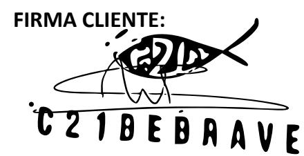

## ACCIÓN:''Campaña'C21BeBrave

## COLABORADORAS:

## DESCRIPCIÓN:

1. Story, día 13. Hacer un story enseñando el producto y dar a conocer la parte solidaria de C21BeBrave: han financiado durante 3 años seguidos la educación de todo un colegio en Togo. Decir que tienen un 30% de descuento por el día del padre con el código Link en el story a la web www.c21bebrave.com

2. Story el día 19. Enseñar que los relojes tienen correa intercambiable y pueden hacer la combinación que quieran. Recordar que es el último día para usar el código del 30%, poner link a la web www.c21bebrave.com en el story y recordar la parte solidaria de C21BeBrave.

3. Story exclusivo de C21BeBrave. No puede aparecer ninguna otra marca en el story que se hable de C21BeBrave.

4. En el story debe haber mención a @c21bebrave.

5. Pasar una foto de los datos y estadísticas del story de la aplicación de Instagram.

Todo#contenido#creado#por#las#colaboradoras#podrá#ser#utilizado#por#la#marca#exclusivamente en#sus#RRSS.

En#el#caso#de#que#la#marca/cliente#o#cualquier#otro#participante#de#la#acción,#tenga#interés#en utilizar# dicho# contenido# en# cualquier# otra# plataforma o# con# cualquier# otro# fin# (offline# media, newsletters,# paid# media,# web…)# tendrá# que# ser# comunicado# a# GO# ENFORCE# TALENT# SL# y# se establecerá#un#presupuesto#en#función#de#las#características#de#la#acción.

## CONDICIONES'DE'LA'PROPUESTA:

Los# servicios# prestados# de# asesoramiento,# gestión# y# promoción#por# GO# ENFORCE# TALENT# ST devengarán#en#un#importe#total#de más# el# IVA# que# en# su# caso# resulte# aplicable# por# la prestación#de#servicios#objeto#de#este#contrato.

El#cliente#abonará#dicha#cantidad#a#GO#ENFORCE#TALENT#SL##el#50%#del#pago#el#día#13#y#el#50% restante#en#un#plazo#máximo#de#30#días.

FIRMA'GO'ENFORCE'TALENT'SL