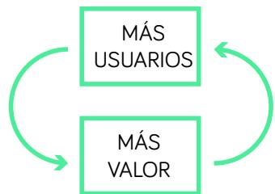
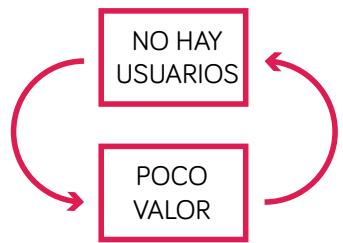

# CONCEPTOS CLAVE: PLATAFORMAS

## MODELO LÍNEAL

La entrega de valor se produce de forma lineal de la empresa a sus clientes. Es decir, la empresa vende productos o presta servicios a sus clientes.

## MODELO DE NEGOCIO DE PLATAFORMA

Las plataformas crean infraestructuras dentro de las cuales sus usuarios se aportan valor entre ellos. Por eso decimos que hay dos lados o dos segmentos de clientes.

## NETWORK EFFECT / EFECTO RED / ECONOMÍAS DE RED

Efecto que se produce en una plataforma debido a que el valor para todos los usuarios incrementa a medida que incrementa el número de usuarios.

Esto no ocurre en los modelos lineales, en los que el valor es independiente del número de clientes.

## CÍRCULO VIRTUOSO

Como consecuencia del network eect se produce un circulo virtuoso debido a que cuando ganas tracción y eres capaz de captar más usuarios que tus competidores, al aportar más valor, te ayudará a captar más usuarios.

## MASA CRÍTICA

Las plataformas empiezan a crear valor cuando alcanzan cierta masa crítica. Por ejemplo, en un Marketplace se empieza a generar valor a los compradores cuando hay “suficientes” vendedores, y viceversa.

## CÍRCULO VICIOSO

Visto desde la otra perspectiva, cuando no tienes usuarios, generas muy poco valor, lo que te dificultará crecer.

<table><tr><td>EL &quot;HUEVO Y LA GALLINA&quot;</td><td>Así se conoce al reto de superar o romper el círculo vicioso.</td></tr><tr><td>MARKETPLACE</td><td>Plataforma que conecta la oferta y la demanda de productos y servicios de diversos tipos.</td></tr><tr><td>CLASIFICADOS</td><td>Modelo de negocio que tuvo mucho auge. Actualmente el término está en “desuso”. Se trata de plataformas que agregan oferta y demanda, con una propuesta gratuita para el usuario, y que monetizan principalmente mediante publicidad. Encajaría dentro del modelo Free. Algunos clasificados han incorporado cuotas Premium. (ej: Wallapop, Vibbo, etc.).</td></tr><tr><td>ON-DEMAND PLATFORMS</td><td>Plataformas como Uber, Cabify, Mr Jeff, Clintu... que ofrecen un servicio integral. Conectan oferta y demanda, pero no con la misma libertad que un Marketplace. Por ejemplo, los precios los fijas la plataforma. Ganan dinero cobrando una comisión por cada transacción.</td></tr><tr><td>PLATAFORMAS DE CONTENIDO</td><td>Plataformas como Youtube, Yelp, Tripadvisor.. en las que unos pocos crean contenido que todos consumen. Corresponden principalmente al modelo Free. En algunos casos también incorporan servicios Premium.</td></tr><tr><td>MODELOS DE NEGOCIO FREE</td><td>Atraen a millones de usuarios con una propuesta gratuita. Monetizan a sus usuarios vendiendo los &quot;datos” y la &quot;atención” a empresas anunciantes.</td></tr><tr><td>MODELOS DE</td><td>Ofrecen un servicio básico gratuito que les permite captar millones de usuarios y un servicio premium de mayor valor a cambio de, habitualmente, un precio en</td></tr><tr><td>NEGOCIO</td><td>formato suscripción. A veces también cobran por el consumo de un servicio</td></tr><tr><td>FREEMIUM</td><td>puntual.</td></tr></table>