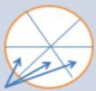
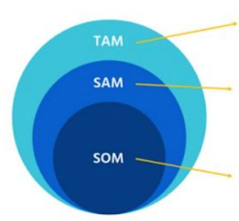
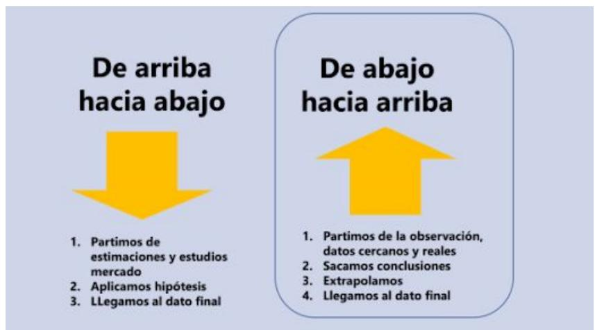

# Conceptos Clave Clientes y mercado objetivo

## Segmentación

La teoría dice que segmentar es analizar el total del mercado (o tus clientes actuales) para identificar grupos más pequeños con características comunes, que te permitan adaptar tu propuesta.

## La importancia de la segmentación

Ser muy bueno segmentando te va a ayudar a entender todo mucho mejor:quiénes son tus clientes, por qué, por qué te compran, por qué no te compran, cómo son, qué ven en ti, etc.

“¿Podrías dar respuesta ahora a todo esto?”

Y cuando tienes esa visión tan clara de tus clientes, lo que haces es adaptar tu propuesta,tus mensajes y tus canales.

Por cierto, todo el mundo sabe lo que es segmentar.   
Pero casi nadie sabe hacerlo bien.

Para ello tienes que conocer y entender todas las Variables de Segmentación, y saber aplicarlas en función del caso / empresa...

## Variables de segmentación

## ¿QUÉ ES?

Son los criterios que utilizas para segmentar. Es decir, “introduces” unos criterios y “te salen” segmentos

## ERROR HABITUAL

Habitualmente las empresas se quedan en las variables más convencionales: demográficas, geográficas, perfil, etc. Y se pierden muchas cosas.

NO tienen una foto completa. No entienden.

## CLAVES

Que las conozcan todas

● No todas se aplican a todos los casos.

<table><tr><td rowspan=1 colspan=2>VARIABLES DE SEGMENTACIÓNAnálisis Cliente</td></tr><tr><td rowspan=1 colspan=1>Geográfica</td><td rowspan=1 colspan=1>¿Dónde viven? País, ciudad..</td></tr><tr><td rowspan=1 colspan=1>Demográfica</td><td rowspan=1 colspan=1>¿Quienes son? Sexo, edad..</td></tr><tr><td rowspan=1 colspan=1>Firmográfica</td><td rowspan=1 colspan=1>¿Quienes son? Tipo de empresa, sector...</td></tr><tr><td rowspan=1 colspan=1>Psicográfica</td><td rowspan=1 colspan=1>¿Cómo son? Urbano, ijo...</td></tr><tr><td rowspan=1 colspan=1>Actitudinal</td><td rowspan=1 colspan=1>¿Cómo ven el mundo? Opiniones, reacciones, queconsideran importante...</td></tr></table>

## Cómo se utilizan

Geográfica.

En función del beneficio.

En función de si han comprado a un competidor.

Por sexo.

En función de cuántas veces nos han comprado.

En función de miles de cosas distintas.

Después tienes que utilizar toda esta información para algo. Es decir, tienes que adaptar la propuesta de valor, los mensajes o los canales.

## Segmentos vs Personas

Vamos a pasar de tener segmentos a identificar / crear una serie de personas ficticias que sean representativas de nuestros clientes más habituales y/o ideales. A estas personas vamos a llamarlas Customer Personas.

## Beneficios de Customer Personas (Vs Segmentos o targets)

Porque nos obliga a pensar en personas, que es al fin y al cabo nuestros clientes.

Porque es mucho más fácil el proceso de entenderles cuando te apoyas en personas que en segmentos. Ten en cuenta que los segmentos se pueden medir, pero las personas se pueden describir.

Porque es mucho más fácil el proceso de entenderles mejor cuando te apoyas en personas que en targets.

● Nos ayuda a tomar decisiones de Marketing.

Cuando conoces muy bien a tus clientes puedes mejorar todo:que venderle, como, mensajes más potentes, canales óptimos para llegar a ella, etc.

## Como crear tus Customer Personas:

La teoría dice que hay que hacer encuestas, analizar datos y demás…

## Te recomendamos que para crear los Customer

Personas te apoyes en gente real y cercana a ti, que sean buenos clientes o representativos de tu cliente ideal. Y los investigues.

¿A quién te resultaría más fácil venderle:a Luis, amigo tuyo de toda la vida, que le conoces bien,o a los jóvenes menores de 35 con unos ingresos medio superiores a los 40k€

## Segmentos Vs Customer Personas

Vamos a pasar de tener segmentos a identificar / crear una serie de personas ficticias que sean representativas de nuestros clientes más habituales y/o ideales. A estas personas vamos a llamarlas Customer Personas.

Para crear una propuesta, mensajes... tienes que pensar en alguien, ¿no?. Pues además de pensar en segmentos vamos a apoyarnos en Customer Personas.

A estas personas las llamamos Customer Personas.

## Customer persona, ¿es útil realmente?

El Customer Persona no solo es un plantilla con colorcitos. Es una herramienta que, bien hecha, ayuda a vender mucho más.

## DISCLAIMER

El problema es que es muy difícil de hacer bien. Y por eso mucha gente lo intenta, pero luego no lo utilizan. Y al final se queda en eso:una plantilla con colorcitos.

## Cómo saber quienes son tus Customer Personas

Se suele hacer de dos formas:

A. Cruzando variables de segmentación. Debes, por lo tanto, cruzar solo las variables más importantes.

B. A partir de alguno de tus clientes reales. Personas de carne y hueso. O empresas si estás en un modelo B2B.

## Qué información debemos analizar de cada customer persona

El objetivo no es rellenar una plantilla, sino tener información que te permita vender más.

Para hacerlo debes analizar a tus clientes desde muchas perspectivas.

Te dejamos un listado muy completo.

## Customer Persona: Conocerle mejor

## DATOS GENERALES DEMOGRÁFICOS

Dónde vive, edad, salario,clase social, sexo..

## BIOGRAFÍA

Descripción de su vida: donde trabaja, familia, su historia...

## PERFIL Y ESTILO DE VIDA

Describe cómo es, personalidad, aficiones, un día en su vida...

## ACTITUDES

¿Qué opinión tienen del mundo? ¿Qué cosas les parecen importantes?

## OBJETIVOS, PROBLEMAS, RETOS

¿Qué es importante? ¿Qué le preocupa? ¿Qué le duele? ¿Qué le gustaría cambiar? ¿Qué es lo que le importa?

## Customer Persona: Entender mucho más a fondo por qué nos compra

## QUÉ PROBLEMA QUIERE RESOLVER O QUE BENEFICIO BUSCA

Es decir, ¿para que nos compra? Tienes que ir al fondo del asunto.

## STOPPERS

¿Hay algo que le pare o le moleste?

## ALTERNATIVAS

¿Cómo trata de resolver esos problemas? ¿Confía en otras soluciones o empresas? ¿Está contento con ello?

## DE TODO LO QUE OFRECES, ¿QUÉ ES LO QUE REALMENTE LE ATRAE?

Seguro que tu producto genera beneficios diversos, pero... ¿cuál valora de verdad?

## ESFUERZOS Y COSTES

¿Qué esfuerzos, costes o sacrificios le genera tu producto? ¿Tiene que renunciar a algo?

## CÓMO NOS VE RESPECTO A LA COMPETENCIA

¿Cómo te percibe? ¿Qué le gusta o disgusta?¿Conoce a tus competidores? ¿A quiénes conoce? ¿Qué piensa de ellos? ¿Puedes aprender algo y mejorar?

Tienes que identificar todas las expresiones, palabras, ideas... que ya están en la mente de tu cliente. Acerca de todos los puntos anteriores.

QUÉ CANALES SON LOS MÁS ADECUADOS PARA LLEGAR

¿Qué medios o redes sociales utiliza? ¿A quien consulta? ¿Cómo podemos llegar a él/ella? ¿Cómo busca información? ¿hace búsquedas o tenemos que impactarle?

## CÓMO TOMA LA DECISIÓN

¿En que se fija? ¿Qué valora? ¿A quien pregunta? Analiza todo el Customer Journey.

## INFLUENCIADORES (Importante en B2B)

¿A quien consulta? ¿Cómo toma la decisión?

## CUÁNDO Y CÓMO USA NUESTRO PRODUCTO

Los distintos Customer Personas usarán tu producto para cosas distintas, en momentos distintos, de forma distinta... Es importante entenderlo.

## QUÉ ESPERA Y QUE OBTIENE

¿Se queda contento? ¿Superamos las expectativas? ¿Qué esperaba?

## FIDELIDAD

¿Es fiel o le da igual?

## RECOMENDACIÓN Y VIRALIDAD

¿Se lo recomiendan a alguien? ¿Cuándo, a quién y por qué?

Elección de los segmentos a los que dirigirte.

## ERROR HABITUAL

La gran mayoría de las empresas no conocen las implicaciones, ventajas e inconvenientes de cada estrategia. Y como consecuencia deciden a quién dirigirse de forma espontánea, sin haberlo pensado, y acaban cometiendo errores: no segmentar, dirigirte a varios segmentos, etc.

Estrategias corporativas de segmentación y targeting

<table><tr><td rowspan=1 colspan=1>MASS MARKET</td><td rowspan=1 colspan=2>SEGMENTADO</td><td rowspan=1 colspan=1>NICHO</td></tr><tr><td rowspan=1 colspan=1>¿Te estásdirigiendo a</td><td rowspan=3 colspan=2>¿Tienespropuestasadaptadas avariossegmentos?</td><td rowspan=3 colspan=1>Te diriges a unnicho muyespecífico.</td></tr><tr><td rowspan=1 colspan=1>todo el</td></tr><tr><td rowspan=1 colspan=1>mercado con lamisma oferta?</td></tr><tr><td rowspan=1 colspan=1></td><td rowspan=1 colspan=2></td><td rowspan=1 colspan=1></td></tr><tr><td rowspan=1 colspan=1>Es difícil sercompetitivo</td><td rowspan=3 colspan=2>Ojo conapuntar avarios</td><td rowspan=4 colspan=1>La mejoropción enmuuchasocasiones.</td></tr><tr><td rowspan=2 colspan=1>cuando nosegmentas.</td></tr><tr><td rowspan=1 colspan=1>segmentos y no</td></tr><tr><td rowspan=1 colspan=1></td><td rowspan=1 colspan=2>ser bueno enninguno.</td></tr></table>

COMPARATIVA MASS MARKET VS NICHO
<table><tr><td rowspan=1 colspan=1>RETOS</td><td rowspan=1 colspan=1>MASS MARKET</td><td rowspan=1 colspan=1>NICHO</td></tr><tr><td rowspan=1 colspan=1>Conocer y</td><td rowspan=3 colspan=1>Es más difícilconocer y conectarcon tus clientesporque dentro detu mercado habrágente muy distinta.</td><td rowspan=3 colspan=1>Es más fácil entender a tus clientesporque son homogéneos, porque ponesfoco absoluto en ellos.</td></tr><tr><td rowspan=1 colspan=1>entender a tus</td></tr><tr><td rowspan=1 colspan=1>clientes</td></tr><tr><td rowspan=1 colspan=1>Crear unapropuesta de valor</td><td rowspan=2 colspan=1>Es más difícilconvencer a todoel mundo.</td><td rowspan=2 colspan=1>Es más fácil desarrollar una propuestapara convencer a un nicho, porque losconoces bien y son homogéneos.</td></tr><tr><td rowspan=1 colspan=1>ganadora</td></tr><tr><td rowspan=1 colspan=1>Llegar a ellos deforma rentable</td><td rowspan=1 colspan=1>Tienes que llegar através de canalesmasivos.</td><td rowspan=1 colspan=1>Puedes elegir los canales en los queestán tus clientes, más segmentados.</td></tr><tr><td rowspan=2 colspan=1>Adquirir unaposición fuerte enel mercado</td><td rowspan=1 colspan=1>Es más difícil ganar</td><td rowspan=2 colspan=1>Más fácil ganar Market Share y crearbarreras de entrada.</td></tr><tr><td rowspan=1 colspan=1>cuota en unmercado grande.</td></tr></table>

## Estrategias de nicho

## EN QUÉ CONSISTE

Especializarte en un segmento /Customer Persona muy específico. A veces también puedes especializarte en un producto muy concreto (vs tus competidores que tienen gamas más amplias).

## POR QUÉ / VENTAJAS

Especializarte te permite conocer ese Customer Persona mejor que nadie. Y esto al finales una ventaja competitiva.

● Menor guerra competitiva porque a los

competidores les da igual que crezcas en ese nicho, no perciben amenaza.

● Puedes hacerte fuerte y crear un monopolio.

Habitualmente las empresas tienden a desenfocarse.

## CUÁNDO

La estrategia de nicho es especialmente recomendable cuando estás lanzando un nuevo modelo de negocio, producto o servicio, especialmente cuando es innovador (=riesgo alto).

## Foco en un nicho

“Busca un Customer Persona super específico (que busca un beneficio concreto, que tiene un problema concreto, que busca en ti algo concreto...) y crear una propuesta para él.”

## Early Adopters

## PROBLEMA HABITUAL

Las empresas crean sus propuestas de valor y mensajes intentando convencer a muchos segmentos de clientes. Y esto te lleva crear algo que no es potente realmente para nadie.

## SOLUCIÓN: PONER FOCO EN TUS CLIENTES IDEALES

Crea todo (propuesta y mensajes) pensando en tus early adopters, es decir, en tus clientes ideales, aquellos con los que tu propuesta encaja a la perfección.

## CÓMO IDENTIFICARLOS

Tienes que encontrar el Customer Persona o nicho en el que ocurra lo siguiente:

Es muy fácil venderles.

● Como compradores no te juzgan.

● Te dan las gracias.

Muestran su entusiasmo.

## Foco en tus Early Adopters

“De todos los nichos o Customer Personas lo mejor es centrarte de forma estricta en aquellos con los que tu propuesta encaja a la perfección. Es decir, que el “match” sea brutal.”

## Están buscando vs NO están buscando

## PROBLEMA HABITUAL

Todas las empresas se dirigen (como borregos) a los mismos clientes. Además se dirigen a clientes que ya están buscando un producto o servicio en el mercado. Consecuencias:

Mercado limitado

● Te pones a competir con todos los demás.

## SOLUCIÓN

Dirigirte a clientes que NO están buscando

<table><tr><td rowspan=1 colspan=1></td><td rowspan=1 colspan=1>ESTÁN BUSCANDO</td><td rowspan=1 colspan=1>NO ESTÁN BUSCANDO</td></tr><tr><td rowspan=1 colspan=1>Tamaño delmercado</td><td rowspan=1 colspan=1>20% del total</td><td rowspan=1 colspan=1>80% del total</td></tr><tr><td rowspan=1 colspan=1>¿Qué hacen?</td><td rowspan=1 colspan=1>Ya están buscando unasolución. Tiene claro lo quequiere, conoce la oferta y estácomparando</td><td rowspan=1 colspan=1>No están buscando y noconocen la oferta porque:• No sienten el problema/ necesidad•  Sienten la necesidadpero no se han puestoa buscar</td></tr><tr><td rowspan=1 colspan=1>Prob. de cerraruna venta</td><td rowspan=1 colspan=1>Baja.Tienes que competir contodos los demás. Te pones a lacola</td><td rowspan=1 colspan=1>Alta.Si eres el primero que lesgenera la necesidad y teposicionas como la solución oproducto de referencia turatio de conversión será muyalto</td></tr><tr><td rowspan=2 colspan=1>Reto</td><td rowspan=1 colspan=1>Si tienes una ventajacompetitiva ganarás cuota.</td><td rowspan=2 colspan=1>Tienes que encontrarles,generar la necesidad yconvencerles. Pero si loconsigues la oportunidad esenorme</td></tr><tr><td rowspan=1 colspan=1>Sino, serás una &quot;empresamás&quot; en un océano rojo</td></tr></table>

## TAM SAM SOM

Modelo que ayuda a estimar el tamaño del mercado

  
Total Addressable Market  
Service Addressable Market  
Service Obtainable Market

> **Figura**: Diagrama del modelo TAM/SAM/SOM como tres círculos concéntricos. **TAM** (Total Addressable Market, exterior, azul claro): el mercado total potencial si el producto pudiera capturar al 100% sin restricciones. **SAM** (Serviceable Addressable Market, intermedio, azul medio): el subconjunto del TAM al que el modelo de negocio puede realmente servir con su propuesta actual (geografía, canal, regulación). **SOM** (Serviceable Obtainable Market, núcleo, azul oscuro): el subconjunto del SAM que el modelo razonablemente puede capturar dadas competencia, recursos y ventajas competitivas reales. La estructura concéntrica hace explícito que el mercado realista es siempre una fracción pequeña del mercado total, y que confundir TAM con SOM es la base de la falacia del 1%.  
Falacia del 1% / Cuento de la lechera

1. En china hay 1,3 miles de millones de personas

2. Vamos a vender al 1%... ¡Nos vamos a forrar!

3. Bueno, seamos prudentes, vamos a vender al 0,1%...¡Nos vamos a forrar!

4. Y llegas allí, y vendes a CERO chinos, porque ningún chino quiere comprar

> **Figura**: Diagrama comparativo de los dos enfoques de estimación del tamaño de mercado. **De arriba hacia abajo** (top-down, flecha amarilla descendente): 1) partir de estimaciones y estudios de mercado, 2) aplicar hipótesis (típicamente un % asumido), 3) llegar al dato final. Es el enfoque que conduce a la falacia del 1%. **De abajo hacia arriba** (bottom-up, flecha ascendente, recomendado): 1) partir de la observación, datos cercanos y reales, 2) sacar conclusiones, 3) extrapolar, 4) llegar al dato final. La fuente recomienda incorporar siempre el enfoque bottom-up para evitar estimaciones desconectadas de la realidad observable.

Cómo estimar el tamaño del mercado: Dos enfoques

Para no caer en estimaciones poco reales aconsejamos incorporar el enfoque de abajo hacia arriba, es decir, partir de la observación de lo que ya ha ocurrido cerca de ti.