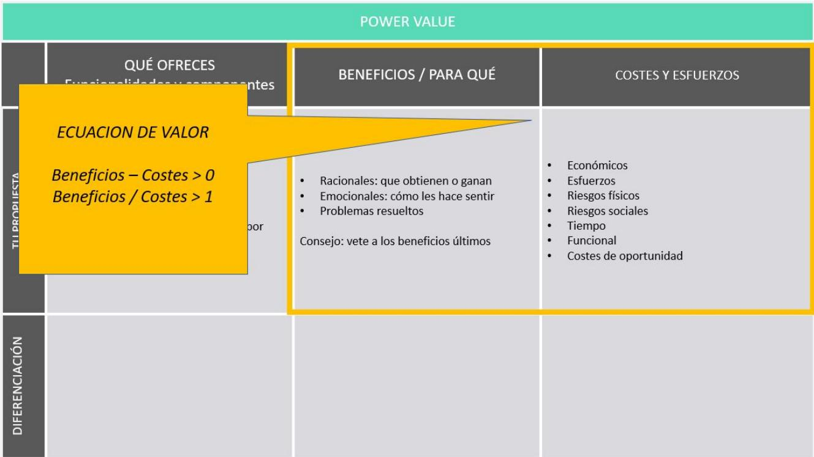
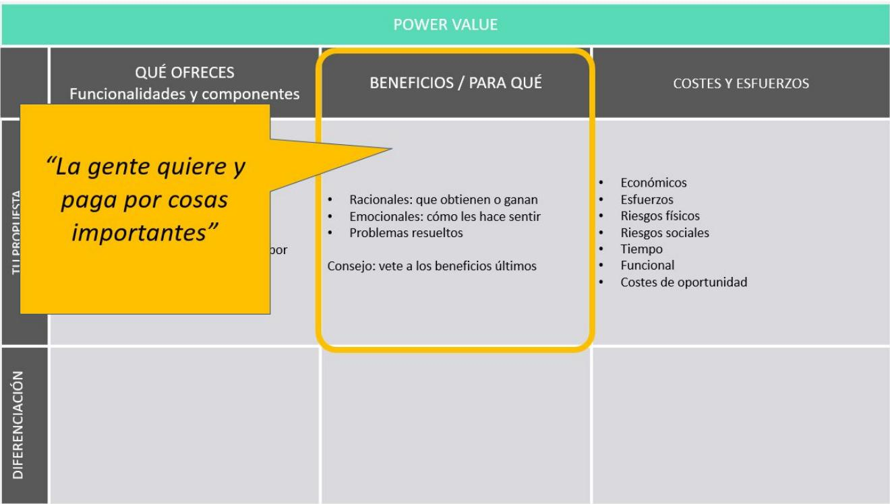
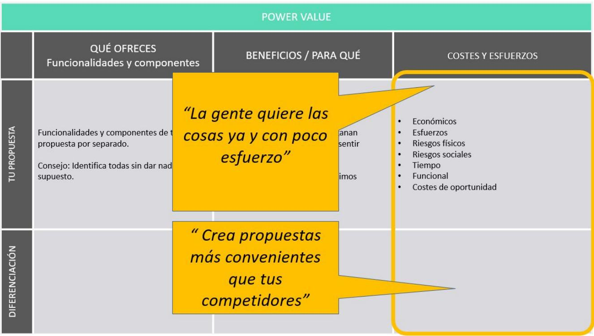

# Conceptos Clave PROPUESTAS DE VALOR

## Propuesta de valor ¿QUE ÉS?

Es el “valor generado” a tus clientes. ¿Y de qué depende?

De muchas cosas: qué beneficios les generas, cómo les haces sentir, cómo te perciben respecto a las alternativas y competidores, cuánto les cuesta económicamente, qué otros esfuerzos tienen que hacer, etc.

## Modelo Power Value

## QUÉ ES y PARA QUÉ SIRVE

Un modelo que estructura de forma muy sencilla los componentes de una propuesta de valor. Te va ayudar analizar la propuesta de cualquier empresa, evolucionar tu propuesta actual o innovar y crear propuestas disruptivas que revolucionen sectores.

## POR QUÉ LO HEMOS CREADO

Porque la gran mayoría de la gente nunca ha analizado de qué se compone una propuesta de valor, o cuáles son las claves para crear propuestas potentes. Y así es difícil crear o innovar.

“Para innovar, ser mejor que los demás o   
incluso revolucionar un sector no hace falta ser muy creativo ni un visionario,   
solo tienes que entender los modelos que te permiten ver las cosas muy claras”

Ecuación de valor

Beneficios – Costes > 0, o Beneficios / Costes > 1

<table><tr><td colspan="4" rowspan="1">POWER VALUE</td></tr><tr><td colspan="1" rowspan="1"></td><td colspan="1" rowspan="1">QUÉ OFRECESFuncionalidades y componentes</td><td colspan="1" rowspan="1">BENEFICIOS / PARA QUÉ</td><td colspan="1" rowspan="1">COSTES Y ESFUERZOS</td></tr><tr><td colspan="1" rowspan="1">O RL</td><td colspan="1" rowspan="1">Funcionalidades y componentes de tupropuesta por separado.Consejo: Identifica todas sin dar nada porsupuesto.</td><td colspan="1" rowspan="1">Racionales: que obtienen o gananEmocionales: cómo les hace sentirProblemas resueltosConsejo: vete a los beneficios últimos</td><td colspan="1" rowspan="2">EconómicosEsfuerzosRiesgos físicosRiesgos socialesTTempoFuncionalCostes de oportunidad</td></tr><tr><td colspan="1" rowspan="1">CAININ</td><td colspan="1" rowspan="1"></td><td colspan="1" rowspan="1"></td></tr><tr><td colspan="1" rowspan="1">O SL</td><td colspan="1" rowspan="1">Funcionalidades y componentes de tupropuesta por separado.Consejo: Identifica todas sin dar nada porsupuesto.</td><td colspan="1" rowspan="2">Racionales: que obtienen o gananEmocionales: cómo les hace sentirProblemas resueltosConsejo: vete a los beneficios últimos</td><td colspan="1" rowspan="2">EconómicosEsfuerzosRiesgoss físicosRiesgos socialesTempoFuncionalCostes de oportunidad</td></tr><tr><td colspan="1" rowspan="1">CAIN</td><td colspan="1" rowspan="1"></td></tr></table>

## Tipos de beneficios

Es útil entender que un producto o servicio puede generar a la vez distintos tipos de beneficios:

Funcionales: que obtiene desde un punto de vista objetivo: ahorrar, adelgazar, reparar un grifo, aprender inglés, simplificar procesos…

Emocionales: ¿Cómo te hace sentir? Libre, valiente, feliz, atractivo, seguro, listo, práctico, ahorrador, triunfador...

Problemas resueltos. A veces es más intuitivo pensar en los problemas que resuelves (vs los beneficios que generas).

1. Debes tener muy claro cuáles son los beneficios que buscan en ti tus clientes. Acuérdate que es parte importante de la investigación del cliente (segmentación, Customer Persona, etc. ).

Te aseguramos que el 90% de la gente realmente no tiene claro qué buscan sus clientes o por qué les compran.

2. La gente paga por cosas importantes como ser más feliz, tener más tiempo, sentirse mejor, etc.

3. No te olvides de los beneficios emocionales. A las personas nos mueven más las emociones que la razón.

“La gente, aunque no sea capaz de verlo de primeras, se mueve por cosas muy básicas, importantes o primitivas. Y todo lo demás son medios para conseguirlas”

Es una reflexión “cosecha propia” pero muy transformadora que nos ayuda a crear propuestas de valor potentes.

## ¿COSAS IMPORTANTES?

Ser más feliz

● Tener más tiempo o más libertad

Sentirte mejor

● Verte mejor físicamente

Destacar sobre los demás, igual te suena mal...   
Industria moda, o automóvil..

Superar tus miedos o ganar seguridad

Ligar, el sexo... La industria del sexo es multimillonaria

Sentirte parte de algo

Divertirte

Sentirte mejor persona

● Vivir a gusto

## ERROR HABITUAL

Las empresas hablan de cosas sin importancia para el cliente: sus funciones y características, su diferenciación con la competencia, etc.

## PARA QUE TE VA A SERVIR

Si vas a crear una nueva propuesta de valor te servirá para enfocarte en propuestas que generen beneficios importantes. Por ejemplo: mejor crear un SW que ayude a los empresarios a ganar más dinero que un SW que ayude a optimizar el rendimiento de sus equipos informáticos.

Te va a ayudar muchísimo para crear copys, anuncios, webs, discursos… que vendan.

## Costes y esfuerzos

## ERROR HABITUAL

Pensar que el coste asociado a tu propuesta de valor es solo económico.

## VISIÓN MÁS AMPLIA DEL COSTE

Identifica todos los costes: económicos directos e indirectos, riesgos sociales, físicos, incomodidades, coste de oportunidad, etc.

## ¿POR QUÉ?

Porque reducir el precio afecta a los márgenes, pero si eres capaz de reducir el resto de costes, incrementarás el valor sin afectar al margen.

## ERROR HABITUAL

Pensar que tu competencia son solo las empresas que hacen lo mismo que tu.

## VISIÓN MÁS AMPLIA DE LA COMPETENCIA

Tus competidores son todas las alternativas a las que recurren tus clientes para dar solución a ese problema u obtener un beneficio similar. Por ejemplo, el cine compite con “salir a cenar” y con “quedarte en casa viendo una peli en Netflix”.

## ‘’La gente quiere las cosas ya y con poco esfuerzo’’

Porque si lo tienes claro te enfocarás en reducir los costes asociadas a tu propuesta de valor y crear propuestas más convenientes   
Porque te va ayudar a crear mensajes potentes para vender más, al hacer alusión a cómo has reducido los costes.

<table><tr><td rowspan=1 colspan=4>POWER VALUE</td></tr><tr><td rowspan=1 colspan=1></td><td rowspan=1 colspan=1>QUÉ OFRECESFuncionalidades y componentes</td><td rowspan=1 colspan=1>BENEFICIOS / PARA QUÉ</td><td rowspan=1 colspan=1>COSTES Y ESFUERZOS</td></tr><tr><td rowspan=1 colspan=1>O RE</td><td rowspan=1 colspan=1>Funcionalidades y componentes de tupropuesta por separado.Consejo: Identifica todas sin dar nada porsupuesto.</td><td rowspan=1 colspan=1>Racionales: que obtienen o gananEmocionales: cómo les hace sentirProblemas resueltosConsejo: vete a los beneficios últimos</td><td rowspan=2 colspan=1>EconómicosEsfueerzosRiesgos físicosRiesgos socialesTiempoFuncionalCostes de oportunidad</td></tr><tr><td rowspan=1 colspan=1>CAEIIN</td><td rowspan=1 colspan=1></td><td rowspan=1 colspan=1></td></tr></table>

> **Figura**: Plantilla del modelo Power Value (canvas de 2×3). Filas: «Tu propuesta» y «Diferenciación». Columnas: «Qué ofreces / Funcionalidades y componentes», «Beneficios / Para qué», «Costes y esfuerzos». La columna de beneficios se desagrega en racionales (qué obtienen o ganan), emocionales (cómo les hace sentir) y problemas resueltos —con el consejo «vete a los beneficios últimos»—. La columna de costes se desagrega en económicos, esfuerzos, riesgos físicos, riesgos sociales, tiempo, funcional y costes de oportunidad. La ecuación de valor, resaltada sobre el canvas: **Beneficios − Costes > 0** o equivalentemente **Beneficios / Costes > 1**. Las siguientes dos imágenes son la misma plantilla con quotes distintas («La gente quiere y paga por cosas importantes» sobre beneficios; «La gente quiere las cosas ya y con poco esfuerzo» y «Crea propuestas más convenientes que tus competidores» sobre costes) — no aportan estructura adicional al canvas.

