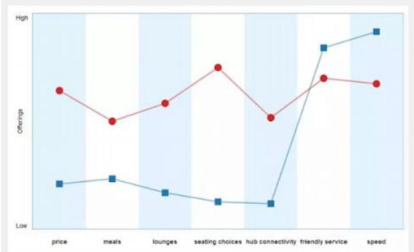
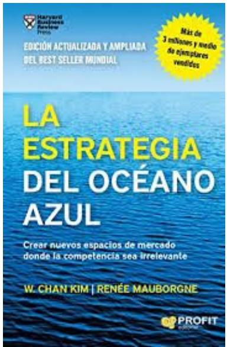
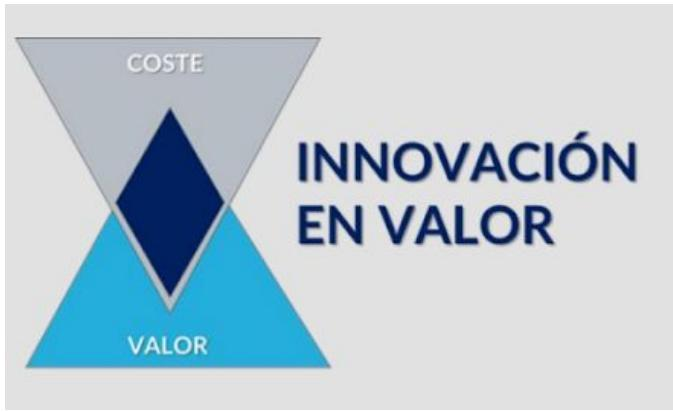
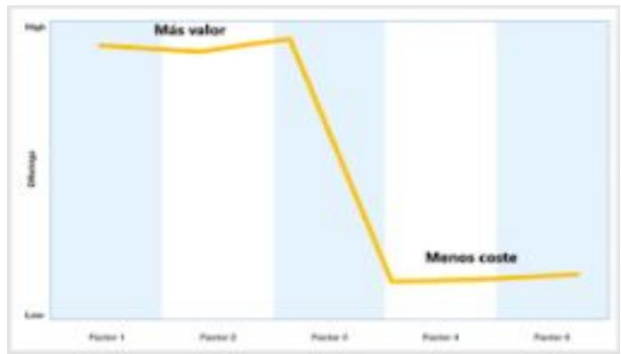
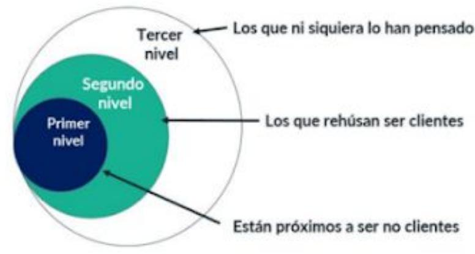

# Conceptos Clave COMO CREAR PROPUESTAS DE VALOR DISRUPTIVAS Y BUSCAR PARA TU OCÉANO AZUL

## Factores competitivos

Son los factores alrededor de los que gira la competencia y que son específicos de cada sector (precio, calidad, servicio,diseño, etc.).

Visto desde otra perspectiva, son los factores en los que invierten las empresas de ese sector para ofrecer un valor a sus clientes.

Ejemplo en el sector de la restauración: Localización, decoración, la calidad de la comida, chef reconocido, precio, ambiente, etc.

Ejemplo en el sector automóvil: marca, precio, motor, diseño, amplitud de gama, etc.

## Curva de valor

La curva de valor representa el valor ofrecido por los competidores dentro de un sector en cada uno de los factores competitivos.

## MÁS VALOR = MÁS INVERSIÓN

Es importante entender que un punto más alto representa una mayor inversión y un mayor valor. Es decir, en este caso,el competidor representado en rojo está invirtiendo más y generando más valor para todos los factores competitivos excepto para los dos últimos.

## ¿A quién vamos a analizar?

## Puedes dibujar las curvas de:

La industria / sector en general. En muchos casos todas las empresas dentro de un sector tienen un comportamiento muy similar.

Segmentos de competidores. Por ejemplo, los competidores low-cost.

Competidores concretos.

## Curva de valor. ¿Por qué es una herramienta tan potente?

## Porque nos ayuda de forma muy visual y sencilla a:

Entender la dinámica competitiva de cualquier sector: ¿alrededor de qué factores gira la competencia? ¿qué es lo importante?

Entender a tus competidores, ¿qué está haciendo el resto?

Entender tu propuesta y tu diferenciación

● Buscar tu diferenciación.

## Matriz Rice

## PARA QUÉ SIRVE

La Matriz Rice es una herramienta que ayuda a crear o evolucionar propuestas de valor, buscando la

diferenciación.

## CÓMO FUNCIONA

El objetivo es buscar la diferenciación o la disrupción, por lo tanto, no podemos tener una curva similar a los demás. Y por ello tenemos que:

Dejar de poner foco en cosas que están haciendo los demás. Para ello tendrás que disminuir la inversión (y el valor)en algunos factores competitivos mediante REDUCIR Y ELIMINAR.

Poner más foco en algunos factores concretos, incrementando la inversión (y el valor). INCREMENTAR Y CREAR.

<table><tr><td rowspan=1 colspan=1>REDUCIR</td><td rowspan=1 colspan=1>INCREMENTAR</td></tr><tr><td rowspan=1 colspan=1>¿Qué variables podemos reducermuy por debajo de la industria?</td><td rowspan=1 colspan=1>Qué variablespodemosincrementar muy por encima dela industria?</td></tr><tr><td rowspan=1 colspan=1>ELIMINAR</td><td rowspan=1 colspan=1>CREAR</td></tr><tr><td rowspan=1 colspan=1>¿Qué variables podemoseliminar?</td><td rowspan=1 colspan=1>¿Qué variables podemosincorporar o crear?</td></tr></table>

La estrategia del océano azul, es un libro creado en 1990 por W .Chan Kim y Renée Mauborgne, profesores de INSEAD.

Los autores afirman que para que las compañías sean exitosas deben dejar de competir en el océano rojo, es dejar, “dejar de competir”, y centrarse en crear nuevos espacios de mercado. La estrategia del océano azul es una metodología práctica que incorpora modelos y herramientas diseñadas para guiar a las empresas hacia su océano azul.

## Océano Rojo

Decimos que los sectores / industrias se han teñido de rojo debido a que la competencia (especialmente en la fase de Madurez) genera guerras de precios, necesidad sistemática de micro segmentar y diferenciarte…

Todo ello repercute de forma negativa en las rentabilidades y limita la capacidad de crecimiento.

Todas las industrias funcionan como océanos rojos debido a que todos las empresas competidores actúan “como borregos”:

Se dirigen a los mismos segmentos de clientes, es decir, todos luchan por los mismos clientes

Y además con propuestas muy parecidas. Casi por inercia se imitan unos a los otros

## Océano Azul

Un océano azul es un nuevo espacio de mercado, en el que no tienes competencia directa, lo que te permite crecer rápidamente y obtener unas

rentabilidades muy superiores a las habituales en un océano rojo.

## Claves para crear un Océano Azul

Hemos resumido la metodología original en dos herramientas o claves:

1. Buscar la INNOVACIÓN EN VALOR vs competir para ser mejor o más barato

2. Pensar en NO CLIENTES.

## Innovación en valor

La estrategia competitiva tradicional propone que para competir hay que elegir entre dos fuentes de ventaja competitiva,buscar la diferenciación (mayor valor) o el menor coste.

Sin embargo, la estrategia del océano azul propone un enfoque distinto. Afirma que para crear un océano azul debemos buscar simultáneamente ofrecer un mayor valor a un menor coste.

## Como crear innovación en valor

Apoyándonos en la Matriz Rice:

● Más valor al INCREMENTAR Y CREAR.

● Menos coste al REDUCIR Y ELIMINAR.

<table><tr><td rowspan=1 colspan=1>REDUCIR</td><td rowspan=1 colspan=1>INCREMENTAR</td></tr><tr><td rowspan=1 colspan=1>¿Qué variables podemos reducermuy por debajo de la industria?</td><td rowspan=1 colspan=1>Qué variables podemosincrementar muy por encima dela industria?</td></tr><tr><td rowspan=1 colspan=1>ELIMINAR</td><td rowspan=1 colspan=1>CREAR</td></tr><tr><td rowspan=1 colspan=1>¿Qué variables podemoseliminar?</td><td rowspan=1 colspan=1>¿Qué variables podemosincorporar o crear?</td></tr></table>

  
Pensar en no clientes

La Estrategia del Océano Azul y afirma que las empresas dentro de un sector, habitualmente se dirigen todas a los mismos segmentos de clientes y nos propone que dejemos de competir frontalmente con la competencia y busquemos nuevos espacios de mercado.

Además, clasifica los niveles de NO Clientes en tres:

  
©W.C. Kim & R. Mauborgne, 2005.