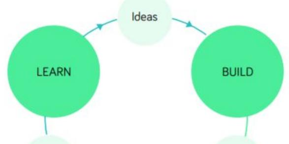
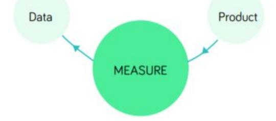
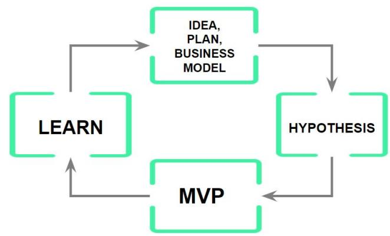

## EL MÉTODO LEAN STARTUP RECURSOS

## LEAN STARTUP

## Qué es y para qué sirve

Metodología creada por Eric Ries que te ayuda a afrontar cualquier tipo de proyecto (desde una pequeña decisión hasta la creación de una empresa) en el que haya cierto grado de innovación / riesgo.

\- Los beneficios son múltiples:

Disminuir el riesgo de fracasar

Disminuir la inversión necesaria, en tiempo y dinero

Maximizar las oportunidades de “encontrar” un modelo de éxito

Crear modelos de negocio y productos más potentes

Etc.

## Innovar vs competir

## Innovar vs competir

Siempre que exista cierto grado de innovación o riesgo tienes que aplicar los principios y método de Lean Startup a rajatabla.

Hemos creado un sencillo modelo en el que comparamos dos tipos de decisiones de negocio: Innovar y Competir.

<table><tr><td rowspan=1 colspan=1></td><td rowspan=1 colspan=1>POCA INCERTIDUMBRECompetir</td><td rowspan=1 colspan=1>MUCHA INCERTIDUMBRECrear, innovar</td></tr><tr><td rowspan=1 colspan=1>CRITERIOS</td><td rowspan=1 colspan=1>Sabes lo que va a pasar.</td><td rowspan=1 colspan=1>NO sabes lo que va a pasar..</td></tr><tr><td rowspan=1 colspan=1>SITUACIONES</td><td rowspan=1 colspan=1>•  Entrar o competir en unmercado existente conclientes, competidores, etc.Ej.: restaurante, gafas de sol tipoHawkers, tienda online de zapatillasde deporte, etc</td><td rowspan=1 colspan=1>•  Crear algo nuevo en unmercado no existente• Entrar en un mercadoexistente con una propuestade valor rompedoraEj.: ThePowerMBA, Shazam, Zappos</td></tr><tr><td rowspan=1 colspan=1>RETO</td><td rowspan=1 colspan=1>Competir: Ganar cuota de mercado</td><td rowspan=1 colspan=1>Product Market Fit: crear algo que lagente quiera</td></tr><tr><td rowspan=1 colspan=1>RIESGO</td><td rowspan=1 colspan=1>Bajo</td><td rowspan=1 colspan=1>Muy alto</td></tr><tr><td rowspan=1 colspan=1>HABILIDADESY MÉTODOSNECESARIOS</td><td rowspan=1 colspan=1>Gestión tradicional: Plan denegocios, estudio de mercado,ventaja competitiva, cuantificaciónde mercado...</td><td rowspan=1 colspan=1>Lean startup: método diseñado parala innovación</td></tr></table>

## CAMINO AL FRACASO

## Camino al fracaso

Hay una serie de errores que cometen en su día a día millones de empresarios y empresas y que a menudo los llevan al fracaso.

<table><tr><td rowspan=1 colspan=1>LO QUE HACEN TODOSCamino al fracaso</td><td rowspan=1 colspan=1>LEAN STARTUPPrincipios subyacentes de lametodología</td></tr><tr><td rowspan=1 colspan=1>Plan de negocios (estudio de mercado)</td><td rowspan=1 colspan=1>No pensar demasiadoAprendizaje validado</td></tr><tr><td rowspan=1 colspan=1>Asumir que sabes lo que va a pasar</td><td rowspan=1 colspan=1>Asumir que te vas a equivocar</td></tr><tr><td rowspan=1 colspan=1>Pedir consejo a «expertos» O «amigos»</td><td rowspan=1 colspan=1>Cuando es muy innovador, solo importa elaprendizaje validado con clientes reales</td></tr><tr><td rowspan=1 colspan=1>Aplazar la fecha de lanzamiento y el contactocon clientes para intentar crear el productoperfecto</td><td rowspan=1 colspan=1>Dejar la construcción y empezar a aprendercuanto antes</td></tr><tr><td rowspan=1 colspan=1>No decir nada a nadie</td><td rowspan=1 colspan=1>Validar cuanto antes</td></tr><tr><td rowspan=1 colspan=1>Conseguir tracción temprana</td><td rowspan=1 colspan=1>El único objetivo es aprender, el resto sobra</td></tr><tr><td rowspan=1 colspan=1>Métricas vanidosas</td><td rowspan=1 colspan=1>Métricas accionables</td></tr></table>

## Ciclo de aprendizaje

El ciclo definido por Eric Ries se llama Build Measure Learn.

> **Figura**: Las dos imágenes anteriores son fragmentos del ciclo canónico **Build-Measure-Learn** definido por Eric Ries. El bucle completo conecta cuatro nodos: **IDEAS** (punto de partida), **BUILD** (construir el MVP a partir de las ideas), **MEASURE** (medir comportamiento real, con Data y Product como inputs), y **LEARN** (extraer aprendizaje validado de los datos para volver a generar Ideas refinadas). El ciclo es iterativo: cada vuelta debe ser lo más corta posible para acelerar el aprendizaje.

Nosotros hemos cambiado la terminología, pero la esencia y funcionamiento es exactamente igual.

> **Figura**: Variante del ciclo Build-Measure-Learn rebautizada por The Power MBA, manteniendo la misma mecánica. Cuatro nodos en bucle: **IDEA, PLAN, BUSINESS MODEL** (punto de partida — generar la hipótesis sobre cómo funcionará el negocio) → **HYPOTHESIS** (formalizar la hipótesis concreta a testar) → **MVP** (construir el experimento mínimo viable) → **LEARN** (extraer aprendizaje validado) → vuelta al inicio con ideas/plan refinado. El cambio de terminología enfatiza la formulación explícita de hipótesis como paso intermedio entre la idea y el MVP.

Aquí tienes una sencilla plantilla para documentar el proceso

## PLANTILLA PARA EXPERIMENTOS

<table><tr><td colspan="2"></td></tr><tr><td>HIPÓTESIS</td><td>Creemos que..</td></tr><tr><td>EXPERIMENTOS / MVP</td><td>Para validarlo vamos a... Y vamos a medir….</td></tr><tr><td>APRENDIZAJE</td><td>Hemos aprendido que... Así que vamos a cambiar...</td></tr></table>

## Hipótesis

Las hipótesis son afirmaciones o asunciones acerca de lo que va a ocurrir (cómo se van a comportar los clientes, cuáles van a ser los costes, los ingresos, la respuesta de los canales, etc.), pero que todavía no hemos comprobado.

A continuación, tienes algunos ejemplos de diferentes hipótesis

• Mis clientes no quieren seguir utilizando (determinado producto)

• El cliente va a pagar 35€ al mes por nuestro Software • Vamos a convertir en leads un 5% de las visitas de la página web • Vamos a alcanzar una cuota de

mercado del 2%

• Voy a captar clientes a través de Google Adwords a un coste de 13€

## No te olvides

Siempre que una idea con cierto grado de innovación o incertidumbre surja en tu cabeza, lo primero que tienes que hacer es identificar las HIPÓTESIS implícitas en esa idea.

## ¿Por qué?

Porque en última instancia, el éxito o fracaso dependerá de que las hipótesis resulten ser acertadas o no. Por eso es muy importante ser capaz de identificar las hipótesis más importantes.

## Error Habitual

Dar por supuestas las hipótesis y lanzarse a construir el producto

## Algunos ejemplos de experimentos y MVP

## Entrevista de Problema - Solución

Conversaciones con potenciales clientes en las que “intentamos venderles el producto”. Detalle en Anexo aparte.

## Landing page

llevamos tráfico a una landing page y observamos qué hacen los clientes.

## Test de humo

Consiste en crear landing page, formularios, botones Call to Action… que te sirven para observar qué hacen los clientes, pero sin tener desarrollado nada más.

## Mago de Oz

El Mago de Oz es un concepto introducido en Lean Startup como ejemplo de MVP. Consiste en desarrollar el front-end, para que los clientes tengan una experiencia lo más real posible, pero toda la tecnología y operaciones detrás son hechas de forma manual.

## Crowdfunding

Existen plataformas como Kickstarter o Indiegogo que te permiten validar el atractivo de tu propuesta.

## Lista de espera

Una magnífica forma de observar la reacción de los clientes sin tener que tener el producto desarrollado.

## Publicidad dirigida

Realizamos campañas de marketing que nos permiten medir cuantitativamente el interés que genera nuestra propuesta.

## Métricas Lean vs métricas vanidosas

Como hemos visto, vamos a construir el producto de forma progresiva, a partir del aprendizaje, por lo tanto, necesitamos unas métricas que nos permitan validar que vamos “en el buen camino”.

Eric hace una distinción entre las Métricas Lean o Accionables y las Métricas Vanidosas

<table><tr><td rowspan=1 colspan=1></td><td rowspan=1 colspan=1>MÉTRICAS VANIDOSAS</td><td rowspan=1 colspan=1>MÉTRICAS ACCIONABLES</td></tr><tr><td rowspan=1 colspan=1>CAUSA-EFECTO</td><td rowspan=1 colspan=1>NO son buenas para aprenderporque no son necesariamenteun signo de Product Market Fitmás fuerte</td><td rowspan=1 colspan=1>Son buenas para aprenderporque son un claro signo detener un Product Market Fit másfuerte</td></tr><tr><td rowspan=1 colspan=1>REPRESENTATIVASDE...</td><td rowspan=1 colspan=1>El «tamaño» del negocio</td><td rowspan=1 colspan=1>Comportamiento individual</td></tr><tr><td rowspan=1 colspan=1>TIPOS DEMÉTRICAS</td><td rowspan=1 colspan=1>Cantidades brutas</td><td rowspan=1 colspan=1>Ratios y unidades económicas</td></tr><tr><td rowspan=1 colspan=1>EJEMPLOS</td><td rowspan=1 colspan=1>SeguidoresVsitasLeadsDescargas de appsNúmero de clientes adquiridosIngresos totales…</td><td rowspan=1 colspan=1>Tasa de conversiónTasa de activaciónCoste por adquisiciónCLTVTasa de repeticiónTasa de cancelaciónNPS….</td></tr><tr><td rowspan=1 colspan=1>CUÁNDO</td><td rowspan=1 colspan=1>Cuándo quieres escalar</td><td rowspan=1 colspan=1>Antes de Product Market Fit</td></tr></table>