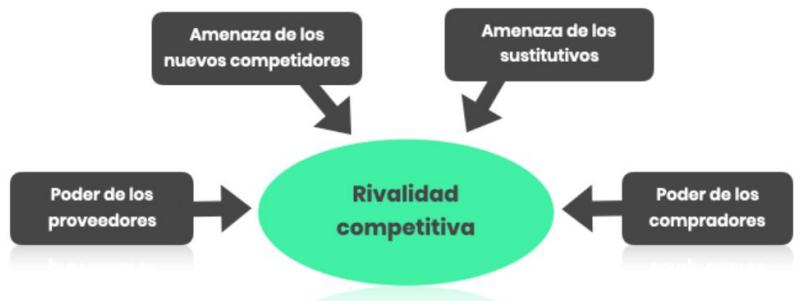
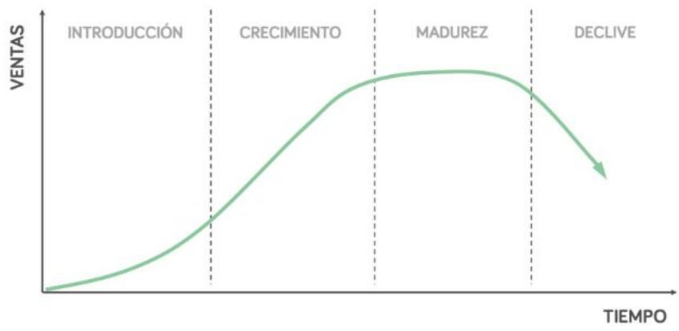
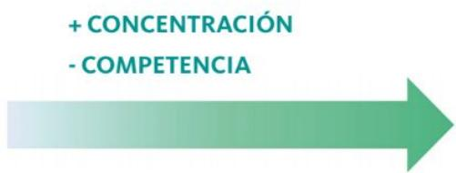

# Conceptos Clave Análisis de un sector

## 5 FUERZAS DE PORTER

Michael Porter propone un modelo para analizar la rentabilidad de un sector a largo plazo. El modelo se llama las 5 FUERZAS DE PORTER, y es uno de los modelos de análisis estratégico más conocidos y utilizados, por lo que es absolutamente necesario que lo entiendas.

> **Figura**: Diagrama del modelo de las 5 Fuerzas de Porter. En el centro, un óvalo
> con «Rivalidad competitiva». Cuatro cajas apuntan hacia el centro con flechas: arriba
> «Amenaza de los nuevos competidores» y «Amenaza de los sustitutivos»; a los lados
> «Poder de los proveedores» (izquierda) y «Poder de los compradores» (derecha). El
> diagrama expresa que las cuatro fuerzas externas (nuevos entrantes, sustitutivos,
> poder de proveedores, poder de compradores) confluyen y determinan el grado de
> rivalidad competitiva del sector, que a su vez condiciona su rentabilidad a largo plazo.

## Para qué sirve:

Nace con el objetivo de ayudarnos a valorar la rentabilidad de un sector.

Además, ayuda a tener una foto de las distintas fuerzas que afectan a un sector, y son cinco:

1. La amenaza de que existan productos sustitutivos.

2. La amenaza de que entren nuevos competidores, que está muy relacionada con las barreras de entrada.

3. El poder que tengan los proveedores sobre ti.

4. El poder que tengan los compradores sobre ti.

5. Estas cuatro fuerzas anteriores influyen en gran medida en el grado de rivalidad que existe dentro de un sector.

## 1. Productos sustitutivos

Son los productos que satisfacen las mismas necesidades, por ejemplo, la cerveza y el vino. No tienen por qué competir frontalmente. Si en tu sector o fuera de él hay pro- ductos que puedan sustituir el valor que tú estás ofreciendo, la rentabilidad puede verse comprometida.

Es uno de los factores más importantes y está relacionado con las barreras de entrada: si las barreras son altas, la amenaza de entrada de nuevos competidores será menor. Por ejemplo, si hace falta una enorme inversión o hay mucha regulación, las barreras de entrada son más altas. Un sector más protegido de la entrada de nuevos competidores es más rentable.

Esta fuerza determina que, si los proveedores tienen mucho poder sobre ti, tus rentabilidades se verán comprometidas. Un ejemplo puede ser una tienda de móviles Orange: tu proveedor es Orange, que tiene un poder muy grande sobre ti y te puede sustituir fácilmente, y esta fuerza resta rentabilidad. El ejemplo opuesto sería el de un gran distribuidor alimentario como Mercadona: en este caso, los proveedores son, en principio, más pequeños, por lo tanto, tiene mucho poder y esa fuerza favorece a la empresa y su rentabilidad mejora.

Si tienen mucha fuerza, son más grandes, etcétera, tendremos problemas de rentabilidad. Por ejemplo, en el caso de un agricultor que es proveedor de Mercadona, su comprador es mucho más grande que él, por lo que obtiene menor rentabilidad.

## Costes de cambio

Un concepto importante aquí son los costes de cambio, entendidos como el grado de facilidad con el que tus compradores cambian de proveedor. Como vimos en el caso de los modelos SAAS, los clientes tienen unos altos costes de cambio que les benefician. Si, por el contrario, los costes de cambio son bajos, como puede ser el seguro del coche, eso provoca que la guerra competitiva sea mayor.

## Commodities

Otro factor importante son las commodities, es decir, que tu propuesta sea igual que las de los demás. En el caso de un sector muy comoditizado, en el que todos ofrecen lo mismo y se trata solo de una cuestión de precios, el poder del comprador es enorme porque los costes de cambio son muy bajos.

## 5. Rivalidad competitiva

Todas estas fuerzas influyen en el grado de rivalidad competitiva que hay dentro de un sector. Habitualmente, se dice que casi todos los sectores son océanos rojos, es decir, que hay mucha guerra competitiva (precios, inversión para diferenciarse, etcétera) y esto siempre se traduce en menores rentabilidades. Por ejemplo, en la banca comercial hay muchos competidores y casi todos ofrecen lo mismo, lo que provoca que las rentabilidades bajen.

Debes conocer el concepto de las barreras de salida. Si los competidores dentro de un sector han realizado fuertes inversiones para entrar, salir supondría unos enormes costes de arrastre o, directamente, no podrían salir. A esto es a lo que llamamos barre- ras de salida. Si estás obligado a competir dentro de un sector, estás abocado a que la lucha competitiva sea mucho mayor, lo que hace que las rentabilidades sean menores.

## BARRERAS DE ENTRADA

Las barreras de entrada incrementan la rentabilidad y el valor de una empresa. También condicionan el funcionamiento y la lucha competitiva de muchos sectores.

Warren Buffet afirma que únicamente invierte en negocios con barreras de entrada (a las que llama foso), y las define así:

“Un buen negocio es como un castillo con un foso alrededor.   
Quiero que haya tiburones en el foso. Quiero que sea intocable”.

Según desde qué perspectiva se miren, las barreras de entrada son algo positivo (si estás ya dentro del mercado o sector) o negativo (si estás fuera).

• Economías de escala: para competir en un sector tienes que ser muy grande. Muchas veces, son sectores en los que la sensibilidad al precio es muy alta. Ejemplo: Walmart o Amazon.

• Economías de red: alcanzas una enorme masa crítica conectando oferta y demanda y generas mucho valor. Por ejemplo, Bucmi.

• Marcas: marca potente con la que los clientes se sienten identificados y es muy reconocida, como Nike o Coca-Cola.

• Inversión necesaria: sectores en los que hay que invertir mucho para entrar. Por ejemplo, los cruceros o las inmobiliarias.

• Costes de cambio: hay sectores que retienen a sus clientes. Los clientes están desincentivos a cambiarse. Es el caso de Microsoft.

• Acceso a recursos preferenciales. Por ejemplo, una petrolífera con acceso a recursos naturales o un gimnasio en una zona determinada.

• Patente: tienes protegido tu negocio durante un tiempo. Por ejemplo, Tetrapack.

• Protección legal: Siempre tienes que pensar en posibles barreras de entrada, en cómo proteger tu negocio respecto de potenciales competidores. Las barreras de entrada generan una enorme ventaja para los que están dentro del sector.

# CICLO DE VIDA DEL PRODUCTO

Entender bien las fases del ciclo de vida del producto nos ayudará a analizar un sector y a comprender aspectos como la lucha competitiva, las rentabilidades, las estrategias de crecimiento, etcétera.

Lo que queremos es que entiendas cómo afecta el ciclo de vida al negocio en cada una de las etapas, es decir, cómo evoluciona la rentabilidad de las empresas, su estrategia de crecimiento, sus costes y la lucha competitiva.

Todos los productos, categorías de productos, marcas o negocios pasan por las mismas fases o etapas, que son las siguientes:

> **Figura**: Curva del ciclo de vida del producto. Eje vertical «VENTAS», eje horizontal
> «TIEMPO». Una curva con forma de S seguida de caída atraviesa cuatro fases marcadas por
> líneas verticales discontinuas: «INTRODUCCIÓN» (ventas casi planas y bajas), «CRECIMIENTO»
> (la curva se dispara hacia arriba con fuerte pendiente), «MADUREZ» (la curva se aplana en
> su punto más alto, crecimiento vegetativo) y «DECLIVE» (la curva cae con una flecha hacia
> abajo). Ilustra cómo evolucionan las ventas de cualquier producto, categoría, marca o
> negocio a lo largo del tiempo a través de las cuatro etapas secuenciales.

s barreras de entrada son algo positivo (si estás ya dentro del mercado o sector) o negativo (si estás fuera).

## Introducción

• Las ventas crecen poco, la demanda aún no ha validado el producto. Hay todavía pocos compradores, la mayoría son early adopters.

• Se fabrica en pequeñas dimensiones, aún no hay eficiencia ni se tiene acceso a las economías de escala.

• Costes unitarios muy altos y rentabilidades muy bajas.

• Se requiere mucha inversión para crecer.

• Pocos competidores. Hay que invertir grandes

cantidades en marketing para darse a conocer.

## Crecimiento

• La demanda aumenta y, por lo tanto, las ventas se disparan.

• Las empresas empiezan a ser rentables.

• Otras compañías, atraídas por esto, entran en el mercado.

• Aún hay mucho potencial de crecimiento.

• El reto es invertir mucho en marketing para crecer.

• Es conveniente invertir antes de la fase de madurez, porque todavía hay potencial de crecimiento.

## Madurez

• Casi toda la demanda ha accedido a ese producto y, a partir de ese momento, las ventas crecen de forma vegetativa, por pura renovación.

• Los competidores que se hacen con una buena cuota de mercado se convierten en empresas muy grandes, con economías de escala y muy rentables.

• Ya sabemos cuál es el tamaño del mercado y para crecer hay que robar cuota a la competencia, lo que es mucho más complicado. Entra aquí el océano rojo.

## Declive

• Llega un momento en que una serie de factores, como cambios en los patrones de

> **Figura**: Flecha horizontal de gradiente apuntando a la derecha, etiquetada arriba con
> «+ CONCENTRACIÓN» y «− COMPETENCIA». Representa la escala de concentración de un sector:
> a medida que aumenta la concentración (se avanza en el sentido de la flecha), disminuye la
> competencia. El extremo de máxima concentración corresponde al monopolio, seguido del
> oligopolio, y el opuesto a la atomización (muchos competidores, sin líder de cuota).

gusto o productos sustitutivos, hacen que las ventas entren en declive.

• La demanda se desacelera.

• El producto ya casi no tiene demanda, las compañías entran en un proceso de reinventarse o morir.

## CONCENTRACIÓN

La concentración depende del número de competidores y de cómo estos se reparten el total de la cuota de mercado. Es importante considerar esta perspectiva porque determina cómo funciona la competencia dentro de un sector, las rentabilidades que obtendrán los distintos players, las barreras de entrada, etcétera.

El market share o cuota de mercado es el porcentaje que vende una empresa sobre el total del mercado. La concentración depende de:

• Número de competidores.

• Tamaño de los competidores.

• Reparto del market share.

En función de esto, tenemos una escala en la que se avanza desde sectores poco concentrados o sectores atomizados hacia sectores muy concentrados.

De más a menos concentración:

## Monopolio

Solo hay una empresa, no hay competencia, lo que supone enormes ventajas, como la fijación de precios o no preocuparse de los demás. Es la situación ideal. Por ejemplo, Microsoft.

## Oligopolio

Sin llegar a ser un monopolio, hay sectores en los que pocos players se reparten casi todo el mercado. Se trata de sectores muy concentrados. Por ejemplo, el de los buscadores, con Google, Bing y Yahoo. Tienen poca competencia y lideran el cambio en la industria, además de fijar los precios.

## Mayor atomización o menor concentración

Hay muchos competidores y no hay ninguno con una cuota de mercado alta. Por ejemplo, el sector de los restaurantes o las escuelas de negocios. No hay líderes, hay empresas que son más grandes que otras, todas compitiendo de forma diferenciada.

## DIFERENCIACIÓN

Otro enfoque o perspectiva para analizar un sector es la mayor o menor diferenciación de las propuestas de valor entre los distintos competidores de un sector. Esto hay que analizarlo desde la perspectiva del cliente. La diferenciación también sigue una escala.

GRADODEDIFERENCIACIÓN

## Comoditizados

En el extremo izquierdo, están los sectores en los que todas las propuestas de valor son similares y el cliente las percibe como parecidas o iguales. Para describir esto se utiliza el término comoditizados. Por ejemplo, el sector de las materias primas o los sectores industriales.

## Diferenciados

En el otro extremo, encontramos los sectores en los que se da un mayor grado de diferenciación, como el sector de relojes de lujo.

Entre medias hay sectores, como, por ejemplo, el sector del vino o el de los bancos, en los que el cliente se vincula poco con las marcas. Las propuestas están bastante commoditizados.

Hay veces en las que, dentro de una misma industria, hay diferentes niveles de diferenciación, como es el caso de la industria del automóvil, en la que, por ejemplo, la diferenciación es media en los económicos, pero la diferenciación es máxima en los de lujo.

## MACROENTORNO (PEST)

Además del análisis del sector o la industria en el cual una empresa compite, la estrategia debe tener en cuenta otros factores externos, lo que conocemos como macroentorno. Esto se refiere a factores políticos, económicos, sociales, tecnológicos, etcétera, sobre los que la empresa no tiene capacidad de actuar pero que pueden afectar generando oportunidades o amenazas.

Para identificarlos y analizarlos, vamos a utilizar una herramienta muy sencilla denominada análisis PEST.

## Para qué sirve:

Esta herramienta nos sirve para hacer un análisis del entorno en el que se mueve la empresa. Es muy útil para determinar cuáles son los factores políticos, económicos, sociales y tecnológicos, que afectan a la empresa.

Es necesario hacer este análisis desde una perspectiva holística.

A veces, se habla de PESTEL, ya que se añaden factores legales y relacionados con el entorno.

## Económicos

Hay que analizar los datos macroeconómicos, la evolución del PIB, las tasas de interés, la inflación, la tasa de desempleo, el nivel de renta, los tipos de cambio, el acceso a los recursos, el nivel de desarrollo y los ciclos económicos. También se deben investigar los escenarios económicos actuales y futuros y las políticas económicas.

## Sociales

Los factores a tener en cuenta son la evolución demográfica, la movilidad social y los cambios en el estilo de vida. También el nivel educativo y otros patrones culturales, la religión, las creencias, los roles de género, los gustos, las modas y los hábitos de consumo de la sociedad. En definitiva, las tendencias sociales que puedan afectar al proyecto de negocio.

## Tecnológicos

El más destacado es la irrupción de internet en las últimas décadas. Hay que conocer la penetración de la tecnología, el grado de obsolescencia, el nivel de cobertura, la brecha digital, los fondos destinados a I+D, así como las tendencias en el uso de las nuevas tecnologías, como la tendencia mobile.