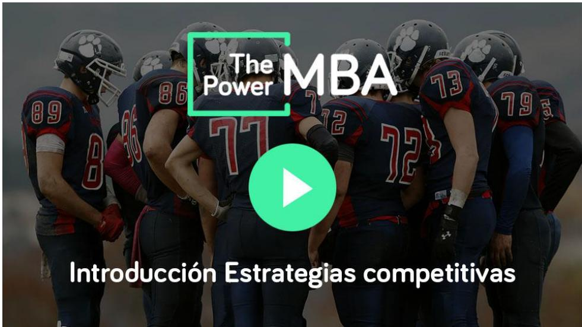
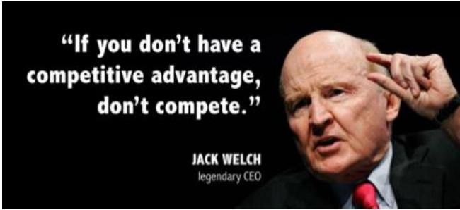

# Estrategias competitivas

Estrategia

Debemos ser capaces de entender bien cuáles son las fuentes de generación de ventajas competitivas, así como las alternativas o estrategias genéricas que tiene toda empresa para competir.

¿Cómo podemos y debemos competir? ¿Intentando ser mejores que el resto, y que los clientes paguen por ello? ¿O quizás reduciendo nuestros costes internos para ser capaces de ofrecer un precio más bajo que la competencia? ¿Nos dirigimos a todos los segmentos del mercado o nos centramos en un nicho?

Las empresas deben tener muy clara su estrategia y las consecuencias. En demasiadas ocasiones las empresas, por carecer de una estrategia clara, acaban desarrollando verdaderas desventajas competitivas.

En este curso vamos a realizar un profundo análisis de la estrategia competitiva utilizando el conocido modelo de las Estrategias Genéricas de Michael Porter.

## Objetivos:

• Entender bien las fuentes de ventaja competitiva

Entender bien las estrategias genéricas: liderazgo en coste, diferenciación y segmentación/ nicho

Conocer las implicaciones que tiene cada una de las estrategias en cuanto a márgenes, fidelidad de los clientes, riesgos, etc.

Ser capaces de tomar decisiones más fundamentadas acerca de cómo competir.

## Clases:

1. Estrategias genéricas

2. Liderazgo de costes

3. Diferenciación

4.Best cost strategy

5. Estrategia de nicho

6. Factores internos