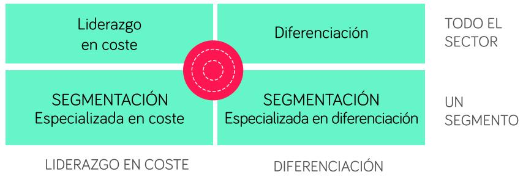

# CONCEPTOS CLAVE: ESTRATEGIAS COMPETITIVAS

Se denomina ventaja competitiva a una ventaja o característica que una compañía tiene respecto a otras compañías competidoras, lo que la hace diferente y permite atraer más consumidores.

## “If you don’t have a competitive advantage, don’t compete” Jack Welch (Legendary CEO)

Michael Porter, a lo largo de los años 80, desarrolló profundamente el concepto de la ventaja y estrategia competitiva. Según Porter, únicamente hay dos fuentes de ventaja competitiva:

## 1. Liderazgo en coste

Capacidad para realizar un producto a un precio inferior al resto de competidores 2. Diferenciación

Capacidad de ofrecer un valor distintivo en alguno de los factores que componen la propuesta de valor (producto, marca, experiencia de cliente, etc.). Los clientes tienen que valorarlo y pagar por ello.

Para definir las estrategias genéricas, es decir, las alternativas que tiene toda empresa para competir, Michael Porter establece dos dimensiones o ejes:

1.. La fuente de la ventaja competitiva, que como hemos visto son dos: liderazgo en coste o diferenciación

2. El Alcance, también llamado objetivo estratégico. En este caso diferencia entre las empresas que se dirigen a todos los mercados (o a una gran mayoría de los segmentos del mercado) y las empresas que se centran en un segmento o nicho concreto de clientes.

A partir de estos dos ejes definen tres estrategias genéricas:

1. Estrategia de Liderazgo global en costes

2. Liderazgo de diferenciación

3. Estrategia de segmentación / enfoque / concentración / nicho Es preciso tener en cuenta que, además, en la estrategia de segmentación, se puede optar por especializarte en coste o diferenciación, por lo tanto, hay quien considera que son cuatro estrategias.

Liderazgo en coste

Diferenciación

SEGMENTACIÓN Especializada en coste

SEGMENTACIÓN Especializada en diferenciación

LIDERAZGO EN COSTE

DIFERENCIACIÓN

## ESTRATEGIA DE DIFERENCIACIÓN

La estrategia de diferenciación implica ofrecer una propuesta más atractiva para los clientes que la de tus competidores.   
Se trata de compañías que se dirigen a todo el mercado.

## FACTORES DE DIFERENCIACIÓN

Los factores de diferenciación son muy diversos y dependen del sector. Los más habituales son: un producto de calidad o con ciertas particularidades muy valoradas por los clientes, la marca, experiencia de cliente, seguridad, servicio post-venta, etc.

En general, cuando los clientes te eligen porque te consideran mejor (en algo), la sensibilidad al precio es menor que cuando te eligen por ser barato. Esto permite mayores márgenes.

Además, la lucha competitiva es menor, debido a que hay “espacio” para diferentes propuestas. En cambio, en una estrategia de liderazgo en coste, en el que todos compiten en precio, la lucha es más encarnizada.

La estrategia de liderazgo en coste implica ser el líder en coste dentro de tu sector. NO estamos hablando obligatoriamente de ser el más barato, sino de ser capaz de producir o prestar el servicio con un coste menor. Este diferencial de coste te aporta una ventaja competitiva, porque puedes utilizarlo para bajar los precios y ganar cuota de mercado o para invertir más en marketing (lo que también te ayudará a crecer).

Es necesario un enorme compromiso para ser muy eficiente a lo largo de toda tu cadena de valor. Se suelen citar algunos factores clave:

• Las economías de escala, que te permiten disminuir el coste unitario a medida que creces

• Desinversión en la prestación de servicios (IKEA vende muebles no montados).

• Mano de obra más barata

Las estrategias de liderazgo en coste son habitualmente más fáciles de imitar que las de diferenciación. Ten en cuenta que habitualmente esas fuentes de reducción de coste (por ejemplo, producir en países de bajo coste) no son únicas o exclusivas para ti.

Quizás la más sostenible es la economía de escala, porque una vez que eres mucho más grande que los demás (véase Walmart) has generado una barrera de entrada.

Es conveniente además tener en cuenta, como decíamos anteriormente, que los clientes, si te eligen únicamente por precio, son muy poco fieles.

Como surja un competidor más barato, te dejarán de comprar.

Por otro lado, una vez que has optado por una estrategia low-cost, parece complicado pivotar a una estrategia de diferenciación, puesto que es difícil cambiar ese “posicionamiento” en la mente de los consumidores.

Implica enfocarte en un segmento de clientes o nicho de clientes concreto. Esta especialización se puede dar en tres dimensiones:

• Que te centres en un segmento de clientes concreto desde el punto de vista demográfico (por ejemplo, Ferrari, hombres de clase alta)

• Geográfico. Es decir, que decidas centrarte en una localización concreta

• Producto. Que decidas fabricar o prestar servicios muy concretos, a diferencia de tus competidores que ofrecen una gama muy amplia.

La verdadera clave de esta estrategia es que enfocarte en un nicho te tiene que permitir ser capaz de satisfacer mejor las necesidades de ese nicho que los competidores que se dirigen a todo el mercado.

Es decir, no se trata de que como eres pequeño, te tengas que conformar con servir a un nicho, sino que, seas pequeño o grande, en ese nicho tienes que ser mejor que los demás.

Habitualmente, este valor adicional generado por el foco en un nicho, “no es suficiente”. Por ello, debes optar por especializarte en coste o en diferenciación. La estrategia de nicho es la opción natural de casi todas las empresas cuando nacen. Suele partir de la identificación de un gap en el mercado: segmento de clientes con necesidades sin cubrir.

> **Figura**: Matriz 2×2 de las estrategias genéricas de Porter. Eje horizontal =
> fuente de ventaja competitiva: «LIDERAZGO EN COSTE» (izquierda) y «DIFERENCIACIÓN»
> (derecha). Eje vertical = alcance/objetivo estratégico: «TODO EL SECTOR» (fila
> superior) y «UN SEGMENTO» (fila inferior). Las cuatro celdas: arriba-izquierda
> «Liderazgo en coste», arriba-derecha «Diferenciación», abajo-izquierda
> «SEGMENTACIÓN especializada en coste», abajo-derecha «SEGMENTACIÓN especializada en
> diferenciación». Un círculo rojo (diana/nicho) marca el centro inferior. Ilustra que
> las dos fuentes de ventaja (coste/diferenciación) combinadas con los dos alcances
> (todo el sector/un segmento) generan las tres (o cuatro) estrategias genéricas.

La principal ventaja, de la que derivan todas las demás, es que conoces mejor y estás más cerca de tu cliente.

• Tienes mayor capacidad de crear productos y servicios adaptados a sus necesidades y retos.

Eres más flexible

• Los clientes son menos sensibles al precio porque se establecen relaciones más cercanas.

• Ayuda enormemente en la estrategia de marketing. Date cuenta de que tus clientes están más segmentados, por lo que puedes utilizar canales y mensajes muy concretos.

• Es más fácil alcanzar rápido una posición de liderazgo en un nicho, lo que genera cierta protección y barreras de entrada

## MERCADOS MÁS APROPIADOS PARA CADA VENTAJA COMPETITIVA

Existen mercados en los que hay más espacio para la diferenciación que otros. Por ejemplo, piensa en los mercados de materias primas. Las propuestas de todos los competidores son similares, es un mercado muy comodotiza do. En un entorno así, los clientes habitualmente eligen por precio, por lo que es más difícil diferenciarte.

Concepto que se utiliza para las empresas que no tienen clara su estrategia y no son capaces de ofrecer mayor valor que sus competidores ni ser lo líderes en coste. Esta situación te lleva a generar una desventaja competitiva. Los clientes optarán por mejores alternativas o más baratas.

La ventaja competitiva es un concepto “externo”. Es decir, tienes una ventaja competitiva si eres capaz de adelantar a tus competidores.

Pero es preciso tener en cuenta que las ventajas competitivas nacen a partir de factores internos. Es decir, no es solo cuestión de elegir, sino que, además, debes partir de un análisis interno y de unas fortalezas sobre las que puedas construir.

Para analizar los factores internos se suele utilizar el esquema de recursos, capacidades y competencias. Los recursos son los activos tangibles, intangibles y humanos. Las capacidades y las competencias nacen de la habilidad para poner el servicio de tus recursos y sacarles un provecho, por ejemplo: ser más innovador, ser capaz de establecer relaciones muy cercanas con los clientes, etc.

RECURSOS

CAPACIDADES

COMPETENCIAS

Ventaja Competitiva