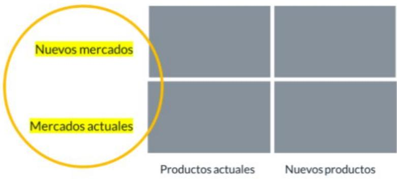
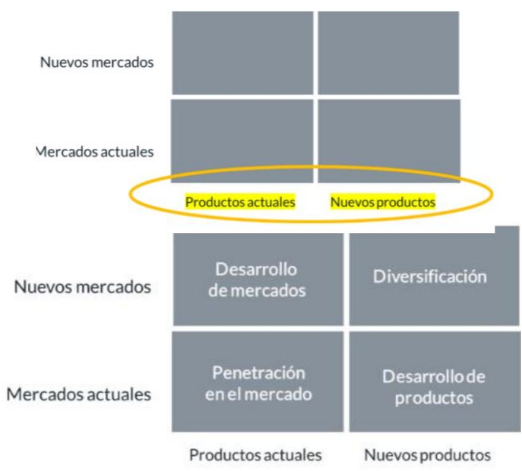

# Conceptos Clave Estrategias de crecimiento

## Matriz Igor Ansoff

La matriz de Ansoff es una excelente herramienta para entender la estrategia de crecimiento de una compañía.

La clave es que aplicable a cualquier tipo de compañía (desde una startup a una gran corporación) y da respuesta a la pregunta “hacía dónde crecer”, si buscar el crecimiento en el mercado actual o fuera, por medio de nuevos productos o nuevos mercados, o diversificar y entrar en negocios más “alejados”.

Se compone de dos ejes:

Segmentos de clientes / mercados: actuales vs nuevos

> **Figura**: Eje vertical de la matriz de Ansoff (segmentos de clientes/mercados),
> con dos niveles resaltados: «Nuevos mercados» (arriba) y «Mercados actuales» (abajo),
> frente a una rejilla 2×2 cuyas columnas son «Productos actuales» y «Nuevos productos».

● Productos: Actuales vs nuevos

> **Figura**: Matriz de Ansoff completa (2×2). Eje vertical = mercados: «Mercados
> actuales» (fila inferior) y «Nuevos mercados» (fila superior). Eje horizontal =
> productos: «Productos actuales» (columna izquierda) y «Nuevos productos» (columna
> derecha). Las cuatro celdas: inferior-izquierda «Penetración en el mercado»
> (mercado actual + producto actual), inferior-derecha «Desarrollo de productos»
> (mercado actual + producto nuevo), superior-izquierda «Desarrollo de mercados»
> (mercado nuevo + producto actual), superior-derecha «Diversificación» (mercado nuevo
> + producto nuevo). El riesgo crece desde la penetración (mínimo) hacia la
> diversificación (máximo).

## PENETRACIÓN EN EL MERCADO

La penetración en el mercado busca aumentar las ventas y el marketshare en los mercados en los que ya está presente y con los productos actuales.

Es la estrategia con menos riesgo y la opción natural mientras puedas seguir creciendo.

## DESARROLLO DE PRODUCTOS

Cuando hemos alcanzado una posición de cierta fuerza en nuestro mercado, podemos crecer apoyándonos en nuestros clientes actuales, pero mediante nuevos productos.

Tiene cierto riesgo porque no sabemos cómo van a reaccionar los clientes actuales a la nueva propuesta.

Nos beneficiamos de sinergias comerciales: marca, mismo canal de distribución, conocimientos de nuestros clientes, etc.

## DESARROLLO DE MERCADOS

Una de las alternativas de crecimiento lógicas es buscar nuevos mercados para nuestros productos. Hay dos opciones:

Expansión internacional

Entrada en nuevos segmentos de clientes.

## DIVERSIFICACIÓN

La diversificación es la estrategia que entraña un mayor riesgo, porque nos alejamos más de nuestro negocio tradicional. Nuevos mercados con nuevos productos.

Se suelen clasificar dos tipos de diversificación:

Relacionada. Cuando existen puntos en común con el negocio tradicional, es decir, cuando te beneficias de ciertas sinergias que disminuyen el riesgo: marca, canales de distribución, acceso a recursos, tecnologías, conocimientos, etc.

No relacionada. No existen puntos de contacto ni sinergias. Entras en un negocio totalmente distinto

## CONGLOMERADOS

Grupos empresariales que han crecido mediante una estrategia de diversificación no relacionada.

## CRECIMIENTO ORGÁNICO VS CRECIMIENTO INORGÁNICO

Esta clasificación hace referencia a CÓMO crecer

Crecimiento orgánico: mediante recursos internos

Crecimiento inorgánico: por medio de una adquisición, fusión, joint venture o alianza estratégica.

## VENTAJAS DEL CRECIMIENTO INORGÁNICO

● Puedes crecer mucho más rápido

● Te beneficias de un negocio en marcha

Se suelen generar sinergias entre los dos negocios

## INCONVENIENTES DEL CRECIMIENTO INORGÁNICO

● Tienes que disponer de la capacidad financiera

● Son operaciones complejas, con más riesgos

La posterior integración puede tener dificultades, por ejemplo, al convivir diferentes culturas

FUSIÓN Dos compañías se fusionan, desaparecen, y nace una nueva compañía fruto de la fusión.

ADQUISICIÓN Una compañía compra y “absorbe” a otra.

JOINT VENTURE Los dos “socios” crean una nueva compañía de la que participan ambos.

Las joint venture se suelen formar con un objetivo específico (entrar en un mercado, desarrollar una nueva tecnología, etc.) y con un plazo de tiempo

ALIANZAS Es la fórmula con menor integración, porque el ESTRATÉGICAS compromiso “formal” es menor, ya que simplemente se da un acuerdo entre dos compañías.

Al igual que las joint venture suelen tener un objetivo y plazo concreto.

ESTRATEGIA DE Consiste en entrar en un eslabón posterior de la INTEGRACIÓN cadena de suministro. Es decir, entrar en el negocio

## VERTICAL HACIA ADELANTE

## ESTRATEGIA DE INTEGRACIÓN VERTICAL HACIA ADELANTE OBJETIVOS

de tus distribuidores o clientes.

Se puede dar, tanto de forma orgánica (Apple se convierte en un retailer con sus Apple Store) como inorgánica (Coca-Cola compra las “embotelladoras en algunos países)

Capturar los márgenes de tus distribuidores

Estar más cerca de los clientes

Tener más control sobre el servicio, experiencia de cliente, etc.

Superar situaciones en las que dependes en exceso de tus distribuidores, porque hay pocos, o porque son poderosos, etc.

Desarrollar ventajas competitivas y barreras de entrada

Reducción de costes logísticos