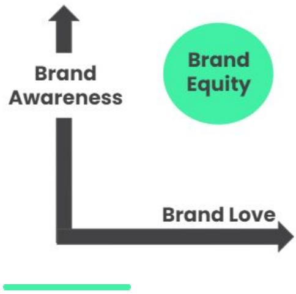
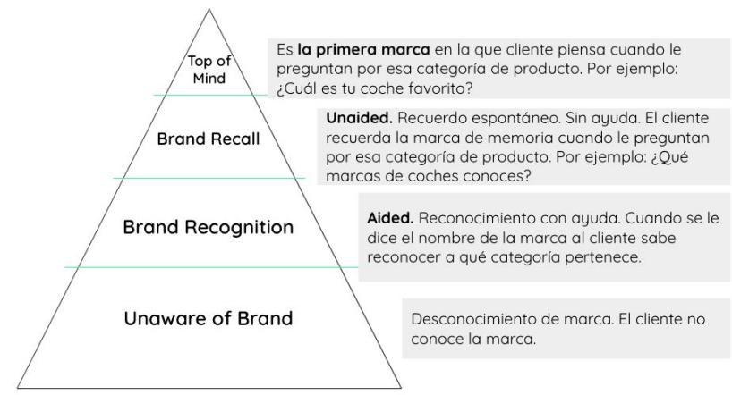
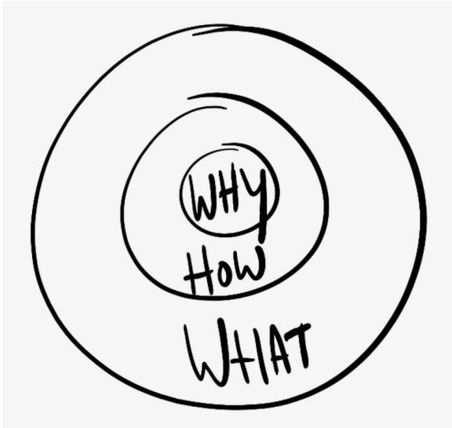
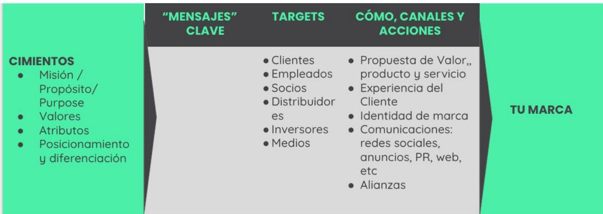

## RECURSOS ESTRATEGIA DE MARCA

# BRANDING

## Definiciones

Existen definiciones muy diversas.

«El agregado total de percepciones que generamos en nuestros clientes actuales y potenciales, y que es resultado de todas las interacciones anteriores».

«La marca no es tu logo, ni tu imagen. La marca es el “gut feeling” (el sentimiento instintivo que generamos)» - Marty Neumeier.

El problema con este tipo de definiciones es que no son muy útiles cuando queremos proyectar, modificar y trabajar con la marca.

## Nuestra definición

«La marca es la historia que cuentan nuestros clientes».

La historia es algo más real, más práctico y más objetivo. Obviamente la historia es consecuencia de las percepciones y reacciones generadas (definiciones anteriores).

## Identidad de marca (Brand Identity)

Conjunto de signos distintivos como el logo, imágenes, colores, sonidos, etc.

## Beneficios de tener una marca potente

Impacto positivo en los clientes y, por lo tanto, en las ventas, márgenes y beneficios:

Vender más, debido a que más gente se siente identificada contigo.

Vender más, debido a que la marca genera clientes más fieles.

Vender más caro. La marca hace que el producto sea inmediatamente más valioso.

Una marca potente genera ventajas competitivas. Es muy importante tener esto en cuenta.

Impacto en otros stakeholders como los

# empleados, inversores, medios, etc.

## Brand Equity

## ¿Qué es?

Término que se refiere al valor de una marca.

El valor de una marca es obviamente algo subjetivo e imposible de medir, sin embargo es indudable que las marcas tienen un valor en sí, como cualquier otro activo. Por lo tanto, la gestión de una marca al final tiene un único objetivo: incrementar el Brand Equity.

## ¿De qué depende?

El valor de una marca es la consecuencia de muchísimas cosas. Para simplificar hemos creado un modelo que te va a ayudar a entender las dos principales palancas:

Reconocimiento de marca (Brand Awareness): el grado en el que tu público objetivo te conoce.

Impacto de marca (Brand love): el grado en el que la marca genera un impacto positivo, incrementa el valor del producto, clientes fieles.

> **Figura**: Modelo del Brand Equity como combinación de dos palancas representadas en
> ejes. Eje vertical = «Brand Awareness» (reconocimiento de marca); eje horizontal =
> «Brand Love» (impacto/amor de marca). El «Brand Equity» (valor de la marca, círculo
> destacado) resulta de la combinación de ambas dimensiones: cuanto mayores son el
> reconocimiento y el impacto positivo de la marca, mayor es su valor.

## Reconocimiento de marca o Brand Awareness

## ¿Qué es?

El reconocimiento de marca mide en qué medida eres conocido por tu público objetivo.

## Niveles

Que una persona de tu público objetivo te conozca no

es una cuestión de SI/NO, sino que existen distintos niveles.

Niveles de Brand Awareness  

> **Figura**: Pirámide de los niveles de Brand Awareness, de la cúspide a la base:
> (1) «Top of Mind» — la primera marca que el cliente piensa en una categoría («¿cuál es
> tu coche favorito?»); (2) «Brand Recall» — recuerdo espontáneo, sin ayuda (unaided):
> el cliente recuerda la marca de memoria al preguntar por la categoría; (3) «Brand
> Recognition» — reconocimiento con ayuda (aided): al decirle el nombre, el cliente sabe
> a qué categoría pertenece; (4) «Unaware of Brand» — desconocimiento total de la marca.
> El reto de «crear marca» es mover al público objetivo hacia los niveles superiores.

## ¿Cómo se mide o estima?

El reconocimiento de marca se puede medir de forma objetiva midiendo o estimando el porcentaje de clientes en cada uno de los niveles.

Suele hacerse mediante encuestas o focus group en las que participa una muestra representativa.

## Retos

Cuando hablamos de «crear (una) marca» nos referimos a conseguir que una parte considerable de tu público te reconozca.

Tenemos que ser conscientes de que alcanzar este punto requiere tiempo y dinero.

Es muy fácil visualizar el tamaño del reto cuando lo trasladas a número utilizando la pirámide que hemos visto arriba.

«Alcanzar un nivel suficiente de reconocimiento de marca requiere mucho impacto, y por lo tanto, mucho tiempo y dinero. Hay que tener cuidado con no desperdiciar dinero en “una gota en el océano”».

## «Una gota en el

Es una expresión utilizada por Borja para describir el

## océano»

efecto que tiene realizar acciones de marketing que «no son suficientemente grandes y continuadas», y por lo tanto no son suficientes para generar   
reconocimiento de marca.

Este efecto genera una complicación adicional en la creación de la marca porque los esfuerzos muchas veces no sirven para nada.

## Ejemplo

Por ejemplo, si realizamos una campaña televisiva que no es lo bastante grande, crearemos impacto solo en un porcentaje de nuestro público objetivo, una sola vez, y no será suficiente para «crear marca»

Tenemos que construir una marca a partir de unos cimientos o fundamentos claros. Esto determina la ESENCIA de la marca.

Nos referimos a este tipo de cosas:

Misión o propósito

Valores de marca

Atributos de marca

Posicionamiento

Diferenciación

## LA ESENCIA ES MUCHO MÁS IMPORTANTE QUE EL LOGO

La gran mayoría de las empresas no tiene clara la esencia de su marca, y como consecuencia se centran

demasiado en el logo y otros componentes de la identidad de marca.

¿Qué es más potente? Tener un logo bonito o una marca que genera una conexión con los clientes gracias a su propósito, valores, diferenciación, etc.

## «Círculo dorado»

## ¿Qué es?

Modelo creado por Simon Synek y popularizado en su libro Empieza por el porqué.

> **Figura**: El «Círculo dorado» (Golden Circle) de Simon Sinek: tres círculos
> concéntricos. El núcleo es «WHY» (por qué: propósito y valores), el círculo
> intermedio «HOW» (cómo: diferenciación, ventaja competitiva) y el círculo exterior
> «WHAT» (qué: el producto o servicio). La tesis es que las empresas excepcionales
> comunican de dentro hacia fuera (empiezan por el porqué), mientras la mayoría solo
> tiene claro el qué.

Todas las empresas tienen muy claro QUÉ HACEN Algunas empresas tienen claro CÓMO LO HACEN, es decir, su diferenciación, ventaja competitiva, etc. Pero muy pocas empresas tienen claro POR QUÉ hacen lo que hacen, es decir, su propósito y valores.

«La gente no compra lo que haces, compra el PORQUÉ lo haces» - Simon Sinek.

## Propósito / Misión

● ¿Por qué haces lo que haces?

¿Cuál es la razón por la que existes (más allá de ganar dinero)?

## Ejemplo

ThePowerMBA: democratizar la educación

## ¿Para qué sirve?

«Tener un propósito claro y potente con el que la gente conecte te ayuda en todos los sentidos, con los clientes, te abre puertas, etc.»

## Values

¿Cuáles son las cosas en las que crees y que guían tus acciones?

● Haces lo que haces porque crees en ello.

## Ejemplos

## ThePowerMBA

Creemos que aprender tiene que ser sencillo y cómodo, y por eso las clases duran 15 minutos.

Creemos que los títulos privados no son garantía de una educación de calidad.

## Grosso Napoletano (cadena especializada en pizzas napolitanas)

Creemos que las pizzas deben hacerse siguiendo una serie de procesos tradicionales (horno, masa, cocineros italianos, etc.)

## ¿Para qué sirve?

Los valores, al igual que el propósito, te ayudan a conectar mejor con clientes y otros stakeholders. Además, ayuda a que te entiendan mejor, porque van a entender por qué haces las cosas de determinada forma.

## Atributos de marca

¿Cuáles son los rasgos más importantes de tu «personalidad»?

¿Cuáles son los rasgos o características que la gente asocia contigo?

Ejemplos: disruptivo, cool, clásico, fiable, local, sencillo, humano, etc.

## ¿Para qué sirven y cómo utilizarlos?

Es conveniente tener muy claros tus atributos. Te va a servir como recordatorio permanente y te va a ayudar a identificar qué tipo de mensajes tienes que lanzar.

Además, es conveniente que seamos conscientes de que es muy fácil «olvidarse» de ellos, especialmente cuando la empresa tiene cierta dimensión.

## Posicionamiento

El posicionamiento es uno de los conceptos clásicos del marketing y habitualmente se define como el «lugar» que ocupa una marca en la mente de los clientes, en relación con el resto de competidores.

Es decir, además de tener claros el resto de fundamentos y cimientos (propósito, valores, atributos) tenemos que elegir una «posición» clara que nos separe de los competidores, porque no estamos solos en el mercado.

El posicionamiento y la diferenciación están muy relacionados.

«¿Quién eres, cuál es tu rol, papel o aportación dentro de este mercado en relación con tus competidores? ELIGE UN POSICIONAMIENTO»

## Claves para definir tu posicionamiento

Tu posicionamiento para empezar tiene que ser muy claro. No puedes intentar ser miles de cosas distintas.

● Tiene que ser potente y fácil de recordar.

Tiene que ser relevante para tu público objetivo. Es decir, les tiene que importar. Por eso a veces al posicionamiento se le denomina «diferencia relevante».

● Tiene que ser creíble.

Tiene que estar basado en tus fortalezas. En muchas ocasiones el posicionamiento y la diferenciación acaba siendo una consecuencia directa de tus fortalezas.

## Factores de diferenciación

Realmente no existe un método único para elegir tu posicionamiento. Ni tampoco un listado completo de opciones.

Por lo tanto, la mejor forma de enfocarlo es hacerte las preguntas: ¿Cuál es el hueco que quieres ocupar?

¿Cómo quieres que te perciban respecto al resto?

## A continuación compartimos algunas opciones o sugerencias:

Ser el primero o el creador de la categoría (Kleenex, ThePowerMBA, etc.).

Apoyarte en un atributo de marca o de producto muy claro, como por ejemplo Volvo y la seguridad.

Ser el más caro, más premium, más exclusivo, como por ejemplo Golden Goose. Es una forma excelente de diferenciarte a la par que incrementar los márgenes.

Ser el más barato.

Hacer una comunicación muy disruptiva y totalmente distinta a los demás, de forma que sorprendamos sistemáticamente, por ejemplo AXE.

Ser el «especialista» en un customer persona o un producto concreto. Es decir, optar por una estrategia de nicho para diferenciarnos de los competidores con una gama más amplia, por ejemplo, Pepe Chuletón. Es una forma muy fácil de buscar tu hueco y crear una marca.

O bien todo lo contrario, ser el competidor que tiene una gama más amplia, como Ikea.

Crear una marca en un sector comoditizado en el que el resto no se apoya en su marca. Por ejemplo, Raza Nostra o Balbisiana. Es una forma muy fácil de destacar.

PlAN DE MARCA  

> **Figura**: Modelo de plan de marca de The Power MBA, leído de izquierda a derecha.
> (1) «CIMIENTOS»: misión/propósito, valores, atributos, posicionamiento y
> diferenciación. (2) «MENSAJES CLAVE». (3) «TARGETS»: clientes, empleados, socios,
> distribuidores, inversores, medios. (4) «CÓMO, CANALES Y ACCIONES»: propuesta de
> valor/producto, experiencia de cliente, identidad de marca, comunicaciones (redes,
> anuncios, PR, web), alianzas. Todo confluye a la derecha en «TU MARCA»: la marca es
> la consecuencia de cientos de mensajes coherentes con los cimientos a través de todos
> los canales y targets.

## Nuestro modelo

Tu marca es la consecuencia de cientos de mensajes que están mandando a través de todos los canales y todas las interacciones con los clientes, desde tu producto, hasta cada uno de los anuncios, noticias, interacciones con Customer Service o vendedores, etc.

## Errores habituales que cometen el 90% de las empresas:

No tienen claro cuál es su objetivo, es decir, la marca que quieren construir.

No tiene claros sus cimientos. No se lo han planteado.

Lanzan infinidad de mensajes sin sentido, por parte de distintos responsables, que no contribuyen a nada.

## Qué vamos a hacer:

Definir muy bien el objetivo, es decir, la marca que queremos crear. ¿Cuál es la historia que quieres que tus clientes cuenten de ti?

Analizar los mensajes que estás lanzando. ¿Contribuyen a la marca?

Identificar los mensajes clave con más impacto y activar iniciativas concretas para conseguirlo. En cada iniciativa puedes tener en cuenta el mensaje, el objetivo y los canales que vas a utilizar.

## Beneficios del modelo:

Te ayuda a entender de forma integral todos los componentes que participan en la creación de la marca.

Es sencillo, a diferencia del resto de modelos super complejos en otros cursos o másters.

Es accionable porque se traduce en iniciativas concretas.