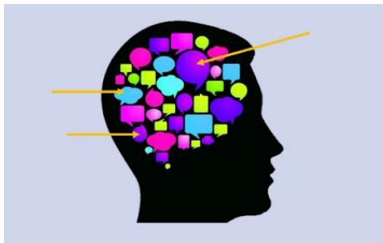
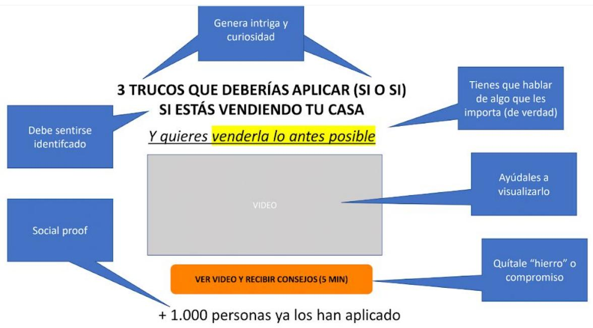
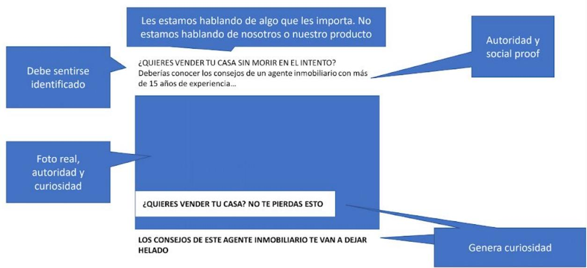
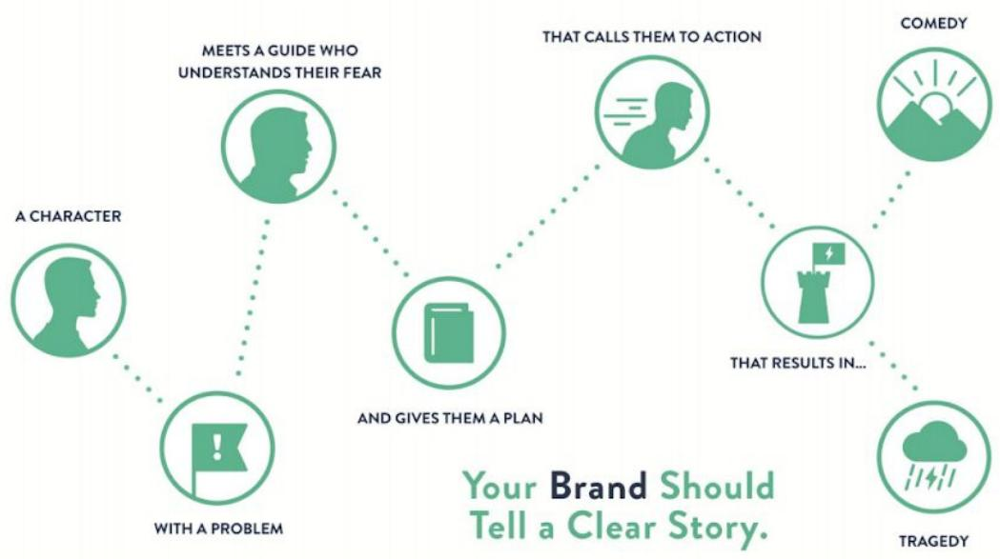
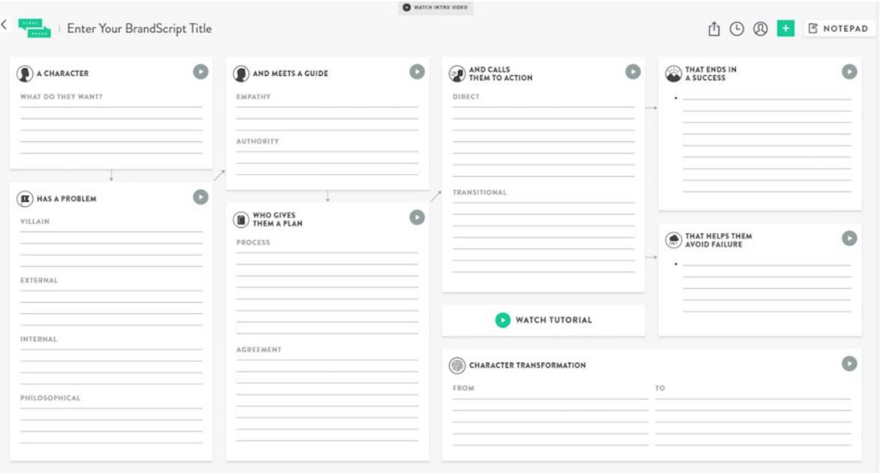

# Conceptos Clave Power Selling

## Leyes de persuasión de Robert Cialdini

Robert Cialdini, el “padre de la persuasión”, analiza el comportamiento humano en sesiones de captación de clientes, con el objetivo de entender cómo dominar el arte de la persuasión.

A partir de su estudio ha creado varios libros en los que explica 7 leyes relacionados con la persuasión que nos ayudan a convencer a clientes potenciales y vender.

## 1. Principio de Reciprocidad

Regala y entrega valor gratis a tus clientes porque la mente humana nos obliga a devolver.

Aplicación:

● Lead Magnets.

Value Marketing.

Nurturing con contenidos de valor.

Samples o muestras gratuitas de productos.

## 2. Principio de Compromiso y Consistencia

Tienes que conseguir que los clientes se comprometan con alguna acción o postura,porque luego suelen actuar en consecuencia.

Aplicaciones:

Encuestas.

● Proceso de venta con plazos definidos.

## 3. Prueba social o Consenso

Preferimos comprar lo que está comprando la gente.   
Especialmente la gente que nos parece aspiracional.

## Aplicaciones:

Destaca tus éxitos.

● Testimonios.

## Consejos:

Destaca la prueba social pero en determinado. segmento que sea una referencia para tus clientes.

● No des por supuesto que conocen tu tamaño.

Se creativo. A veces no tienes mucho track record. Es cuestión de parecerlo.

## 4. Principio de Simpatía (y Cercanía)

Preferimos comprar a marcas y productos que “nos caen bien” y que sentimos cercanas.

Aplicación y consejos:

Utiliza el storytelling.

Destaca tus valores.

● Apóyate en el lado personal de la empresa.

● Las redes sociales son el canal perfecto.

## 5. Principio de Autoridad

Preferimos (y nos genera confort) comprar a gente o marcas que sean una referencia o autoridad.

Aplicaciones:

Destaca tus éxitos, logros, clientes, premios, etc.

## 6. Principio de Escasez

## Aplicaciones:

Fear of missing out(FOMO). Como hace booking, Amazon, etc.

Plazas o unidades limitadas.

● Tiempo limitado.

Hacer preventas.

## 7. Principio de Pertenencia

Nos gusta sentirnos parte de algo, de una comunidad, grupo, etc.

## Aplicaciones:

● Haz partícipes a tus clientes.

Crea una comunidad.

Utiliza las redes sociales.

Consúltales.

## ‘’Vender’’ una acción

## A QUÉ NOS REFERIMOS

En marketing estamos permanentemente pidiendo a los clientes que hagan cosas: pinchen en un anuncio, dejen los datos, compren, etc. Tienes que ser capaz de vender cada una de esas acciones de forma irresistible.

## PROBLEMA HABITUAL

Casi nadie sabe hacerlo. Y por eso sus anuncios no funcionan, las webs no convierten, etc.

## Decálogo Power Selling

1. Tiene que sentirse identificado.

2. Genera intriga, curiosidad o sorpresa.

3. Explícale qué va a ganar (beneficios).

4. Y déjale claro qué va a recibir.

5. Entra en la conversación en su mente.

6. Y habla su idioma.

7. Adelántate a sus objeciones.

8. Déjale claro qué tiene que hacer.

9. Disminuye el riesgo dándole confianza y confort.

10. Apoyate en Social Proof.

## La conversación en la mente del cliente

Dentro de la mente de los clientes están las conversaciones. Cuando tu conoces esas conversaciones puedes utilizar sus mismas palabras para crear mensajes que conecten mejor en todos tus anuncios, webs, etc. ¡Y venderás como una bestia!

## CLAVES:

● Contenido. Que sepas qué piensa.

Palabras. Que sepas qué palabras utiliza.

## Qué conversaciones tenemos que ‘’buscar’’

Debes descubrir qué hay en la mente de tu cliente acerca de las cosas importantes:

● ¿Qué le duele o preocupa?

¿Qué beneficios busca (en tu producto o similares)?

● ¿Qué quiere / no quiere?

¿Por qué te compra?

¿Por qué no te compra?

¿Qué le motiva?

¿Qué está haciendo ahora? ¿Alternativas?

● ¿Qué piensa de la competencia?

¿Qué es lo que le gusta de ti? ¿Y qué no?

¿Qué objeciones o dudas tiene?

Debes conocer todo esto. Y además saber qué expresiones y palabras utiliza para expresarlo.

## Estilo Editorial

## A QUÉ NOS REFERIMOS

Estilo de comunicación utilizado en las noticias.. Está pensado para generar intriga, curiosidad, sorprender, etc. Abre cualquier medio de comunicación y verás a lo que nos referimos.

## CÓMO APLICARLO

Debemos inspirarnos en ello y aplicarlo (en la medida de lo posible) en todas nuestras comunicaciones, ya sean anuncios, webs, folletos, emails, etc. Tienes que conseguir que todo lo que hagas genere interés, sorprenda, etc.

## PROBLEMA HABITUAL

Las empresas se limitan a hablar de ellos, de sus competidores, a informar, etc. Y en cualquier caso aburren y no sorprenden. Fíjate en cualquier anuncio.

## CÓMO APRENDER

Existen algunas técnicas y consejos.

● Y tienes que fijarte mucho.

Analiza todas tus comunicaciones: ¿sorprenden? ¿generan intriga? ¿apetece seguir?. ¿O por el contrario aburren y generar indiferencia?

## Imágenes

Utiliza Imágenes naturales, de gente real, que conecte.

Utiliza Imágenes que sorprendan, llamen la atención, generen curiosidad.

No utilices imágenes tipo stock que parezcan muy falsas.

Fórmulas (más abajo).

Utiliza Palabras potentes (más abajo).

Apóyate en preguntas.

## Números

Apóyate en Números siempre que puedas. Ayudan a “concretar” y generan más interés y curiosidad.

Las 5 claves para ....Vs Las claves para....

## Palabras potentes (ejemplos)

Tu.

● Gratis.

Ahora, muy pronto, nunca más, en muy poco tiempo, nunca, ¡ya!..

● Gana, aprende, siente, deja de, olvídate, únete…

Rápido, nuevo, primer, único, sorprendente, deseado...

## Preguntas

Las preguntas tienen dos ventajas (respecto a una afirmación):

El cliente puede estar de acuerdo o no con una afirmación. Con la pregunta no te

mojas.“¿Crees que la clave para ..... ?”

Te hacen plantearte algo ¿Te gustaría ser un emprendedor de éxito?

Descubre los 3 errores que NUNCA debes cometer.

## Algunas fórmulas

Apóyate en estas fórmulas para escribir titulares,bullets, etc.

● Cómo (obtener un beneficio) sin (hacer algo).

Cómo (eliminar un problema) sin (hacer algo).

(Beneficio) en (plazo de tiempo) sin (hacer algo).

(X) formas de (obtener un beneficio).

Deja de (algo que molesta al cliente).

¿Crees / Pensabas que (algo en la mente del cliente)? NO.

¿Te gustaría (lograr algo / eliminar un problema) sin (hacer algo)?

## Lead Magnets

## ¿QUÉ ES?

Consiste en ofrecer gratis algo valioso a tu público objetivo (e-book, consejos, video,webinar, evento físico, etc.) con el objetivo de atraer su atención y que “entren en el funnel de conversión”.

## ¿PARA QUÉ SIRVE?

Ampliar el tamaño de tu mercado dirigiéndote a los que “no están buscando”.

Captar leads más baratos.

Consejos en la creación de un Lead Magnet

## Debes aplicar el Decálogo. En concreto:

Crea un contenido que resuelva un problema o genere un gran valor para tu público objetivo. ¿Qué les importa de verdad?

Tu Customer Persona objetivo tiene que sentirse identificado desde el primer momento.

● Deja muy claro qué va a recibir.

Ayúdale a “visualizarlo”. Por ejemplo, si es un ebook, crea una imagen del ebook.

Apóyate en el social proof. Utiliza testimonios y destaca a cuánta gente estás ayudando,se lo ha descargado, etc.

## Anuncios

## CLAVES

Tienes que “vender el click” de forma irresistible.

Inspírate en el estilo editorial. Es decir, en vez de informar y aburrir como el típico anuncio, debes generar intriga, curiosidad, ganas de saber más, etc.

● Aplica el Decálogo.

Les estamos hablando de algo que les importa. No estamos hablando de nosotros o nuestro producto

Genera curiosidad

Descubre los 5 errores mortales. Video gratis ( 5 min.) +10.000 visualizaciones

Palabras potentes

Deja claro lo que van a recibir

Social Proof

## Crear un cuento

## RETO

Cuando creas anuncios, web, emails o cualquier otra comunicación, te enfrentas a dos retos:

¿Qué mensajes transmitir? ¿Cómo estructurar estos mensajes?

La gran mayoría de la gente no sabe qué mensajes transmitir, ni cómo estructurarlos. ¿Consecuencia? Aburren, no se entiende nada, etc.

## SOLUCIÓN

Utilizar la “estructura y contenido de un cuento o historia” que enlace todos los mensajes,sea fácil de entender y seguir, enganche, convenza, etc.

## Brandscript de

Script de tu marca = Guión que guioniza todas las comunicaciones de tu marca.

StoryBrand

El Brandscript es la herramienta que vamos a utilizar para crear el guión. Creada por Storybrand. https://storybrand.com/

Storybrand nos ayuda a dar un guión a todas las comunicaciones de una empresa, inspirándonos en la estructura que siguen las películas y novelas. Es decir, una historia que engancha.

Ayuda enormemente a dar respuestas a los retos anteriormente identificados: ¿Qué contenido? ¿Cómo estructurarlo?

> **Figura**: Esquema de la metodología StoryBrand SB7 («Your brand should tell a clear
> story»): la narrativa sigue la secuencia (1) un personaje (A CHARACTER), (2) con un
> problema (WITH A PROBLEM), (3) conoce a un guía que entiende su miedo (MEETS A GUIDE WHO
> UNDERSTANDS THEIR FEAR), (4) que le da un plan (AND GIVES THEM A PLAN), (5) que le llama
> a la acción (THAT CALLS THEM TO ACTION), (6) que resulta en éxito/COMEDY o evita el
> fracaso/TRAGEDY. La marca es el guía, no el héroe; el cliente es el personaje.
Metodología 7Brandscripthttps://storybrand.com/

> **Figura**: Plantilla del BrandScript de StoryBrand con los bloques a rellenar: A
> CHARACTER (what do they want), HAS A PROBLEM (villain, external, internal,
> philosophical), AND MEETS A GUIDE (empathy, authority), WHO GIVES THEM A PLAN (process,
> agreement), AND CALLS THEM TO ACTION (direct, transitional), THAT ENDS IN A SUCCESS,
> THAT HELPS THEM AVOID FAILURE, y CHARACTER TRANSFORMATION (from → to). Es la herramienta
> operativa para guionizar todas las comunicaciones de la marca.