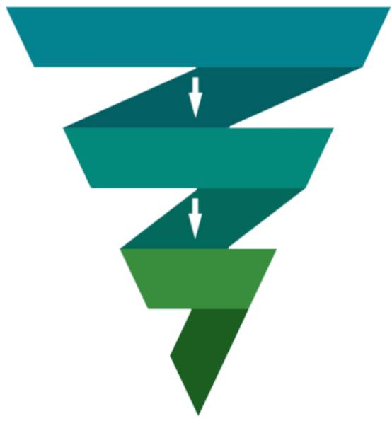

## Conceptos Clave Visión Estratégica

## Power funnel

Un funnel es una forma de ordenar las diferentes etapas que pasa alguien desde que visita nuestra web hasta que acaba comprando.

Habitualmente se representa de forma simplificada como un embudo para mostrar gráficamente cómo de todo lo que entra por la parte alta del embudo (visitas a nuestra web) solo una parte de ello sale por la abajo (clientes).

Nuestra versión es el Power Funnel porque tenemos en consideración no solo las etapas por las que pasa el cliente sino las diferentes estrategias de marketing digital que podemos seguir, las herramientas que nos van a hacer falta para cada estrategia y las métricas que tenemos que tener en cuenta.

Hay tantos funnels como empresas.

Cada empresa debe diseñar su propio funnel conforme a su modelo de negocio particular.

Podemos aprender de otros funnel y tener referencias pero si lo copiamos no tendremos los mismos resultados.

Las empresas que no tiene un funnel diseñado no tienen la perspectiva o visión amplia de toda su estrategia de marketing digital y por lo tanto

● toman peores decisiones y aleatorias

se pierde mucha información por el camino

tienen menos insights y de menor calidad

gestionan peor a su equipo de marketing

convierten menos de lo que podrían

su CAC sube como consecuencia de todo esto

## Funnels cortos vs largos

Si vendemos productos o servicios cuya decisión de compra sea muy simple será más fácil convertir una visita en una compra. Por eso en estos casos hablamos de un funnel corto.

Esto pasa, por ejemplo, si tenemos una tienda online donde vendemos una cartera de 10 euros.

En cambio, si tienes un servicio que cuesta 3.000€ al mes te costará mucho convertir las visitas a tu web en clientes. Te hará falta crear cadenas de emails para dar más información, responder muchas preguntas, llamarles por teléfono… En estos casos hablamos de que se trata de un funnel largo.

En resumen:

● Proceso de venta corto = funnel corto

Proceso de venta largo = funnel largo

Que sea de un tipo u otro no es que sea mejor o peor.

El funnel se utiliza para mejorar cualquiera de los objetivos principales del negocio y tendremos que optimizarlo como haga falta para ello.

## Objetivos de cualquier negocio

## 1.- Incrementar ventas 2.- Obtener más beneficios 3.- Incrementar el ROI

Grábalos a fuego porque estos objetivos son comunes para el 100% de los negocios cualquier acción de marketing que hagamos de una forma u otra debe orientarse a mejorar al menos alguno de estos objetivos

## Margen bruto

N° de centes

$$
\texttt { \textbf { x } } ( { \mathsf { C L T V } } - { \mathsf { C A C } } )
$$

## ROI

Return On Investment

$$
\mathrm { R O I } = \frac { \mathsf { B e n e f i c i o \left( M B \right) } } { \mathsf { I n v e r s i o n } } = \frac { \mathsf { c l i e n t e s } \quad \mathrm { \times } \quad \mathrm { \left( C L T V - C A C \right) } } { \mathsf { N } ^ { \circ } \mathrm { d e } }
$$

## Palancas del marketing digital

## Más tráfico o más leads

Es lo que todo el mundo quiere para su empresa. Donde todas ponen el foco y veremos que a veces esto es un problema.

¿Qué tenemos que hacer? Intensificar las estrategias de branding y atracción, lo que suele ir acompañado

de un incremento de la inversión.

## Más conversión

Hacer que un mayor porcentaje de visitas a nuestra web o lead se conviertan en clientes.

Para ello podemos hacer muchas cosas pero especialmente:

● Tener una propuesta de valor más potente.

Optimizar todo el funnel: mensajes, llamadas, retargeting etc.

## Más CLTV

Que cada cliente se deje más dinero durante su ciclo de vida.

Estrategias que podemos seguir:

> Para modelos de venta de productos y servicios:

Subir los precios (ticket medio)

Que los clientes repitan

> Para modelos de recurrencia:

Que los clientes no se vayan, es decir, reducir el Churn Rate

## Menos CAC

Si reducimos lo que nos cuesta adquirir cada cliente tendremos más dinero para invertir en nuevos canales y captar más clientes.

También nos ayuda a tener una empresa más sostenible y menos sensible a cambios.

## La conversión: la gran olvidada

La inmensa mayoría de contenido relativo a marketing digital que hay en internet y en los libros está orientada a lo mismo: cómo atraer más tráfico.

Atraer tráfico a tu web es imprescindible. Es como empezamos a llenar el funnel por arriba. El problema está cuando nos olvidamos por completo de la

## conversión.

Atraer tráfico es cada día más y más caro y, por lo tanto, es fácil que el CAC suba en igual medida.

En cambio, mejorar la conversión es mucho más barato y puede contribuir en mayor medida a mejorar los objetivos de la empresa.

Mira este ejemplo. Pasando la conversión de un 0,5% a un 1% el margen bruto es 3x mayor.

<table><tr><td rowspan=1 colspan=1></td><td rowspan=1 colspan=1>Base</td><td rowspan=1 colspan=1>Optimizada</td></tr><tr><td rowspan=1 colspan=1>Inversión en tráfico</td><td rowspan=1 colspan=1>10.000€</td><td rowspan=1 colspan=1>10.000€</td></tr><tr><td rowspan=1 colspan=1>Visitas</td><td rowspan=1 colspan=1>100.000</td><td rowspan=1 colspan=1>100.000</td></tr><tr><td rowspan=1 colspan=1>Ratio de conversión</td><td rowspan=1 colspan=1>0,5%</td><td rowspan=1 colspan=1>1%</td></tr><tr><td rowspan=1 colspan=1>Volumen: N° gafas vendidas</td><td rowspan=1 colspan=1>500 gafas</td><td rowspan=1 colspan=1>1.000 gafas</td></tr><tr><td rowspan=1 colspan=1>CAC</td><td rowspan=1 colspan=1>20€</td><td rowspan=1 colspan=1>10€</td></tr><tr><td rowspan=1 colspan=1>CLTV</td><td rowspan=1 colspan=1>40€</td><td rowspan=1 colspan=1>40€</td></tr><tr><td rowspan=1 colspan=1>CLTV - CAC</td><td rowspan=1 colspan=1>20€ por gafa</td><td rowspan=1 colspan=1>30€ por gafa</td></tr><tr><td rowspan=1 colspan=1>Margen bruto total</td><td rowspan=1 colspan=1>10.000€</td><td rowspan=1 colspan=1>30.000€</td></tr></table>

## La importancia de la atribución

La atribución trata de asignar cada venta o conversión a un canal específico.

¿Vienen de un anuncio de Instagram? ¿De buscarnos en Google?

Si la compra fuera tan impulsiva que con impactarles una vez ya nos compran la atribución sería así de simple.

En cambio, la realidad es que para que alguien nos compre necesitas muchos impactos por diferentes canales normalmente para termina comprando.

Y ahí radica la dificultad de la atribución.

Si un cliente…

1. ve un anuncio nuestro en Facebook

2. después en youtube

3. un amigo le comenta sobre nosotros

4. nos busca en Google

5. vuelve a entrar por un anuncio de remarketing

6. y finalmente nos compra en esa última visita

¿Qué canal se lleva el mérito? ¿El primero? ¿El último click?

Es complejo pero tener un modelo de atribución claro nos va ayudar a conocer qué canales nos funcionan mejor y peor a lo largo del tiempo. De ahí su importancia.