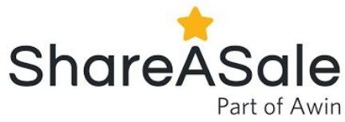
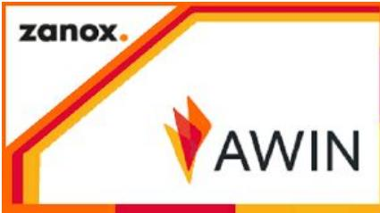

# Listado de plataformas de afiliados

Tiene infinidad de temáticas de todos los sectores y muchos planes en todos los servicios y productos relacionados con el marketing online. Tiene programas de afiliados por ejemplo de soluciones para tiendas online, publicidad b2b, registro de dominios, hostings, herramientas para redes sociales, plantillas para wordpress y herramientas para monitoreo de clicks en enlaces.

https://www.shareasale.com/

Esta plataforma de afiliación también es de las que incluye entre sus idiomas el castellano. También existen muchos programas de diferentes temáticas como:

Viajes

● Banca/ Seguros /Finanzas

● Gran consumo

● Automóvil

● Telefonía /ADSL

Belleza / Salud

https://performance.timeonegroup.com/es/

## Tradedoubler

Al igual que con las demás también dispones de programas de afiliados para multitud de sectores y cuenta con registro de más de 2.000 anunciantes. La web contiene diversos contenidos para que sepas que hacer en cada paso, en ese sentido es de las más completas.

Tienes un guía inicio rápido, ejemplos por si quieres conocer otros casos de éxito y entre su red de afiliados se encuentran empresas tan conocidas como Mapfre, El Corte Inglés o Fnac.

https://www.tradedoubler.com/es/

## Rakuten Marketing

La utilizan más en Estados Unidos, Australia o en algunos países de Europa como Francia, Alemania o Reino Unido. Es una opción más, recomendable si te manejas bien en inglés para entender todo. La ventaja o desventaja, según se mire, puede estar en los precios o comisiones que estarán adaptadas a mercados extranjeros y no al español.

La calidad de los servicios y la atención está demostrada así que puedes comparar y ver si ésta plataforma es la que más te conviene.

https://rakutenmarketing.com/

Es una de las más famosas y antiguas. El panel de administración lo tienes en castellano y otros idiomas.

Ofrece un seguimiento al afiliado y un sistema fiable de pagos. También incluye informes y un sistema propio de análisis de datos que podría ayudarte a entender mejor los resultados. Otros servicios avanzados que pueden convencerte a la hora de elegir esta plataforma de afiliación son:

Supervisión de transacciones en tiempo real.

Miniaplicaciones para productos.

● API/ Servicios Web.

## Admitad

Get Code.

https://www.cj.com/

Cuenta con más de 700 programas de afiliados y tienen un sistema original por el que los afiliados de mayor éxito reciben premios en forma de pagos adicionales. Como afiliado tienes acceso a varias herramientas y la posibilidad de tener un gestor-asesor personal que te guíe a la hora de entender y contratar las comisiones.

● Servidor publicitario

SubID

Postback URL

ReTag

● Descuentos y códigos promocionales (cupones)

https://www.admitad.com/es/

## Afiliapub

Está especializada en temáticas relacionadas con el juego y las apuestas. Te ofrece varias opciones a la hora de contratar la forma de pago y puedes elegir entre: CPL, CPA, RS, pagos híbridos y por adelantado.

Luego a la hora de los pagos tienes también diversidad de métodos ya que aceptan: paypal, moneybookers y transferencias.

http://www.afiliapub.com/es

Está especializada en el nicho de mercado del dating o sitios de encuentros y citas. Es uno de las temáticas que más dinero mueven por Internet, de ahí que algunas plataformas decidan centrarse en esta temática.

En comparación con otras, Prelinker ofrece facilidad de pago post resultados, ya que se cobra a día 25 del mes siguiente.

También destaca la posibilidad de tener tu propia marca blanca, y acceso una serie de herramientas de integración para que pongas en marcha tus propios proyectos.

https://www.prelinker.com/

Puedes optar por programas de afiliados de los siguientes sectores:

Financieros y Seguros

● Ventas al por menor y Compras

● Telecomunicaciones y Servicios

Viajes

Dentro de las anteriores secciones existen infinidad de subdivisiones en los que encontrarás multitud de programas de afiliados.

https://www.awin.com/es