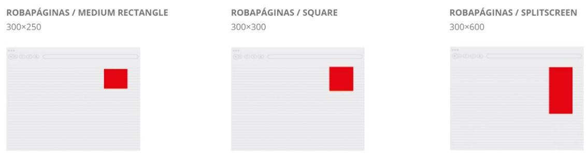
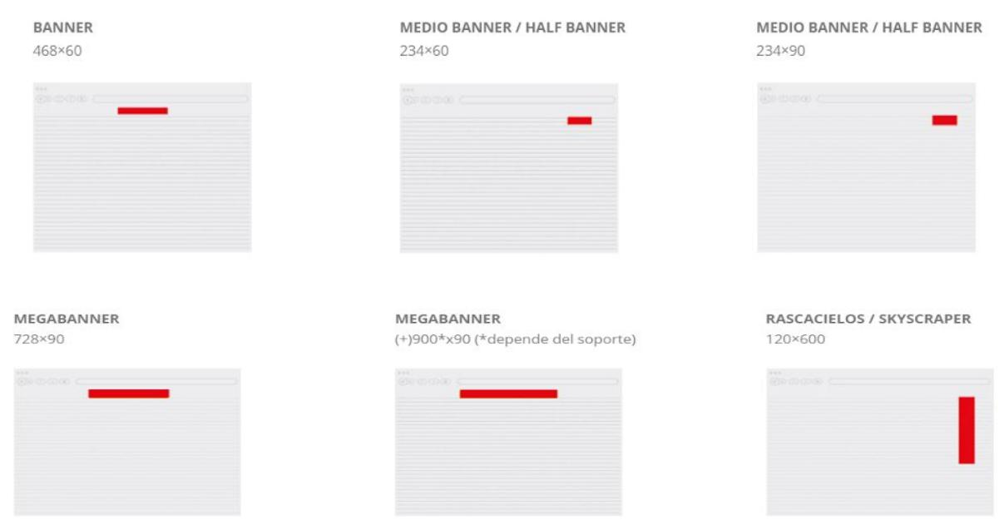
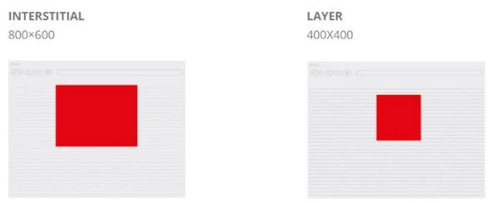
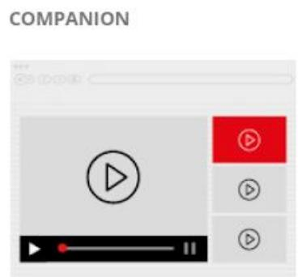
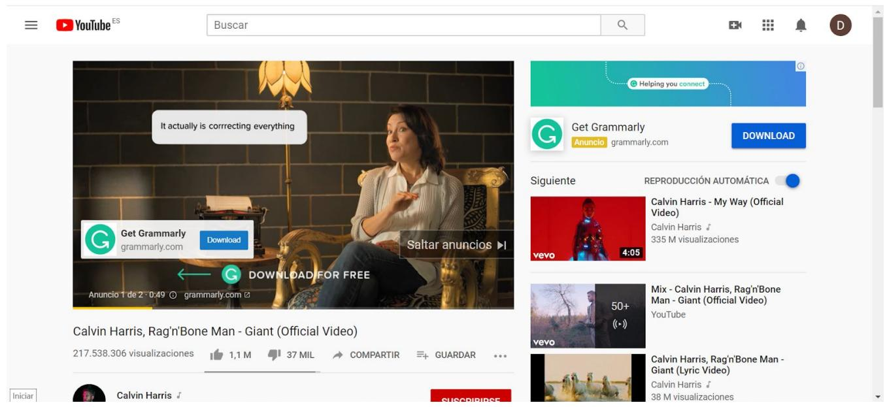
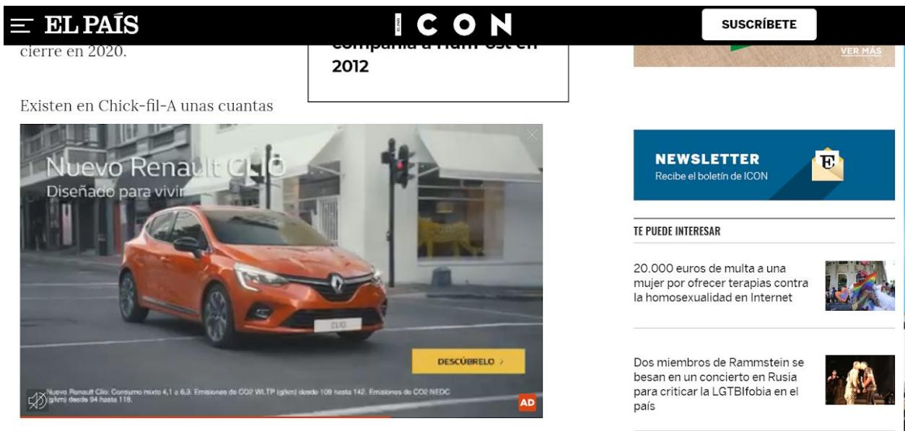

# FORMATOS DE ANUNCIOS DISPLAY

A pesar de que podríamos clasificar siguiendo muchos criterios diferentes, vamos a distinguir los Anuncios Display dependiendo de su movimiento.

En este caso, diferenciaremos entre displays fijos, representados por una imagen incrustada en una web, o displays dinámicos, ya sean en formato de video o .gif.

## Anuncios Display Fijos:

Encontramos distintas modalidades que a su vez varían dependiendo de tamaño, posición y si se mantienen, se expanden o flotan.

Robapáginas: De distintos tamaños y formas, es uno de los formatos más usados de todos los tiempos y nos dan la posibilidad de anunciarnos en casi cualquier sitio web. Todos los Robapáginas tienen también sus versiones expandibles, todas ellas con las mismas medidas y los mismos pesos (30 Kb). A continuación, podéis observar los diferentes tipos de Robapáginas además de un ejemplo en una página web:

Banner: Son muy similares a los Robapáginas, con la única diferencia de que en lugar de cuadrados suelen ser rectangulares y horizontales, excepto en el caso del “Rascacielos”. Se pueden encontrar de muchos tamaños, desde el “Half Banner" hasta el “Megabanner”. Dentro de ellos, se puede distinguir entre tan solo imágenes o banners que reproducen también sonido.

En cuanto a los formatos flotantes, destacan principalmente dos, el Interstitial y el Layer, del mismo tipo pero con distinta medida. Aparecen en el frente de la página, muchas veces tapando el contenido por lo que tienen visibilidad total pero pueden resultar molestos. Muchas veces aparecen en forma de Pop Up.

Todos los formatos que hemos mencionado se pueden encontrar tanto en versión web como dirigido a smartphones, adaptados para ajustarse a los distintos tamaños de la página.

BANNER   
Proporción 6:1   
320×50 /480×80/800×125

  
ROBAPÁGINAS / MEDIUM RECTANGLE Proporción 1:1 300×250/750×625

  
DOBLE ROBAPÁGINAS Proporción 1:2 300×600

  
INTERSTITIALPantalla completa320×480 /640×960

  
INTERSTITIAL DESPLEGABLE Proporción de 6:1 a Pantalla completa 320×50 a 320×480

  
CATFISH Proporción 6:1 320×50 / 480×80 / 800×125

## Anuncios Display de Video:

También podemos encontrar Banners de tipo dinámico, ya sean con reproducción de video o con formato .gif.

El primer tipo que podemos observar, es el formato In Stream, es decir, anuncios que se reproducen antes, durante o después del video.

PREROLL

  
MIDROLL

  
POSTROLL

A continuación podemos ver un ejemplo de Preroll Video, muy habitual en Youtube:  

Aquí tenemos ejemplos de publicidad In Stream con anuncios que aparecen mientras reproducimos un video en Youtube:

Mientras que si los videos publicitarios están incrustados en páginas web y se reproducen automáticamente al entrar, se denominan Out Stream.

IN-BANNER

  
IN-PAGE (IN-TEXT)

  
IN-PAGE (IN-HEADER)

  
FLOATING VIDEO

  
VIDEO INTERSTITIAL

  
NATIVE VIDEO AD

Y este es un ejemplo de video Out Stream que se reproduce al entrar a una web:  
  
peculiaridades. Una de ellas es que no encontraremos en sus menús cubos de alitas o muslitos rebozados y crujientes, quizá la estampa más popular de otras grandes multinacionales especializadas en pollo como KfC (iniciales de

Como dato curioso, en los últimos tiempos están tomando fuerza los Incentivized Ads, es decir, anuncios que aparecen y te dan la posibilidad de reproducir un video a cambio de un ‘premio”.

INCENTIVIZED VIDEO  

Al igual que ocurre con los de formato fijo, también se han adaptado estos anuncios dinámicos al formato móvil.

VIDEO BANNER Proporción 4/3 320×240 / 480×320

IN-TEXT Proporción 4/3 320×240 /480×320

INTERSTITIAL CON VIDEO Video con imagen 320×240 a 320×480

VIDEO PRE-ROLL Proporción 4/3 320×240 / 480×320

