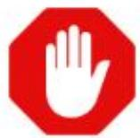
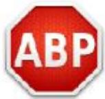

## Bloqueadores de publicidad

Los adblockers o bloqueadores de publicidad son programas o extensiones que evitan que, mientras el usuario navega, aparezcan banners, pop-ups y demás formatos publicitarios que le interrumpan.

Han supuesto una revolución en el sector de la publicidad online. Por eso tienes que tenerlos en cuenta. No vale con impactar de cualquier manera al usuario. Hacer publicidad invasiva, que “asalte” la navegación del usuario implica que, si este tiene instalado un adblocker, tu anuncio no le aparezca.

Al hacer campañas piensa en crear valor. Tienes que ofrecer productos, servicios y contenido que realmente sean útiles al consumidor.

Dependiendo del tipo de adblocker que se utilice, se puede bloquear toda la publicidad o aplicar filtros que eliminen sólo la más intrusiva, sólo la que tiene que ver con un tema en concreto… Algunos, por defecto, permiten los anuncios “aceptables o discretos”.

## BLOQUEADORES MÁS UTILIZADOS

## ADBLOCK

● Es el adblocker más conocido

Permite los anuncios aceptables

Los usuarios pueden crear sus propios filtros y hacer “listas blancas”

Bloquea también anuncios en redes sociales (Facebook, Twitter, Youtube…)

ADBLOCK PLUS

## ADBLOCKER ULTIMATE

## ADGUARD ADBLOCKER

No bloquea todos los anuncios por defecto, sino que muestra los anuncios aceptables.

Los usuarios avanzados pueden crear filtros y hacer “listas blancas”.

Bloquea publicidad en Youtube y Facebook .

Elimina todos los anuncios. No tiene la flexibilidad de otros adblockers que permiten los “anuncios aceptables” y las listas blancas

● No tiene ninguna afiliación con compañías publicitarias ni patrocinios corporativos.

Permite filtrar malware y adware y evitar el seguimiento.

Es más moderno y más rápido (usa la mitad de memoria que otros adblockers).

Está más enfocado en las principales redes sociales. Funciona especialmente bien para bloquear anuncios en Facebook, Twitter, Youtube…

Bloquea iconos sociales (botones como “me gusta”) que aparecen en muchas páginas impidiendo la lectura del contenido.

Ten en cuenta que algunos adblockers no actúan ante ‘’Anuncios Discretos’’, anuncios que están bien integrados en el sitio web y que no afectan a la navegación y a la usabilidad.