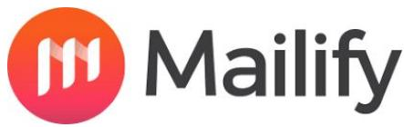

# Herramientas de Email Marketing

## sendinblue

Aunque no sea la más conocida y que Marketing Automation esté limitado al premium, SendinBlue ofrece la creación de newsletters eficaces, la posibilidad de segmentar tu audiencia sin límites así como analizar y optimizar tus campañas.

Además, cuenta con estadísticas en tiempo real, mapas de calor y un plan gratuito con contactos ilimitados y 300 emails al día.

## BENCHMARK

Su versión gratuita, aún estando limitada, tiene una capacidad de 2000 contactos y 14000 envíos al mes.

Cuenta con buenos precios y un muy buen soporte técnicos, así como autorespondedores y embudos de venta visuales.

Es la herramienta perfecta para blogs, web y tiendas online.

ActiveCampaign>

Tiene automatizaciones y etiquetas, un CRM básico, puntuaciones de Leads, embudos de ventas visuales y una comunidad grande con muchos tutoriales (aunque la mayoría están en inglés).

En la parte negativa, no tiene una versión gratuita (solo una prueba de 14 días), es caro en algunas versiones y no está completamente traducido.

También tiene puntuaciones de leads, embudos de ventas visuales y da la posibilidad de crear Webinars, Landing Pages y mandar emails de abandono del carrito.

Por otro lado, es difícil de usar y no tiene versión gratuita, solo un mes de prueba gratis

Aunque no es de las más conocida, tiene 67 plantillas personalizables, un editor gráfico para diseñar newsletter en pocos minutos, gestión de contactos, listas negras y corrección de emails entre otras cosas.

Además de esto, puedes diseñar landing pages y formularios, dispones de más de 1000 imágenes libres, un soporte técnico en 6 idiomas y el seguimiento de campañas en tiempo real.

Ofrece también la posibilidad de enviar SMS personalizados y de hacer campañas automáticas multicanal.

Cuenta con la versión gratuita con más capacidad, (15000 suscriptores y 75000 envíos al mes), y no tiene limitaciones.

Tiene autorespondedores, un muy buen soporte técnico y servidores muy optimizados anti spam.

Por último, destacamos la opción de las plantillas responsive y sobre todo, unos muy buenos precios.

Sin embargo, no cuenta con embudos de venta, etiquetado de usuarios ni opciones avanzadas, además de su poca usabilidad.

## Infusionsoft.

Es una solución muy especializada en la venta, con seguimientos web, puntuación de Leads, automatizaciones y segmentación y embudos de venta visuales.

Aunque tiene un CRM muy completo y se puede integrar en muchas plataformas, no cuenta con una versión gratuita, solo una demo, sólo está disponible en inglés y el soporte técnico es limitado y de baja calidad.

Aparte de esto, destaca por ser muy caro.

También destaca por ser herramienta muy especializada a la venta, con embudos de ventas visuales y webinars, y al igual que la anterior, puedes realizar seguimientos web, puntuación de Leads, automatizaciones y segmentación y CRM muy completo.

En lo negativo destaca que no tiene versión gratuita, solo está disponible en inglés, tiene un soporte técnico limitado y es caro, aunque su versión básica no tiene limitaciones.

HubSρôt

Destinado principalmente a empresas grandes, es una solución muy completa con herramientas de marketing, que posee prácticamente todo lo que hemos mencionado anteriormente excepto los embudos de venta, pero con un gran soporte técnico.

Ser el más caro (a partir de 185€/mes la versión con email marketing, unas versiones gratuitas muy limitadas y la falta de una traducción completa son sin duda sus puntos flacos.