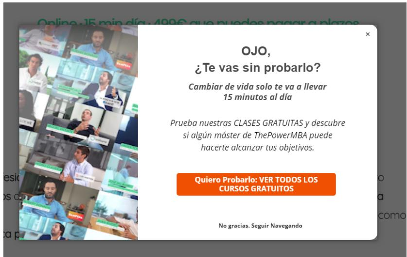
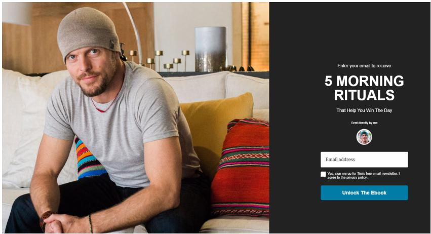
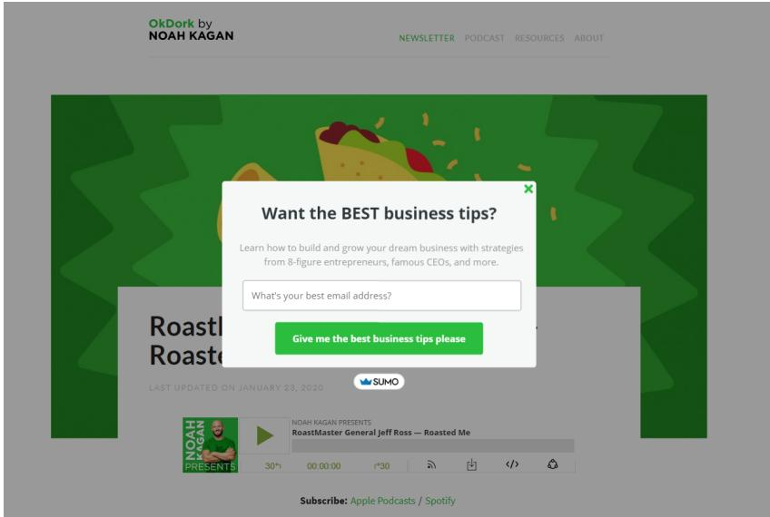
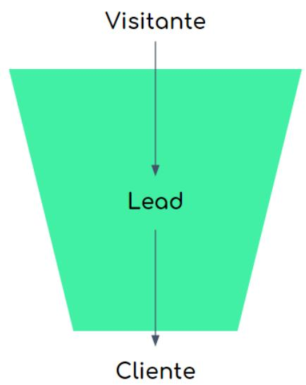
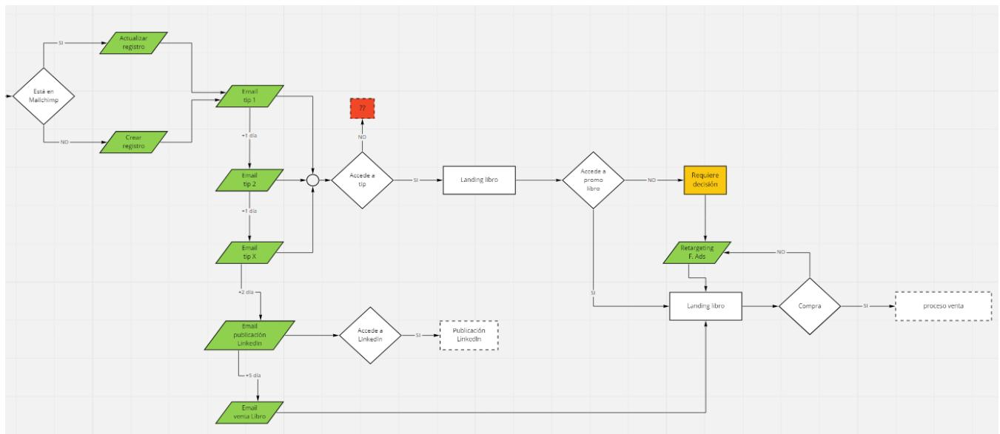

# Conceptos Clave Captación y Nurturing de Leads

## Lead

Un lead es cualquier persona interesada en lo que hacemos y que tenemos algún dato de contacto suyo que nos permita volver a interactuar con ella.

Esta es la descripción genérica y después cada empresa es la que decide en qué momento una persona pasa de ser un simple contacto a un lead.

Esto no es genérico porque ¿qué significa que tiene interés en lo que hacemos?

Cada negocio es un mundo y para lo que unos es una muestra clara de interés para otros no lo es y prefieren no considerarlos leads.

## Lead magnet

Un lead magnet es cualquier forma que usemos para captar los datos de un potencial cliente o lead.

En ThePowerMBA usamos las clases gratis como lead magnet.

De esta manera captamos los datos de quienes están interesados en ver cómo funciona el programa por dentro y les ofrecemos varias clases gratis.

Formatos de lead magnets hay decenas.

Podemos por ejemplo dar un ebook a cambio (algo que normalmente se usa muy mal)

  
o también para nuestra newsletter

## Leads a lo largo del funnel

Una persona a medida que llega y atraviesa nuestro funnel pasa por nuestro funnel tendrá diferentes estados.

En general se puede representar así:

  
Desde que nos conoce hasta que muestra interés y nos deja sus datos sería un visitante o contacto.

En el momento en que deja sus datos y tiene interés

por nuestro producto pasa a ser un lead.

Una vez un lead nos compra pasa a ser un cliente.

Pero por supuesto no todos los leads se convierten en clientes y vamos a perder muchos por el camino. Dependiendo de cómo queramos hacerlo, hay quien los deja de llamar leads o los llama leads “muertos” ya que se consideran imposibles o muy difíciles de que se les pueda vender en el futuro.

## Lead nurturing

Cuando alguien se convierte en lead empieza una fase en la que tenemos que intentar acercar de la manera que sea a ese lead para convertirlo en cliente.

Es decir, se trata de convencerlo para que nos compre. A eso le llamamos lead nurturing.

Esto lo hacemos dándole la información adecuada para resolverle todas las dudas que pueda tener y que le están impidiendo comprar.

Las formas de hacer lead nurturing son casi infinitas. Cualquier manera de aportar valor al lead para acercarlo al cliente es válida.

En negocios digitiales (y muchos físicos) el email es un canal muy habitual pero como hemos dicho, imaignación al poder.

## ¿Todos los negocios necesitan lead nurturing?

En ocasiones, hay compras que son tan rápidas e impulsivas que una persona pasa a ser cliente sin ni siquiera pasar por ser lead.

Imagínate que vas a comprar un paquete de folios en

Amazon. No hace falta pedir información extra, ni una prueba gratis ni nada. Es poco dinero, lo ves y lo compras.

En estos casos no hay lead nurturing porque ni siquiera hay un lead o el precio de venta es tan bajo que ni merece la pena.

Pero en una gran mayoría de negocios donde la compra no es impulsiva si es necesario trabajar el lead nurturing.

Igual es un nurturing muy sencillo, pero existe.

En cambio cuando el precio es muy elevado o la decisión de compra es muy compleja es cuando más y mejor nurturing necesitamos.

## Lead scoring

Cuando manejamos muchos leads necesitamos organizarlos y priorizar y esto lo hacemos gracias al lead scoring.

Consiste principalmente en asignar una puntuación a cada lead según las acciones que haga o deje de hacer.

A más puntuación le asignemos un lead significa que más probable es que nos compre y, por lo tanto, tenemos que priorizar las acciones sobre este tipo de leads.

Por ejemplo, cuando un lead abre todos los emails que le enviamos y hace click en los enlaces y rellena todos los formularios que le enviamos, etc… es bastante más probable que nos compre que alguien que no ha abierto nunca nuestros emails. En este caso si tenemos un comercial que solo puede llamar a una de esas dos personas es evidente que merece más la pena llamar a la primera que a la segunda.

Para eso sirve el lead scoring, para hacer ese “razonamiento” de forma automática.

## Marketing automation

Es el proceso con el cual automatizamos las diferentes acciones que requiere el lead nurturing.

A mayor es el volumen de leads que manejamos más necesidad hay de automatizar lo máximo posible.

Para ello existen infinidad de herramientas llamadas CRM (Customer Relationship Management) que nos permiten organizar y automatizar las acciones a lo largo del funnel, especialmente las de nurturing.

## Workflow

Cuando queremos automatizar todo o parte de nuestro nurturing es necesario diseñar antes el workflow, o lo que es lo mismo, el esquema de todas las posibles acciones que según lo que hace el lead van ocurriendo.

