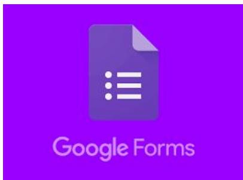

# Herramientas para crear formularios

## Google Forms

Además de ser gratuita, puede guardar   
automáticamente los resultados del form en una hora de cálculo para facilitar el análisis.

Es muy fácil y rápido de editar.

Incluye todos los campos básicos, pero no encontrarás campos para pagos o para subir archivos.

Si es necesario, puedes añadir campos y funciones con Google Forms Add-ons.

## Pros

Lo principal: Es gratis, online y permite recopilar información de forma fácil y eficiente.

Puedes crear encuestas y formularios en cuestión de minutos.

Solo necesitas una cuenta de Google para empezar a utilizarlo.

La interfaz es muy fácil de utilizar. Cualquier usuario con un conocimiento medio puede crear formularios.

Puedes elegir entre una paleta de colores así como imágenes personalizadas de fondo.

Los resultados se integran con hojas de cálculo de google, lo que facilita mucho el análisis de resultados.

● Permite mucha personalización del formulario.

Podemos tanto enviar los formularios por mail cómo integrarlos en una web o enlazarlos a través de RRSS.

## Contras

● La personalización del diseño es limitada.

Solo funciona con conexión a internet.

Existen algunas limitaciones relativas a la capacidad que la herramienta según el formato del documento.

## Precios

gratuito con una cuenta de Gmail. O desde \$ 5 al mes con una cuenta de G Suite.

## Google Forms

## Wufoo

Tiene todos los campos que necesitas para crear un buen formulario con su sistema de arrastrar y soltar, incluidos campos de pago que funcionan con una gran variedad de servicios y una herramienta de subida de archivos que permite al usuario enviar imágenes y documentos a través del formulario.

Además, incluye más de un centenar de plantillas y temas para facilitar el inicio.

Cuenta con un generador de informes muy potente y fácil de usar.

## Ventajas

Buena protección anti-spam.

● Interfaz fácil de utilizar para crear formularios.

Buenos registros de envío de formularios.

Es muy simple para crear formularios desde 0 y luego copiar el código html y fijarlo directamente en tu web.

Es fácil y barato crear formularios y cuestionarios profesionales.

Aunque puede parecer complejo, es de hecho fácil de entender y administrar.

● Tiene un gran soporte técnico.

## Contras

● El sitio móvil no está del todo optimizado.

● La información API es complicada.

## Precios

Gratuito para 3 formularios y hasta 100 entradas al mes. O desde \$ 14.95 al mes para hasta 10 formularios y 500 entradas.

## Wufoo

## JotForm

Se considera la herramienta más rápida de utilizar.

Ve a jotform.com, haz clic en “Plantillas” y en “Usar plantilla” y segundos más tarde tendrás un formulario casi completo.

Puedes personalizar los campos o arrastrar y soltar para añadir alguno nuevo. Luego solo tienes que hacer clic en Publicar y copiar el enlace del formulario para utilizarlo.

Incluye una variedad de campos junto con integraciones de pago.

Es un constructor de formularios sorprendentemente potente y uno de los más fáciles de usar.

## Pros

Este generador de formularios en línea que consiste prácticamente en arrastrar y soltar, con 100 envíos, 10 envíos seguros y 10 envíos con pago, todo gratis.

Lo principal es la facilidad de uso, la cantidad de funciones de los formularios y la atención al cliente.

Tiene muchas plantillas y se pueden integrar apps.

Las opciones son prácticamente interminables.

## Contras

No es fácil ordenar datos en sus servidores para propósitos de validación.

## Precio

Gratis para 5 formularios y hasta 100 entradas al mes. O desde \$ 19 al mes para el Plan Bronce para 25 formularios y hasta 1,000 entradas por mes.

JotForm

## Typeform

## Typeform

Todas las herramientas mencionadas anteriormente muestran todo el formulario a la vez y llenan la pantalla con pequeños cuadros de texto y viñetas. Typeform lo hace diferente y muestra solamente la pregunta que tienes que responder en ese momento acompañada de un diseño interactivo.

La gran ventaja que tiene Typeform es que consigue que sea divertido hacer formularios.

Es una gran opción si deseas ser un poco más original y que tus formularios funcionen bien en dispositivos móviles.

Es además, la que usamos principalmente en ThePowerMBA y te contaremos su funcionamiento más extendidamente en las siguientes clases.

## Pros

Fácil de utilizar.

● Si inviertes dinero, es fácil que te salga rentable.

Ha desarrollado una herramienta con no solo un diseño moderno, pero también extremadamente poderoso.

Puedes crear mapas de lógica en la que el usuario salte dependiendo de su respuesta.

Lo mejor de Typeform es lo bonitas y profesionales que quedan tus encuestas. La propia herramienta hace gran parte de tu trabajo de personalización.

Customizable para una infinidad de opciones.

Fácil funcionamiento de formularios tanto básicos como más complejos.

## Contras

La versión gratuita es excesivamente básica y te limita mucho los movimientos.

Faltan integraciones importantes con otros softwares. Requiere de intermediarios.

## Precio

Gratuito para 10 campos por formulario y 100 respuestas por mes. O desde \$ 35 al mes el Plan Pro con campos ilimitados y respuestas junto con saltos de lógica y campos de pago.

## Typeform

## Zoho Forms

Si posees una cuenta de Zoho, puedes utilizar Zoho Forms de forma gratuita. Además puedes crear tareas y enviar correos electrónicos de Zoho cuando se completen formularios, o utilizar sus integraciones para agregar los datos a Zoho CRM o Zoho Creator.

Lo mejor de todo es que Zoho Forms está construido para que puedas trabajar en equipo. Incluso se pueden aprobar las respuestas de los formularios o ver las estadísticas desde la aplicación móvil de Zoho Forms o compartir los datos con las otras aplicaciones de Zoho que tu equipo esté usando.

Si necesitas crear formularios que se ajusten al flujo de trabajo de tu empresa esta es una una gran opción.

## Pros

Fantásticos formularios y un amplio rango de características.

● Fácil de usar y grandes recursos para empezar.

Muy bueno para un uso rápido mientras usas la plataforma de Zoho.

Ofrece plantillas para facilitar la creación de formularios.

## Contras

● Le faltan más opciones de diseño.

El servicio al cliente podría ser algo mejorable, sobre todo en cuanto a rapidez.

● Solo está disponible en algunos idiomas.

## Precio

Gratis para 3 formularios y 500 entradas al mes. O desde \$ 10 al mes por el Plan básico para formularios ilimitados, 10.000 envíos al mes e integraciones de pagos.

## Zoho Forms

## Ninja Forms

Es un plugin muy potente con versión tanto gratuita como de pago y dirigido a WordPress.

Es más potente que otras versiones gratuitas, y su versión premium posee varias extensiones muy flexibles.

La versión gratuita de Ninja Formas te ofrece varias opciones para gestionar tus formularios: Un form builder drag and drop, un lugar donde se guardan todos los emails, anti spam integrado, y más. Es superior a Contact Form 7 en muchos aspectos.

## Pros

Las funcionalidades principales del plugin son siempre gratuitas. Solo debes contratar versión de pago si quieres mejorar el plugin con add-ons.

Es fácil de usar. Viene con una función de creador que te permite armar tu formulario.

Permite mejorar tu formulario con add-ons sin tener que comprar todos de una. Puedes ir comprandolos uno a uno.

## Contras

Al plugin principal le faltan algunas funcionalidades en su versión gratuita. Por ejemplo, si quieres crear formularios dinámicos basados en selecciones del usuario, tendrás que instalar el add-on correspondiente por 49\$.

Es caro: Al principio, comprar add-ons de forma individual puede ser una buena estrategia, pero a medida que quieras ir sofisticando tus formularios puede acabar resultando bastante caro.

Precio

Personal 99\$ Proffesional 199\$ Agency 499\$

Ninja Forms

Gravity Forms

Es el plugin por excelencia de formularios de WordPress.

Se trata de una herramienta de pago que no tiene versión gratuita, pero utiliza un sistema de extensiones con el que puedes ampliar sus funcionalidades, y personalizar tus formularios según lo necesites.

Tiene mucho recorrido. Ha pasado por muchas versiones, y se trata de una herramienta muy potente, completa, y probada. Su servicio de soporte es bastante bueno, y tiene mucho material de ayuda mediante guías y foros.

Gravity Forms tiene una interfaz muy amigable e intuitiva, por lo que es muy fácil de utilizar y es ideal para gente no muy experimentada. Pero a su vez, se trata de una herramienta que te permite hacer cualquier cosa.

## Pros

Habilidad de crear formularios avanzados.

● Facilidad de uso.

Una gran variedad de add-ons para conseguir incluso más funcionalidad.

Muchas opciones para controlar cada aspecto del formulario.

## Precio

Licencia personal por 39\$ que permite usarlo en una web sin add-ons.

Licencia Business por 99\$ que permite utilizarlo en 3 sitios y acceder a add-ons básicos.

## Gravity Forms

Licencia de Desarrollador por 199\$ que permite acceder a todas las funcionalidades.