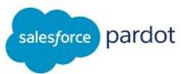
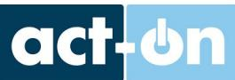
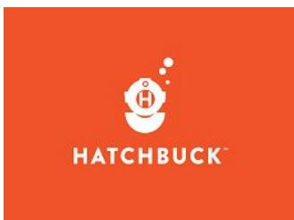

# Herramientas más comunes de marketing automation

Considerada el buque insignia del Marketing Automation por ser pionera, ofrece una herramienta muy poderosa.

## HubSρt

Su mayor inconveniente es el precio, ya que puede resultar muy cara para pequeñas y medianas empresas.

El rango de precios va desde los 185€ hasta los 2.200€ (+ cuota de configuración) mensuales dependiendo del pack que elijas.

Su mayor fortaleza es que proporciona una suite de herramientas conectadas entre sí muy avanzada que te permite llevar a cabo todos los pasos importantes de Marketing digital.

https://www.hubspot.es/

Se ha convertido en líder de ventas al ser la opción preferida por las pequeñas y medianas empresas.

La gran ventaja que tiene es que es fácil para las PYMES crear y ejecutar una estrategia de marketing y ventas, interactuar con los clientes, conseguir captar nuevos, cerrar ventas de forma más rápida y automatizar tareas repetitivas.

https://keap.com/

## Marketo

Ofrece una amplia variedad de características, apoyo profesional especializado y diferentes tipos de informes, así como opciones de personalización.

Su característica más destacada es su equipo, ya que al contrario que en otras plataformas all in one, está diseñada por especialistas de marketing y no por programadores informáticos.

Gracias a esto, los empleados hablan el mismo idioma que los clientes y siempre tienen en cuenta el feedback recibido.

https://www.marketo.com/

Especializada en empresas B2B de entre 10 y 500 empleados, su rango de precios es bastante elevado, siendo sus planes mensuales el Estándar (1.000\$), Pro (2.000\$) y Ultimate (3.000\$).

Aún así, todos los planes mensuales tienen unas funcionalidades comunes como Email Marketing, Lead Nurturing, ROI Reporting y CRM.

Uno de los inconvenientes de Salesforce, como en otros CRM, es la dificultad para hacer la integración con otras herramientas y con nuestro flujo de gestión de lead actual.

https://www.pardot.com/

## eloqua

Entre sus clientes destacan compañías muy reconocidas como Sony, LinkedIn y American Express, debido a que su software es muy fácil de integrar.

Permite también a los profesionales del marketing planificar y ejecutar campañas y a la vez ofrecer una experiencia personalizada a sus clientes potenciales.

https://www.oracle.com/es/marketingcloud/products/ marketing-automation/

En lo referido a rango de precios, sus diferentes packs se venden por entre 2.000\$ y 4.000\$, así como planes personalizados.

Basado exclusivamente en la nube, permite su uso tanto a profesionales del marketing digital como a empresas particulares.

Permite, por lo tanto, tener juntos programas de inbound, outbound y marketing automation para así optimizar su ROI en marketing.

Los planes de precios mensuales son dos: Professional (490€) y Enterprise (1.640€).

https://www.act-on.com/

También está enfocada principalmente a empresas B2B, con un software que ofrece 5 tipos de soluciones diferentes: Marketing Plataform, Marketing Automation, Email Marketing, Mobile Custom Engagement y Engage Apps.

Sin embargo, el rango de precios generalmente varía dependiendo del tamaño de la base de datos, y por lo tanto, dependerá de las necesidades empresariales del usuario.

https://www.ibm.com/es-es/digital-marketing/silverpo p

## ontraport

Ofrece multitud de funcionalidades agrupadas en cuatro grupos principales (Publish, Market, Sell y Organize).

Es una herramienta muy poderosa para gestionar una pequeña y mediana empresa que venda productos o servicios por Internet.

Su rango de precios para suscripción mensual son: Basic (79\$), Pro (297\$) y Team (597\$). https://ontraport.com/

## SharpSpring

Su capacidad más destacada es la capacidad de rastrear visitantes incluso antes de conocer su nombre.

Sin embargo, está diseñada principalmente para agencias de marketing online y configurada para que estas puedan agregar varios clientes en la plataforma. Como valor añadido, tiene una fantástica atención al cliente si es necesario resolver dudas.

El principal inconveniente, el precio. Requiere una cuota de instalación de 2.000\$ y una mensual de entre 500\$ y 800\$.

Su contratación tanto para agencias como para negocios es necesaria bajo petición.

https://es.sharpspring.com/

Destinada a pequeños negocios con escasos recursos económicos, es una herramienta muy potente que principalmente ofrece funcionalidades básicas a un precio muy asequible.

Cuenta actualmente con cuatro planes mensuales: Starter (39\$) Small Biz (79\$) Team (119\$) y Professional (199\$).

Sus características principales se dividen en tres bloques: Email Marketing, CRM y Marketing Automation.

https://www.hatchbuck.com/