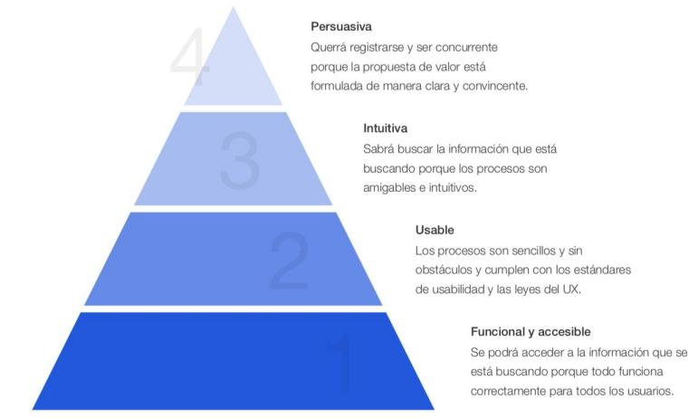
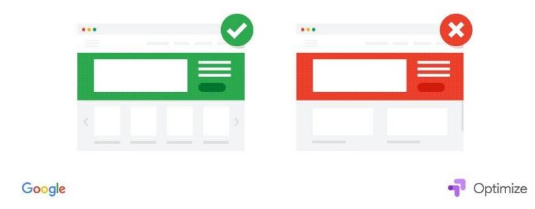

# Conceptos Clave Conversión

## CRO

Acrónimo de “Conversión Rate Optimization”.

Es todo aquello que hacemos para mejorar la conversión de cualquier elemento de nuestro funnel.

Hay decenas de metodologías distintas y nosotros os explicaremos la nuestra pero el fin de todas ellas es el mismo: mejorar la conversión.

El CRO es el gran olvidado del marketing digital porque es más complejo que pagar por poner un anuncio y llevar tráfico a nuestra web.

Pero también es una estrategia que si la trabajamos bien afecta de forma directa a los objetivos de nuestro negocio.

Con el mismo tráfico pero mejorando solo un poco la conversión en cuellos de botella de nuestro funnel podemos generar muchas más ventas.

## Cuellos de botella en el funnel

En la parte del funnel donde más tráfico, leads o clientes perdemos es lo que se llama un cuello de botella.

Pongamos que atraemos 1.000 visitas a la web, 10 de ellas se convierten en lead y finalmente 9 nos compran vemos que algo pasa claramente en la conversión de visita a lead.

Por el camino nos estamos dejando a 990 visitas que se van sin convertirse en lead.

Puede ser porque atraemos tráfico poco segmentado, porque el texto de la landing no se entiende, porque la web carga lento o por cientos de razones pero tenemos claro que ahí hay un cuello de botella y, por lo tanto, una micro-conversión que podemos optimizar.

## Aprendizaje contínuo

Si el marketing en general es un área que siempre cambia y nos obliga a estar siempre aprendiendo, el CRO lo es aún más.

No hay una fórmula mágica aplicable y repetible para mejorar la conversión.

El CRO es experimentación pura. No a loco pero si testeando hipótesis constantemente y aprendiendo de ellas.

Si algún día crees que lo sabes todo sobre CRO, te has quedado desactualizado.

## La pirámide de la conversión

Al igual que ocurre en la pirámide de necesidades de Maslow, para que una web convierta bien debemos apuntalar los escalones inferiores de la pirámite de la conversión para que los superiores tengan realmente efecto.

Dicho de otro modo ¿de qué sirve que una web tenga los mejores textos del mundo, muy persuasivos, si tarda tanto en cargar que los usuarios se van antes siquiera de poder ver los textos?

Las casas se empiezan a construir por la cimentación y no por el tejado. Las webs primero tienen que ser funcionales.

Si no entendemos el concepto de la pirámide de la conversión, todo lo que apliquemos de CRO tendrá resultados aleatorio y se escapará a nuestro control.

> **Figura**: Pirámide de la conversión (análoga a la pirámide de Maslow): para que
> una web convierta, los escalones inferiores (los más básicos: que la web sea
> funcional, accesible, cargue rápido y sea usable) deben estar apuntalados antes de
> que los superiores (los más sofisticados: persuasión, textos, intuición) tengan
> efecto real. De abajo arriba se construye la conversión, igual que una casa se empieza
> por la cimentación y no por el tejado.

## Proceso CRO

Verás muchas versiones de lo mismo. Esta es la nuestra y sobre la que trabajamos en este programa.

El proceso CRO tiene los siguientes pasos:

1.- Identificar micro-conversiones   
2.- Medir los cambios   
3.- Identificar mejoras de conversión   
4.- Implementación   
5.- Optimización

Cada paso nuevo es dependiente del anterior y si nos saltamos alguno comienza la aleatoriedad de las acciones que no nos llevan a buen puerto.

Cuando consideramos una micro-conversión optimizada lo suficiente volvemos a empezar por el paso 1 pero no te confundas, no es como empezar de cero. Ya hemos dicho que es un proceso de aprendizaje contínuo por lo que a cada experimento vamos más experiencia e información para los siguientes.

## Entrar en la cabeza de nuestro cliente

Esto es clave a lo largo de todas nuestras estrategias de marketing pero en el CRO gana especial relevancia porque cuando nos ponemos a cambiar botones de color, crear formularios que conviertan mejor… y todas las estrategias que veremos a veces nos olvidamos que lo importante es lo que pasa por la cabeza de nuestro cliente cuando ve ese botón, cuando rellena ese formulario…

Es decir, el centro de todo es la persona que va a interactuar con ese elemento de nuestra web y debemos tener la capacidad de meternos en su cabeza.

## A/B Testing

Los test A/B son una herramienta básica del CRO.

Básicamente se trata de hacer variaciones sobre el mismo elemento, enviar tráfico a las diferentes variaciones y ver cuál convierte mejor.

Por ejemplo: Hacemos 2 formulario muy parecidos pero con algunas variaciones. A 100 potenciales clientes los llevamos a una versión y a otros 100 potenciales clientes los llevamos a otra.

¿Cuál convierte mejor y por qué? Eso es lo que tratamos de entender con los test A/B.

Afortunadamente hay muchas formas de hacerlo. Una herramienta gratuita es Google Optimize que vemos en el programa.

Test what works best

## Landing page

Una landing page es cualquier web a la que llevamos un tráfico específico.

Aunque todas las webs tienen una página principal a la que entramos poniendo, por ejemplo   
https://thepowermba.com/ lo ideal es tener otras páginas específicas donde apuntes anuncios, las RRSS o cualquier canal que nos permita llevar público   
segmentado.

Por ejemplo, en ThePowerMBA si ponemos un anuncio o pieza de contenido enfocada a menores de 27 años te vamos a llevar a esta landing https://thefutureleaders.thepowermba.com/

El programa es 90% igual que el original pero los mensajes, testimonios, etc… están enfocados a las peculiaridades de ese público.