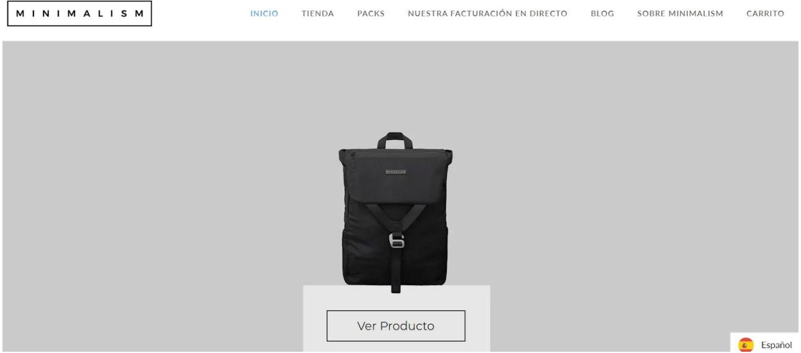

# Consejos para CTA (Call to Action)

El objetivo de un CTA es que el usuario haga una acción concreta en tu web o app

## El Contenido

Utiliza verbos de acción: “pruébalo”, “apúntate”, “cómpralo”.

Incluye palabras que creen urgencia : “ahora”, “hoy”, “ya”.

● Ten en cuenta a quién te diriges y varía el CTA en función de cada tipo de usuario.

Escribe un mensaje conciso (se recomienda entre 1 y 3 palabras). Es importante que deje claro al usuario lo que hacer.

● No olvides el contexto del CTA. Puedes añadir líneas explicativas arriba o debajo.

● Incluye números, precios.

● Si ofreces algo gratis, dilo.

## El Diseño

● Hazlo en forma de botón, que invite a hacer click.

● Cuida el espacio vacío alrededor para poner más énfasis en el CTA.

● Escribe con un tipo de letra legible, simple y grande.

● Usa los colores de tu marca.

Asegúrate de que haya contraste entre el color del texto, el del botón y el fondo.

● Puedes usar elementos interactivos.

● Si pones varios CTAs juntos, cambia el color.

## La Ubicación

● Mejor sitúalo “above the fold”, que no haya que hacer scroll.

● Lugares estratégicos, donde llame la atención:

\- En la parte central de la web.

\- Arriba a la izquierda (lectura horizontal).

\- Al terminar un artículo.

● No te olvides de adaptarlo en la versión móvil.

● No abuses de ellos en una misma landing page.

El CTA es un botón clave para convertir.   
Haz tests A/B de forma habitual para ver cuál funciona mejor.

Te dejamos ejemplos para que te inspires:

CONSEGUIR SPOTIFY GRATIS

## Más seguridad, mayor calidad y una ciudad a tu alcance

Conviértete en conductor y empieza a ganar dinero.

Conduce con nosotros

## Ocupa el asiento del conductor y cobra por ello

Conduce en la red más grande de pasajeros activos.

Regístrate para conducir →

# Diseña lo que quieras. Publica donde quieras.

Regístrate con Google

f

Regístrate con Facebook

Regístrate con tu correo electrónico

