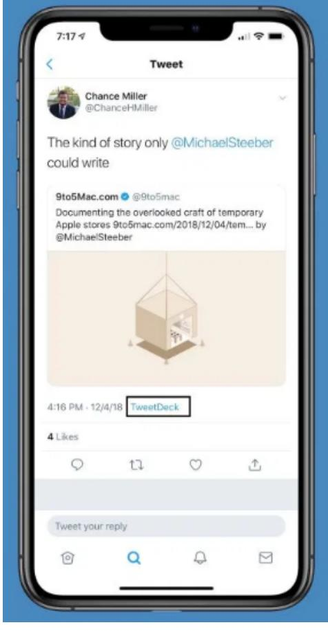

# Conceptos Clave Recomendación y Viralización

Hagas lo que hagas, hasta la mejor campaña de marketing del mundo siempre será peor que el boca a boca.

La confianza es clave para mejorar la conversión y generar ventas y cuando otra persona nos recomienda un producto se genera una confianza enorme.

El boca a boca en persona es difícil que lo controlemos nosotros. Suele nacer de tener un muy buen producto. Pero no por ello significa que no podamos hacer nada.

Hay decenas de estrategias de recomendación y viralización que podemos seguir pero… ¿Cuál es la diferencia entre recomendación y viralización?

Vamos a verlo.

## Diferencia entre recomendación y viralización

Aunque ambas estrategias persiguen el mismo objetivo (hacer que nuestro propios clientes nos atraigan nuevos) hay una diferencia significativa entre ambas.

Las estrategias de recomendación buscan conseguir los objetivos gracias a la voluntad del cliente o usuario en compartir información sobre nuestro producto de la manera que sea.

El caso más común es el de los bancos. Si traes a un amigo os regalan a los dos 50 euros. Como a ti te interesa se lo cuentas a tu amigo y trato hecho con el banco. Recomendación pura.

En cambio la viralización ocurre cuando ayudas a la empresa a darse a conocer solo por usar su producto o su servicio.

En las clases veremos el ejemplo de TikTok. ¿Cómo generó viralidad? Simplemente permitiendo a sus usuarios compartir su video de TikTok también en Instagram pero añadiendo una marca de agua en esos vídeos para que todo el mundo que los viera supiera que ha sido grabado desde TikTok.

Otro ejemplo de viralización. Si usas la herramienta TweetDesk cuando publiques añaden su publicidad como ves en esta imagen

  
Objetivos que persigue la recomendación y la viralización

Estas estrategias, como ya hemos visto en el resto de estrategias de marketing digital deben estar siempre relacionadas con los objetivos del negocio.

En este caso, si las aplicamos correctamente, van a afectar especialmente en

atraer nuevos leads y clientes

reducir el CAC

Pongamos foco en esta segunda. Ya hemos visto que a medida que agotamos canales el CAC sube considerablemente y eso puede ser la muerte de muchos negocios.

Ahora imagínate que tienes una cantidad importante de tus actuales clientes empiezan contarles a sus allegados sobre tu producto o servicio y eso se termina convirtiendo en nuevos leads o ventas.

¿Cuál es el coste de eso? Puede llegar a ser prácticamente 0.

Por eso tantas empresas se centran en crear sistemas que potencien la recomendación y productos que su propio uso provoquen la viralización.

¿Cuánto crees que le cuesta a TikTok poner la marca de agua cuando se comparte el vídeo en Instagram? 0 o casi 0. Compara este coste con hacer otro tipo de campañas.

## Dependencia de la calidad el producto o servicio

Como pasa con muchas otras estrategias tener un buen producto o servicio es importante.

Pero en este caso no solo es que sea importante sino que es clave.

¿Quién va a recomendar a un amigo un producto malo? Ya puedes dar un incentivo muy muy alto porque sino nadie voluntariamente lo va a recomendar.

En el caso de seguir estrategias de viralización también afecta en mucha medida.

Si hemos dicho la viralización genera impactos de forma automática solo por el uso del producto ¿Qué pasa si es un mal producto? Que nadie lo usa. Y si nadie lo usa no se genera esa viralización.