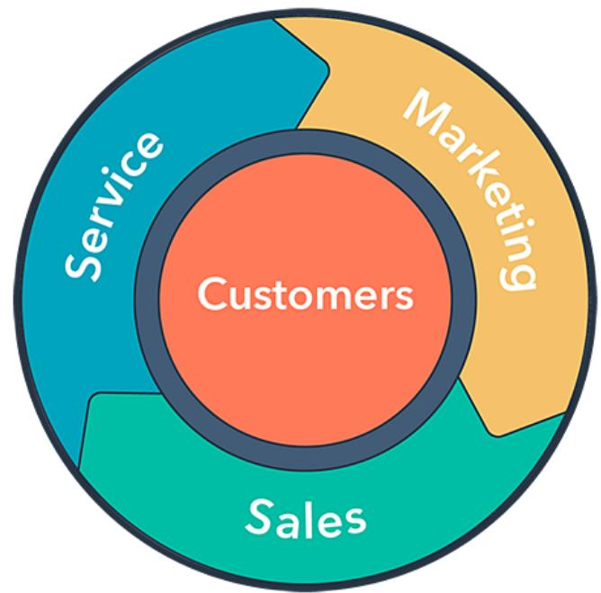
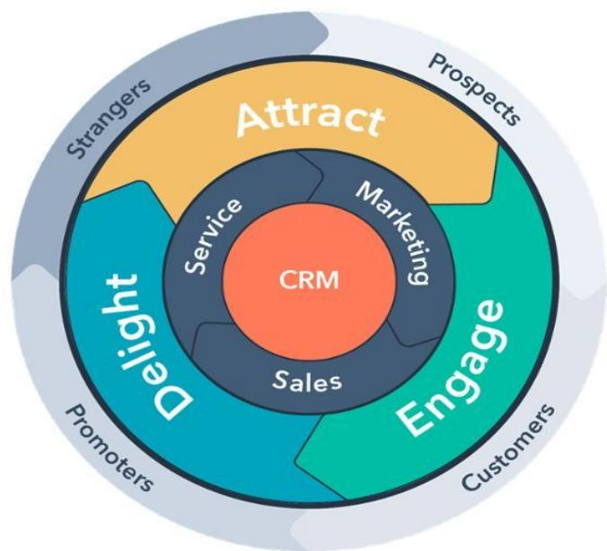
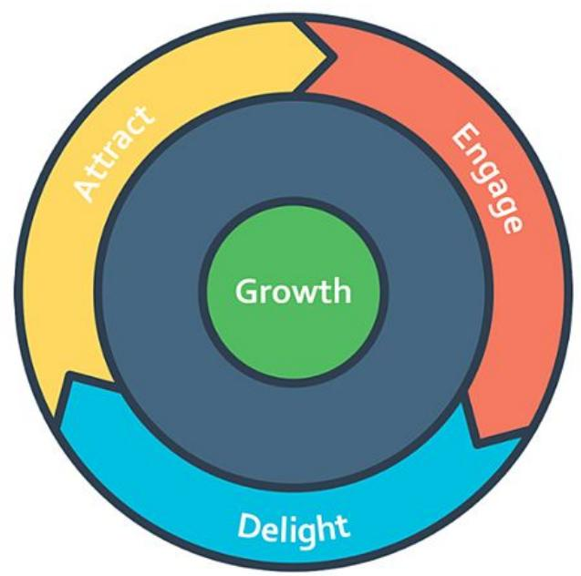

# Flywheel Funnel

Como un pequeño extra y aprovechando que lo escucharás en uno de los casos prácticos, quiero que conozcas el concepto de Flywheel, un funnel que está principalmente enfocado a modelos en los que se intenta fidelizar.

¿Qué es?

Te quiero hablar del flywheel, un tipo de funnel que se centra en fidelizar al cliente lo máximo posible.

Es decir, en lo que se invierte, previo estudio de las costumbres de tu buyer persona, es en que la rueda gire y gire y tu cliente te compre una y otra vez.

Por lo tanto, se debe aplicar a un modelo más recurrente y preferiblemente tras utilizar una estrategia de inbound marketing específica según tu tipo de cliente.

## Elementos dinámicos

El flywheel se tiene dos pilares dinámicos, en los que el objetivo es la optimización total. Estos son:

La velocidad: ya no se trata solo de atraer al cliente, sino más bien en deleitarlo y mejorar su experiencia con nuestra marca.

La fricción: A la hora de aumentar la velocidad de tu flywheel, al igual que con la rueda de un coche, hay que intentar reducir la fricción lo máximo posible. Y para ello, se utilizan procesos de automatización.

Y encontraremos tres fases dentro de nuestra rueda que se retroalimentan la una de las otras:

● Marketing

Ventas

● Servicio

Con esto no te estoy diciendo que el flywheel sea mejor que el funnel que te hemos enseñado ahora, ni siquiera si tu modelo de negocio es recurrente.

Simplemente, quiero que conozcas la existencia de este tipo de funnel que se ha puesto de moda en los últimos tiempos.

Ejemplos

Aquí te dejo otros ejemplos de Flywheel con distintos planteamientos:

