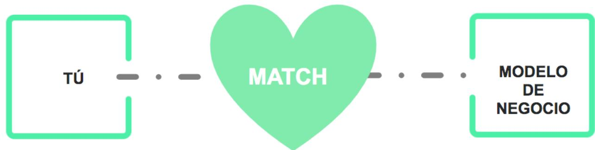

## OBJETIVO Que elijas el proyecto perfecto para ti

# ¡Es para ti!

Debes tener en cuenta que miles de proyectos fracasan porque sus fundadores, por falta de conocimiento, no hacen un análisis adecuado…

> **Figura**: Diagrama del concepto de «fit» (encaje) representado como un MATCH: a la
> izquierda una caja «TÚ» (el emprendedor/fundador), a la derecha una caja «MODELO DE
> NEGOCIO», y en el centro un corazón grande con la palabra «MATCH» uniendo ambos. Expresa
> la tesis del módulo: el proyecto perfecto es el que hace match entre el emprendedor (su
> visión, riesgo asumible, situación y dedicación) y el modelo de negocio elegido.

## ¿Cuáles son las implicaciones?

Para empezar es necesario conocer bien las implicaciones del modelo de negocio que quieras crear, es decir, de tu idea.

Debes ser capaz de responder a las siguientes preguntas: cómo afecta al riesgo, potencial, fi nanciación necesaria, ingresos, plazos…

## IMPLICACIONES DEL MODELO DE NEGOCIO

<table><tr><td rowspan=1 colspan=1>RIESGO</td><td rowspan=1 colspan=1>¿Cuál es el nivel de riesgo? Recuerda: mayor innovación, mayor riesgo</td></tr><tr><td rowspan=1 colspan=1>POTENCIAL</td><td rowspan=1 colspan=1>¿A dónde te puede llevar? ¿Startup escalable? ¿Tamaño del mercado?¿Autoempleo?</td></tr><tr><td rowspan=1 colspan=1>FINANCIACIÓN NECESARIA</td><td rowspan=1 colspan=1>¿Cuánto capital hace falta? ¿Es interesante para inversoresprofesionales?</td></tr><tr><td rowspan=1 colspan=1>INGRESOS</td><td rowspan=1 colspan=1>¿Va a generar retorno rápido? ¿Cuándo se alcanza Punto Muerto?</td></tr><tr><td rowspan=1 colspan=1>PRIMEROS PASOS</td><td rowspan=1 colspan=1>¿Qué hace falta para arrancar? ¿Mucha gente? ¿Tienes que contratargente desde el día 1?</td></tr><tr><td rowspan=1 colspan=1>CONOCIMIENTOS YHABILIDADES</td><td rowspan=1 colspan=1>¿En que tenemos que ser muy buenos para tener éxito? ¿Marketing?¿Ventas? ¿Operaciones y eficiencia?.</td></tr><tr><td rowspan=1 colspan=1>CONTACTOS</td><td rowspan=1 colspan=1>¿Es necesario tener contactos de algún tipo?</td></tr></table>

Y a partir de ese conocimiento (y de un diagnóstico de tus objetivos, capacidades, competencias, etc.) debes ser capaz de dar una respuesta muy convincente a las siguientes preguntas:

## ANÁLISIS DEL MATCH CON FUNDADORES

<table><tr><td>1. ¿ES EL PROYECTO PERFECTO PARA TI? 2. De todos los proyectos que ¿Tienes ¿POR QUÉ</td><td>¿Encaja con tu VISIÓN? ¿Encaja i con el nivel de riesgo que puedes asumir? ¿Encaja con tu situación y dedicación?</td></tr></table>

## ANEXO

Te dejamos el análisis y comparativa de algunos tipos de modelos de negocio (todos se ven en detalle en ThePowerMBA)

<table><tr><td colspan="1" rowspan="1">IMPLICACIONES DELMODELO DE NEGOCIO</td><td colspan="1" rowspan="1">MODELOS INNOVADORESCrear propuestas innovadoras</td><td colspan="1" rowspan="1">MODELOS MENOS INNOVADORESCompetir en un mercadoexistente</td></tr><tr><td colspan="1" rowspan="1">RIESGO</td><td colspan="1" rowspan="1">Riesgo muy alto</td><td colspan="1" rowspan="1">Riesgo más bajo</td></tr><tr><td colspan="1" rowspan="1">POTENCIAL</td><td colspan="1" rowspan="1">Potencial muy alto</td><td colspan="1" rowspan="1">Potencial de crecimiento más bajo</td></tr><tr><td colspan="1" rowspan="1">FINANCIACIÓNNECESARIA</td><td colspan="1" rowspan="1">Más fácil obtener financiación de BAprofesionales</td><td colspan="1" rowspan="1">Financiación más tradicional</td></tr><tr><td colspan="1" rowspan="1">INGRESOS</td><td colspan="1" rowspan="1">Inciertos</td><td colspan="1" rowspan="1">Cuota de mercado</td></tr><tr><td colspan="1" rowspan="1">PRIMEROS PASOS</td><td colspan="1" rowspan="1">Validación inicial conThePowerFormula formula es clave</td><td colspan="1" rowspan="1">Fácil de poner en práctica rápido</td></tr><tr><td colspan="1" rowspan="1">CONOCIMIENTOS YHABILIDADES</td><td colspan="1" rowspan="1">• Conocimiento del sector nonecesario•Mayor reto intelectual</td><td colspan="1" rowspan="1">•Si conoces el sector, mejor•Fácil de poner en práctica rápido•¿Cuál es tu ventajacompetitiva?</td></tr><tr><td colspan="1" rowspan="1">CONTACTOS</td><td colspan="1" rowspan="1"></td><td colspan="1" rowspan="1"></td></tr><tr><td colspan="1" rowspan="1">IMPLICACIONES DELMODELO DE NEGOCIO</td><td colspan="1" rowspan="1">STARTUP</td><td colspan="1" rowspan="1">EMPRENDIMIENTOTRADICIONAL</td></tr><tr><td colspan="1" rowspan="1">RIESGO</td><td colspan="1" rowspan="1">Riesgo más alto</td><td colspan="1" rowspan="1">Riesgo más bajo</td></tr><tr><td colspan="1" rowspan="1">POTENCIAL</td><td colspan="1" rowspan="1">ESCALABILIDAD. Compañías valiosas.Exit</td><td colspan="1" rowspan="1">Potencial de crecimiento másbajo</td></tr><tr><td colspan="1" rowspan="1">FINANCIACIÓNNECESARIA</td><td colspan="1" rowspan="1">RondasTe diluyes</td><td colspan="1" rowspan="1">Financiación más tradicionalNo te diluyes</td></tr><tr><td colspan="1" rowspan="1">INGRESOS</td><td colspan="1" rowspan="1">Cuanto más innovador, más inciertos</td><td colspan="1" rowspan="1">Ganar cuota en un mercadoque existe</td></tr><tr><td colspan="1" rowspan="1">PRIMEROS PASOS</td><td colspan="1" rowspan="1">Validación inicial conThePowerFormula formula es clave</td><td colspan="1" rowspan="1">Fácil de poner en prácticarápido</td></tr><tr><td colspan="1" rowspan="1">CONOCIMIENTOS YHABILIDADES</td><td colspan="1" rowspan="1">•Conocimiento del sector nonecesarioMayor reto intelectual</td><td colspan="1" rowspan="1">Si conoces el sector, mejor• ¿Cuál es tu ventajacompetitiva?</td></tr><tr><td colspan="1" rowspan="1">CONTACTOS</td><td colspan="1" rowspan="1"></td><td colspan="1" rowspan="1"></td></tr></table>

<table><tr><td rowspan=1 colspan=1>IMPLICACIONES DELMODELO DE NEGOCIO</td><td rowspan=1 colspan=1>MARKETPLACE</td></tr><tr><td rowspan=1 colspan=1>RIESGO</td><td rowspan=1 colspan=1>Alto</td></tr><tr><td rowspan=1 colspan=1>POTENCIAL</td><td rowspan=1 colspan=1>ESCALABILIDAD. Compañías valiosas. Exit</td></tr><tr><td rowspan=1 colspan=1>FINANCIACIÓN NECESARIA</td><td rowspan=1 colspan=1>Intensivo en capital</td></tr><tr><td rowspan=1 colspan=1>INGRESOS</td><td rowspan=1 colspan=1>Punto muerto lejano</td></tr><tr><td rowspan=1 colspan=1>PRIMEROS PASOS</td><td rowspan=1 colspan=1>Más difíciles de validar la propuesta de valor, porquedepende de la masa crítica.</td></tr><tr><td rowspan=1 colspan=1>CONOCIMIENTOS YHABILIDADES</td><td rowspan=1 colspan=1>Estrategia de plataformas. Se aprende en ThePowerMBA</td></tr><tr><td rowspan=1 colspan=1>CONTACTOS</td><td rowspan=1 colspan=1></td></tr></table>

<table><tr><td>IMPLICACIONES DEL MODELO DE NEGOCIO</td><td>E-COMMERCE</td></tr><tr><td>RIESGO</td><td></td></tr><tr><td>POTENCIAL</td><td></td></tr><tr><td>FINANCIACIÓN NECESARIA</td><td>NO hace falta mucho dinero para arrancar porque no te hace falta mucha estructura y puedes ir invirtiendo de forma</td></tr><tr><td>INGRESOS</td><td>progresiva. Es fácil alcanzar punto muerto</td></tr><tr><td>PRIMEROS PASOS</td><td>Sencillos</td></tr><tr><td>CONOCIMIENTOS Y HABILIDADES</td><td>Tecnología es sencilla •¿Eres bUeno en MARKETING DIGITAL?</td></tr><tr><td>CONTACTOS</td><td></td></tr></table>