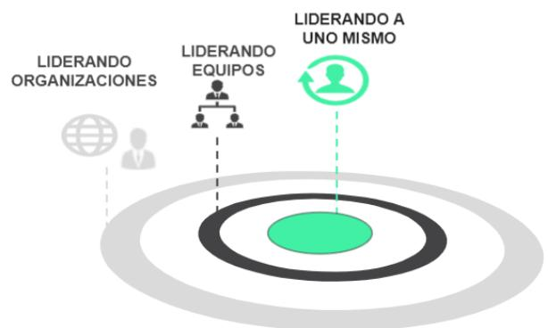
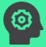
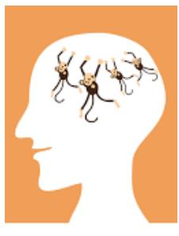
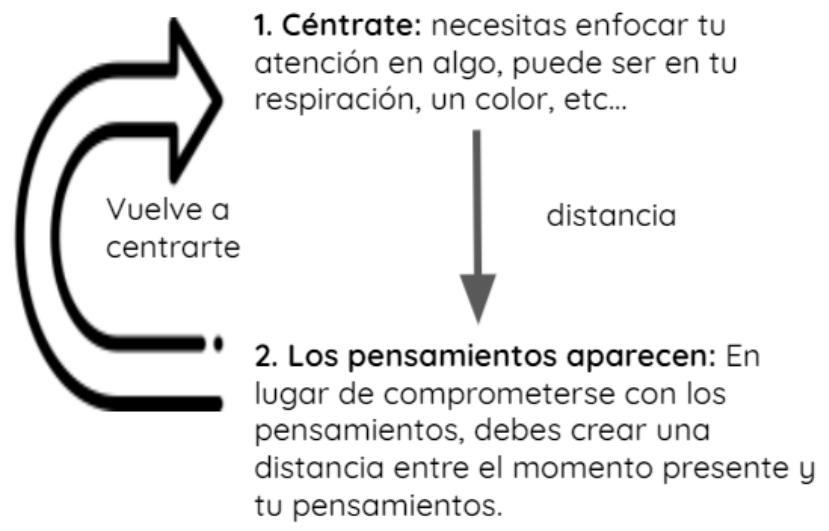
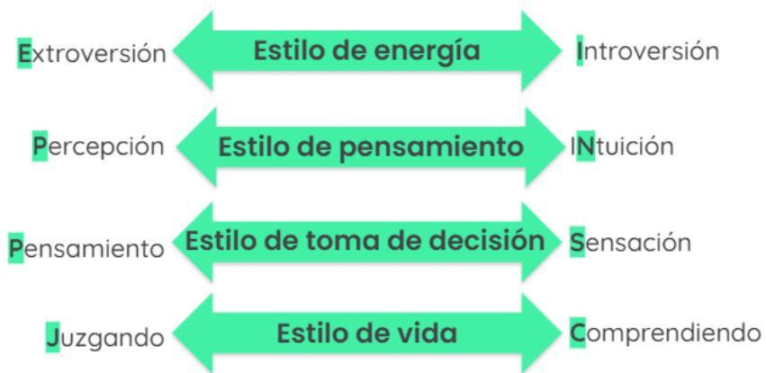
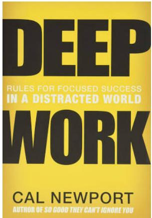
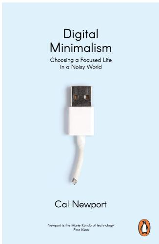
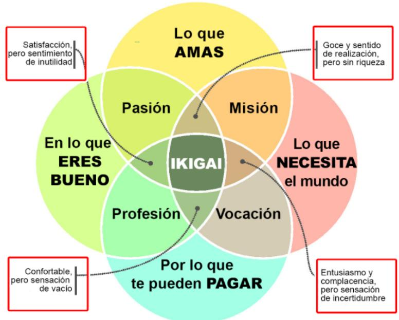

## LIDERARSE A UNO MISMO RECURSOS

## ¿QUÉ ES EL LIDERAZGO?

## Liderazgo

El liderazgo va sobre la gente y el impacto tanto en la vida profesional como en la personal, es decir, motivar o inspirar a la gente para conseguir un impacto o un resultado.

## ¿Cómo conseguirlo?

Hay muchos enfoques, pero debes encontrar tu propia fórmula para que se alinee con tu personalidad.

Cuando pensamos en el liderazgo hay tres capas:

Liderarse a uno mismo de manera efectiva: es el centro del liderazgo, solo liderando a ti mismo de manera efectiva serás capaz de liderar de manera efectiva a equipos y organizaciones. Por ejemplo, gestionando tus emociones, tu salud física y mental, etc.

● Liderar equipos de manera efectiva

● Liderar organizaciones de manera efectiva

> **Figura**: Diagrama de diana con las tres capas concéntricas del liderazgo. El centro (núcleo verde) es «Liderando a uno mismo»; el anillo intermedio «Liderando equipos»; el anillo exterior «Liderando organizaciones». La composición visual transmite que liderarse a uno mismo es el núcleo del que dependen las capas externas: solo liderándose a uno mismo de forma efectiva se pueden liderar equipos y organizaciones.

## LIDERARSE A UNO MISMO

## Autoevaluación

¿Cómo puede un líder alcanzar el máximo rendimiento / estado de fl ujo? ¿Cómo puede gestionar la energía y liderar desde la agilidad interior?

Antes de decidir en qué necesitas trabajar para liderarte a ti mismo de un modo más efectivo, tienes que tener claro en qué centrarte. Esta herramienta de autoevaluación se fi ja en las diferentes áreas que

## tienes que evaluar con sinceridad.

<table><tr><td rowspan=1 colspan=1></td><td rowspan=1 colspan=1>EVALUACIÓN</td><td rowspan=1 colspan=1>TUPUNTUACIÓN</td></tr><tr><td rowspan=1 colspan=1>CuerpoÉ</td><td rowspan=1 colspan=1>Señales de advertencia: malestar frecuente, sensación deagotamiento, cansancio, insomnio, falta de calidad del sueño, etc.•    Ejercicio $- \dot { \mathfrak { C } } { \mathsf { C o n } }$ qué frecuencia haces ejercicio?Nutrición - ¿Es equilibrada? $i { \mathsf { C u d l } }$ es tu relación con lacomida? $\dot { \mathcal { L } } ^ { \top \cup }$ dieta está basada entera omayoritariamente en comida no procesada? ¿Bebessuficiente $\mathsf { a g u o a ? }$ Recuperación - ¿Duermes bien y suficiente? $\dot { \mathcal { L } } ^  \top \} \mathsf { e }$ tomasdescansos regularmente durante el día?Documentos sobre ejercicio, nutrición y recuperación.</td><td rowspan=1 colspan=1></td></tr><tr><td rowspan=1 colspan=1>Mente</td><td rowspan=1 colspan=1>Señales de advertencia: no puedes concentrarte, tienesarrebatos emocionales (ira, gritos, culpabilidad..), estrés,agotamiento, relaciones complicadas.•    Mindfulness - $i ^ { \mathsf { M e d i t o s ? } }$ •    Flexibilidad emocional - ¿Eres consciente de tusemociones?Espacio para la renovación y la conexión -¿Desconectas regularmente del trabajo, las noticias, lasdistracciones digitales..?</td><td rowspan=1 colspan=1></td></tr><tr><td rowspan=1 colspan=1>AlmaS</td><td rowspan=1 colspan=1>Señales de advertencia: te sientes vacío, te falta algo en la vida,no te sientes conectado con el mundo a tu alrededor, te sientesapático, deprimido, etc.Significado $\cdot \dot { \mathcal { C } } \mathsf { U } \dot { \mathsf { G } } |$ es tu propósito en la vida? ¿En quéactividades significativas participas a menudo?Pertenencia - ¿Te sientes parte fundamental de tufamilia, amigos o comunidad?</td><td rowspan=1 colspan=1></td></tr></table>

## FUNDAMENTOS DEL MINDFULNESS

## Cómo funciona nuestra mente

Tal vez no seas consciente de ello, pero hay millones de pensamientos en tu mente, cada hora, cada minuto.

“Mente de mono” - es un término budista que signifi ca «inquieto, agitado, caprichoso, fantasioso, inconstante, confuso, indeciso, incontrolable». Por ejemplo: nuestros pensamientos saltan de uno a otro.

## Consecuencias de la «Mente de mono»

No estás presente - la mente, en lugar de estar en el presente, siempre está en el pasado o en el futuro.

No tienes control sobre tus emociones - cuando no estás presente, suele dejarte llevar por tus emociones como la ira, la tristeza, etc. Eres más reactivo que proactivo.

Drena tu energía - con miles de pensamientos rondando por tu cabeza sin parar sientes una fatiga física y mental.

Reducción de las capacidades cognitivas - no te centras, eres menos productivo, etc.

## Cómo funciona el mindfulness

> **Figura**: Diagrama del ciclo del mindfulness en dos pasos con bucle de retorno. (1) **Céntrate**: enfocas tu atención en algo, p. ej. tu respiración o un color. (2) **Los pensamientos aparecen**: en lugar de comprometerte con ellos, creas «distancia» entre el momento presente y tu pensamiento. Una flecha vertical etiquetada «distancia» conecta el paso 1 con el paso 2, y una flecha circular «Vuelve a centrarte» cierra el bucle de regreso al paso 1. El mecanismo central es observar los pensamientos sin engancharse y reenfocar repetidamente.

## Práctica

ayudarte como Headspace, Chopra, Potential Project, Calm, etc.

Descansos: tómate descansos regulares de un minuto a lo largo del día para recargarte.

Céntrate: céntrate siempre en una sola tarea.

## TIPOS DE PERSONALIDAD

Aunque todos somos individuos únicos, hay muchos rasgos en común que compartimos con otros y que pueden ayudarnos a entendernos mejor intuitivamente. Los diferentes tests de personalidad te ayudan a evaluar tu tipo de personalidad y a comprender que no todos ven el mundo del mismo modo que tú. No hay ningún tipo de personalidad mejor que otro, pero a cada tipo se le dan mejor unas cosas y peor otras.

Algunos de los test de personalidad más completos son: MBTI, DISC, OCEAN, Descubridor de talentos Gallup, Eneagramas, Método Birkman, Perfi l Caliper, Winslow, CPI, 16 PF de Cattell, etc.

¿Por qué son útiles?

Nos ayudan a entendernos mejor

● Nos hacen más conscientes

● Nos ayudan a entender a los demás

Ayudan a que los demás nos entiendan

## Cuándo aplicarlos

En la comunicación diaria: entender cómo los demás perciben el mundo nos permite adaptarnos a la hora de comunicarnos con ellos. Por ejemplo: una persona orientada a los detalles querrá saber hasta el último decimal de la cuota de mercado y puede pensar que alguien que se centra en el conjunto general no conoce el mercado.

Al crear un equipo: repartir las tareas entre los miembros del equipo según sus tipos de personalidad asegura una mayor productividad.

Al tratar con las emociones y el estrés: ser consciente de lo que nos causa el estrés a nosotros y a los demás nos puede ayudar a evitarlo.

Para descubrir puntos ciegos: arrojan luz sobre los puntos ciegos y estimulan la autoconciencia además de impulsar el diálogo entre compañeros.

Vida laboral: te ayuda a saber qué tipos de trabajos encajan mejor con tu personalidad y puede ayudarte a descubrir tu trabajo ideal.

Y cualquier cosa que incluya la necesidad de entender a otros y a ti mismo, desde contratar o encontrar al compañero ideal hasta entender por qué te comportas de cierto modo.

## ¡Ojo!

Un test de personalidad solo te dice tus preferencias naturales, sin embargo, hay muchas habilidades que puedes aprender.

Además, tú y todos somos seres complejos. Tus experiencias, tu bagaje cultural, tu propósito y tus prioridades entre otras cosas defi nen tu vida y tus decisiones, utiliza el test de personalidad como un mero indicador.

## MBTI

El indicador de personalidad Myers-Briggs Type (MBTI) es uno de los más famosos ya que es muy sencillo de entender y de utilizar.

## 16 tipos de personalidad

Está basado en 4 dimensiones con dos extremos, creando 16 tipos de personalidad diferentes según las combinaciones.

> **Figura**: Las 4 dimensiones bipolares del MBTI, cada una representada como una flecha de doble sentido con un extremo a cada lado. (1) **Estilo de energía**: Extroversión ↔ Introversión. (2) **Estilo de pensamiento/percepción**: Percepción (Sensación) ↔ iNtuición. (3) **Estilo de toma de decisión**: Pensamiento ↔ Sensación (sentimiento). (4) **Estilo de vida**: Juzgando ↔ Comprendiendo (percibiendo). Cada tipo MBTI se nombra con la primera letra (en inglés) del extremo dominante de cada dimensión (la segunda letra en el caso de la intuición, N); las combinaciones de los 2 extremos × 4 dimensiones generan 16 tipos de personalidad.

Los tipos se llaman por la primera letra (en inglés) de los extremos, la segunda letra en el caso de la intuición. La mayoría de la gente está entre los dos extremos, pero siempre tenemos una preferencia natural. Puedes, por ejemplo, aprender a utilizar más el pensamiento a la hora de tomar decisiones que los sentimientos, sin embargo, te sentirás más cómodo haciendo caso primero a tus sentimientos y ya después tomando una decisión racional.

Hay muchos test online, sin embargo, después de hacer la evaluación inicial, lo mejor es leer las descripciones de los tipos que pueden ser el tuyo y descubrir con cuál te identifi cas más.

## OBJETIVOS PERSONALES

Te proporcionan una visión a largo plazo y motivación a corto plazo. Te da una estrella polar, te ayuda a centrarte y a organizar tu tiempo y recursos.

En la plantilla que te proporcionamos hay 9 temas que aportan valor a tu vida:

1. Tú mismo

2. Tu salud

3. Tu familia

4. Tus fi nanzas

5. Tus logros profesionales

6. Tus amigos y círculos sociales

7. Tus aventuras, viajes y exploraciones

8. Tu espiritualidad

## 9. Tu comunidad

El arte consiste en llegar a comprender en profundidad lo que te importa personalmente, cuáles son tus aspiraciones personales en cada una de estas dimensiones tanto a medio como a largo plazo.

Guárdate un tiempo para estar solo y tranquilo durante este proceso y crea una atmósfera que te resulte relajante, música tranquila, una taza de té o lo que te funcione. No le des demasiadas vueltas, solo empieza a escribir con el siguiente enfoque:

## Enfoque en 4 pasos

1. EL TRABAJO DE TU VIDA: Imagínate en tu propio funeral. Imagínate que todos tus seres queridos están presentes y que puedes escuchar lo que dicen sobre tu vida en cada uno de estos 9 aspectos. ¿Qué te gustaría escuchar?

2. TUS OBJETIVOS CONCRETOS: Escribe tus objetivos concretos en cada uno de estos ámbitos para el próximo año.

3. TU ENFOQUE INMEDIATO: Escribe lo que te gustaría conseguir en los próximos 3 meses (mirando hacia tus objetivos anuales). Que sea lo más concreto posible.

4. COMPARTE Y REFLEXIONA: Comparte este plan con una o dos personas de confi anza porque nos comprometemos más con nuestros objetivos cuando los compartimos. A partir de este momento, dedica una hora al mes, dos o tres horas al trimestre y medio día al año a refl exionar y planifi car.

Puedes descargar la plantilla completa aquí.

# PRODUCTIVIDAD PERSONAL

## Deep work

El deep work es la capacidad de concentrarse sin distracciones en una tarea de alta exigencia cognitiva. Aprender a practicar el deep work requiere que te comprometas más que nunca sentándote regularmente para centrarte en tareas de alto impacto. Te permite conseguir más en menos tiempo. Está basado en el libro de Cal Newport.

## Estrategias Deep Work

Rítmica - reservar varias horas para el deep work cada día, por ejemplo, 90 minutos de deep work y 15 minutos de descanso. Ideal si tu trabajo permite la planifi cación.

Monástica - marcharse varios días para centrarse en una tarea determinada. Tiene el mayor potencial y el menor nivel de cambio de contexto. Aun así, es poco realista para la mayoría de personas que deben seguir un horario diario.

Periodístico - encajar el deep work cada vez que tu horario te lo permita, aunque sea solo media hora. Este método esporádico es difícil para los principiantes del deep work, ya que requiere desconectar rápidamente.

## Minimalismo digital

electrónico, las redes sociales o el consumo general de internet, el propósito de esta fi losofía es cuestionar si añaden valor a tu vida o no. Está basada en otro libro de Cal Newport.

## Tácticas

Orden digital: elimina todas las suscripciones y aplicaciones que no sean esenciales.

Periodos no digitales: defi ne periodos de tiempo sin actividad tecnológica

Crea periodos digitales específi cos: establece tiempos para actividades digitales específi cas como responder a los correos dos veces al día sin mirarlo el resto del tiempo.

Crea una distancia: aleja tus dispositivos electrónicos para crear una distancia tanto física como mental.

Sabáticos digitales: periódicamente tómate un día o incluso un fi n de semana entero desconectado de los dispositivos digitales.

Desactiva las notifi caciones: desactiva las notifi caciones del whatsapp, el correo y las demás aplicaciones.

## ENCUENTRA TU PROPÓSITO

Ten claro lo que te importa y ten el coraje de vivir de acuerdo con ello.

Es fundamental tanto para tu felicidad como para tu rendimiento. Solo puedes triunfar y ser feliz de

manera SOSTENIBLE si vives de acuerdo a tu propósito. Idealmente, deberías encontrar un propósito en lo que haces, sin embargo, no existe una fórmula mágica que se adapte a todos.

## Ikigai

El Ikigai es un concepto japonés que se traduce más o menos como «RAZÓN DE SER».

No es un objetivo fi nal, es un proceso de descubrimiento y refl exión. Puedes encontrar tu propósito en un par de meses, un par de años, en décadas o puede que nunca. Pero acercarte cada vez más a esa intersección hará que seas más feliz y exitoso. Céntrate en el proceso.

Tu Ikigai es la intersección de lo que amas, lo que se te da bien, aquello por lo que te pagan y lo que el mundo necesita.

Ikigai: 'Tu razón de ser'  

> **Figura**: Diagrama de Venn del Ikigai con 4 círculos solapados. Los 4 conjuntos son: **Lo que AMAS**, **En lo que ERES BUENO**, **Lo que el mundo NECESITA** y **Por lo que te pueden PAGAR**. Las intersecciones de pares contiguos generan 4 zonas intermedias: AMAS ∩ ERES BUENO = **Pasión**; AMAS ∩ NECESITA = **Misión**; NECESITA ∩ PAGAN = **Vocación**; PAGAN ∩ ERES BUENO = **Profesión**. El **Ikigai** es la intersección central de los 4 conjuntos. El diagrama marca además que cada zona intermedia, al carecer de uno de los 4 elementos, produce una insatisfacción específica: Pasión sin paga → «satisfacción pero sentimiento de inutilidad»; Misión sin paga → «goce y sentido de realización pero sin riqueza»; Profesión sin que el mundo lo necesite → «confortable pero sensación de vacío»; Vocación sin destreza → «entusiasmo y complacencia pero sensación de incertidumbre».