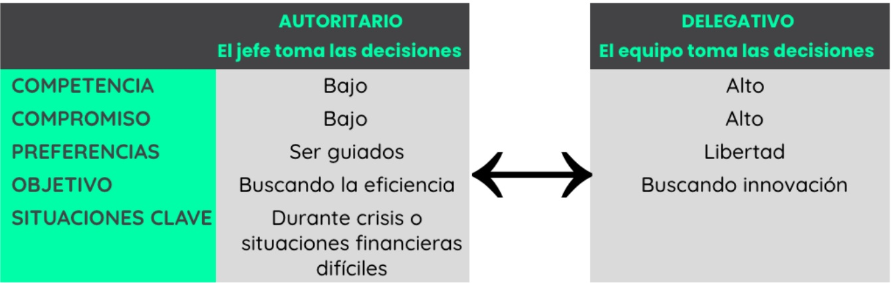
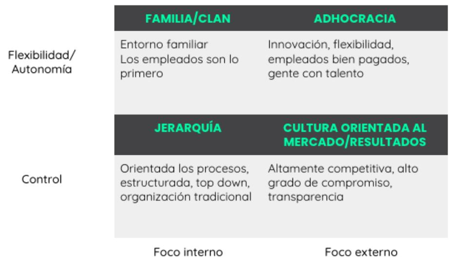
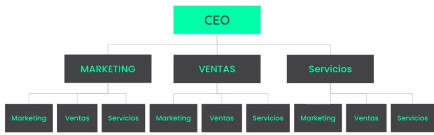
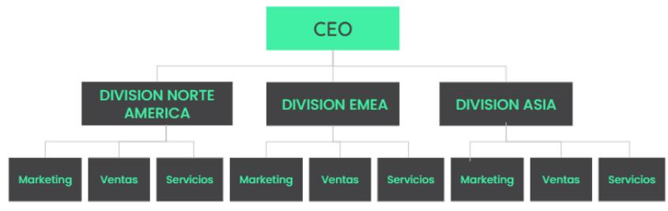
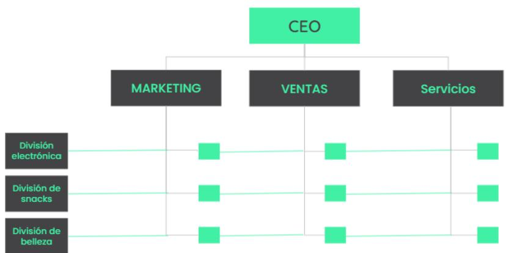
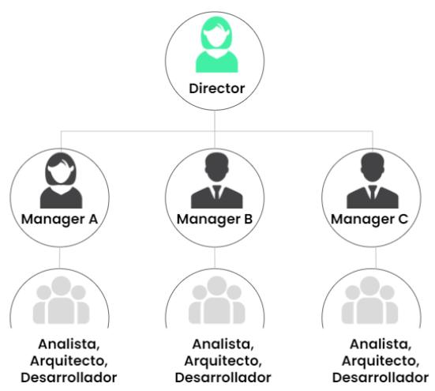

## LIDERANDO EQUIPOS Y ORGANIZACIONES RECURSOS

# LIDERAR VS. GESTIONAR

Las palabras «líder» y «manager» a menudo se usan como sinónimos y, aunque muchas veces necesitas ser manager y líder, hay una clara distinción entre ambas.

## Managers

Gestionan los recursos para alcanzar los objetivos en términos de tiempo, dinero y efi ciencia. Es un papel más táctico en la organización.

Por ejemplo:

● Defi nen objetivos concretos

● Establecen planes

● Organizan el equipo

● Establecen prioridades

● Acompañan al equipo

Etc.

## Líderes

Por otra parte, los líderes infl uyen en los recursos para alcanzar su potencial. Esto necesita algo más que habilidades gerenciales y es un rol estratégico en la organización que se centra en un plazo medio o largo. Deben tener una visión y poder comunicar de manera cautivadora para conseguir seguidores.

Por ejemplo:

● Alinean sus equipos

Inspiran a sus empleados

● Empoderan a sus empleados

Se aseguran de que estén todos alineados con la misma visión

## ¿Cómo son estos conceptos en la vida real?

Cuando estás a cargo, debes ser un buen manager y un buen líder al mismo tiempo, por lo que en ambos roles necesitas estos conjuntos de habilidades.

Por ejemplo, si eres marketing manager y desarrollas un plan, aplicarás ambos factores:

## GESTIONAR

Definir un plan

## LIDERAR

•Reuniones diarias, seguimientos

• Asegurar el compromiso/ motivación

KPIs

• Asegurar el alineamiento • Acompañar a los individuos •Toma de decisiones • Asegurarse que se entiende la visión

Dependiendo del tipo de trabajo, es posible que tengas que aplicar unos factores más que otros, es decir, al gestionar una línea de ensamblaje de 300 empleados vas a necesitar más habilidades de gestión, mientras que para un equipo pequeño de ingenieros altamente califi cados vas a necesitar más habilidades de liderazgo.

## Crecer como líder/manager

Vas a tener que crecer y adaptarte como líder/manager en función del crecimiento de tu carrera.

Sé consciente de ti mismo: antes de empezar a desarrollarte como gerente/líder, tienes que ser consciente de las habilidades de las que careces, por ejemplo las personas más técnicas que consiguen un puesto de manager, a menudo tienen difi cultades para aprender a liderar un equipo, o un emprendedor visionario puede tener problemas para gestionar recursos.

Aprende nuevas habilidades: se puede aprender muchas habilidades a través del entrenamiento, el feedback, etc.

Complemente: si hay habilidades que no puedes aprender o decides no hacerlo, puedes incluir en tu equipo a gente que complemente tu conjunto de habilidades. No tienes que hacerlo todo tú mismo.

<table><tr><td rowspan=1 colspan=1></td><td rowspan=1 colspan=1></td></tr></table>
> **Figura**: Tabla comparativa de los dos estilos de liderazgo extremos respecto a la gestión de personas, contrastados en 5 filas. **AUTORITARIO** (el jefe toma las decisiones) vs **DELEGATIVO** (el equipo toma las decisiones). Competencia del equipo: Bajo ↔ Alto. Compromiso del equipo: Bajo ↔ Alto. Preferencias de los empleados: «ser guiados» ↔ «libertad». Objetivo: «buscando la eficiencia» ↔ «buscando innovación». Situaciones clave: el estilo autoritario encaja «durante crisis o situaciones financieras difíciles», el delegativo cuando se busca innovación. La idea operativa: a menor competencia/compromiso del equipo conviene un estilo más autoritario; a mayor competencia/compromiso, uno más delegativo.

# ESTILOS DE LIDERAZGO

## Tipos de estilos de liderazgo

Los estilos de liderazgo se pueden clasifi car de muchos modos diferentes, por lo que lo hemos simplifi cado en estos dos extremos con respecto a la gestión de personas.

## Liderazgo situacional

No existe un estilo de liderazgo perfecto, tú, como líder, debes adaptarte a las personas y a las situaciones. No hay un estilo de liderazgo bueno o malo, sino uno más adecuado para la situación concreta, la empresa, los objetivos, los empleados, etc.

Los estilos más jerárquicos son más adecuados cuando hay poca incertidumbre, cuando no es necesario innovar porque todas las tareas están defi nidas, cuando la clave es la efi ciencia, etc.

Para las organizaciones que quieren innovar o cuando ser más ágil es una ventaja competitiva, es necesario dar más autonomía a los empleados, mejorar la comunicación, promover la toma de riesgos, etc.

Una vez que comprendas tu estilo, las necesidades de la organización y las necesidades de los empleados, eres tú como líder el que tiene que adaptar el estilo de liderazgo a ellos.

# MISIÓN, VISIÓN Y VALORES

## Misión, visión y valores

## EJECUCIÓN

## Misión

La piedra angular de cada negocio es su misión, su visión y sus calores, la estrella polar de la organización. Podemos compararlo con el propósito de nuestra vida personal. Solo cuando tienes clara tu misión, tu visión y tus valores puedes garantizar la claridad operativa y la ejecución excelente en la organización. Todo debe estar vinculado.

Misión/Visión

Valores

Objetivos Estratégicos

Objetivos Operacionales/Tácticos

Iniciativas

EJECUCIÓN

La misión es el propósito central de una organización, su razón de ser. Debe ser inspiradora, algo que resuene en los clientes y en los empleados.

## Ejemplos:

Tesla: acelerar la transición del mundo hacia la energía sostenible.

Zappos: inspirar al mundo mostrando que se puede brindar felicidad simultáneamente a los clientes, los empleados, los proveedores, los acciones y a la comunidad a largo plazo y de un modo sostenible.

Unilever: hacer de la vida un lugar común y sostenible

● ThePowerMBA: democratizar la educación

## empresarial.

## ¿Cómo ayuda a la ejecución?

● La comunicación está alineada con tu misión, muestra el POR QUÉ, la razón de ser. De este modo puedes conectar mejor con tus clientes. Recuerda la clase de branding en la que hablamos del círculo dorado de Simon Sinek.

Alinea a las partes interesadas: ayuda a atraer a las partes interesadas que están en línea con tu misión (clientes, empleados, accionistas, evangelistas de la marca, etc.)

Ayuda en la toma de decisiones: para cualquier decisión estratégica debes asegurarte de que está en línea con tu misión.

Enfoque: en línea con la toma de decisiones, te ayuda a mantener en el foque.

## Visión

En contraste con la misión, la visión es más direccional, muestra a dónde te diriges a medio y largo plazo. ¿Dónde quieres estar en 10 o 15 años? Debe ser desafi ante pero accesible.

## Ejemplos:

Tesla: ser la empresa de automóviles más atractiva del s. XXI impulsando la transición del mundo hacia los vehículos eléctricos.

Zappos: n/a

Unilever: ser el líder mundial en negocios sostenibles

ThePowerMBA: ser la primera escuela de negocios a nivel mundial,

## ¿Cómo ayuda a la ejecución?

Referencia: te ayuda a defi nir objetivos estratégicos, ya que tienes claro lo que quieres conseguir.

Motivacional: te da una meta más factible por la que luchar

## Values

Aquello en lo crees, lo que defi endes. Los valores impulsarán tus actividades diarias, ya seas un líder o un empleado..

## Ejemplos:

Tesla: sostenibilidad, innovación, creatividad, extender la evolución, etc.

Zappos: tener un gran servicio, adoptar e impulsar el cambio, ser divertidos y un poco raros, hacer más con menos, etc.

Unilever: integridad, respeto, responsabilidad, ser los pioneros, etc.

ThePowerMBA: accesibilidad, ser convenientes, divertidos, atractivos, transparencia radical, etc.

## ¿Cómo ayuda a la ejecución?

Vivir siguiendo unos valores ayuda a la ejecución de las actividades.

<table><tr><td rowspan=1 colspan=1></td><td rowspan=1 colspan=1>Preguntas</td><td rowspan=1 colspan=1>Descripción</td><td rowspan=1 colspan=1>Ejemplo TPMBA</td><td rowspan=1 colspan=1>¿Cómo ayuda a laejecución?</td></tr><tr><td rowspan=7 colspan=1>MISIÓN</td><td rowspan=1 colspan=1>¿ Por qué existes?</td><td rowspan=1 colspan=1> Inspirar</td><td rowspan=1 colspan=1>Democratizar la</td><td rowspan=8 colspan=1>Crea una comunicación.que muestre el PORQUÉAlinea a las partesinteresadasAyuda en la toma dedecisionesPoner focoAyuda a definir los</td></tr><tr><td rowspan=6 colspan=1>¿Cuál es  tupropósito?</td><td rowspan=1 colspan=1>Estar en línea</td><td rowspan=1 colspan=1>enseñanza</td></tr><tr><td rowspan=1 colspan=1>con clientes y</td><td rowspan=1 colspan=1></td></tr><tr><td rowspan=1 colspan=1>empleados</td><td rowspan=1 colspan=1></td></tr><tr><td rowspan=3 colspan=1></td><td rowspan=1 colspan=1></td></tr><tr><td rowspan=1 colspan=1></td></tr><tr><td rowspan=2 colspan=1>La primera</td></tr><tr><td rowspan=5 colspan=1>VISIÓN</td><td rowspan=5 colspan=1>¿Hacia dóndevamos?¿Dónde quieresestar en 10 años?</td><td rowspan=1 colspan=1>Desafiante pero</td></tr><tr><td rowspan=1 colspan=1>alcanzable</td><td rowspan=1 colspan=1>escuela de</td><td rowspan=2 colspan=1>objetivos estratégicosMotivacional</td></tr><tr><td rowspan=1 colspan=1></td><td rowspan=1 colspan=1>negocios a nivel</td><td rowspan=1 colspan=1>•Motivacic</td></tr><tr><td rowspan=1 colspan=1></td><td rowspan=3 colspan=1>global</td><td rowspan=4 colspan=1></td></tr><tr><td rowspan=1 colspan=1></td></tr><tr><td rowspan=6 colspan=1>VALORES</td><td rowspan=6 colspan=4>¿En qué crees?                             La educación¿Qué creencias    •Consistencia       debería ser          accionesapoyas y definen                           accesible,tus acciones?                               conveniente,divertida...Transparenciaradical con todaslas partesimplicadas</td></tr><tr><td rowspan=1 colspan=1>La educación</td></tr><tr><td rowspan=1 colspan=1>Consistencia_</td><td rowspan=1 colspan=1></td></tr><tr><td rowspan=1 colspan=1></td><td rowspan=1 colspan=1>accesible,</td></tr><tr><td rowspan=1 colspan=1></td><td rowspan=1 colspan=1></td></tr><tr><td rowspan=1 colspan=2>cYanmdlow</td></tr></table>

## CULTURA CORPORATIVA

## Cultura corporativa

La cultura corporativa refl eja el ADN o la personalidad de la organización y depende de las características que la hacen única y la distinguen de otras entidades. Es lo que lleva a la gente a actuar de cierto modo en la organización.

## ¿Cómo afecta a la organización?

La cultura afecta a todo. El tipo de cultura de una organización afectará a la marca, los valores, el tipo de clientes que atrae, el éxito, el fracaso, la motivación de los empleados… a todo.

## ¿De qué depende?

Sería imposible hacer una lista completa de todos los factores que afectan a la cultura de una organización, pero esto son algunos elementos que infl uyen en ella:

● La visión, la misión y los valores

Los integrantes de la organización, sobre todo los líderes

● La propuesta de valor del empleado

● La autonomía, la libertad y la fl exibilidad

La interacción y la familiaridad entre los líderes y los equipos

● Las ofi cinas, tanto el estilo como la ubicación

Si se anima o no a los empleados a correr riesgos

La estructura de la organización: funciones, departamentos, etc.

## Impacto en el negocio

Es un factor diferenciador tanto para ti como para la organización. Si tienes una cultura corporativa saludable, podrás superar a tus competidores, ya que afecta a tus ganancias y pérdidas, benefi cio neto, cuota de mercado, etc.

Una vez hayas defi nido tu estrategia, puedes activar la cultura que apoyará a esa estrategia.

## Fuerza de la cultura

Para construir una cultura sólida se necesita:

● Ser altamente consistente

Que la gente crea en las normas culturales

Que esté en línea con la misión, la visión y los valores

● Que esté vinculada a la estrategia

Zappos y el ejército son dos culturas muy diferentes, pero en ambos casos se siguen las normas anteriores.

# 4 TIPOS DE CULTURA ORGANIZACIONAL

## 4 arquetipos

Hay 4 arquetipos culturales que podemos analizar desde dos perspectivas:

## 1. El grado de autonomía o fl exibilidad de la

organización. Esto afecta tanto a la defi nición de los procesos (si están bien defi nidos o no) y a las personas (su grado de autonomía. En este sentido, tenemos dos extremos:

○ Organizaciones enfocadas en el control, buscan la efi ciencia y generalmente son muy jerárquicas y poco fl exibles.

○ Organizaciones más fl exibles, tanto en términos de funciones como de autonomía del personal para realizar estas funciones, innovar, asumir riesgos, etc. Normalmente estas organizaciones tienen una estructura más horizontal.

2. Por otro lado, podemos clasifi car las organizaciones en función de en lo que se centran: un entorno interno y externo. Por supuesto, todas las organizaciones tienen en cuenta ambos, pero nos referimos a cuál es más importante para la empresa.

## Foco externo

○ Organizaciones enfocadas en lograr los objetivos de ventas y crecimiento

○ Organizaciones enfocadas en innovar, revolucionar un mercado o lanzar un nuevo producto

## Foco interno

○ Organizaciones centradas en los empleados

○ Organizaciones enfocadas en los procesos

> **Figura**: Matriz 2×2 de los 4 arquetipos de cultura organizacional. Eje vertical: **Flexibilidad/Autonomía** (fila superior) vs **Control** (fila inferior). Eje horizontal: **Foco interno** (columna izquierda) vs **Foco externo** (columna derecha). Cuadrantes: arriba-izquierda **FAMILIA/CLAN** (entorno familiar, los empleados son lo primero); arriba-derecha **ADHOCRACIA** (innovación, flexibilidad, empleados bien pagados, gente con talento); abajo-izquierda **JERARQUÍA** (orientada a procesos, estructurada, top-down, organización tradicional); abajo-derecha **CULTURA ORIENTADA AL MERCADO/RESULTADOS** (altamente competitiva, alto grado de compromiso, transparencia). La posición de cada arquetipo se determina por su combinación de los dos ejes (flexibilidad vs control × foco interno vs externo).

## Clan

En este tipo de empresas el entorno es como ser parte de una familia, los empleados son lo primero.

Pros: la gente se siente bien y segura

Contras: dado el entorno familiar, las personas a veces evitan tomar decisiones difíciles y pivotar la organización, no son efi cientes

## ¿Cuándo?

Cuando el cliente es lo más importante, ya que los empleados transformarán su felicidad en satisfacción del cliente.

Ejemplo: Zappos, Disney

## Adhocracia

Empresas que innovan, crecen y pivotan rápidamente. Ofrecen mucha fl exibilidad, los empleados están bien remunerados y no necesitan adaptarse   
continuamente.

Pros: permite el crecimiento rápido y la innovación. Contras: falta de estabilidad

## ¿Cuándo?

Cuándo quieres innovar o hacer algo disruptivo, cuando no hay un camino claro.

Ejemplo: Facebook, ThePowerMBA, N26

Organizaciones altamente competitivas orientadas a los resultados que requieren un alto grado de compromiso. Los resultados a alcanzar están claramente defi nidos y comprendidos.

## Pros: Resultados

Contras: competitividad interna, falta de innovación

## ¿Cuándo?

Cuando quieres centrarte en los resultados a corto plazo.

Ejemplo: Empresas de software B2B, empresas minoristas

## Jerarquía

La mayoría de organizaciones tradicionales caen en el arquetipo de la jerarquía, es decir, están orientadas a procesos muy estructurados. Todo el mundo tiene claro cuál es su papel, lo que tienen que hacer, etc.

Pros: efi ciencia y control Contras: burocracia, política

## ¿Cuándo?

Cuando la efi ciencia y el control son lo más importante.

Ejemplo: Bancos tradicionales.

## ESTRUCTURAS ORGANIZACIONALES

Hay cuatro estructuras organizativas comunes::

1. Funcional

2. Divisional (geografía, marca, etc.)

3. Matriz

4. Basada en proyectos

Hemos hablado de la importancia de alinear la cultura

organizacional con los objetivos estratégicos y lo mismo ocurre con la estructura organizacional. Tienes que elegir la estructura que seguirá tu estrategia.

## Functional

Las organizaciones se estructuraban tradicionalmente por funciones: marketing, fi nanzas, comercial, operaciones, etc. Se da tanto en las organizaciones pequeñas como en las más jerárquicas y verticales.

## Pros

● Las sinergias de conocimiento funcional se crean y se refuerzan mediante el trabajo conjunto.

Es fácil de gestionar (asignación clara de roles, gestión de la comunicación interna, etc.)

## Contras

Pérdida del enfoque en el cliente y de los objetivos estratégicos, ya que están centrados en su propia función.

● Falta de comunicación entre los departamentos

> **Figura**: Organigrama de la estructura **funcional**. Un CEO en la cúspide del que dependen los departamentos por función (Marketing, Ventas, Servicios), cada uno con sus subequipos. La organización se agrupa verticalmente por especialidad funcional.

## Divisional

A medida que la empresa crece, sobre todo en las organizaciones más grandes, se crean divisiones que son casi empresas en sí mismas, ya que tienen todas las funciones dentro de la división. Las divisiones pueden ser por geografía, producto, línea de negocio, marca o segmento de clientes.

## Pros

● Al ser como «empresas pequeñas» están más orientadas a los clientes y los objetivos.

## Contras

Sin embargo, las divisiones generan ciertas

## inefi ciencias.

En cada una de las divisiones contaremos con especialistas funcionales, en algunos casos realizando funciones muy similares.

Falta de sinergia de conocimiento funcional porque no se comunican con la sufi ciente frecuencia.

> **Figura**: Organigrama de la estructura **divisional**. Un CEO del que dependen divisiones casi autónomas (en el ejemplo: división electrónica, de snacks y de belleza), cada una con sus propias funciones completas (Marketing, Ventas, Servicios). La organización se agrupa por producto/línea de negocio/geografía en lugar de por función.

## Matriz

Las organizaciones matriciales son las que tienen dos dimensiones (funciones y divisiones), es decir, un enfoque híbrido entre los dos anteriores. Todos informan tanto a la función como a la división.

## Pros

Las organizaciones matriciales combinan los efectos de los enfoques anteriores.

● Mayor orientación a los resultados

Centralización de funciones para aprovechar las sinergias de coste y conocimiento

## Contras

● Son más complejas

Informar a dos superiores puede generar tensiones en algunas ocasiones. Es un poco más difícil asignar los roles.

> **Figura**: Organigrama de la estructura **matriz**. Cruce de dos dimensiones: las funciones (Marketing, Ventas, Servicios, en columnas bajo el CEO) y las divisiones (división electrónica, de snacks, de belleza, en filas). Cada nodo de cruce reporta a la vez a su función y a su división (doble reporte), combinando los enfoques funcional y divisional.

Dado que el entorno empresarial cambia a un ritmo acelerado, las empresas se enfrentan a una mayor incertidumbre. Por eso la tendencia actual, sobre todo en organizaciones más ágiles y adhocráticas, es la de crear equipos por proyectos. Esta estructura permite ser más ágil e innovador.

## ¿Cómo funciona?

Es complementaria a cualquier otra estructura organizacional. En otras palabras, puedes crear proyectos con estructuras funcionales, divisionales o matriciales.

Los equipos se crean con objetivos específi cos y están limitados a un determinado periodo de tiempo.

Estos equipos están formados por personas de diferentes funciones o divisiones.

## Pros

● Permite trabajar en muchas iniciativas

Aumenta la motivación de los empleados que trabajan con objetivos específi cos en mente durante un periodo de tiempo defi nido, en pequeñas organizaciones y también comprenden el impacto de su trabajo.

## Contras

● Es más complicado de gestionar

Es inestable

> **Figura**: Organigrama de la estructura **basada en proyectos**. Equipos temporales formados por personas de distintas funciones o divisiones, creados con objetivos específicos y acotados a un periodo de tiempo. Es complementaria a las otras estructuras (puede superponerse a la funcional, divisional o matriz) y favorece la agilidad y la innovación.

## AJUSTE DE OBJETIVOS

## Ajuste de objetivos tradicional

Tradicionalmente, el ajuste de objetivos se hacía a largo plazo y con muchas aprobaciones.

Hay dos documentos principales necesarios para el proceso.

Plan de negocios: defi ne la dirección estratégica durante 2 o 3 años. Por ejemplo: qué productos se van a conquistar, qué clientes, en qué región, etc.

Plan presupuestario: el presupuesto se realiza normalmente una vez al año y contiene proyecciones mensuales de todas las métricas fi nancieras y algunas métricas comerciales clave. Es el punto de referencia para el próximo año, para los KPIs, para los objetivos individuales. Es un número fi jo (a menos que exista un factor externo importante que requiera un cambio) que conduce a toda la organización.

## Defectos

Las circunstancias comerciales cambian mucho más rápido que antes => la revisión anual no funciona en un entorno de incertidumbre y de ritmo frenético

Crea mucha ansiedad en la organización debido a la presión por alcanzar los KPI.

● Requiere mucho tiempo para desarrollarse.

No orienta a las operaciones diarias sobre el modo de alcanzar esos números.

Etc.

## ¿Qué es el OKR?

Es un sistema que permite planifi car, establecer objetivos estratégicos y monitorearlos por toda la organización.

Lo utilizan las empresas más innovadoras y mejor gestionadas del mundo como Google, Twitter, Uber, y muchas más.

## ¿Cómo funciona?

Los OKR se componen de objetivos y resultados clave.

## 1. Se establecen OBJETIVOS

● Se defi nen varios objetivos para cada nivel

Se recomienda un número razonable de objetivos, por ejemplo entre 1 y 3.

● Lo objetivos defi nen hacia dónde queremos ir

Deben estar alineados con los objetivos estratégicos

● Deben ser ambiciosos y desafi antes

● No son mensurables

## 2. Y luego se defi nen los RESULTADOS CLAVE para

## cada uno de los objetivos

Los resultados clave nos permiten saber si vamos por el buen camino para alcanzar las metas.

Se deben establecer entre 2 y 5 resultados clave para cada objetivo

● Son mensurables

● Es más fácil centrarse en lograr los resultados clave que en un objetivo

## Implementación en una organización

Los OKR se establecen en tres niveles (según la organización):

• Organizacional, es decir, estratégico

• Por equipos

• A nivel individual

Es muy importante que el equipo y los OKR individuales se incorporen a los OKR de la organización y estén directamente correlacionados. De esta forma, te asegurarás de que toda la organización contribuya a los objetivos estratégicos.

Es importante tener en cuenta que los OKR deben ser transparentes y estar disponibles para toda la organización. Todos los miembros de la organización deben poder ver los OKR de todos los equipos y todos los empleados.

## Planificación y

seguimiento puntual

revisarás con la misma frecuencia. Es decir, los managers deben sentarse con los miembros del equipo para revisar el progreso de cada OKR.

Sin embargo, no debes ceñirte a los OKR anuales y trimestrales, sino defi nir la facturación de los OKR en función del tipo de objetivos, proyectos, urgencia, etc.

Debes establecer escalas de seguimiento para cada resultado clave, por ejemplo 0-1 o 0-10.

## BENEFICIOS

Permite impulsar a toda la organización hacia objetivos estratégicos

● Los OKR permiten monitorear sistemáticamente si la organización se enfoca a objetivos estratégicos

Es un sistema muy transparente. Toda la organización conoce los objetivos y los resultados clave del resto.

Aumenta la motivación de los empleados, ya que comprenden cómo su trabajo contribuye a los resultados generales de la empresa.