# ADVERTISING PSYCHOLOGY

A GUIDE FOR MARKETERS AND MANAGERS

NICK KOLENDA

## Hello...

I’m Nick Kolenda.

In this guide, you’ll find a list of practical, yet fascinating techniques in advertising.

This PDF is free for everyone — send it to your team or colleagues.

Download my other guides here:

www.NickKolenda.com

## Contents

or use as checklist

## AD CONTENT

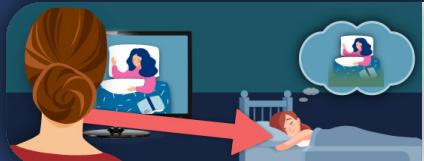

Position Images on the Left 5   
Insert a Blockade on the Right   
Immerse Viewers Into 1st Person Perspectives 9   
Attach the Product to an Everyday Trigger 11   
Add Elements From Their Top-Down Attention 12   
Depict the Problem in Grayscale 14   
Reduce Color in Text-Filled Ads 16   
Reduce Color for Distant Events 17   
Enlarge Emotional Words 20   
Rhyme Your Slogan or Call-to-Action 22

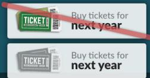

Want a Tour? Visit our Store

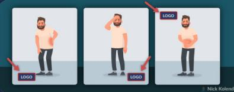

Move Your Logo in Ad Variations 23   
Choose Models That Resemble Each Segment 26   
Use Direct Eye Gazes for Virtuous Products 27

## STRATEGY

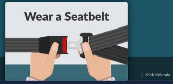

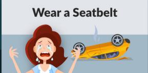

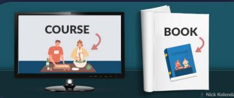

Use Negative Ads to Grab Attention 29   
Use Positive Ads to Be Remembered 31   
Target Their Emotions in Traditional Markets 32   
Inject Something Absurd or Nonsensical 33   
End Ads By Illustrating the Next Step 34   
Advertise in Congruent Modalities 36   
Find Mediums With Congruent Emotions 37   
Advertise in the Same Topic Domain 39   
Avoid Mediums That Depict a “Paid” Placement 40   
Advertise Early to Mold Future Simulations 42   
Disperse Ads Over Time 43

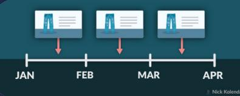

CONTENT

STRATEGY

IMAGES

COLOR

WORDS

PEOPLE

FRAMING

MEDIUMS

TIMING

# Position Images on the Left

Design your ads based on neuroanatomy.

You evaluate stimuli differently on the left or right:

…a stimulus presented in the left visual field (LVF) is initially received and processed by the right hemisphere (RH), and a stimulus presented in the right visual field (RVF) is initially projected to and processed by the left hemisphere (LH; Bourne, 2006, p. 374)

In other words, your right hemisphere will process the left side of advertisements. Therefore, place images in these locations:

Because the right hemisphere is better suited to process pictorial information and the left one is more logical and verbal, placing the image on the left hand side of the text enhances the processing of the whole message (Grobelny & Michalski, 2015, p. 87)

## REFERENCES

Bourne, V. J. (2006). The divided visual field paradigm: Methodological considerations. Laterality, 11(4), 373-393.

Grobelny, J., & Michalski, R. (2015). The role of background color, interletter spacing, and font size on preferences in the digital presentation of a product. Computers in Human Behavior, 43, 85-100.

# Insert a Blockade on the Right

Take a guess — which ad performed better?

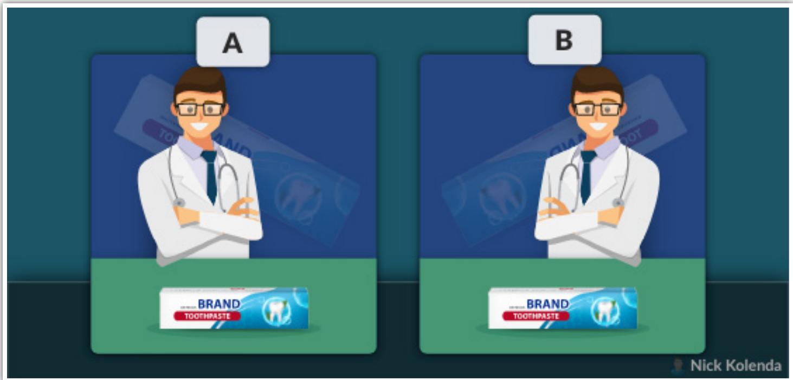

Answer: Right ad (Park, Spence, Ishii, & Togawa, 2018).

The argument? People look more trustworthy if they face left.

Maybe…but I see a more plausible explanation.

If you read from left to right, you evaluate ads from left to right. In the previous ad on the right, this person blocks your eyes from leaving. Your eyes enter from the left, move rightward until hitting that person, and

then move downward toward the product.

In the ad on the left, your eyes start at this person and then move rightward (away from the product).

We need research to verify my claim, but I suspect that advertisements hold more attention if they block your eyes from moving rightward.

## REFERENCES

Park, J., Spence, C., Ishii, H., & Togawa, T. (2018). Does Face Orientation Affect the Perception of a Model and the Evaluation of Advertised Product?. ACR European Advances.

## Nick Kolenda

## Immerse Viewers Into 1st Person Perspectives

You’re more likely to buy something if you can imagine using this product (see my book Imagine Reading This Book).

Advertisers can strengthen these mental images by showing perspectives from the 1st person point-of-view.

For example, Peloton shows multiple POV shots in their commercials:

After watching these commercials, viewers evaluate the purchase decision by imagining buying a Peloton. This simulation helps them determine whether they want to buy one.

POV shots are effective because they ease that simulation: Hmm, do I want to buy a Peloton? I can imagine myself using it. So yes, I want to buy one.

## REFERENCES

Xu, A. J., & Wyer Jr, R. S. (2007). The effect of mind-sets on consumer decision strategies. Journal of Consumer Research, 34(4), 556-566.

Xu, A. J., & Wyer Jr, R. S. (2008). The comparative mind-set: From animal comparisons to increased purchase intentions. Psychological Science, 19(9), 859-864.

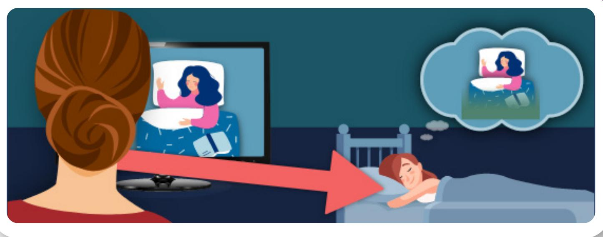

## Attach the Product to an Everyday Trigger

Advertisers want viewers to remember their product later.

How can they do this? They can associate their ad with an everyday experience. When viewers encounter this experience later, they will be reminded of the advertisement.

Peloton could improve their commercial by attaching their product to an everyday experience. For example, many people lie in bed each morning struggling to find the motivation to exercise. They could show someone experiencing this moment before leaving their bed to ride their Peloton. Next time that viewers experience this struggle in bed, they will be prompted to think of Peloton.

See my YouTube video for another example with Tide.

# Add Elements From Their Top-Down Attention

Humans have two types of attention:

• Top-Down. You look for something specific

Bottom-Up. You monitor what’s noticeable.

Most people ignore commercials. They fiddle with their phone, while subconsciously monitoring for any cue from their show so that they knew when it’s back. Clever advertisers apply this mechanism.

For example, while waiting for The Office to return, I was distracted with my phone. Once I heard the character Darryl speaking, I looked at the TV. But I realized...it wasn’t Darryl...it was the actor, Craig Robinson, in an unrelated commercial.

This advertiser took a cue from The Office — the voice of Craig Robinson — and inserted this cue into their commercial. This commercial pierced my attention because my brain was actively searching for this cue.

The Takeaway: Break through “top-down” attention by inserting a cue that viewers are actively monitoring.

CONTENT

STRATEGY

IMAGES

COLOR

WORDS

PEOPLE

FRAMING

MEDIUMS

TIMING

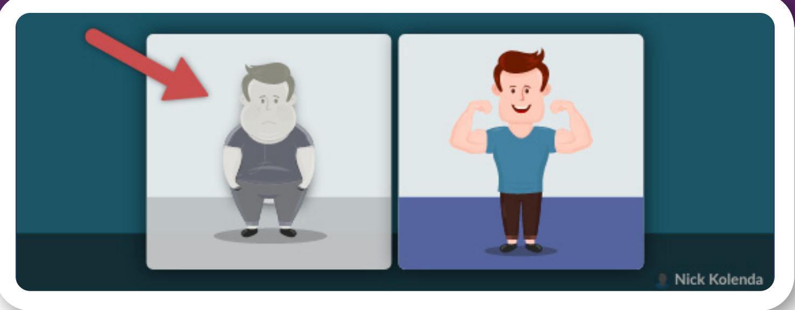

# Depict the Problem in Grayscale

Infomercials are notorious for this technique.

You see footage of somebody needlessly struggling with an ordinary task. Then bam. You see another person solving this problem with a better product.

But look closely...the “before” scenario is in black and white. These two scenarios look visually different.

This subtlety is powerful. Viewers feel a sensation of contrast: Hmm, these two scenarios seem very different.

Next, they confuse this visual contrast with a semantic contrast: Therefore, the product must make a big difference.

I call it contrast fluency: Viewers believe that a product will make a bigger difference if these two scenarios look visually different.

Always degrade the color or visual quality of the “problem” framing.

# Reduce Color in Text-Filled Ads

Grayscale ads perform better when viewers feel overwhelmed:

When the substantial resources devoted to ad processing are inadequate for thorough ad scrutiny, black-and-white ads or those that color highlight aspects highly relevant to ad claims are more persuasive (Meyers-Levy & Peracchio, 1995, p. 121)

A lot of text can feel overwhelming, so reduce the level of color (e.g., brightness) in these ads.

## REFERENCES

Meyers-Levy, J., & Peracchio, L. A. (1995). Understanding the effects of color: How the correspondence between available and required resources affects attitudes. Journal of consumer research, 22(2), 121-138.

# Reduce Color for Distant Events

Grayscale ads perform better for future purchases.

In one study, grayscale ads performed better depending on the start date of a charity (Lee, Fujita, Deng, & Unnava, 2017).

• In a few years? Grayscale ads boosted donations.

• In a few days? Color ads boosted donations.

In a follow-up study, people paid a higher price for a hoverboard depending on the launch date:

• In a few years? Grayscale ads boosted payments.

Tomorrow? Color ads boosted payments.

Why does that happen?

Turns out, we visualize future events in grayscale. Researchers gave people a blank drawing of a housewarming party, and people colored this drawing with more grey if the party was occurring in five years (Lee, Fujita, Deng, & Unnava, 2017).

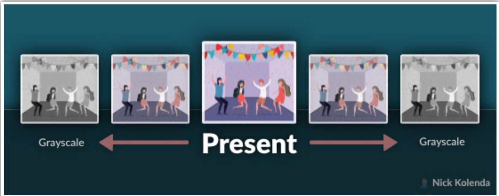

Always reflect on the timeline of the purchase: Will it occur in the distant future? Then use gray colors to match the mental imagery of viewers. These ads will “feel right.”

## REFERENCES

Lee, H., Fujita, K., Deng, X., & Unnava, H. R. (2017). The role of temporal distance on the color of future-directed imagery: A construal-level perspective. Journal of Consumer Research, 43(5), 707-725.

CONTENT

STRATEGY

IMAGES

COLOR

WORDS

PEOPLE

FRAMING

MEDIUMS

TIMING

# Enlarge Emotional Words

Large images are more emotional (De Cesarei & Codispoti, 2006).

And that makes sense. Across evolution, our ancestors judged threats based on their size:

…in real life, the distance from an object influences its biological relevance for the organism… Aggressors, for example, appear to be more dangerous the closer they get to the individual (Bayer, Sommer, & Shacht, 2012, p. 5)

Turns out, words inherited this effect. Enlarging text intensifies their impact (Bayer, Sommer, & Shacht, 2012).

Plus, large words capture more attention:

…an increase in text surface size raises attention to this element much more than it simultaneously reduces attention to the brand and pictorial elements…[so] advertisers aiming to maximize attention to the entire advertisement should seriously consider devoting more space to text (Pieters & Wedel, 2004, p. 48)

## REFERENCES

Bayer, M., Sommer, W., & Schacht, A. (2012). Font size matters—emotion and attention in cortical responses to written words. PloS one, 7(5), e36042.

De Cesarei, A., & Codispoti, M. (2006). When does size not matter? Effects of stimulus size on affective modulation. Psychophysiology, 43(2), 207-215.

Pieters, R., & Wedel, M. (2004). Attention capture and transfer in advertising: Brand, pictorial, and text-size effects. Journal of marketing, 68(2), 36-50.

## Rhyme Your Slogan or Call-to-Action

A simple rhyme dictated the O.J. Simpson trial: If the glove doesn’t fit, you must acquit.

Consider these ad frames:

What sobriety conceals, alcohol unmasks.

What sobriety conceals, alcohol reveals.

Both statements convey the same information, but the rhyming statement seemed more accurate and truthful (McGlone & Tofighbakhsh, 2000). Students felt a pleasant sensation from the rhyme, and they misattributed this sensation to the information. So…

• Be a dove, show some love.

Whaddya say, donate today.

Want a tour? Visit our store.

## REFERENCES

McGlone, M. S., & Tofighbakhsh, J. (2000). Birds of a feather flock conjointly (?): Rhyme as reason in aphorisms. Psychological science, 11(5), 424-428.

# Move Your Logo in Ad Variations

Create variations of your ads.

Subsequent exposures will force people to retrieve the original ad from memory. And this retrieval strengthens their memory:

…the act of retrieval is itself a learning event in the sense that the retrieved information becomes more recallable in the future than it would have been without having been retrieved…if P2 encourages retrieval of P1, recall for P1 should be enhanced (Appleton-Knapp, Bjork, & Wickens, 2005, p. 267)

Specifically, consider moving your logo.

People evaluate logos more favorably when they move locations. Why? Viewers pay more attention because something feels different:

…a relatively small visual change from one ad exposure to the next can be detected incidentally…detection of the change likely caused participants to deploy more processing resources to the logos/products, in turn increasing fluency (Shapiro & Nielson, 2013, pp. 1211 – 1212)

## REFERENCES

Appleton-Knapp, S. L., Bjork, R. A., & Wickens, T. D. (2005). Examining the spacing effect in advertising: Encoding variability, retrieval processes, and their interaction. Journal of Consumer Research, 32(2), 266-276.

Shapiro, S. A., & Nielsen, J. H. (2013). What the blind eye sees: Incidental change detection as a source of perceptual fluency. Journal of Consumer Research, 39(6), 1202-1218.

## CONTENT

STRATEGY

IMAGES

COLOR

WORDS

PEOPLE

FRAMING

MEDIUMS

TIMING

# Choose Models That Resemble Each Segment

People in ads are more effective when they resemble customers:

…when consumers are exposed to advertising that is consistent with a salient dimension of their self, they spontaneously selfreference the ad. This leads to more favourable thoughts, attitudes and purchase intentions (Lee, Fernandez, & Martin, 2002, p. 374)

Advertising via Facebook? Instead of displaying the same ad to everyone, replace the model with someone who resembles each segment.

You could segment on a broad trait, like gender. Or create tighter segments by focusing on psychological characteristics.

## REFERENCES

Lee, C. K. C., Fernandez, N., & Martin, B. A. (2002). Using self-referencing to explain the effectiveness of ethnic minority models in advertising. International Journal of Advertising, 21(3), 367-379.

## Use Direct Eye Gazes for Virtuous Products

Humans perform “good” behaviors when other people are watching.

In one study, people donated more money when they were standing near an image of eyes (vs. flowers; Bateson, Nettle, & Roberts, 2006).

Do you promote virtuous products, like charities? Then orient gazes toward the viewers.

In a commercial for LoveShriners, a young boy breaks the 4th wall by waving to viewers and addressing them directly: “Oh…hi people.”

That’s clever. Viewers feel like this young boy is watching them, and they feel pressured to behave accordingly (e.g., donate).

## REFERENCES

Bateson, M., Nettle, D., & Roberts, G. (2006). Cues of being watched enhance cooperation in a real-world setting. Biology letters, 2(3), 412-414.

## CONTENT

## STRATEGY

IMAGES

COLOR

WORDS

PEOPLE

## FRAMING

MEDIUMS

TIMING

# Use Negative Ads to Grab Attention

Humans are built to avoid pain.

Thus, we notice negative stimuli more easily. In advertisements, negative framing attracts more eye fixations (Ferreira et al., 2011).

…heart rate was slower during exposure to negative messages… participants allocated more attention to the negative advertisements (Bolls, Lang, & Potter, 2001; p. 646 – 647)

Consequently, negative ads can trigger immediate behaviors, like impulse buys (Shiv, Edell, & Payne, 1997).

If your main goal is immediate action (e.g., clicking an ad), a negative frame might work better. You’ll capture more attention and trigger immediate behavior.

## REFERENCES

Bolls, P. D., Lang, A., & Potter, R. F. (2001). The effects of message valence and listener arousal on attention, memory, and facial muscular responses to radio advertisements. Communication research, 28(5), 627-651.

Ferreira, P., Rita, P., Rosa, P., Oliveira, J., Gamito, P., Santos, N., ... & Sottomayor, C. (2011). Grabbing attention while reading website pages: the influence of verbal emotional cues in advertising. Journal of Eye Tracking, Visual Cognition and Emotion, (1), 64-68.

Shiv, B., Edell, J. A., & Payne, J. W. (1997). Factors affecting the impact of negatively and positively framed ad messages. Journal of Consumer Research, 24(3), 285-294.

# Use Positive Ads to Be Remembered

Negative ads might grab attention, but positive ads will be remembered:

…positive advertisements were more memorable. We suggest that this seeming contradiction can be explained not by the amount of attention allocated to the advertisements but rather by the levels of arousal experienced by participants during exposure (Bolls, Lang, & Potter, 2001, p. 647)

## REFERENCES

Bolls, P. D., Lang, A., & Potter, R. F. (2001). The effects of message valence and listener arousal on attention, memory, and facial muscular responses to radio advertisements. Communication research, 28(5), 627-651.

# Target Their Emotions in Traditional Markets

Customers ignore ads when they are familiar with a product. That’s why emotional appeals can be more effective:

In older markets, consumers may have gained knowledge, reducing their motivation to engage in extensive ad processing. As such, factors that increase their personal involvement in the ad — like the use of emotion-focused appeals and positively framed messages — may be particularly likely to create a behavioral response (Chandy, Tellis, MacInnis, & Thaivanich, 2001, p. 411)

Emotion creates a fresh perspective — which, in turn, influences behavior.

## REFERENCES

Chandy, R. K., Tellis, G. J., MacInnis, D. J., & Thaivanich, P. (2001). What to say when: Advertising appeals in evolving markets. Journal of marketing Research, 38(4), 399-414.

# Inject Something Absurd or Nonsensical

Absurd advertisements capture attention because they disrupt expectations (Arias-Bolzmann, Chakraborty, & Mowen, 2000).

Some examples:

Surrealism. Use objects in unconventional ways (e.g., an orange for the sun)

Anthropomorphism. Give human traits to inanimate objects (e.g., an orange with a face)

• Allegory. Describe something in terms of something else (e.g., dancing oranges to convey liveliness)

## REFERENCES

Arias-Bolzmann, L., Chakraborty, G., & Mowen, J. C. (2000). Effects of absurdity in advertising: The moderating role of product category attitude and the mediating role of cognitive responses. Journal of Advertising, 29(1), 35-49.

# End Ads By Illustrating the Next Step

People make decisions by imagining the motor behavior.

They become more likely to perform this behavior if they can imagine themselves doing it (see my book Imagine Reading This Book).

Rather than ask viewers to perform a call-to-action, show them. Insert this mental imagery into their brain.

Want customers to…

…sign up? Show a cursor clicking the sign-up button.

…leave a review? Show a review being posted on Yelp.

…share on social media? Show a message on Facebook.

…visit your site? Show your URL being typed in a browser.

Those illustrations ease those simulations. Viewers misattribute this ease with a desire: Hmm, how much work will this be? I can see myself doing it, so it shouldn’t take long.

## CONTENT

## STRATEGY

IMAGES

COLOR

WORDS

PEOPLE

FRAMING

MEDIUMS

TIMING

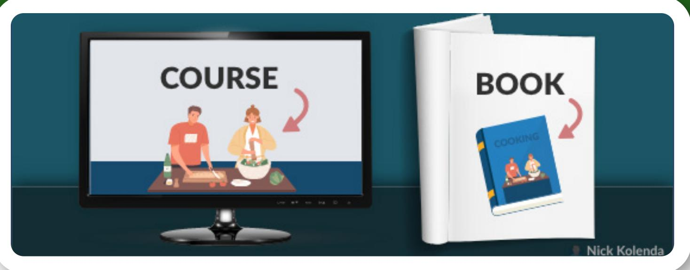

# Advertise in Congruent Modalities

It’s hard to imagine exercising while wearing pajamas.

Similar effects happen with ads. You should advertise to viewers who are experiencing a bodily state that matches your product.

Selling an online course? Advertise via video, such as YouTube. These viewers can imagine watching your course because they are already watching video. The modality is congruent.

Selling a book? You need viewers to imagine reading it. Therefore, advertise via written mediums (e.g., magazines, blog posts) because these modalities ease the simulation of reading.

The Takeaway: Find people who are performing behaviors that are similar to your desired behavior. These people will be able to imagine buying and using your product more easily.

## Find Mediums With Congruent Emotions

Sparking emotion is hard.

It’s much easier to find people who are experiencing an emotional reaction, and then expose your message to them.

For example, I noticed that Tums is sponsoring episodes of Hot Ones, a YouTube show where celebrities eat spicy wings.

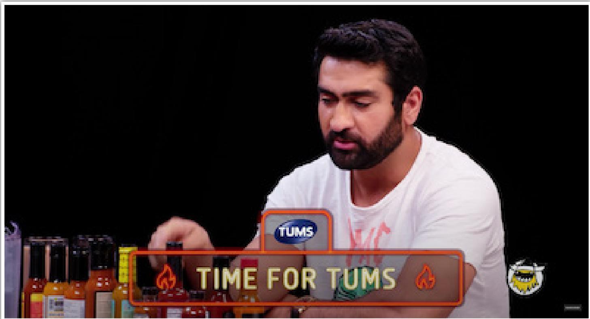

That’s clever. Humans have mirror neurons — if you watch somebody perform a behavior, like eating spicy food, you simulate this experience. In other words, viewers of Hot Ones are experiencing a body state that can help them simulate the value of antacids.

Alternatively, Tums could advertise around dinnertime (when viewers are more likely to be experiencing heartburn).

The Takeaway: Expose your ads in a time or location in which viewers can simulate the value of your product.

# Advertise in the Same Topic Domain

Help viewers imagine using your product by advertising in the same semantic domain.

For example, an ad for ketchup performed better when it followed an ad for mayonnaise (Lee & Labroo, 2004). Mayonnaise activated the domain of condiments, which helped people imagine buying ketchup.

Selling a course on cooking? Advertise your course in cooking domains. The idea of “cooking” will already be activated in those people — thus, they can imagine watching your course.

## REFERENCES

Lee, A. Y., & Labroo, A. A. (2004). The effect of conceptual and perceptual fluency on brand evaluation. Journal of Marketing Research, 41(2), 151-165.

# Avoid Mediums That Depict a “Paid” Placement

Your ads perform worse if customers see that you “paid” for them:

…users receiving the “Paid Advertisement” label click 25% and 27% fewer advertisements, respectively (Edelman & Gilchrist, 2012, pg. 2)

This effect is strong enough that differences emerge from a 6-second (vs. 3-second) duration of disclosure (Boerman, van Reijmersdal, & Neijens, 2012).

## REFERENCES

Boerman, S. C., Van Reijmersdal, E. A., & Neijens, P. C. (2012). Sponsorship disclosure: Effects of duration on persuasion knowledge and brand responses. Journal of Communication, 62(6), 1047-1064.

Edelman, B., & Gilchrist, D. S. (2012). Advertising disclosures: Measuring labeling alternatives in internet search engines. Information Economics and Policy, 24(1), 75-89.

CONTENT

## STRATEGY

IMAGES

COLOR

WORDS

PEOPLE

FRAMING

MEDIUMS

TIMING

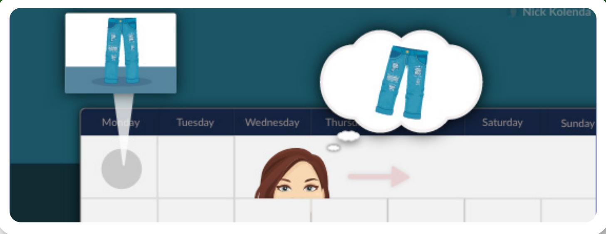

# Advertise Early to Mold Future Simulations

Back-to-school commercials start pretty early.

Same with commercials near holidays, right? You typically see Christmas ads in November.

Advertisers aren’t necessarily trying to influence your behavior during these early moments. They are inserting a simulation that will dictate your future behavior.

While seeing these commercials, you think: Ah, that’s right. I need to go Christmas shopping. Maybe I’ll go to Target in the next few weeks.

Over the next few weeks, you imagine doing your Christmas shopping at Target. You might see other ads in the meantime, but your plans have already formed. Target planted their seed before other retailers.

A single commercial could start a snowball effect that influences your behavior weeks later.

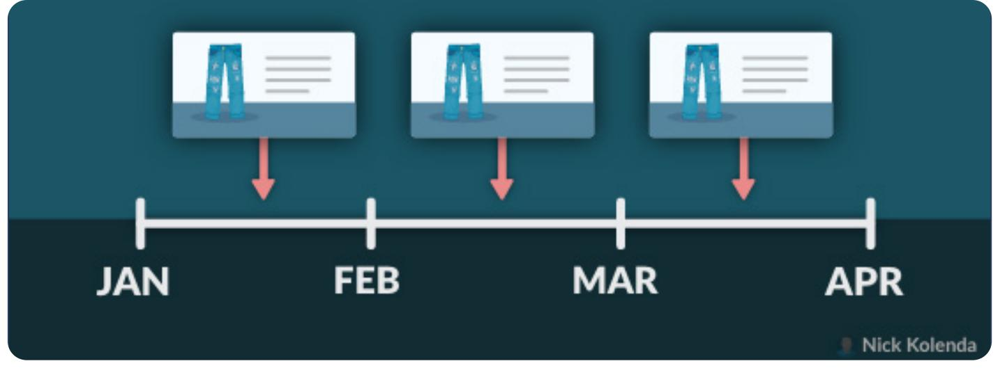

# Disperse Ads Over Time

Humans learn better with “distributed practice.”

Studying for an exam? You should study in increments over time, rather than cram the night before.

Likewise, ads perform better when they are spread apart, rather than bunched together (Sahni, 2011).

Viewers encode these ads more effectively with less annoyance:

Marketers of unfamiliar brands need to build familiarity to compete better with more familiar brands, but they must be careful in how they use concentrated, high-repetition ad schedules in order to avoid alienating consumers (Campbell & Keller, 2003, pp. 301 – 302)

## REFERENCES

Campbell, M. C., & Keller, K. L. (2003). Brand familiarity and advertising repetition effects. Journal of consumer research, 30(2), 292-304.

Sahni, N. S. (2015). Effect of temporal spacing between advertising exposures: Evidence from online field experiments. Quantitative Marketing and Economics, 13(3), 203-247.

## Next step...

So, you mastered advertisements? Now you can move to the next topic: Pricing.

Which prices are better? How should you display them? How can you find a price that maximizes revenue?

For these steps, check out my course on Pricing Optimization:

www.NickKolenda.com/video-courses