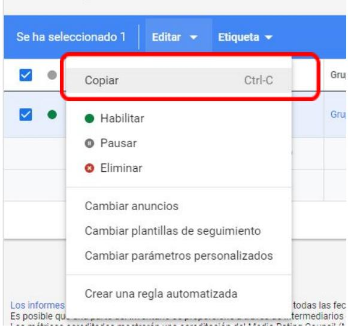
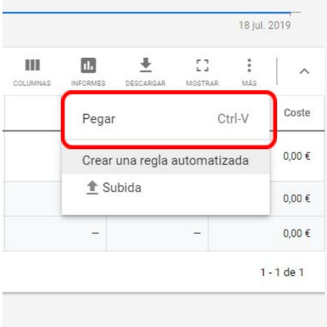

# ANUNCIOS DE TEXTO EN GOOGLE ADS

## 1) ELEMENTOS DE LOS ANUNCIOS DE TEXTO

En todo anuncio de texto de Google Ads, existen tres elementos obligatorios:

## 1. TÍTULO

Cerrajero Rapido Barato Madrid | El mas barato de Madrid 24H

Abrimos todo tipo de puertas y sin romper! Cambiamos cerraduras. Llamanos. Todo Madrid. Equipo De Profesionales. Servicio Integral. +20 Años De Experiencia. Asesoría Disponible. Ventajas: Más De 20 Años De Experiencia, Calidad, 365 Días Del Año/24 Horas.

Constituye la parte más importante del anuncio (capta la mayor parte de la atención del usuario).

− Tiene que describir tu producto o servicio, de manera directa.

− Debe incluir al menos una palabra clave.

Se divide en tres campos, separados por un guion o barra: Título 1, Título 2 y Título 3 (añadido recientemente por Google). Cada campo es totalmente independiente del otro, y el límite máximo de cada uno son 30 caracteres.

Debes tener en cuenta que Google Ads especifica que el Título 3 es posible que no se muestre siempre.

## 2. DESCRIPCIÓN

Cerrajero Rapido Barato Madrid | El mas barato de Madrid 24H

Anuncio www cerraierobaratocerca es/ 688 82 84 27   
Abrimos todo tipo de puertas y sin romper! Cambiamos cerraduras. Llamanos. Todo Madrid. Equipo De Profesionales. Servicio Integral. +20 Años De Experiencia. Asesoría Disponible. Ventajas: Más De 20 Años De Experiencia, Calidad, 365 Días Del Año/24 Horas.

Se utiliza para destacar las características únicas / ventaja competitiva de nuestro producto o servicio.

Es recomendable que incluya una llamada a la acción (call to action o CTA).

La llamada a la acción es un verbo que convierte a los usuarios de pasivos a activos (ej.: envía, compra, regístrate, descarga, haz tu pedido…). En el ejemplo: “Llámanos”.

Existen dos descripciones y el límite máximo de cada una son 90 caracteres. Debes tener en cuenta que la descripción 2, al igual que el Título 3, es posible que no se muestre siempre.

## 3. URL VISIBLE

Cerrajero Rapido Barato Madrid | El mas barato de Madrid 24H   
Anuncio www.cerrajerobaratocerca.es/ 688 82 84 27   
Abrimos todo tipo de puertas y sin romper! Cambiamos cerraduras. Llamanos. Todo Madrid. Equipo De Profesionales. Servicio Integral. +20 Años De Experiencia. Asesoría Disponible. Ventajas: Más De 20 Años De Experiencia, Calidad, 365 Días Del Año/24 Horas.

− La URL visible está conformada por:

o El dominio de la URL final

o El texto de los campos opcionales de Ruta visible

− La URL final es la dirección a la que llega el usuario después de hacer clic en el anuncio (la landing page)

De esta URL, en el anuncio sólo aparece el dominio. En el ejemplo, la URL final es, pero sólo se muestra “www.cerrajerobaratocerca.es”:

https://cerrajerobaratocerca.es/cerrajeros-madrid?gclid=EAIaIQobChMItrHFk oe84wIVVZnVCh11-ga7EAAYAiAAEgIwH\_D\_BwE

Después del dominio, la plataforma nos da la opción de escribir dos espacios personalizados, de 15 caracteres como máximo. Estos espacios se denominan “ruta visible” y no es obligatoria:

Agencia Marketing Digital  Herramientas Propias | geotelecom.es

Anuncio www.geotelecom.esagenciamarketin/digital

Equipo enfocado a resultados. Preocupados por tu rentabilidad. No esperes a contactarnos!

En estos espacios, podemos escribir lo que queramos ya que son meramente visuales. La función de la ruta es aumentar la relevancia del anuncio y que los usuarios tengan una idea de la página de la web en la que aterrizarán al hacer clic en el anuncio.

Optimiza los títulos. Una estrategia adecuada para optimizar el título de los anuncios en Google Ads consiste en publicar dos versiones del mismo anuncio modificando una sola variable del título. Una vez publicadas, debemos medir cuál de las dos cumple mejor nuestros objetivos de campaña (más clics, más ventas, etc.).

Para duplicar el anuncio, la propia plataforma nos simplifica el proceso dando la opción de copiar y pegar):

Es recomendable utilizar keywords en el Título, en la Descripción y en la URL final. Usa también aquellas palabras que te diferencian de tus competidores.

− Incluye una llamada a la acción.

Piensa en tu audiencia móvil. Adapta el tipo de anuncio, el contenido, las keywords que utilizas, y optimiza la página de destino para este tipo de dispositivos.

Usa todas las extensiones de anuncios posibles. Aportan muchísimo valor al usuario que ve el anuncio y no tienen coste alguno.

Mejora la experiencia de la página de destino. Esta página es a la que llega el usuario después de hacer clic y afecta directamente al rendimiento del anuncio y a su posición en la página de resultados. Google valora positivamente en una página:

o Relevancia: tiene que existir una conexión lógica, y cuanto más directa mejor, entre el anuncio y la página de destino. Por ejemplo, si publicas un anuncio de un producto o categoría concreta, el anuncio debe llevar al usuario a la página de dicho producto o categoría. No a la Home u otra página del sitio.

o Confianza: esto implica incluir certificados de seguridad, aviso de privacidad, política de devoluciones, condiciones del sitio, información de contacto, etc.

o Originalidad: imágenes (tip: no utilizar fotos de stock), texto y vídeos propios.

o Facilidad de navegación (usabilidad): página sencilla e intuitiva, velocidad de carga que no empeore la experiencia del usuario, etc.

Utiliza las mismas palabras y frases en el anuncio y en la página de destino. Esto aumenta la relevancia de la página.

Crear anuncios reales y verídicos, sin exageraciones de contenido, ni de formato (demasiadas mayúsculas, exclamaciones, etc.).

Asegurarse de que los anuncios cumplen con las políticas de Google. Si no lo haces, serán rechazados.

## 3) EXTENSIONES

Las extensiones de anuncio son elementos extra que podemos incluir en nuestros anuncios, además del Título, la Descripción, la Ruta y la URL final.

Las principales ventajas de incorporar extensiones son:

1. Visibilidad: cuanto más contenido tenga tu anuncio, más espacio ocupará y más visibilidad tendrá.

2. Actuación: las extensiones proporcionan más información al usuario y esto le genera confianza, lo que hace que actúe más y el anuncio obtenga más clics.

3. Coste: no tienen coste alguno, son gratuitas.

¿Cuándo aparecen las extensiones? No tienen porqué aparecer siempre, sino que lo harán cuando:

Google Ads prediga que tu anuncio va a tener un mejor rendimiento si aparece una cierta combinación de extensiones

− La posición y el ranking de tu anuncio son lo suficientemente altos para mostrar extensiones en esa búsqueda.

## TIPOS DE EXTENSIONES

Extensiones de enlace de sitio: Incluyen en el anuncio otros enlaces (a tu sitio web), además del principal. Por ejemplo: menú de un restaurante, cupones de descuento, sucursales, productos, etc. El coste de un clic en un enlace de sitio equivale al coste de un clic en el título del mismo anuncio.

Calzado y ropa deportiva NikE | Fuerza, velocidad, resistencia   
Anunciowww.nike.com/Última\_novedad   
Compra las últimas novedades den NIKE.com. Entregas y devoluciones gratuitas. Tipos: Running, Fútbol, Training, Baloncesto, Tennis, Skateboarding, Golf, Cross-training, Surf, Yoga.   
Gran Vía 38, Madrid - 915 23 73 59 - Abierto hoy · 10:0021:30

## Rebajas Nike: -20% extra

Air Max 270 React

Ahorra indicando el código JULY20. Elige estilo con las ofertas Nike!

Llega más lejos: estilo y confort todo el día. Big Air, With GO.

Extensiones de texto destacado: permiten agregar texto adicional que indique ventajas para el usuario, como el envío gratuito o el servicio de atención al cliente las 24 horas.

Comprar Sandalias | Hasta el 80% de descuento | FloryDay.com   
Anunciowww.floryday.com/   
Últimos vestidos ahorras hasta 80%. Envío rápido, Alta Calidad, Compra Ahora! Devoluciones fáciles Nuevos estilos 2019 en lidad. En ío gratuito. Atención al público 24h. Servicio 5 estrellas. Cómoda y fácil de usar. Las meiores ofertas   
Vestidos - desde 23,00 € - +3000 Estilos · Más

Vestidos baratos Ropa 100% Garantía de Calidad Todas las tallas, +7000 Estilos. Oferta -50% 80% de Descuento & Envío Gratuito!

Extensiones de fragmentos estructurados: permiten destacar características de tus productos o servicios que vengan en forma de lista con un título.

Flores Online A Domicilio | Envía tu Ramo Hoy Mismo | FloraQueen.es Anunciowww.floraqueen.es/Flores/online   
Valoración de floraqueen.es: 3,9   
Entrega de Flores Frescas a Domicilio. Rápido y Puntual Envía Flores Ahora! Desde 19,90 €. Primera Calidad. Garantía de Frescura. Destinos: Barcelona, Madrid, Valencia, Bilbao, Málaga, A Coruña.

Extensiones de ubicación: muestran detalles de tu local como la dirección, el teléfono o las horas de apertura. Se configuran desde Google My Business, enlazando esta herramienta con Google Ads.

Calzado y ropa deportiva NikE | Fuerza, velocidad, resistencia   
Anunciowww.nike.com/Última\_novedad   
Valoración de nike.com: 4,9   
Compra las últimas novedades den NiKE.com. Entregas y devoluciones gratuitas. Tipos: Running, Fúo TainingBaloncestoTnisSkateboardingo ross-traininSu.   
Gran Vía 38, Madrid - 915 23 73 59 - Abierto hoy · 10:00-21:30

Rebajas Nike: -20% extra Air Max 270 React Ahorra indicando el código JULY20. Llega más lejos: estilo y confort Elige estilo con las ofertas Nike! todo el día. Big Air, With GO.

Extensiones de llamada: incluyen en tu anuncio el número de teléfono de tu empresa. Cuando el anuncio se muestra en dispositivos móviles, permite directamente llamar. Google te informa del número de llamadas que recibiste a través del anuncio.

## Despacho Abogados | Familia-Laboral-Reclamaciones

Anunciowww.eliasymunozabogados.com/Despacho/Abogados-Madrid 915 71 17 87 Abogados Multidisciplinares. Más de 20 años de experiencia. Consúltenos ahora! Mínimo desembolso inicial. Multidisciplinares. Financiación sin coste. Abogados Especializados. Tarifas transparentes. Atención ininterrumpida. Tipos: Familia, Indemnizaciones, Laboral.

Pozuelo de Alarcon · 2 ubicaciones cerca

## Abogados Reclamaciones

## Abogados Familia

Reclamaciones de Cantidad, Despidos

Accidentes. +20 Años Experiencia

Despacho de abogados especialista en derecho de familia, matrimonial

Extensiones de SMS: permiten al usuario escribir un mensaje de texto desde su dispositivo móvil al número de teléfono que haya determinado el anunciante (p. ej. concertar una cita, pedir un presupuesto, información, un servicio, etc.).

Prueba | ThePowerEcommerce Anuncio www.thepowermba.com/ecommerce

Envíanos un mensaje para saber más

Extensiones de precios: permiten que muestres tus productos o servicios con su respectivos precios directamente en el anuncio (no son anuncios de Google Shopping). Resulta particularmente atractiva en los dispositivos móviles (formato carrusel).

Prueba | ThePowerEcommerce Anuncio www.thepowermba.com/ecommerce

ThePowerEcommerce

MBA + Ecommerce

499,00 € Programa ecommerce

899,00 € Formación integral

Bot

Veloc

E x t e n sio n e s  d e  p r o m o ció n .  S e  u tiliz a n  p a r a  m o s t r a r  o f e r t a s  y  d e s c u e n t o s especiales de tu negocio.

Prueba | ThePowerEcommerce Anuncio www.thepowermba.com/ecommerce

50 € de descuento en ThePowerEcommerce

Extensiones de aplicación: te permiten colocar un enlace a tu aplicación en tu anuncio en dispositivos móviles y tablets.

Anuncio · Google Play

ElTenedor Restaurantes - Reservas y Promociones | Los Mejores... 4,4\* (51.784)

Hasta un 50% en tu cuenta Descarga la App

↓ Instalar

## Anuncio · www.eltenedor.es/

ElTenedor.es | ElTenedor Restaurantes| Madrid

¿Buscas restaurantes? Reserva en Madrid y Disfruta de -50% Descuentos en tu cuenta. Reserva 100% gratuita. +30.000 restaurantes. Reserva inmediata. +5 millones de opiniones. Tipos: Mediterráneo. Español. Japonés. Italiano