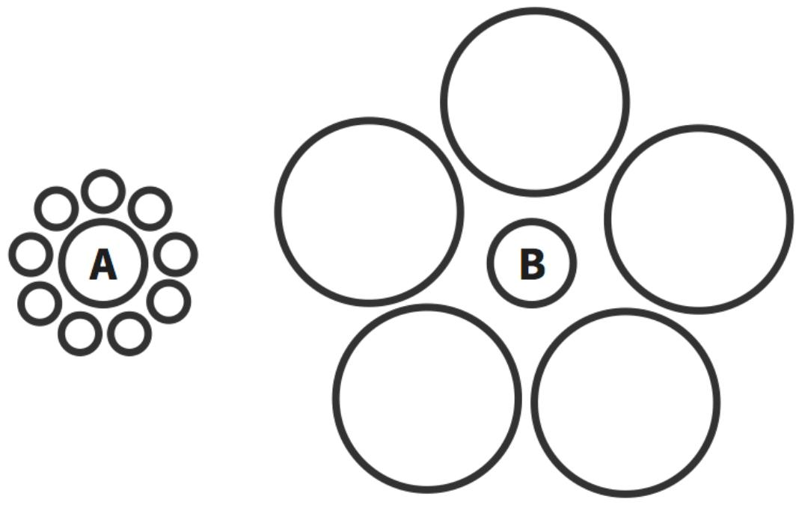

## Images

Figure 0.1 Steps in METHODS Process
<table><tr><td rowspan=4 colspan=1>Beforethe Request</td><td rowspan=1 colspan=1>Step 1: Mold Their Perception</td></tr><tr><td rowspan=1 colspan=1>Step 2Elicit Congruent Attitudes</td></tr><tr><td rowspan=1 colspan=1>Step 3 Trigger Social Pressure</td></tr><tr><td rowspan=1 colspan=1>Step 4: Habituate Your Message</td></tr><tr><td rowspan=2 colspan=1>Duringthe Request</td><td rowspan=1 colspan=1>Step 5 Optimize Your Message</td></tr><tr><td rowspan=1 colspan=1>Step 6: Drive Their Momentum</td></tr><tr><td rowspan=1 colspan=1>Afterthe Request</td><td rowspan=1 colspan=1>Step 7: Sustain Their Compliance</td></tr></table>

Table 1.1 Priming Effects on Behavior
<table><tr><td>Mindset</td><td>Prime</td><td>Outcome</td><td>Source</td></tr><tr><td>Politeness</td><td>Exposure to words about politeness (e.g., respect, honor, considerate)</td><td>People waited longer before interrupting an experimenter</td><td>Bargh, Chen, &amp; Burrows, 1996</td></tr><tr><td>Friendship</td><td>A questionnaire about a friend</td><td>People were more likely to help in a follow-up research study</td><td>Fitzsimons &amp; Bargh, 2003</td></tr><tr><td>Intellect</td><td>People were asked to write a short essay about college professors</td><td>People answered more questions correctly in Trivial Pursuit</td><td>Dijksterhuis &amp; van Knippenberg, 1998</td></tr><tr><td>Cleanliness</td><td>The smell of a citrus-scented all-purpose cleaner</td><td>People kept their desks cleaner after eating food</td><td>Hollandm Hendriks, &amp; Aarts, 2005</td></tr><tr><td>Guilt</td><td>Exposure to words about guilt (e.g., guilty, remorse, sin)</td><td>People were more likely to purchase candy</td><td>Goldsmith, Kim Cho, &amp; Dhar, 2012</td></tr></table>

Figure 2.1 Ebbinghaus Illusion  

Figure 6.1 Conformity Study by Asch (1951)  
  
Standard Line

  
Comparison Lines