## Choice Psychology

A GUIDE FOR MARKETERS AND MANAGERS

NICK KOLENDA

## Hello...

I’m Nick Kolenda.

In this guide, you’ll learn the factors that influence our decisions (and why).

This PDF is free for everyone, so share it with your team or colleagues.

Download my other guides here:

www.NickKolenda.com

## Contents

or use as checklist

## HOW WE DECIDE

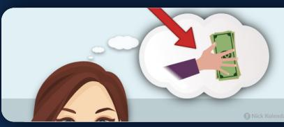

Simulation Fluency

The Decision Scale

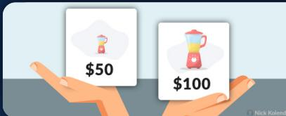

Relative Comparisons

## SIMULATION FLUENCY

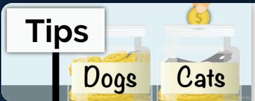

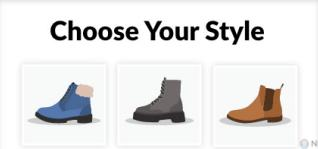

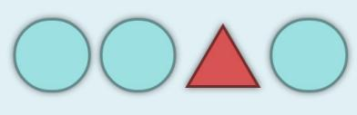

Gamify the Choice 12   
Activate a Which-to-Choose Mindset 14   
Prime the Choice Through Visual Design 16

Choice Psychology: A Guide for Marketers and Managers

Nick Kolenda / Kolenda Group LLC © 2015, 2021

www.NickKolenda.com

## DECISION SCALE

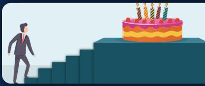

Guilt   
Reduce the Guilt of Emotional Choices 18   
We donate Offer Charity Incentives for Emotional Products 20   
to charity   
Extract Effort Before Emotional Choices 21   
Attributes   
Add More Attributes to Product Descriptions 22   
You deserve a treat   
Use Assertive Language for Emotional Products 23   
Isolate Emotional Options 24

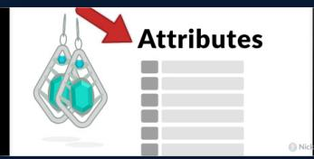

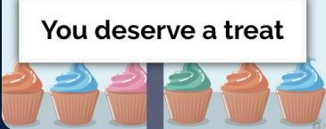

## RELATIVE COMPARISONS

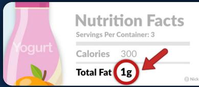

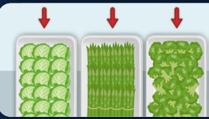

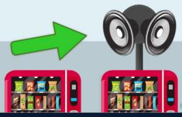

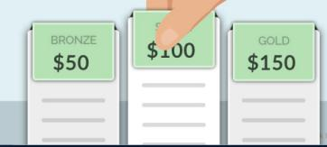

Show the Full Assortment of Options 27   
Raise Undesirable Attributes Above Zero 28   
Total Fat 1g   
↓ ↓ ↓   
Divide Important Attributes Into More Items 30   
Add Sensory Cues to Capture Attention 32   
  
\$100 \$110 Place Your Target Option in the Center 33   
INTERVIEW SCHEDULE   
Place Your Target Option First or Last 34   
THEM US   
> > >> Align Features With Competitors 35   
✓   
Trait 4 ×

## HOW WE DECIDE

## Simulation Fluency

You’re reading this guide.

…but why? How did you make this decision?

The answer: Simulation fluency.

Before clicking this guide, you imagined reading it. Your brain used this mental imagery to gauge your desire. Did it feel good? Then you clicked this guide.

In every decision, you simulate two events:

Outcome: What happened after making this decision?

• Process: What steps are required?

Those are the benefits and costs, respectively.

Next, you subtract these emotions to calculate the “net” value of the decision.

For example, should you buy a new suit? In order to make this decision, you simulate the positive outcomes (e.g., looking good, getting hired). Then you simulate the costs (e.g., spending money, spending time to find a suit). Finally, you subtract these two simulations for a surplus or deficit.

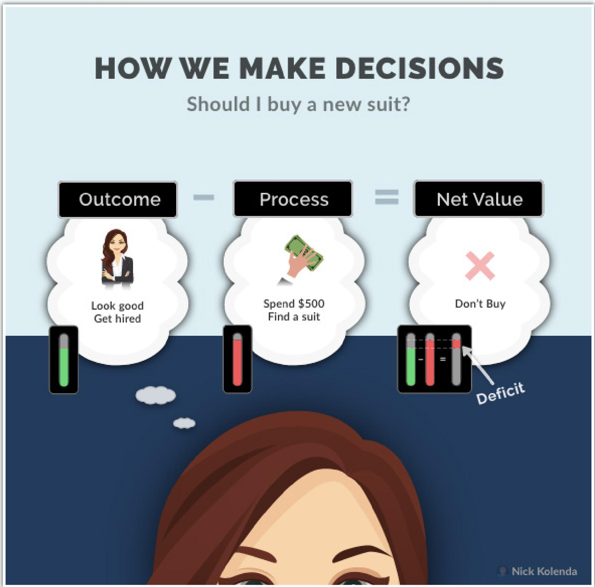

You reject this decision if your negative emotions are stronger than positive emotions. Or, more likely, you search for a cheaper alternative. Then you run this simulation again. How does it feel this time? Better?

You continue these simulations until you find a suitable option (catch the pun?) or reject the decision for now.

Every decision follows a similar sequence. Including your decision to read this guide.

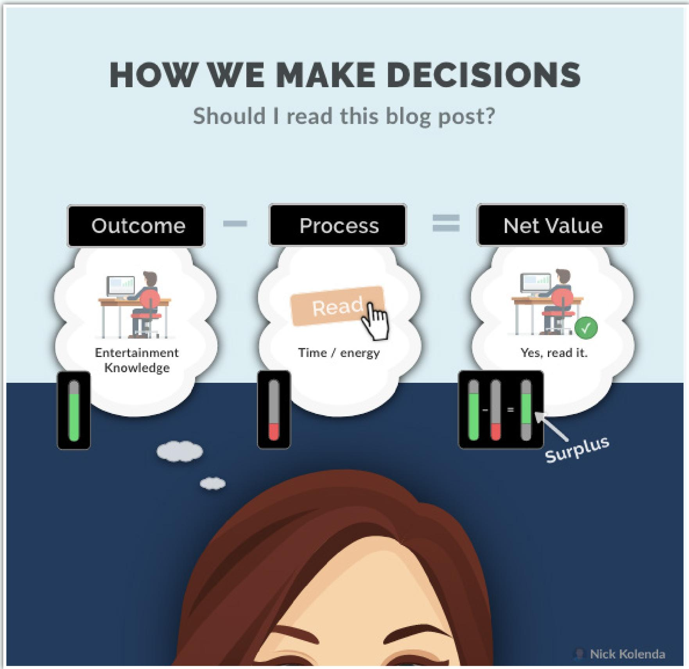

Retrace your steps. You are reading this guide because your simulation resulted in a surplus. Your positive emotions from the outcome (e.g., knowledge, entertainment) were stronger than the negative emotions of the process (e.g., spending time to read it, giving up other content).

See my book Imagine Reading This Book for more details.

## The Decision Scale

I categorized all behaviors by valence and agency.

I call it the equity scale or decision scale.

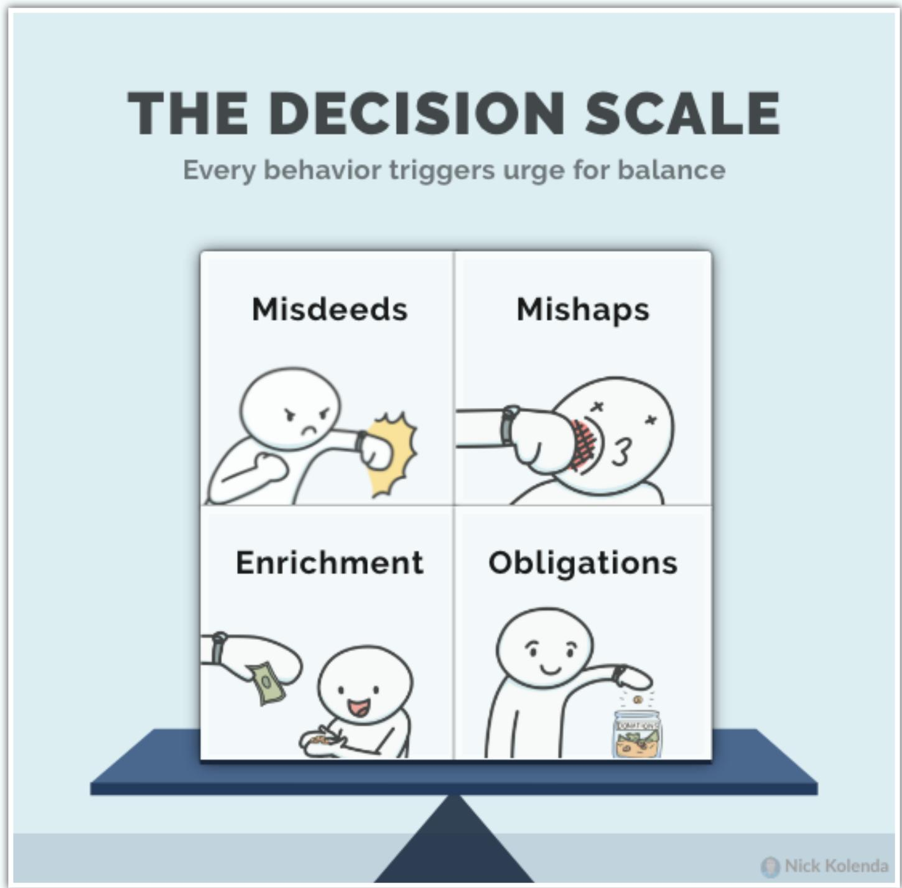

Basically, there are 4 behaviors:

1. Misdeeds—You do something bad

2. Mishaps—Something bad happens to you

3. Obligations—You do something good

4. Enrichment—Something good happens to you

Every behavior tilts the scale: Misdeeds and enrichment tilt leftward; mishaps and obligations tilt rightward. In both cases, you crave behaviors on the opposing side of the scale to regain balance.

This scale is ingrained into the criminal justice system. Someone who commits a misdeed (e.g., crime) will typically suffer a mishap (e.g., prison, monetary fine) or be required to perform an obligation (e.g., community service). The victim (who suffered a mishap) might receive enrichment (e.g., money) to rebalance their scale.

See my book The Tangled Mind for applications with morality. See my other book Imagine Reading This Book for applications with self-motivation.

This guide will focus on applications in marketing.

# Relative Comparisons

People evaluate options by comparing them to each other.

Consider two dictionaries:

• Dictionary A—10,000 entries. Like New.

• Dictionary B—20,000 entries. Good condition.

Customers offered a higher price for Dictionary A when it was the only option. However, when it was next to Dictionary B, they preferred Dictionary B (Hsee, 1996).

Evaluating options is hard. How many entries should a dictionary contain? 10,000? 20,000? Who knows. We need a comparison point.

Adjacent options become that comparison. In turn, we experience context effects—our choices are influenced by the composition of options, rather than the pure “rational” motive (Rooderkerk, Van Heerde, & Bijmolt, 2011).

For example, our choices are influenced by two effects:

## 1. Compromise Effect

People choose options in the middle of two extremes.

## 2. Attraction Effect

People choose options that are similar to another option, yet superior.

In the graphic below, the \$145 blender is called a decoy option. Marketers aren’t trying to sell this blender—they are displaying this blender to shift demand toward the \$150 blender. Humans might detect “vehicle” features thousands of years into the future,

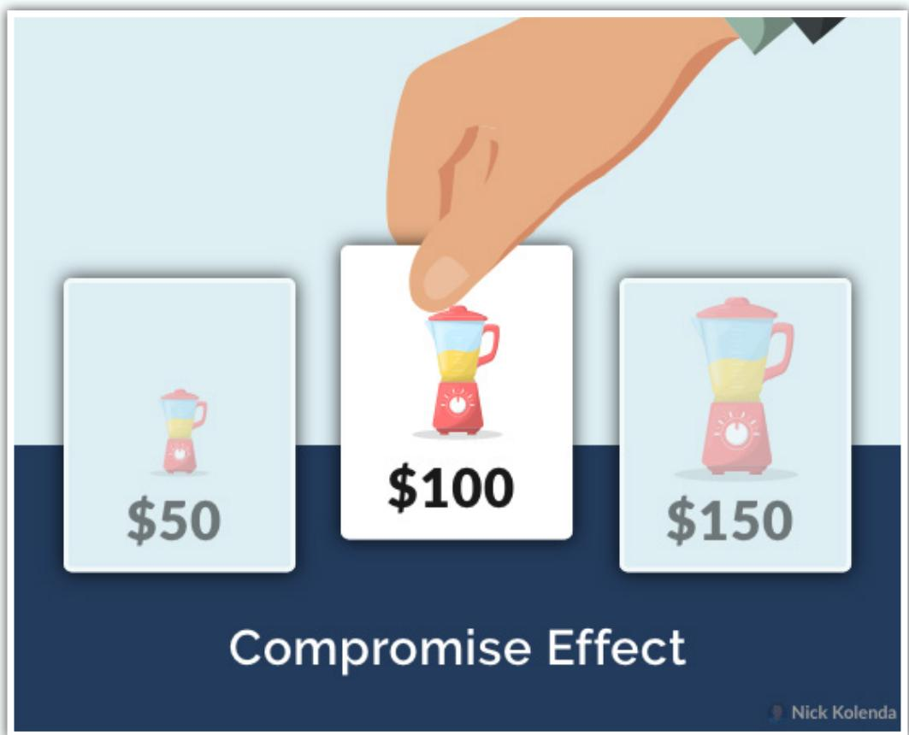

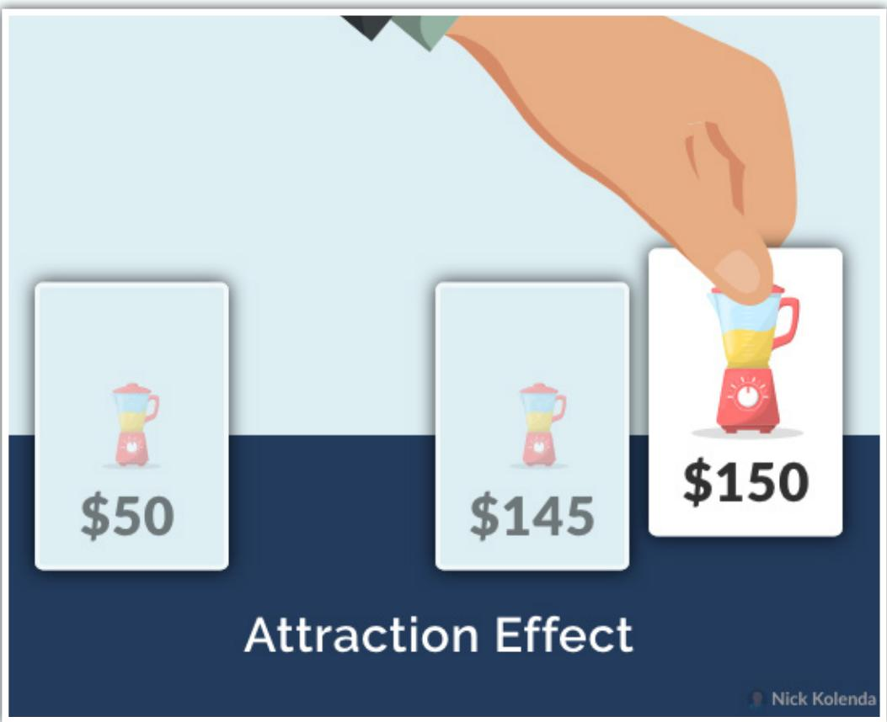

## SIMULATION FLUENCY

## Gamify the Choice

Choices can be two types:

Instrumental—Choosing to obtain something (e.g., groceries)

Experiential—Choosing for the experience (e.g., enjoyment)

Aim for experiential choices. These choices feel good, so people are more likely to simulate a pleasant decision (Choi & Fishbach, 2011).

How can you apply this effect?

Perhaps gamify your choice. In a café, patrons gave more tips if they could “vote” with their money (Rifkin, Du, & Berger, 2021). Researchers presented two jars, such as:

• Cats vs. Dogs

• Vanilla vs. Chocolate

• Mountains vs Beach

• James Bond vs. Michael Scarn

Those “dueling preferences” transformed a negative process (e.g., giving up money) into a positive process (e.g., self-expression).

…encouraging consumers to make choices for the sake of expressing their tastes is an effective strategy…giving consumers the opportunity to make such choices without the pressure of acting on them results in increasing the intention to act on those choices. (Choi & Fishbach, 2011, p. 553)

Or consider the navigation menu of your website or software. Most interfaces fixate on the instrumental nature of navigation—users choose options for the utilitarian purpose of navigation. Perhaps subtle words could reframe these choices as self-expression:

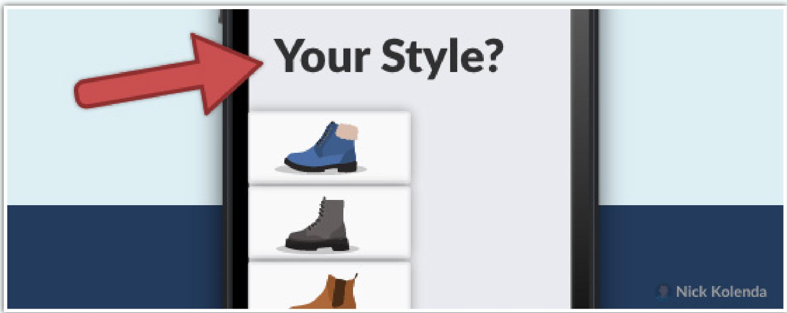

## Activate a Which-to-Choose Mindset

Which animal do you prefer?

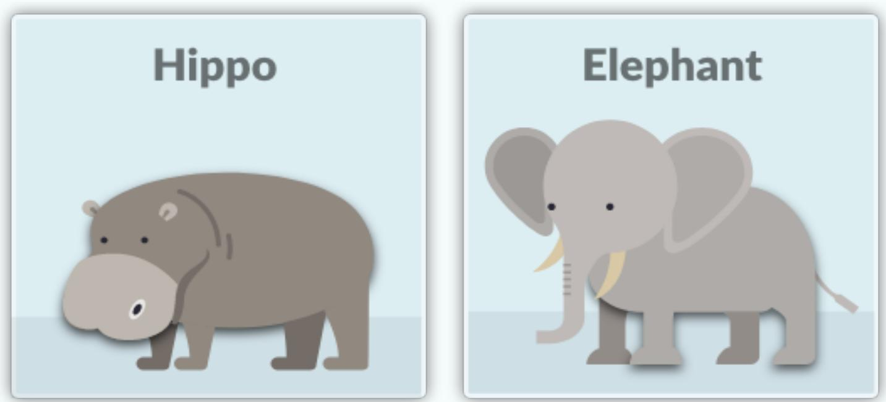

In one study, people who answered this question were more likely to buy a computer (Xu & Wyer, 2008). You can blame three stages of buying:

• Stage 1: Whether to buy

• Stage 2: Which to buy

• Stage 3: How to buy

Any choice (elephant vs. hippo) activates a “which-to-choose” mindset. If shoppers are browsing products, they might skip the first stage of “whether” to buy — and proceed immediately to the second stage of “which” to buy.

Stating a preference appears to induce a which-to-buy mindset, leading people to think about which of several products they would like to buy under the implicit assumption that they have already decided to buy one of them. (Xu & Wyer, 2007, p. 564)

When you’re a hammer, everything looks like a nail.

When you make a choice, everything looks choosable.

# Prime the Choice Through Visual Design

Graphic design can influence behavior.

One mechanism is semantic priming. In one study, people were more likely to choose distinctive products if they saw a distinctive pattern (i.e., OOOO□OO vs. OOOOOOO; Maimaran & Wheeler, 2008).

Your visual branding should match the abstract traits of your product. What type of product do you sell?

• Unique Product? Use designs that “pop” out.

Variety of Benefits? Use many colors, shapes, and sizes.

• Lightweight Product? Use lightweight colors.

Refer to my book The Tangled Mind for a full list of sensory metaphors.

## DECISION SCALE

## Reduce the Guilt of Emotional Choices

People feel guilty buying luxurious products. They want to indulge, but they need justification.

Why do they need justification? Because this purchase is a misdeed.

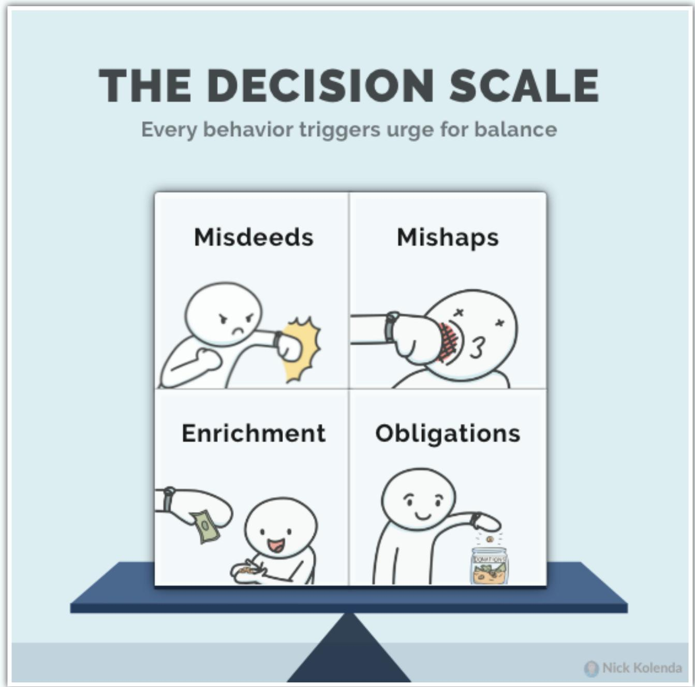

Customers need to balance their decision scale with obligations or mishaps. In other words:

They need to do something good.

• Something bad needs to happen to them.

This section has a list of applications.

# Offer Charity Incentives for Emotional Products

Charity incentives are more effective for emotional products (Strahilevitz & Myers, 1998).

Any donation is an “obligation” that balances a luxurious purchase—customers feels like they deserve a reward because of their good deed.

## Extract Effort Before Emotional Choices

Any feeling of work (or an “obligation”) can justify emotional purchases:

…higher required effort shifts consumer preference from necessity to luxury rewards, because higher efforts reduce the guilt that is often associated with choosing luxuries over necessities. (Kivetz & Simonson, 2002, p. 155)

Perhaps you can stock emotional products in the back of a store — this distant walk might provide justification.

Or add emotional rewards into loyalty programs. Customers will need to “work” to achieve them.

…a supermarket might offer \$50 in supermarket vouchers for consumers who spend a total of \$2,000, whereas consumers who spend \$20,000 would be given the option of earning a three-day trip to Las Vegas. (Kivetz & Simonson, 2002, p. 169)

Place rational rewards in bottom tiers and emotional rewards in higher tiers.

## Add More Attributes to Product Descriptions

Emotional products feel impractical. However, marketers can overcome this feeling by adding more attributes to product descriptions.

…some rental car websites (e.g., Avis.com) highlight only a few key features of each vehicle (e.g., category, passenger capacity), whereas others (e.g., Hertz.com) list dozens of attributes under each option (e.g., cargo room, gas mileage, safety and entertainment features; Sela & Berger, 2012, p. 942)

Even if your attributes are meaningless, the sheer number transforms the purchase from a misdeed into an obligation—a product that customers should be buying.

## Use Assertive Language for Emotional Products

Assertive language is more effective with emotional purchases (Kronrod, Grinstein, & Wathieu, 2012).

Customers use this language to justify the purchase—suddenly they are no longer choosing to indulge…someone is forcing them.

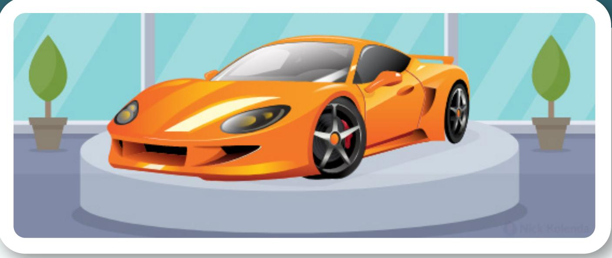

# Isolate Emotional Options

Emotional products sell more effectively when presented alone:

…potential car buyers may be more likely to buy a hedonic car such as the S2000 [convertible] when it is displayed on its own than when it is displayed next to, for example, the more utilitarian Pilot EX sportsutility vehicle. (Okada, 2005, p. 52)

Why? The presence of rational options can intensify the guilt of buying (Okada, 2005).

Perhaps you could offer a “Guilty Pleasures” category in your eCommerce store so that you remove all of the rational competitors.

Or perhaps you show items individually. These “sequential presentations” reduce intergroup comparisons:

…the absence of an explicit comparison in [a sequential presentation] makes it easier to create justifications for the hedonic alternative. (Okada, 2005, p. 45)

You can restrict the number of options, too. Large assortments feel overwhelming, so people choose a “justifiable” option. Dining out? Large menus nudge you toward a Caesar salad, while small menus nudge you toward pizza (see Sela, Berger, & Liu, 2009).

## Consider this nuance when choosing a distributor:

…manufacturers of healthy snacks would be better off pursuing venues with larger selections. Similarly, an award-winning (but nonentertaining) movie might be better off shown in a 21-screen multiplex theater rather than a small two-screen theater when rivaling shoot-’em-up action flicks. (Sela, Berger, & Liu, 2009, p. 950)

## \$50

## RELATIVE COMPARISONS

# Show the Full Assortment of Options

Never show items one at a time. Otherwise shoppers “hope” for a better option:

…choosers presented with their options simultaneously tend to remain focused on the current set of options, comparing them among each other; whereas choosers presented with their options sequentially tend to imagine a better option, hoping it will become available. (Mogilner, Shiv, & Iyengar, 2013, p. 1300)

## Sell jewelry?

Once you learn their preferences, bring out multiple options. And frame those options as the “best” options. You could show more options later, but you need to crush their hope for something better.

## Raise Undesirable Attributes Above Zero

Consider two brands of yogurt:

• Brand A: 5 grams of fat

• Brand B: 1 gram of fat

Customers know that Brand A has 5x more fat than Brand B.

However, replace B with C:

• Brand A: 5 grams of fat

• Brand C: 0 grams of fat

You can no longer compare these options because the difference is infinite. Instead, you evaluate 5 grams of fat in absolute terms — which is less meaningful:

…compared to zero, any number is infinitely larger, so this type of comparison becomes meaningless. In this case, consumers lose the reference point that allows them to use relative comparisons (Palmeira, 2011, p. 16)

Albeit counterintuitive, raising undesirable attributes above zero can increase the perceived value. It’s called the zero-comparison effect (Palmeira, 2011).

For example, people were more likely to choose a credit card when the interest rate increased from 0% to 1%:

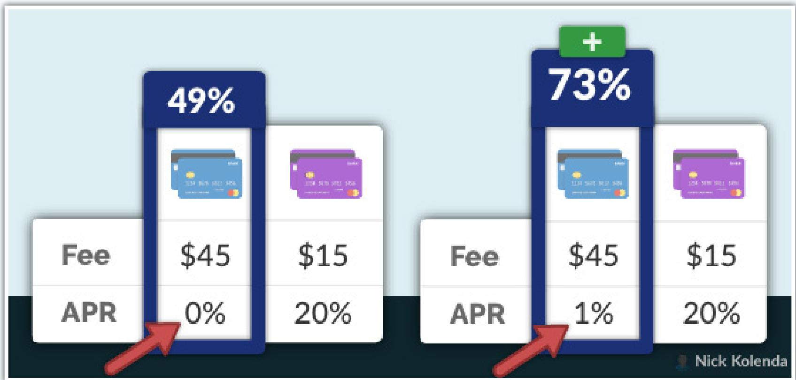

Likewise, be careful when desirable attributes are showing a small number— consider reducing them to zero. Even though this number is objectively worse, it hinders the relative comparison.

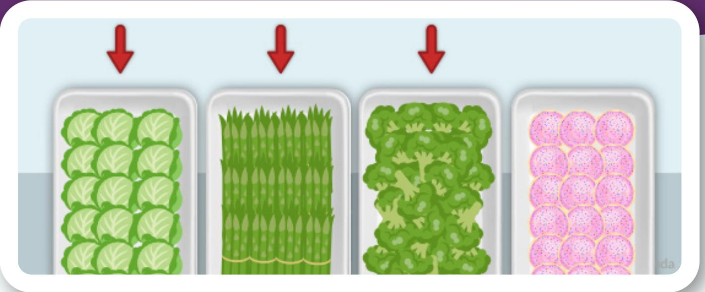

## Divide Important Attributes Into More Items

People distribute resources equally:

…[for] decision tasks in which people are called on to allocate a scarce resource (e.g., money, choices, belief) over a fixed set of possibilities (e.g., investment opportunities, consumption options, events)…they are biased toward even allocation. (Fox, Bardolet, & Lieb, 2005, p. 338)

## Investing \$10,000?

If your options are stocks and mutual funds, you are biased toward equal dispersion—\$5,000 in stocks, while \$5,000 in mutual funds.

But now, you see a third option: Treasury bonds. Your dispersion will be further diluted—\$3,333 in stocks; \$3,333 in mutual funds; \$3,333 in bonds.

The same effect occurs when pulling resources.

Suppose that you see two trays of food:

• Healthy

• Unhealthy

You are biased to pull an equal amount of food from each category.

But aha, we can influence this choice by partitioning the “healthy” category into multiple categories:

• Healthy—Vegetables

• Healthy—Fruit

• Unhealthy

The “healthy” category now comprises a larger percentage of the group.   
Less food will be chosen from the “unhealthy” category.

#

## Add Sensory Cues to Capture Attention

People are more likely to choose an option if they look at it longer. Therefore, distinguish your target option (e.g., color, size, shape).

In one study, people were more likely to choose a vending machine that was under a loudspeaker because the noise pushed their attention to the machine (Shen & Sengupta, 2014).

## Place Your Target Option in the Center

You’re more likely to choose an option from the center—it’s called the central gaze cascade effect (Atalay, Bodur, & Rasolofoarison, 2012).

Upon viewing options, your eyes are immediately drawn toward the center. But you still need to view the adjacent options, so you look left and right. During these eye movements, you need to repeatedly cross over the central options.

And those fixations trigger a feedback loop:

The more you look at an option, the more you like it.

The more you like an option, the more you look at it.

Marketers could place their target plans in the middle of an assortment. Or retailers could stock high ROI products on middle shelves — based on supermarket data, 71% of shoppers choose products from the middle two rows (Christenfeld, 1995).

## Place Your Target Option First or Last

Place your option in the center when customers view all options. However, place your item first or last when customers view options individually.

These positions — first and last — exert stronger effects on memory (see Miller & Campbell, 1959).

• First Position: Impacts long-term memory

• Last Position: Impacts working memory

Got a job interview? Schedule your interview based on the hiring timeline:

General Hiring. Schedule in early mornings (e.g., first interview of day). Your interview will be more memorable in the long-term.

Immediate Hiring. Schedule in late afternoons (e.g., last interview of day). Your interview will be in their working memory when they decide.

<table><tr><td></td><td>THEM</td><td>US</td><td></td></tr><tr><td>Trait 1</td><td></td><td></td><td></td></tr><tr><td>Trait 2</td><td></td><td></td><td></td></tr><tr><td>Trait 3</td><td>×</td><td></td><td></td></tr><tr><td>Trait </td><td>×</td><td></td><td>Nick Kolenda</td></tr></table>

## Align Features With Competitors

Which option would you choose:

Trip to Paris

Trip to Paris + \$1

You would choose Option B, right? But now, which option would you choose:

Trip to Rome

Trip to Paris + \$1

Tougher, right? Both trips — Paris vs. Rome — are so different that \$1 dollar is meaningless. Yet \$1 determined your decision when the two trips were identical.

Here’s the point: When customers believe that two options are similar, any advantage in one option (e.g., \$1) can dictate a major decision.

Follow this technique to influence people to choose your product over competing products. If they believe that your product is similar (yet superior) to competing products, they will gravitate toward your product.

## References

Atalay, A. S., Bodur, H. O., & Rasolofoarison, D. (2012). Shining in the center: Central gaze cascade effect on product choice. Journal of Consumer Research, 39(4), 848- 866.

Choi, J., & Fishbach, A. (2011). Choice as an end versus a means. Journal of Marketing Research, 48(3), 544-554.

Christenfeld, N. (1995). Choices from identical options. Psychological Science, 6(1), 50-55.

Fox, C. R., Bardolet, D., & Lieb, D. (2005). Partition dependence in decision analysis, resource allocation, and consumer choice. In Experimental business research (pp. 229- 251). Springer, Boston, MA.

Hsee, C. K. (1996). The evaluability hypothesis: An explanation for preference reversals between joint and separate evaluations of alternatives. Organizational behavior and human decision processes, 67(3), 247-257.

Kivetz, R., & Simonson, I. (2002). Earning the right to indulge: Effort as a determinant of customer preferences toward frequency program rewards. Journal of Marketing research, 39(2), 155-170.

Kronrod, A., Grinstein, A., & Wathieu, L. (2012). Go green! Should environmental messages be so assertive?. Journal of Marketing, 76(1), 95-102.

Maimaran, M., & Wheeler, S. C. (2008). Circles, squares, and choice: The effect of shape arrays on uniqueness and variety seeking. Journal of Marketing Research, 45(6), 731-740.

Miller, N., & Campbell, D. T. (1959). Recency and primacy in persuasion as a function of the timing of speeches and measurements. The Journal of Abnormal and Social Psychology, 59(1), 1.

Mogilner, C., Shiv, B., & Iyengar, S. S. (2013). Eternal quest for the best: Sequential (vs. simultaneous) option presentation undermines choice commitment. Journal of Consumer Research, 39(6), 1300-1312.

Okada, E. M. (2005). Justification effects on consumer choice of hedonic and utilitarian goods. Journal of marketing research, 42(1), 43-53.

Palmeira, M. M. (2011). The zero-comparison effect. Journal of Consumer Research, 38(1), 16-26.

Rifkin, J. R., Du, K. M., & Berger, J. (2021). Penny for your preferences: leveraging selfexpression to encourage small prosocial gifts. Journal of Marketing, 85(3), 204-219.

Rooderkerk, R. P., Van Heerde, H. J., & Bijmolt, T. H. (2011). Incorporating context effects into a choice model. Journal of Marketing Research, 48(4), 767-780.

Sela, A., & Berger, J. (2012). How attribute quantity influences option choice. Journal of Marketing Research, 49(6), 942-953.

Shen, H., & Sengupta, J. (2014). The crossmodal effect of attention on preferences: Facilitation versus impairment. Journal of Consumer Research, 40(5), 885-903.

Strahilevitz, M., & Myers, J. G. (1998). Donations to charity as purchase incentives: How well they work may depend on what you are trying to sell. Journal of consumer research, 24(4), 434-446.

Xu, A. J., & Wyer Jr, R. S. (2007). The effect of mind-sets on consumer decision strategies. Journal of Consumer Research, 34(4), 556-566.

Xu, A. J., & Wyer Jr, R. S. (2008). The comparative mind-set: From animal comparisons to increased purchase intentions. Psychological Science, 19(9), 859-864.

## Next Step...

You learned the science of choice.

But how do you apply this knowledge in a real-world context?

For this next step, view my courses on marketing:

www.NickKolenda.com/video-courses