NICK KOLENDA

## ND I 1U PSYCHOLOGY WHAT EACH COLOR MEANS CAND WHYJ

Color Psychology: What Each Color Means (and Why)

Nick Kolenda © Copyright 2015, 2022

www.NickKolenda.com

## COLOR MEANINGS

WWW.NICKKOLENDA.COM

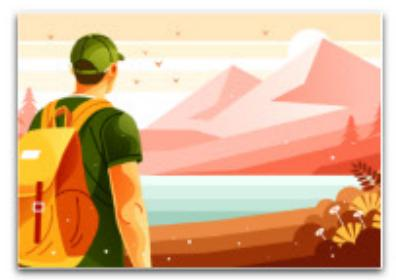  
RUGGED

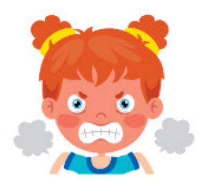  
AGGRESSIVE

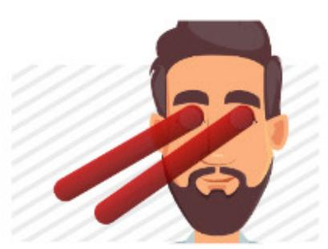  
ATTENTION

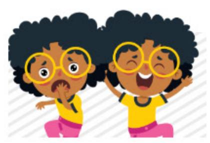  
STIMULATING

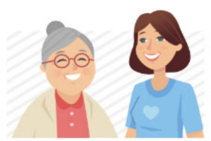  
SOCIAL

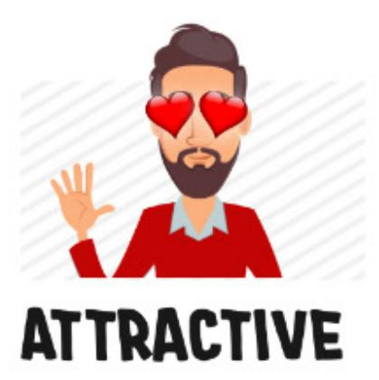

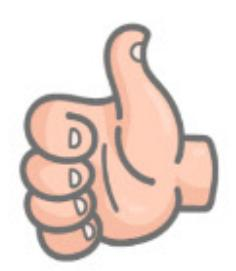  
CALM  
LIKING

  
LIGHT

  
CHEAP

  
ADD TO CART  
ACTION

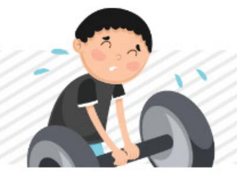

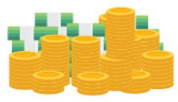  
HEAVY  
EXPENSIVE  
BLACK

  
DURATION

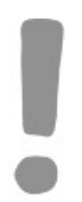  
IMPORTANT

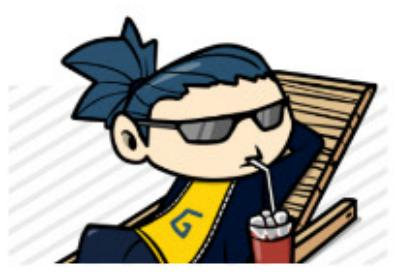

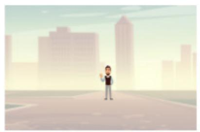

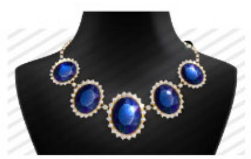  
DURABLE  
LUXURY  
FAR

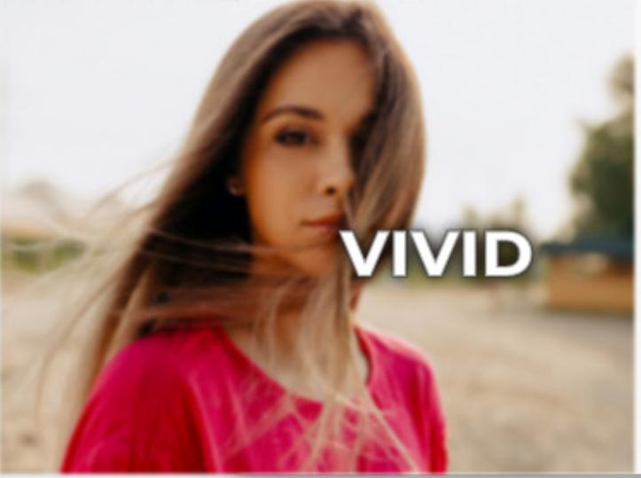

  
NEARBY  
CONVENIENT

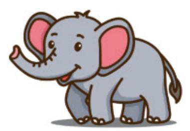  
LARGE

## Content ,

COLOR COMPONENTS 8   
COLOR PREFERENCES 9   
1. Evolution 10   
2. Ecological Valence Theory 11   
COLOR MEANINGS 13   
Weight   
Size   
Proximity 17   
Luxury 19   
Details 21   
Actionability   
Visibility   
Sociality   
Stimulating   
HOW TO CHOOSE COLORS 29   
1. Monochromatic Colors 30   
2. Analogous Colors 31   
3. Complementary Colors 32   
4. Split-Complementary Colors 33   
5. Triadic Colors 34   
6. Tetradic Colors 35

## Introduction

Color is everywhere.

So, a lot of research on color must exist, right?

Actually…no. Not really.

In Google Scholar, “color psychology” returned 2,480 studies.

Number of Studies

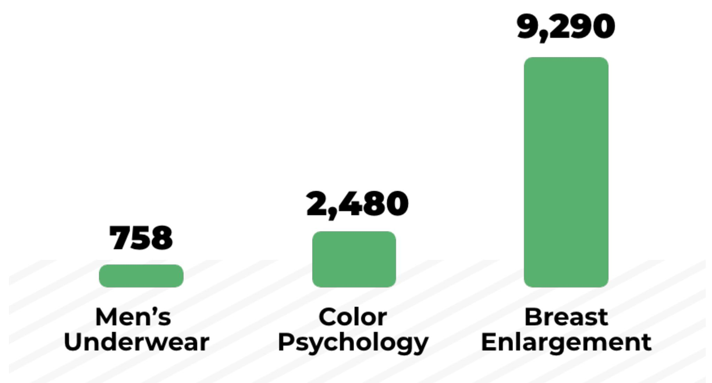

In this guide, I compiled the practical (and scientific) information about color theory. If you need to choose a color within the next 5 minutes, you can refer to the opening summary.

## Color Components

All of these colors are blue:

Yet those colors look different. Why is that? Because color has three components:

» Hue. Overall category (e.g., blue, red, yellow).

» Saturation. Vividness. Low saturation looks washed out.

» Value. Brightness. Shades are dark; tints are bright.

Most software will let you adjust each component.

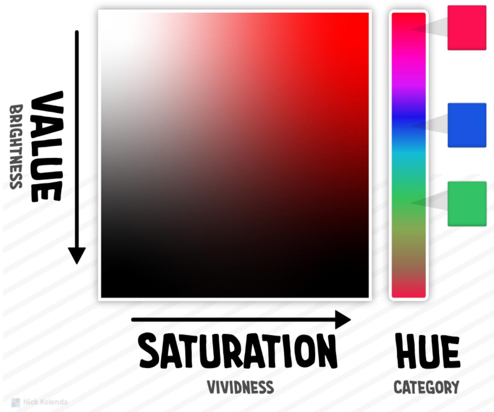

## Color Preferences

Your color preferences emerge from two sources: evolution and ecological valence theory.

## 1. Evolution

Over time, females developed a preference for reddish colors because of their ancestral duties in gathering food — which required them to identify warm colors on green foliage:

…the ability to discriminate red wavelengths may have a greater adaptive significance for foragers (i.e., females) than for resource protectors (i.e., males) and so contribute to contemporary visual biases. (Alexander, 2003, p. 11)

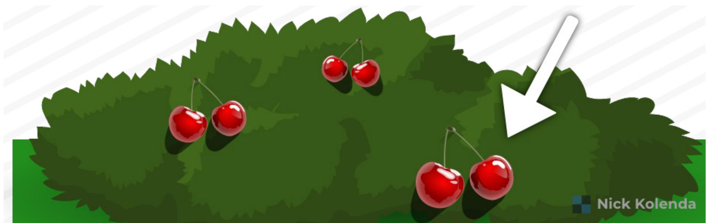

Color preferences can also emerge from a biological need (e.g., thirsty people prefer colors that appear glossy; Meert, Pandelaere, & Patrick, 2014).

## 2. Ecological Valence Theory

Your brain has a web of knowledge in which concepts are interconnected.

If you enjoy the beach, you might prefer blue because this color is connected to the ocean (and thus happiness).

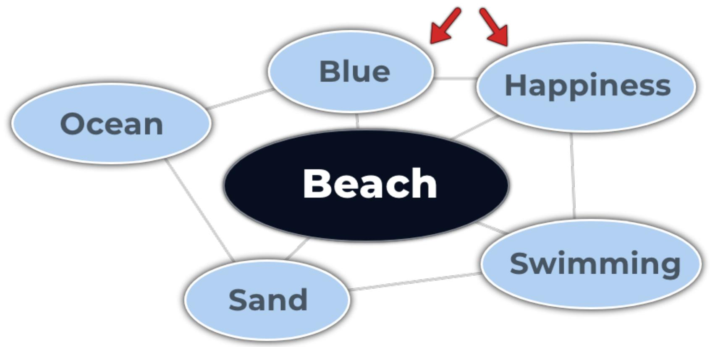

However, your preferences will change with new experiences. Get hit by a blue car? Suddenly blue is less appealing:

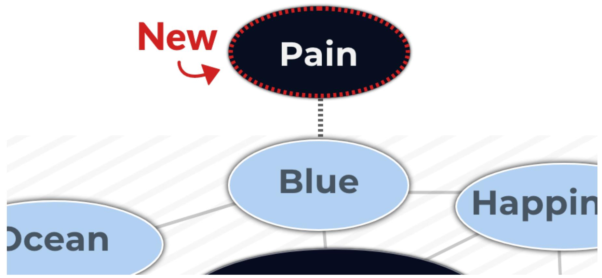

These associations can explain gender differences. Many parents reinforce a “typical” color for each gender. They give:

» …blue toys to boys

» …pink toys to girls

And voila: Boys prefer blue, while girls prefer pink.

Based on ecological valence theory, the entirety of your color preferences — from most favorite to least favorite — falls in direct accordance with your past experience:

The more enjoyment and positive affect an individual receives from experiences with objects of a given color, the more the person will tend to like that color. (Palmer & Schloss, 2010, p. 8878)

# Color Meanings

People assume that each color has a meaning:

» Blue means

» Brown means

» Yellow means

But it’s not that straightforward. Any meaning depends on past experience.

For example, custodians see yellow from urine. In their brain, yellow is connected to disgust. Seeing this color in any context can activate disgust.

Culture matters, too. Westerners love blue, yet this color is “evil” in East Asia (Schmitt, 1995).

So, is there any universal agreement? Can colors mean the same thing across the world? Short answer, yes.

A color will inherit universal meaning if — and only if — everyone sees this color in the same context. For example, certain colors (red, yellow, orange) are universally “warm” because every human feels warmth while viewing these colors in fire or the sun.

In this section, I propose other universal meanings.

## Weight

Dark colors look heavy:

Heaviness, in turn, can portray other ideas.

» Durability. Dark products look more durable (Hagtvedt, 2020).

» Density. Selling chocolate? Is it light and healthy? Or rich and filling? Use white and dark packaging, respectively.

» Pricing. Prices have abstract weight. You want them to seem light and small, so place them on white backgrounds.

» Importance. Heaviness implies importance. In one study, information seemed more important on a heavy clipboard (Ackerman, Nocera, & Bargh, 2010). Dark colors, which look heavy, can instill this perception; they “carry more weight.”

## DURABLE

DENSE

## EXPENSIVE

\$49

\$49

"FIVE STARS" —CUSTOMER

CHOOSE PlAN

CHOOSE PLAN

## IMPORTANT

\*\*\* "FIVE STARS" -CUSTOMER

## Size

Saturated colors seem larger.

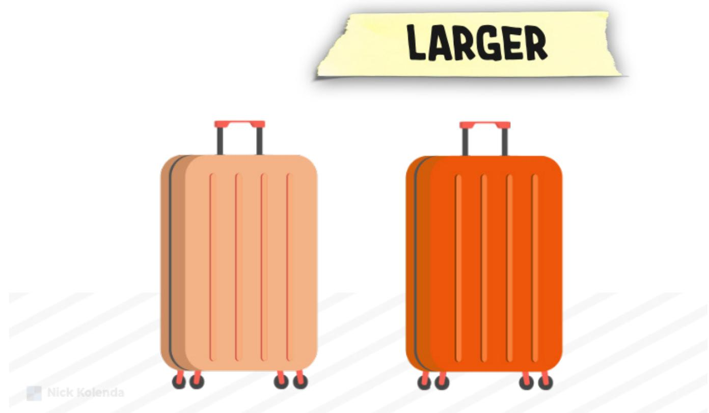

In one study, participants who wanted a large suitcase preferred a saturated orange. But people who wanted a small suitcase preferred a less saturated orange (Hagtvedt & Brasel, 2017).

Why? Think about it.

Saturated colors grab your attention. When you look at these objects, you know that something grabbed your attention. But you don’t necessarily blame the color.

Your brain will search for other reasons why you’re staring at this object. And, based on your experience, large objects grab more attention than small objects. So your brain assumes that this saturated object must be larger.

## Proximity

Saturated colors seem closer.

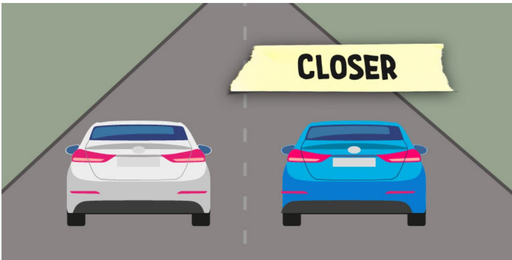

You devote more attention to nearby objects. Therefore, when a saturated color grabs your attention, you blame the proximity: Hmm, why am I looking at this object? It must be closer.

Interestingly, this effect also happens with time. Running a promotion? Choose a saturated color for the deadline:

CLOSER

## TOMORROW TOMORROW

This saturated deadline will grab attention. And, based on their experience, nearby objects typically grab attention. So they will perceive this deadline to be closer.

Researchers have confirmed that desaturated colors feel farther away in time. In one study, people colored a blank drawing of a party. If the party was happening in five years, they used more variations of grey because their mental imagery was less vivid and colorful (Lee, Fujita, Deng, & Unnava, 2017).

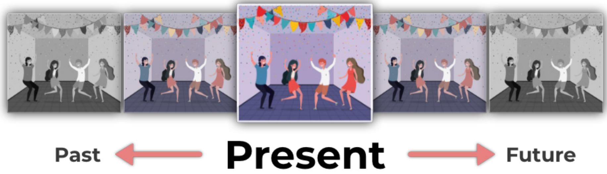

In another study, people viewed an ad for a fundraiser. If the event was occurring in the distant future, they donated more money when the imagery was in black-and-white (Lee, Fujita, Deng, & Unnava, 2017).

## Luxury

Many luxury brands advertise in grayscale:

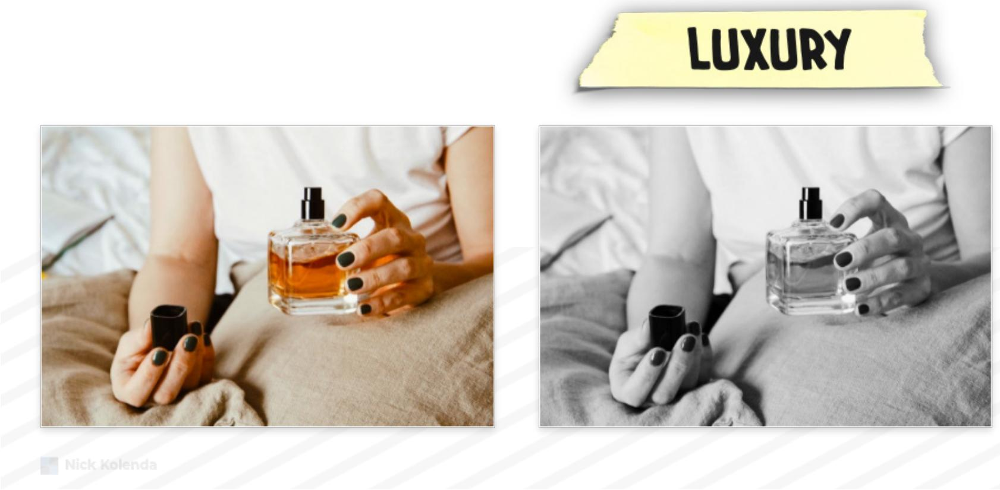

Luxury brands are aspirational. We desire them because they feel distant, as if we can’t possess them. In fact, ads for luxury brands perform better with greater distance between the product and the model (Chu, Chang, & Lee, 2021).

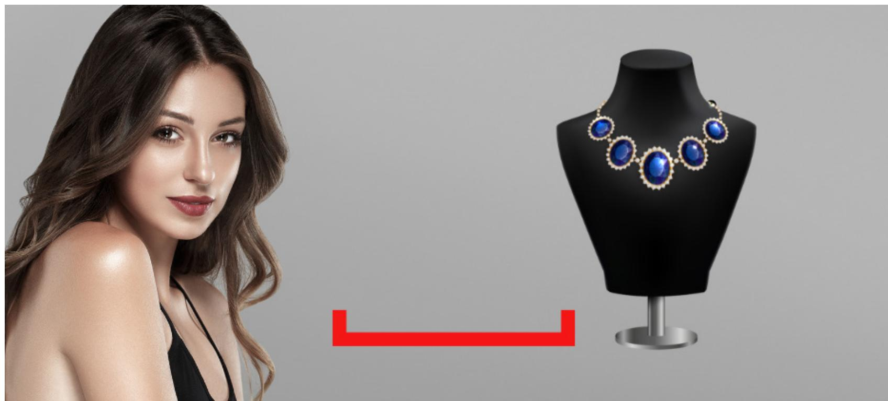  
And you also prefer luxury brands when standing farther away from them (Chu, Chang, & Lee, 2021).

Do you sell a luxury product? Reduce the saturation of colors in your designs. Desaturated colors — because they feel distant — will strengthen the perception of this brand.

## Details

Saturated colors feel closer to you, and this proximity orients your focus toward the details of these objects.

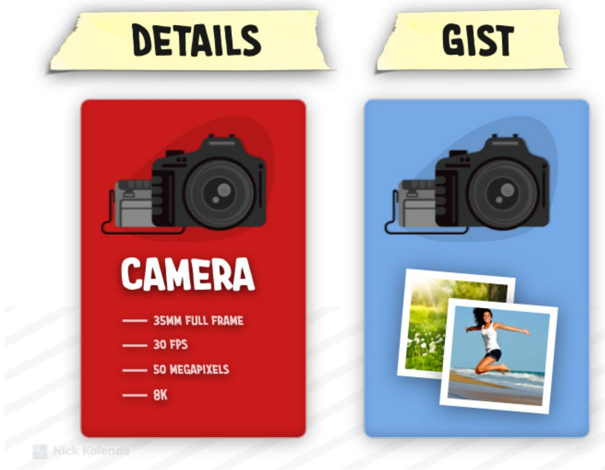

In one study, customers preferred red advertisements that described the details of a camera, but they preferred blue advertisements that described an overview (Mehta & Zhu, 2009).

Caveat: Avoid saturated colors when providing many details. When displaying a lot of text, reduce the saturation of colors so that your design feels less overwhelming (Meyers-Levy & Peracchio, 1995).

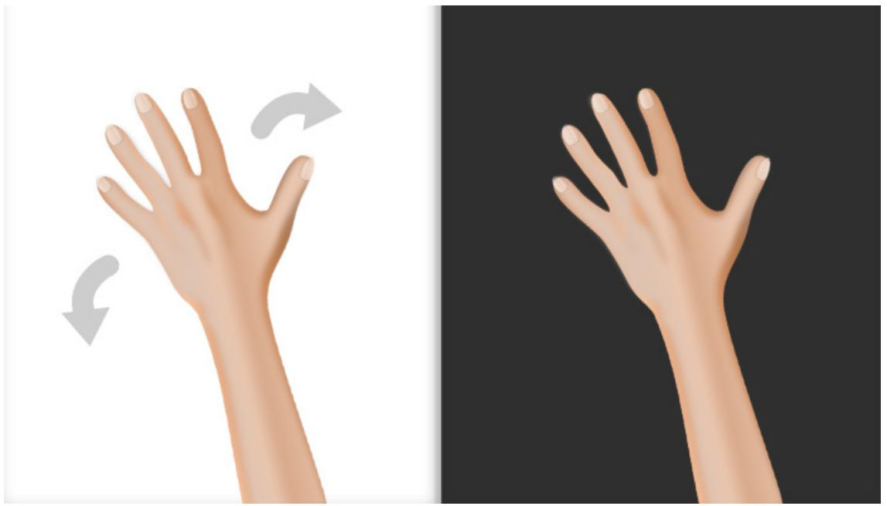

## Actionability

White is empty, so it facilitates movement.

Designing a website?

» White Interfaces. Ease the ability to act (e.g., sign up, buy)

» Dark Interfaces. Retain visitors. Since movements feel more difficult, exit actions (e.g., leaving) feel difficult too. Dark colors weigh them down.

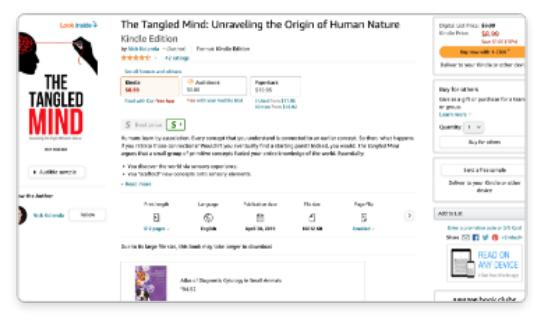  
AMAZON

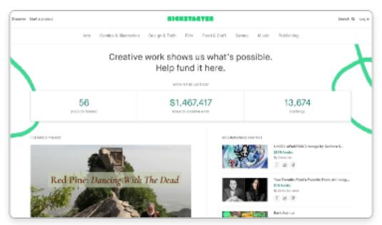  
KICKSTARTER

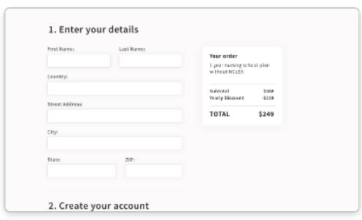  
CHECKOUT PAGES

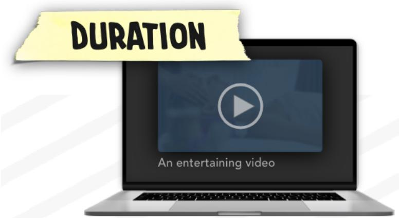

  
NETFLIX

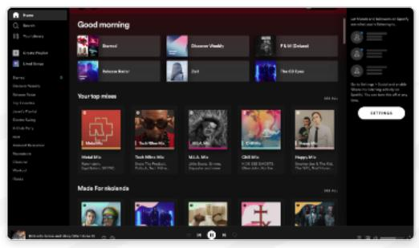  
SPOTIFY

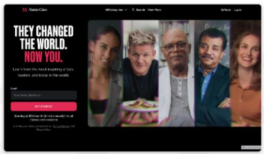  
MASTERCLASS

## Visibility

White and black resemble day and night, respectively.

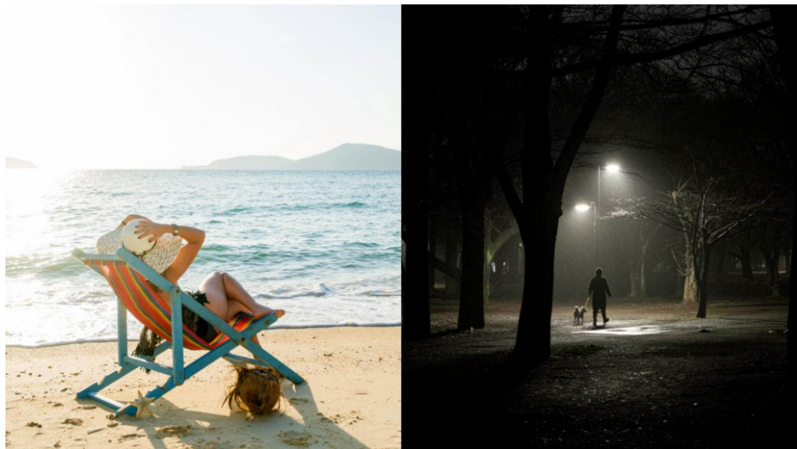

White promotes visibility, while black obscures it.

This visibility can influence our perception and behavior. When your behavior feels more visible, you perform “good” deeds. For example, people donate more money while standing near an image of eyes (Bateson, Nettle, & Roberts, 2006). Subconsciously, it feels like this donation will be seen by others.

In another study, people estimated the room to be brighter while reflecting on a past ethical deed because, subconsciously, a brighter room would help other people see this good deed (Banerjee, Chatterjee, & Sinha, 2012).

Conversely, restricting visibility (e.g., dark colors) can increase “bad” behaviors — e.g., sports teams with black uniforms get more penalties (Frank, & Gilovich, 1988). In a shroud of darkness, we perform “bad” behaviors because, subconsciously, it feels like nobody will see these actions.

Need to choose a color? Choose light colors for “good” behaviors and dark colors for “bad” behaviors:

» Donations. Charity websites should use a white background so that donations feel more visible.

» Software. New users might prefer a dark interface to hide their rookie mistakes.

» Adult Content. Visitors of an “adult” website might prefer a dark website to hide this behavior.

See my book The Tangled Mind for other examples.

## Sociality

Red strengthens attraction. In multiple studies, people in red shirts seem more attractive (Elliot & Niesta, 2008; see Pazda, Elliot, & Greitemeyer, 2012).

ATTRACTIVE

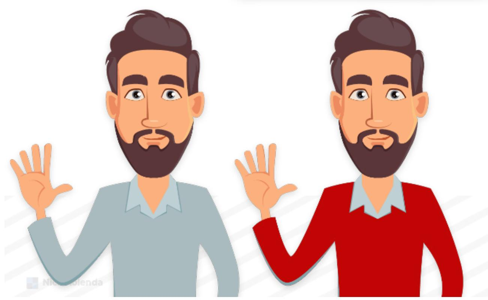

Some researchers offer an evolutionary explanation — for example, monkeys develop red swellings on their butts to attract mates (Dixson, 1983). Humans might have inherited a similar mechanism.

But here’s my take: We confuse physical warmth (e.g., red) with social warmth.

Researchers have confirmed that these two types of warmth — physical and social — share the same circuitry in our brain (Inagaki & Eisenberger, 2013).

As babies, we developed this circuitry when our parents held us:

…for an infant, the subjective experience of affection is typically correlated with the sensory experience of warmth, the warmth of being held…the associations are automatically built up between the two domains… children are then able to separate out the domains, but the cross-domain associations persist (Lakoff & Johnson, 1999, p. 46).

Today, if you seek social warmth, your brain unknowingly seeks physical warmth. Lonely people prefer warmer stimuli (e.g., showers, food) because this physical warmth feels like social warmth (Bargh, & Shalev, 2012; Zhong & Leonardelli, 2008).

People in red shirts seem more attractive because red seems physically warm. And your brain confuses this physical warmth for social warmth.

Therefore, red might be useful for social contexts (e.g., dating app, conference, social event).

## Stimulating

Warm and saturated colors are stimulating (Crowley, 1993).

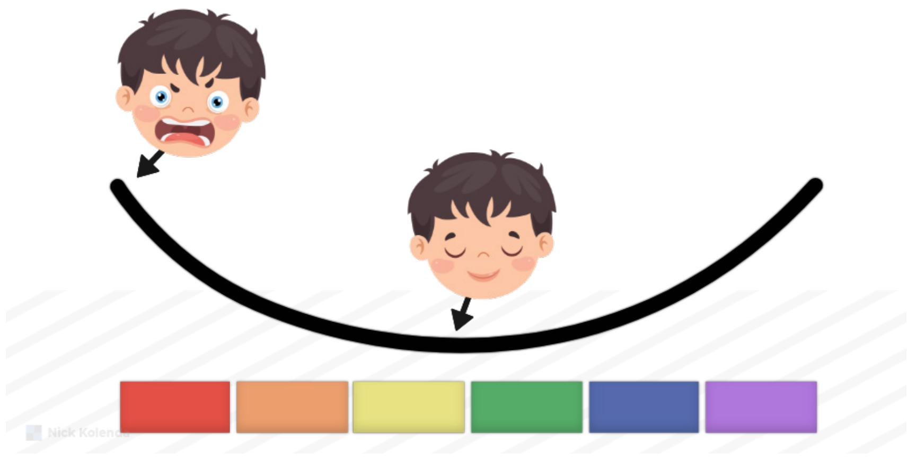

Blue is more effective for loading screens because users feel more relaxed (Gorn, Chattopadhyay, Sengupta, & Tripathi, 2004). Red or saturated colors will stimulate people, causing them to notice each second while waiting.

…the uniforms of the checkout employees might influence perceived ease and time spent during the transaction…a store like Target, with its almost overwhelming, saturated red atmosphere at the checkout area, may need to reconsider its interior color choices. (Labrecque, 2010, p. 30)

## IMPULSIVE

Arousal inhibits cortical functioning. People spend less time rationalizing or debating, and they act now (Walley & Weiden, 1973; Crowley, 1993).

Therefore, what’s your goal?

» Action? Use red.

» Liking? Use blue.

## AGGRESSIVE

Red increases aggression.

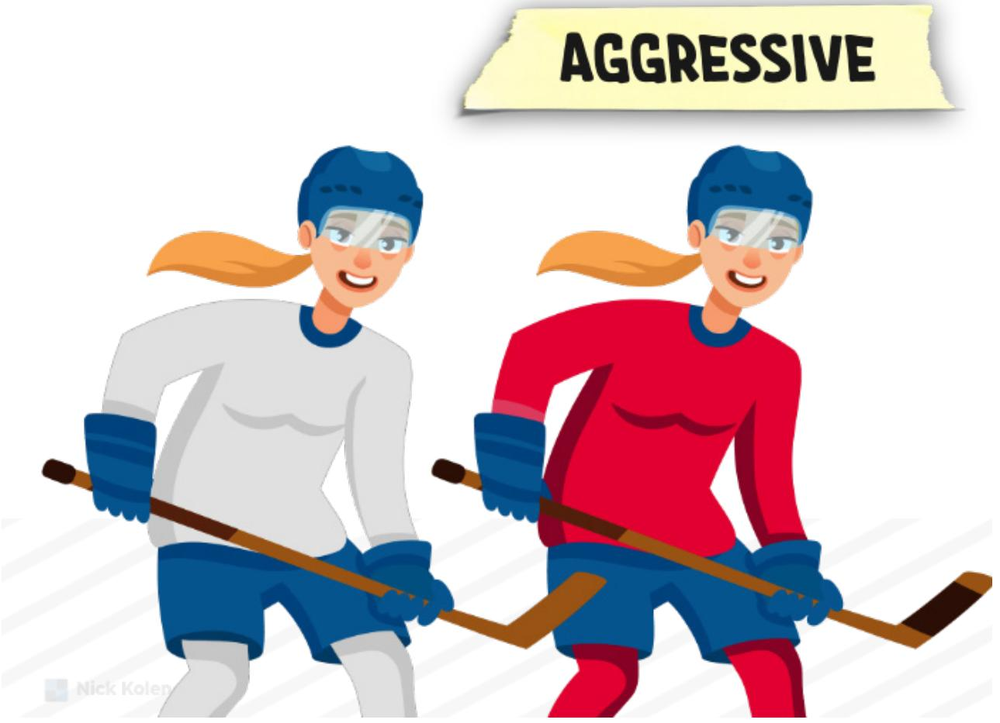

In competitions, players in red uniforms are more likely to win because (a) they behave more aggressively, and (b) opponents perceive them to be more dominant (Hagemann, Strauss, & Leißing, 2008; Elliot & Aarts, 2011).

Interestingly, eBay auctions with red backgrounds get higher bids because the bidders are more aggressive (Bagchi & Cheema, 2013).

Perhaps you should wear a blue shirt to your next salary negotiation.

## How to Choose Colors

The following color schemes can help you find colors that go well together.

## 1. Monochromatic Colors

Monochromatic schemes use the same hue, which can feel more coherent and united.

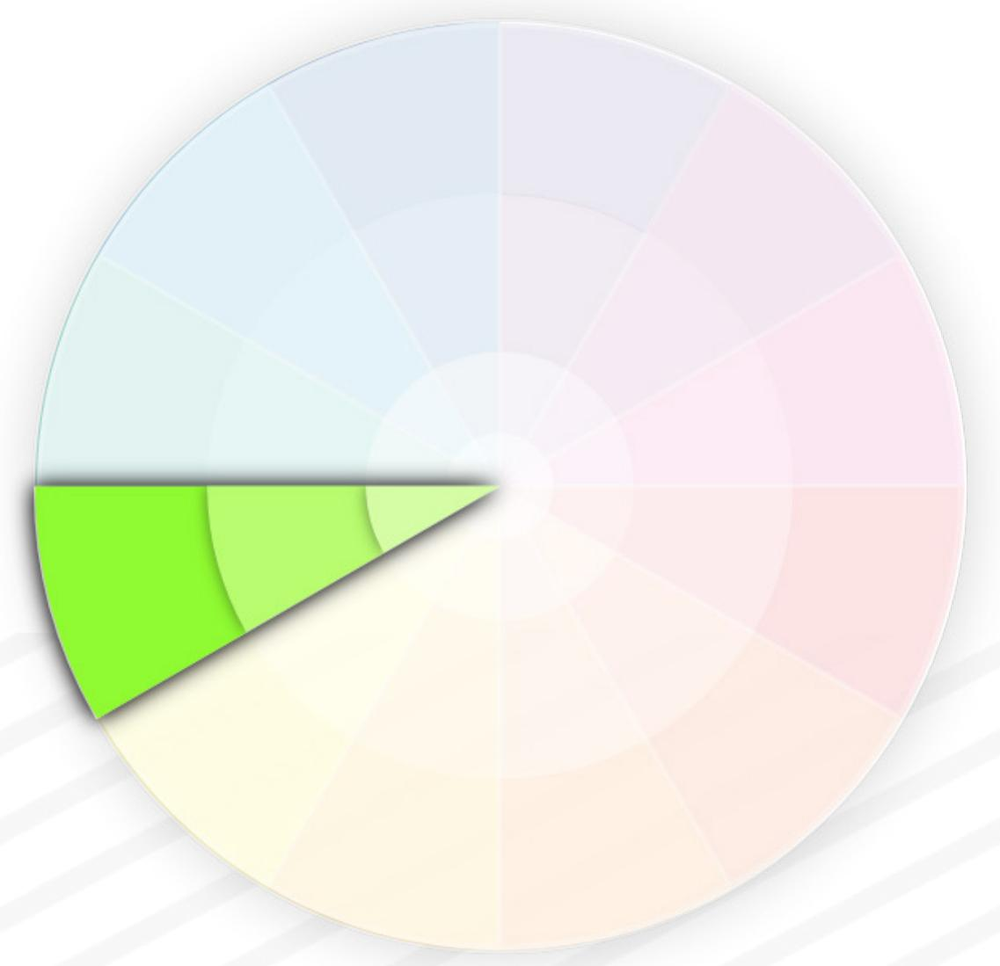

## MONOCHROMATIC

## 2. Analogous Colors

Analogous schemes use adjacent hues on the color wheel, which can feel united (with more flexibility in the variety of colors).

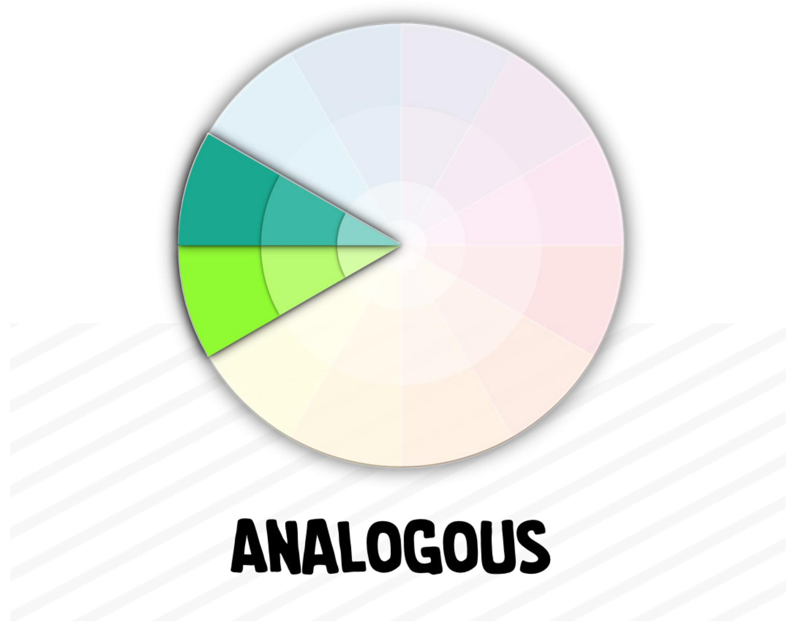

## 3. Complementary Colors

Complementary schemes use colors on opposing sides of the color wheel. These colors strengthen contrast — which can push attention toward an object in the foreground (e.g., call-to-action).

Contrast can also be aesthetically pleasing:

…warmer figures are preferred on cooler backgrounds, cooler figures are preferred on warmer backgrounds, and figures are generally preferred on backgrounds of contrasting lightness. (Schloss & Palmer, 2011, p. 568)

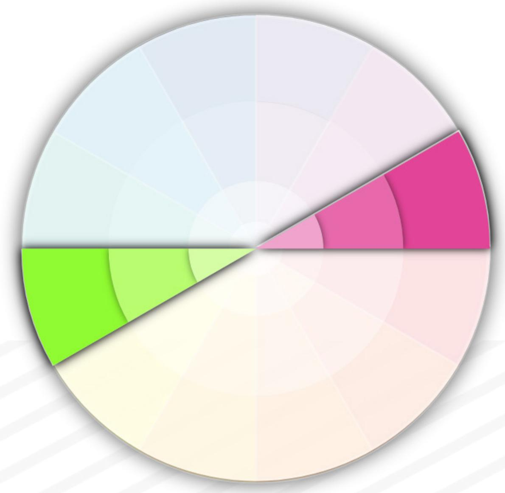

## COMPLEMENTARY

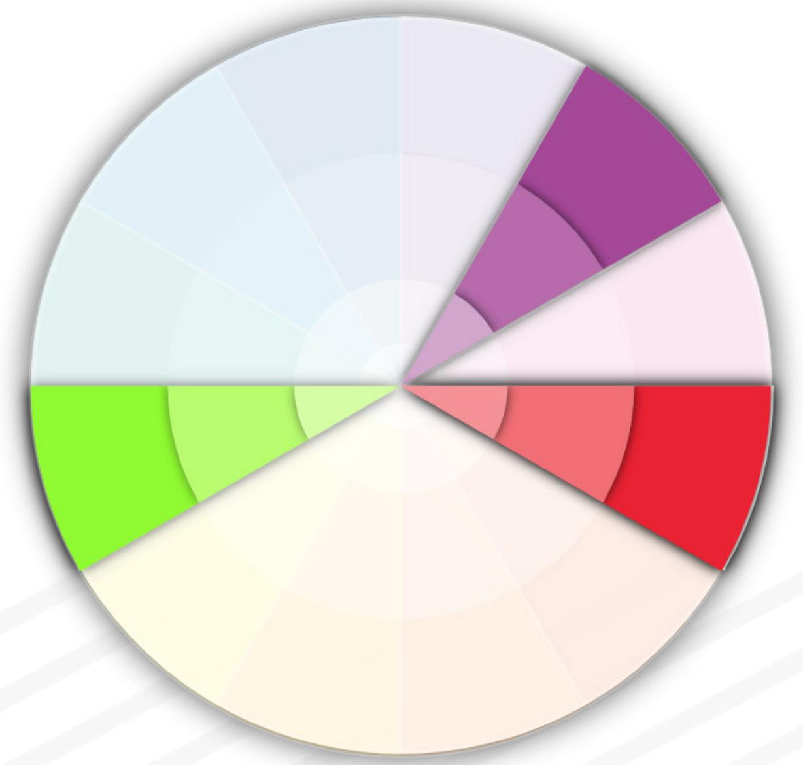

## 4. Split-Complementary Colors

Split-complementary schemes uses two colors on the opposite side of a color wheel (which are adjacent to the complementary color). These colors can soften the extreme contrast from a pure complementary scheme.

## SPLIT-COMPLEMENTARY

## 5. Triadic Colors

Triadic schemes use three colors situated at 120 degrees on the color wheel. These colors are a compromise between the simplicity of monochromatic schemes and the contrast of complementary schemes.

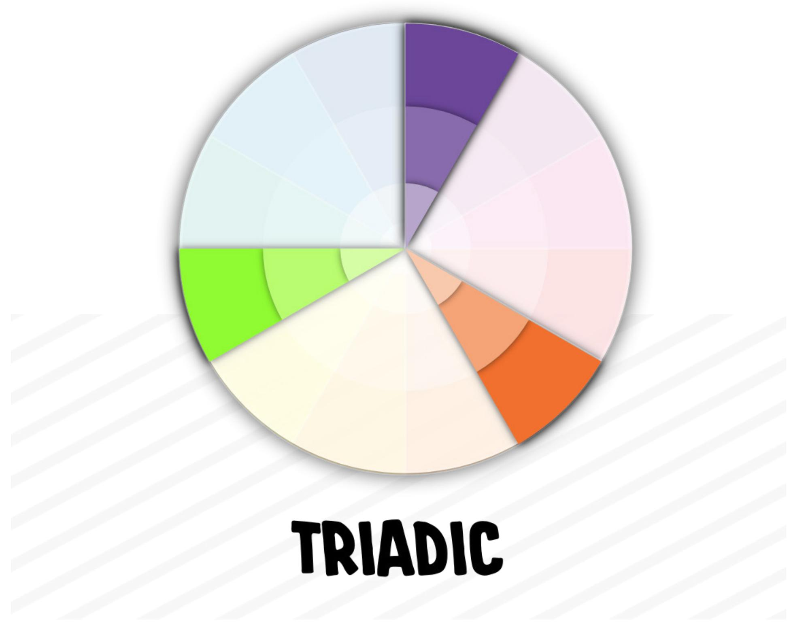

## 6. Tetradic Colors

Tetradic schemes form a rectangle on the color wheel. These colors communicate variety or complexity.

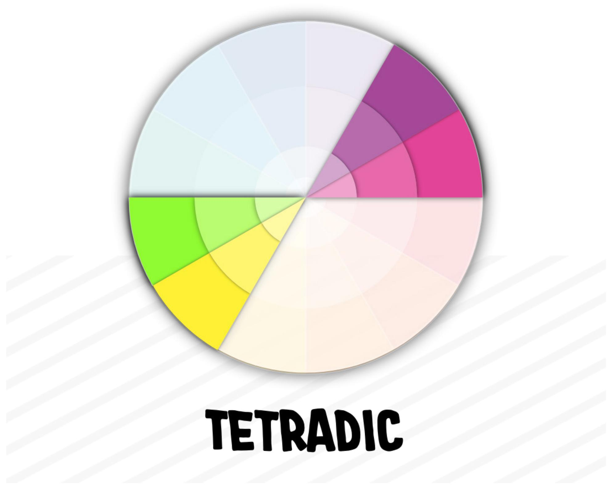

## References

Ackerman, J. M., Nocera, C. C., & Bargh, J. A. (2010). Incidental haptic sensations influence social judgments and decisions. Science, 328(5986), 1712-1715.

Alexander, G. M. (2003). An evolutionary perspective of sex-typed toy preferences: Pink, blue, and the brain. Archives of sexual behavior, 32(1), 7-14.

Bagchi, R., & Cheema, A. (2013). The effect of red background color on willingness-to-pay: the moderating role of selling mechanism. Journal of Consumer Research, 39(5), 947-960.

Banerjee, P., Chatterjee, P., & Sinha, J. (2012). Is it light or dark? Recalling moral behavior changes perception of brightness. Psychological Science, 23(4), 407-409.

Bargh, J. A., & Shalev, I. (2012). The substitutability of physical and social warmth in daily life. Emotion, 12(1), 154.

Bateson, M., Nettle, D., & Roberts, G. (2006). Cues of being watched enhance cooperation in a realworld setting. Biology letters, 2(3), 412-414.

Bhalla, M., & Proffitt, D. R. (1999). Visual–motor recalibration in geographical slant perception. Journal of experimental psychology: Human perception and performance, 25(4), 1076.

Crowley, A. E. (1993). The two-dimensional impact of color on shopping. Marketing letters, 4(1), 59- 69.

Dixson, A. F. (1983). Observations on the evolution and behavioral significance of “sexual skin” in female primates. Advances in the Study of Behavior, 13, 63-106.

Elliot, A. J., & Niesta, D. (2008). Romantic red: red enhances men’s attraction to women. Journal of personality and social psychology, 95(5), 1150.

Frank, M. G., & Gilovich, T. (1988). The dark side of self-and social perception: Black uniforms and aggression in professional sports. Journal of personality and social psychology, 54(1), 74.

Gorn, G. J., Chattopadhyay, A., Sengupta, J., & Tripathi, S. (2004). Waiting for the web: how screen color affects time perception. Journal of marketing research, 41(2), 215-225.

Hagtvedt, H. (2020). Dark is durable, light is user‐friendly: The impact of color lightness on two product attribute judgments. Psychology & Marketing, 37(7), 864-875.

Hagtvedt, H., & Brasel, S. A. (2017). Color saturation increases perceived product size. Journal of Consumer Research, 44(2), 396-413.

Hurlbert, A. C., & Ling, Y. (2007). Biological components of sex differences in color preference. Current biology, 17(16), R623-R625.

Inagaki, T. K., & Eisenberger, N. I. (2013). Shared neural mechanisms underlying social warmth and physical warmth. Psychological science, 24(11), 2272-2280.

Kimberly, B., & James R, P. (2009). Amber lenses to block blue light and improve sleep: a randomized trial. Chronobiology international, 26(8), 1602-1612.

Labrecque, L. I. (2010). The marketer’s prismatic palette: Essays on the importance of color in marketing with implications for brand personality.

Lakoff, G., & Johnson, M. (1999). Philosophy in the flesh: The embodied mind and its challenge to western thought (Vol. 640). New York: Basic books.

Lee, H., Fujita, K., Deng, X., & Unnava, H. R. (2017). The role of temporal distance on the color of future-directed imagery: A construal-level perspective. Journal of Consumer Research, 43(5), 707-725.

Lessard, D. A., Linkenauger, S. A., & Proffitt, D. R. (2009). Look before you leap: Jumping ability affects distance perception. Perception, 38(12), 1863-1866.

Meert, K., Pandelaere, M., & Patrick, V. M. (2014). Taking a shine to it: How the preference for glossy stems from an innate need for water. Journal of Consumer Psychology, 24(2), 195-206.

Mehta, R., & Zhu, R. J. (2009). Blue or red? Exploring the effect of color on cognitive task performances. Science, 323(5918), 1226-1229.

Meyers-Levy, J., & Peracchio, L. A. (1995). Understanding the effects of color: How the correspondence between available and required resources affects attitudes. Journal of consumer research, 22(2), 121-138.

Palmer, S. E., & Schloss, K. B. (2010). An ecological valence theory of human color preference. Proceedings of the National Academy of Sciences, 107(19), 8877-8882.

Pazda, A. D., Elliot, A. J., & Greitemeyer, T. (2012). Sexy red: Perceived sexual receptivity mediates the red-attraction relation in men viewing woman. Journal of Experimental Social Psychology, 48(3), 787-790.

Radeloff, D. J. (1990). Role of color in perception of attractiveness. Perceptual and Motor Skills, 71(1), 151-160.

Schloss, K. B., & Palmer, S. E. (2011). Aesthetic response to color combinations: preference, harmony, and similarity. Attention, Perception, & Psychophysics, 73(2), 551-571.

Schmitt, B. H. (1995). Language and visual imagery: Issues of corporate identity in East Asia. The Columbia Journal of World Business, 30(4), 28-36.

Sugovic, M., Turk, P., & Witt, J. K. (2016). Perceived distance and obesity: It’s what you weigh, not what you think. Acta psychologica, 165, 1-8.

Suk, H. J., & Irtel, H. (2010). Emotional response to color across media. Color Research & Application: Endorsed by Inter‐Society Color Council, The Colour Group (Great Britain), Canadian Society for Color, Color Science Association of Japan, Dutch Society for the Study of Color, The Swedish Colour Centre Foundation, Colour Society of Australia, Centre Français de la Couleur, 35(1), 64-77.

Walley, R. E., & Weiden, T. D. (1973). Lateral inhibition and cognitive masking: a neuropsychological theory of attention. Psychological review, 80(4), 284.

## Next Step

If you enjoyed this guide, you’d enjoy my other (free) guides on psychology and marketing.

www.NickKolenda.com