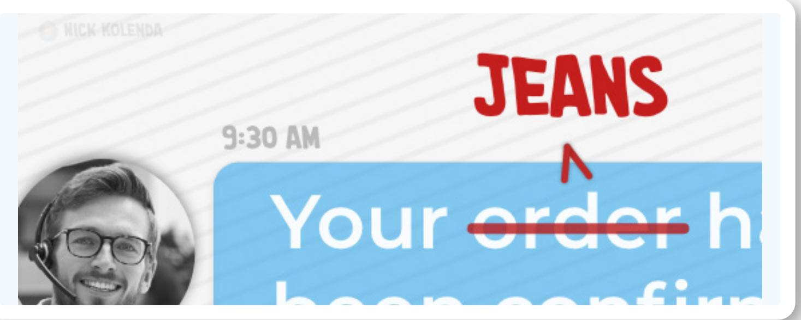
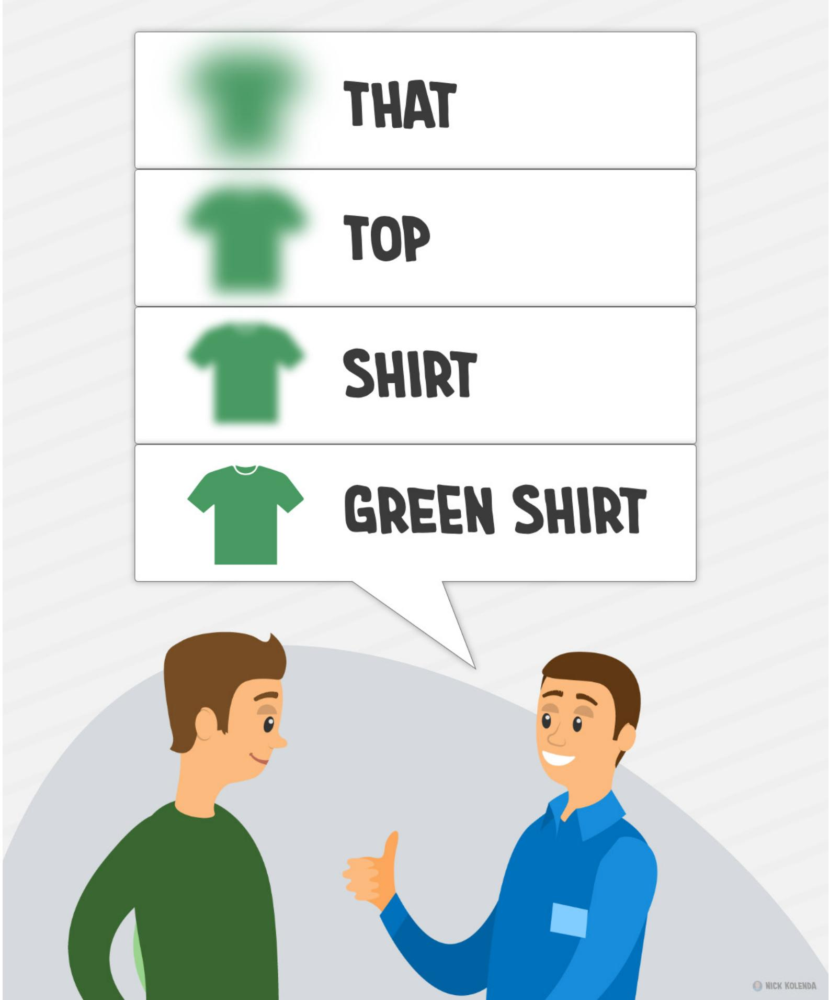
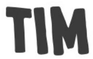
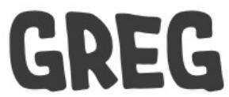
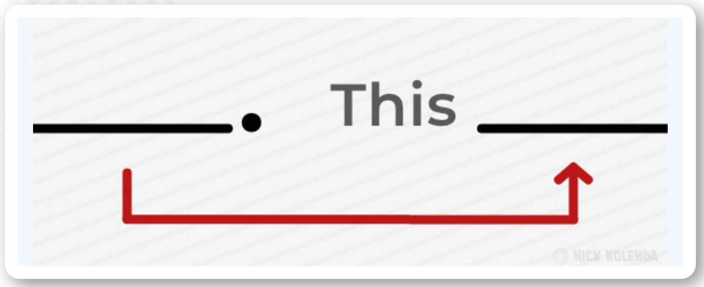
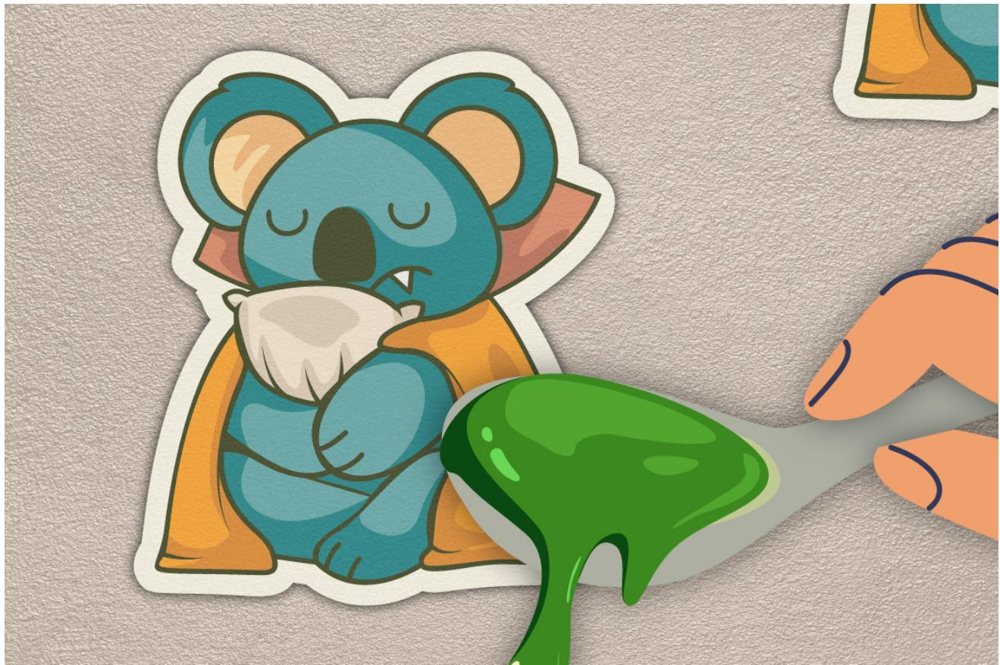
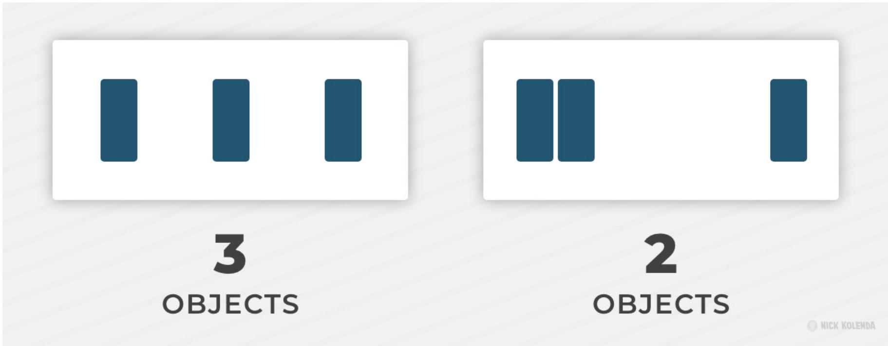
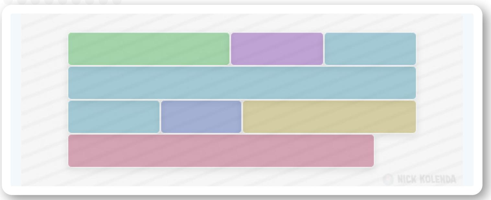
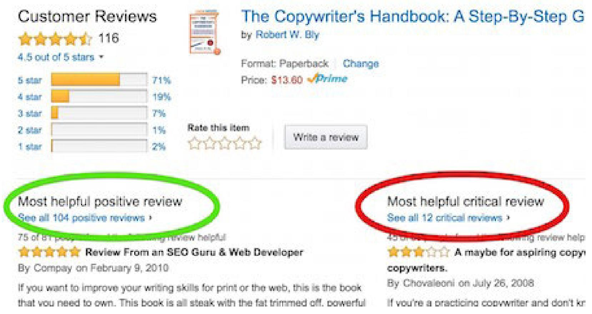

NICK KOLENDA

## COPY TING PSYCHOLOGY HOW TO WRITE PERSUASIVE SENTENCES

Copywriting Psychology: How to Write Persuasive Sentences

Nick Kolenda © Copyright 2015, 2022

More Free Guides:

www.NickKolenda.com

## Content .

VIVIDNESS   
Choose Words That Are Easy to Imagine 4   
Replace Vague Benefits With Concrete Examples 6   
Tailor Your Words to the Scenario 7   
Offer Relevant Applications of a Product 9   
Immerse Readers into the Hypothetical Behavior 10   
Depict Information With Positive Frames 12   
Distribute Semantically Related Words 14   
CONTINUITY   
Construct Sentences With Active Voice 17   
Bind Sentences With Connective Words 19   
End Sentences With a Concrete Image   
Begin Sentences With the Previous Object   
Constrain Your Writing to a Single Interpretation   
LINGUISTICS   
Symbolize the Message in Written Traits 26   
Adjust the Distance Between Words 28   
Sequence Words in Alphabetical Order   
Portray Actions With Imperfect Verbs   
Diversify Your Words, Syntax, and Emotions   
Alternate the Phonetic Flow of Words   
Delete Exclamation Marks 36

## FRAMING

Isolate Segments With Different Needs 39   
Emphasize Their Autonomy in the Decision 40   
Describe the Benefits Indirectly 41   
Mention Drawbacks of the Behavior 43   
Ask Rhetorical Questions 44   
Demonstrate an Impact on Other People 45

## Vividness Continuity Linguistics Framing

# 10-GRAMS PIECES

## Choose Words That Are Easy to Imagine

How do customers decide whether to buy products? They imagine the experience:

Hmm, do I want to buy this product?

\*imagines buying and using\*

Yeah, I would enjoy this product.

This simulation helps them gauge their desire. If they can’t imagine using your product, they can’t imagine the value they would receive from buying it (see my book Imagine Reading This Book).

Therefore, write concrete words that are easy to imagine. Describe cookies in terms of “bags” or “pieces” (rather than “ounces” or “grams”) to help people visualize this experience (Monnier & Thomas, 2022).

Or write concrete instructions:

» Vague: Sign up for an account

» Concrete: Create a username and password

You can apply this technique in your own life. Stop writing vague tasks in your calendar: What does ”study” mean? Study chemistry? Memorize notecards? Read a textbook?

Write a concrete task—Review past exams—so that you can visualize this behavior. If you can visualize the behavior, it will seem easier to do.

The takeaway: Scan your marketing materials…website…sales pages to replace vague words with concrete terms that are easy to imagine.

# Replace Vague Benefits With Concrete Examples

Vague benefits will harm your copy.

Don’t Say: quality, powerful, high-performance, fast, easy, reliable, durable, revolutionary, premier, best, excellent

Try visualizing those words.

You’re probably struggling because each word has different interpretations. The term “durable” can mean:

» Material: Is it strong material? How strong?

» Impact: Can it withstand damage? How much damage?

» Weight: Is it heavy and stable? How stable?

» Lifespan: Will the product last? How long?

Write concrete benefits that portray a single idea. Why is your software “easy” to use? Does it offer minimal features? Is the interface beautiful? Is the onboarding quick? Can you automate tasks? Can novices use it?

## Tailor Your Words to the Scenario

While chatting with customer support, you might hear: I can’t add a new product to your order. But you can cancel the current order, and then add a new item.

However, this specialist should customize these examples: I can’t add those jeans to your order. But you can cancel the shoes, and then add the jeans to your order.

Custom responses are more persuasive (Packard & Berger, 2021).

Or consider a clothing store. While a customer is trying a shirt, the salesperson could say:

» THAT looks great!

» That TOP looks great!

» That SHIRT looks great!

» That GREEN TEE-SHIRT looks great!

Each subsequent example instills a more concrete image.

Look for placeholder words in your copy, and replace them:

» Vague: This service can…

» Concrete: This website audit can…

# Offer Relevant Applications of a Product

Versatility can backfire.

Compare these two insurance plans:

» Death by terrorism

» Death by any reason

The second plan is economically better, but people preferred the first plan because they could imagine this scenario (Johnson, Hershey, Meszaros, & Kunreuther, 1993).

Selling food containers? Don’t force customers to think of applications. Replace “food” with concrete examples: soups, sauces, stews, meats, fruits, veggies.

Selling copywriting services? Don’t list broad services—landing pages, product descriptions, emails. These applications are insufficient because customers still need to think of examples. Mention types of emails: product launches, onboarding sequences, promotional discounts, newsletters.

# Immerse Readers into the Hypothetical Behavior

Read this sentence:

» If you win the lottery, what would you do?

You just read an IF-THEN statement. Even though the IF portion is hypothetical, winning the lottery now feels more realistic because you imagined this scenario.

Running a giveaway contest? Ask people what they would do if they won the prize or money. This imagery will entice them to participate because they will feel more likely to win.

But this technique can work in any scenario:

» If you [desired behavior], how would…

Examples:

» If you watch this course…

» If you work with our team…

» If you create an account…

if–then statements trigger a mental simulation process in which people suppose the antecedent (if statement) to be true and evaluate the consequent (then statement) in that context . . . evaluating a conditional will heighten belief in its antecedent more than in its consequent (Over et al., 2007, p. 2052).

# Depict Information With Positive Frames

Negative frames depict the absence of events. Our product:

» …doesn’t leak.

» …has no BPA.

» …won’t scratch your car.

Good intentions? Yes. Persuasive? No.

Negative frames are harmful because they depict the negative event (Jacoby, Nelson, & Hoyer, 1982). It resembles the phrase: Don’t think of a pink elephant. People read the previous sentence by imagining a pink elephant.

Therefore, write sentences that depict pleasant events.

» Negative: Our cream won’t hurt your skin.

» Positive: Our cream is soft and gentle on your skin.

If you need to mention the absence of an unpleasant event, morph this word into a positive frame:

» Leak-proof

» BPA-free

» Scratch-free

“Doesn’t leak” generates an image of something leaking, but “leak-proof” generates an image of durable material.

# Distribute Semantically Related Words

Your brain is a web of knowledge. Activating one concept will activate concepts that are connected to it.

Read these words: DEEP, SALTY, FOAM

These ideas are related to SEA. While reading those words, you activated the concept of SEA because of “spreading activation” (Topolinski & Strack, 2008).

Apply this idea technique in your writing. In the previous sentence, I replaced “idea” with “technique” because this word has a stronger relationship with “apply.”

Fill your sentences with semantically related words so that every concept becomes more activated. Selling a coffee brewer? You could say:

» Bad: If you make coffee…

» Good: If you brew coffee…

Not only is “brew” more vivid, but it also relates to “coffee.” Reading “brew” activates the idea of “coffee” even before you reach this word. This syntax will be easier to read, more enjoyable, and more truthful (see Alter & Oppenheimer, 2009).

Vividness   
Continuity   
Linguistics   
Framing

# Construct Sentences With Active Voice

You typically see causes before effects.

And that’s why active sentences are better:

» Active: Tim hugged Greg.

» Passive: Greg was hugged by Tim.

Active sentences unfold seamlessly with each new word.

Passive sentences unfold in reverse—your brain needs a placeholder to represent the subject.

Passive voice can be helpful when you need to emphasize the object of a sentence. Otherwise, write active sentences.

  
ACTIVE VOICE

HUGGED

PASSIVE VOICE

  
GREG WAS HUGGED BY TIM

Likewise, begin sentences with something concrete. Avoid vague words:

» There are

» This is

Vague words are hazy and intangible, so they obscure the subject of a sentence.

# Bind Sentences With Connective Words

“Coherence markers” bind sentences together:

» Additive: and, or

» Temporal: then, next

» Adversative: but, though

» Causal: because, so

These words maintain a seamless flow of imagery. Without them, your sentences remain disconnected from each other.

Researchers compared two ads for Dove:

» No Markers: Your skin’s natural oils keep it silky and supple. As you age, it becomes less elastic and the production of oil slows down. Aging can cause dull, dehydrated skin.

» Coherence Markers: Your skin’s natural oils keep it silky and supple. But as you age, your skin becomes less elastic and the production of oil slows down. That is why aging can cause dull, dehydrated skin.

Readers preferred the second version (Kamalski, 2007).

Causal markers (because, so) are especially persuasive because they signal justification. Many people operate on autopilot—subconsciously, they look for words like “because” to determine whether a behavior is justified (Langer, Blank, & Chanowitz, 1978).

## End Sentences With a Concrete Image

You might be tempted to end sentences with prepositions:

» What time are you leaving at?

» What are you waiting for?

» Where did you come from?

Sure, those sentences are grammatically correct. But they’re ugly.

Left dangling at the end of a sentence, prepositions feel jarring because readers expect something to appear after them.

However, the reciprocal variation might be worse (e.g., at what time are you leaving). Instead, say:

» When are you leaving?

» Why are you waiting?

» Where were you?

Each sentence begins and ends with a concrete word.

# Begin Sentences With the Previous Object

Read these sentences:

The knife is in front of the pot. The glass is behind the dish. The pot is on the left of the glass.

Confusing, right? Each sentence requires a new image.

But if we swap the last two sentences:

The knife is in front of the pot. The pot is on the left of the glass. The glass is behind the dish.

Much better. A single narrative is unfolding across these sentences.

. . . subjects try to integrate each incoming sentence into a single coherent mental model (Ehrlich & Johnson-Laird, 1982, p. 296).

Ease readability by adjoining the end of a sentence with the beginning of the next sentence.

# Constrain Your Writing to a Single Interpretation

Read the bold portion from this description of a kitchen bundle:

From a microwave oven, coffee maker, mini refrigerator, serveware and utility cart to help you prepare and serve food to wall decals, rugs and letterboards to bring decorative flair to your space...

That bold portion translates into this image:

Arrange your words so that one—and only one—interpretation is possible. Otherwise, readers need to decipher the intended meaning, which slows their reading speed and obscures the message.

Vividness   
Continuity   
Linguistics   
Framing

# Symbolize the Message in Written Traits

Linguistic traits convey meaning.

For example, prices seem numerically larger if the font size is larger (Coulter & Coulter, 2005). You think: Hmm, something feels big, It must be the price.

Same with copywriting. Read this sentence from a coffee brewer:

The K-Mini® brewer is effortlessly simple to use - just add fresh water to the reservoir, pop in your favorite K-Cup® pod, press the brew button and enjoy fresh brewed, delicious coffee in minutes.

The message? Brewing coffee is simple. The problem? This sentence is long and complex. Much like prices, the size of your description will influence the perceived size of the task.

If you want to portray a process as quick and simple, you need a sentence that—itself—is quick and simple. Like this version:

The K-Mini® brewer is simple to use: Just add water, pop in your favorite pod, and press the brew button. Enjoy fresh brewed, delicious coffee in minutes.

Readers will conceptualize the bold portion as the steps. And this portion feels much shorter than the previous version.

Always match your linguistic traits with the intended meaning. Want to portray:

» Variety of unique features? Insert a variety of unique words (e.g., aroma, scent, fragrance).

» Consistent quality? Repeat a phrase (e.g., say “fresh coffee every time” in a few places).

» Fun experience? Insert words that are fun to say (e.g., hullabaloo, bamboozle, whippersnapper).

## Adjust the Distance Between Words

You group objects that are close together:

  
Same with words. While reading sentences, you don’t translate individual words into a mental image. You translate clusters of words.

In one study, “\$199” seemed more expensive near “high performance” because readers translated this cluster (\$199 and high) into a single image (Coulter & Coulter, 2005).

Always consider the distance between words.

» Customers find that the chair is comfortable.

» Customers find the chair comfortable.

The chair seems more comfortable in the second version because readers merge “chair” and “comfortable” into a single image. In the first version, these words are separated from each other, so they generate distinct images.

# Sequence Words in Alphabetical Order

Read this slogan:

» Bufferil eases pain

Subconsciously, this slogan feels pleasant because each word is positioned in alphabetical order (King & Auschaitrakul, 2020). Something just feels right, and you misattribute this feeling to the product.

# WAS ING

# Portray Actions With Imperfect Verbs

Compare these sentences:

» John painted houses.

» John was painting houses.

People who read “was painting” believe that John painted more houses (and spent more time painting; Matlock, 2011).

“Painted” depicts the completed job, whereas “was painting” depicts the ongoing work.

During a criminal trial, an attorney could say:

» The defendant pointed the gun.

» The defendant was pointing the gun.

If juries hear the second version, they’re more likely to convict because they can imagine the defendant pointing the gun.

# Diversify Your Words, Syntax, and Emotions

Humans crave variety.

Eating the same food—even if you enjoy it—will become repetitive and boring (Rolls, Rolls, Rowe, & Sweeney, 1981).

Same with writing. Readers lose interest if they encounter the same linguistic traits, so inject variety:

» Words. Readers prefer a mixture of words (Hosman, 2002).

» Lengths. Let’s write short sentences. Notice how the writing seems fine. Heck, it might seem engaging. But soon you’ll notice something. This writing is becoming repetitive. Your brain wants a change. It wants a long sentence. These short sentences are boring. So let’s read a long sentence. Notice how this long sentence feels refreshing and invigorating because of its lengthy prose— it feels like you’re breathing air for the first time during

this paragraph.

» Emotion. Researchers analyzed 4,000+ movies and 30,000+ articles, and they found that content is more successful when it shifts unpredictably between different emotions (Berger, Kim, & Meyer, 2021).

# Alternate the Phonetic Flow of Words

While reading, you experience inner speech: You speak the words inside your head.

Therefore, write with phonetic flow: If writing is hard to say— Red leather, yellow leather—it will be hard to read.

How can you write with phonetic flow? You should AVOID:

» Words with Similar Beginnings. People are slower to read a sentence like: The sparrow snatched the spider swiftly off the ceiling (McCutchen, Bell, France, & Perfetti, 1991). One patio set included the phrases “sling-style seating” and “space-saving storage”—which are examples to avoid.

» Words With Similar Endings. You should also avoid “sling seating” because these words repeat the same -ing ending. “Sling chairs” would be better.

» Similar Adjoiners. You should avoid “chairs sling” because these words share an “s” between them.

» Groups of Many Small Words. Avoid a headline like:

“Free you up to do the things you love.” It has a long string of small words.

## Delete Exclamation Marks

Your inner speech has vocal traits.

For example, you read slower or faster based on the author’s vocal traits (e.g., whether they speak slow or fast; Alexander & Nygaard, 2008).

Punctuation matters, too. Your inner speech is more emphatic while reading exclamation points, which can sound weird in mundane contexts:

## » I sat down!

It seems obvious, yet marketers insert exclamation marks into mundane contexts—Buy Now!—to trigger excitement.

Despite good intentions, this syntax will usually backfire because readers need to exclaim these trivial statements in their head, which—inevitably—feels weird. Visitors then mi-

sattribute this negative emotion to the decision: Hmm, something doesn’t feel right. It must be the product.

Avoid exclamation marks altogether. If you need an exclamation mark to trigger excitement, then your writing isn’t strong enough.

## Vividness Continuity Linguistics

Framing

# Isolate Segments With Different Needs

Customers buy kitchen appliances for different reasons: Some want functionality, others want aesthetics.

How can you solve this problem?

» Solution 1: Create different brands for each segment.

» Solution 2: Push segments toward different versions of your copy.

Do you sell presentation software?

On your website, you could create a separate page for each segment (e.g., teachers, managers, speakers, students) so that everyone arrives on a page that describes their exact needs. Despite multiple segments, your copy can still be laser-focused on specific individuals.

# ...BUT YOU ARE FREE...

## Emphasize Their Autonomy in the Decision

People are less likely to comply if they believe that you are trying to persuade them (Brehm, 1966).

Therefore, hide your persuasive motive by emphasizing their freedom to choose. In one study, people donated 4x more money after hearing the phrase: but you are free to accept or refuse (Guégen & Pascual, 2000).

# PRODUCT IS SAFE

## Describe the Benefits Indirectly

Compare these sentences:

» Tim was sitting in a soft chair.

» Tim sank endlessly in his soft chair.

Each sentence has a different meaning:

» Tim was sitting in a soft chair. This statement asserts that the chair is soft. In order to trust this statement, you need to trust the person saying these words. Skeptical readers might suspect the opposite: The chair is hard.

» Tim sank endlessly in his soft chair. This statement implies that the chair is soft. Here, the reciprocal version (Tim didn’t sink) is less harmful because skeptical readers still assume that the chair is soft.

Smart customers will always consider reciprocal versions of statements. Read this sentence:

» Our product is safe

Cautious buyers will consider the reciprocal intention—our product is unsafe—to protect themselves if the marketer is lying. Therefore, describe benefits indirectly to bypass these harmful reciprocals.

Communicate safety with certifications, endorsements, and indirect language so that readers infer your product is safe without relying on your assertion. With inferences, customers—themselves—become the source of information.

## Another example:

» Tide will clean your clothes really well. Customers think: Hmm, does it clean clothes well? Can I trust this person?

» The freshness of the outdoors. Now in liquid form. Customers think: Hmm, freshness of the outdoors? What does that mean? Must be brisk and refreshing.

In the second example, readers generate the meaning. And, naturally, they trust themselves more than marketers.

# Mention Drawbacks of the Behavior

Readers prefer “two-sided arguments” that describe the benefits and drawbacks of a message (Rucker, Petty, & Brinol, 2008).

That’s why Amazon shows positive and negative reviews.

Readers feel more comfortable buying these products because the decision feels more cautious and informed.

# EVER FEEL ANXIOUS?

## Ask Rhetorical Questions

Do you ever use rhetorical questions – like this one? You should. Rhetorical questions are persuasive (Petty, Cacioppo, & Heesacker, 1981).

Why? Because they generate an implicit response:

Rhetorical questions tend to invite a response from the message recipient, over or otherwise…[This] may increase the certainty of one’s attitudes through an implicit response (Blankenship & Craig, 2006, p. 124)

Readers become more engaged, and they evaluate your message more carefully.

# PROTECT YOUR FAMILY

## Demonstrate an Impact on Other People

Consider two messages in a hospital bathroom:

» Hand hygiene prevents you from catching diseases.

» Hand hygiene prevents patients from catching diseases.

Staff were more likely to wash their hands after reading the second message (Grant & Hofmann, 2011).

People are optimistic. Even if your product will prevent something negative, people won’t expect this negative event to occur. Your product will seem unnecessary.

Does your product reduce the likelihood of car accidents? Nobody expects a car accident to happen, so they might feel unmotivated to buy it. Describe how this decision (or lack thereof) will impact other people. Suddenly readers are no longer gambling their own safety – they are gambling the safety of their family and loved ones.

## References

Alexander, J. D., & Nygaard, L. C. (2008). Reading voices and hearing text: Talker-specific auditory imagery in reading. Journal of Experimental Psychology: Human Perception and Performance, 34(2), 446.

Alter, A. L., & Oppenheimer, D. M. (2009). Uniting the tribes of fluency to form a metacognitive nation. Personality and social psychology review, 13(3), 219-235.

Berger, J., Kim, Y. D., & Meyer, R. (2021). What makes content engaging? How emotional dynamics shape success. Journal of Consumer Research, 48(2), 235-250.

Blankenship, K. L., & Craig, T. Y. (2006). Rhetorical question use and resistance to persuasion: An attitude strength analysis. Journal of language and social psychology, 25(2), 111-128.

Brehm, J. W. (1966). A theory of psychological reactance.

Collins, A. M., & Loftus, E. F. (1975). A spreading-activation theory of semantic processing. Psychological review, 82(6), 407.

Coulter, K. S., & Coulter, R. A. (2005). Size does matter: The effects of magnitude representation congruency on price perceptions and purchase likelihood. Journal of Consumer Psychology, 15(1), 64-76.

Ehrlich, K., & Johnson-Laird, P. N. (1982). Spatial descriptions and referential continuity. Journal of verbal learning and verbal behavior, 21(3), 296-306.

Grant, A. M., & Hofmann, D. A. (2011). It’s not all about me: Motivating hand hygiene among health care professionals by focusing on patients. Psychological science, 22(12), 1494- 1499.

Gueguen, N., & Pascual, A. (2000). Evocation of freedom and compliance: The “but you are free of…” technique. Current research in social psychology, 5(18), 264-270.

Hadjichristidis, C., Handley, S. J., Sloman, S. A., Evans, J. S. B., Over, D. E., & Stevenson, R. J. (2007). Iffy beliefs: Conditional thinking and belief change. Memory & cognition, 35(8), 2052-2059.

Hosman, L. A. (2002). Language and persuasion. The persuasion handbook: Developments in theory and practice, 371-390.

Jacoby, J., Nelson, M. C., & Hoyer, W. D. (1982). Corrective advertising and affirmative disclosure statements: their potential for confusing and misleading the consumer. Journal of Marketing, 46(1), 61-72.

Johnson, E. J., Hershey, J., Meszaros, J., & Kunreuther, H. (1993). Framing, probability

distortions, and insurance decisions. Journal of risk and uncertainty, 7(1), 35-51.

Kamalski, J. (2007). Coherence Marking, Comprehension and Persuasion on the processing and representations of discourse (Doctoral dissertation, Netherlands Graduate School of Linguistics).

King, D., & Auschaitrakul, S. (2020). Symbolic sequence effects on consumers’ judgments of truth for brand claims. Journal of Consumer Psychology, 30(2), 304-313.

Langer, E. J., Blank, A., & Chanowitz, B. (1978). The mindlessness of ostensibly thoughtful action: The role of” placebic” information in interpersonal interaction. Journal of personality and social psychology, 36(6), 635.

Matlock, T. (2011). The conceptual motivation of aspect. Motivation in Grammar and the Lexicon, 27, 133.

McCutchen, D., Bell, L. C., France, I. M., & Perfetti, C. A. (1991). Phoneme-specific interference in reading: The tongue-twister effect revisited. Reading Research Quarterly, 87-103.

Monnier, A., & Thomas, M. (2022). Experiential and Analytical Price Evaluations: How Experiential Product Description Affects Prices. Journal of Consumer Research.

Packard, G., & Berger, J. (2021). How concrete language shapes customer satisfaction. Journal of Consumer Research, 47(5), 787-806.

Petty, R. E., Cacioppo, J. T., & Heesacker, M. (1981). Effects of rhetorical questions on persuasion: A cognitive response analysis. Journal of personality and social psychology, 40(3), 432.

Rolls, B. J., Rolls, E. T., Rowe, E. A., & Sweeney, K. (1981). Sensory specific satiety in man. Physiology & behavior, 27(1), 137-142.

Rucker, D. D., Petty, R. E., & Briñol, P. (2008). What’s in a frame anyway?: A meta-cognitive analysis of the impact of one versus two sided message framing on attitude certainty. Journal of Consumer Psychology, 18(2), 137-149.

Topolinski, S., & Strack, F. (2008). Where there’s a will—there’s no intuition. The unintentional basis of semantic coherence judgments. Journal of Memory and Language, 58(4), 1032- 1048.

## Next Step

If you enjoyed this guide, you’d enjoy my other (free) guides on psychology and marketing.

www.NickKolenda.com