# Herramientas para crear anuncios TOP en Facebook Ads

Con el objetivo de mejorar la experiencia para anunciantes y usuarios, los anuncios que se muestran en Facebook, Instagram y Audience Network están sujetos a un proceso de revisión, en el que se analiza cuánto ocupa el texto en las imágenes de los anuncios.

Por ello, si la imagen del anuncio contiene más de un 20% de texto, Facebook considera que es demasiado y va a limitar su alcance, o directamente no lo va a poner en circulación. Ten en cuenta que cuando se limita el alcance, el coste se dispara porque gastas lo mismo, impactando a una audiencia menor.

Para saber si una imagen cumple con este requisito, podemos contar con una herramienta denominada Social-Contests, a la que puedes acceder desde este enlace. Simplemente subes la imagen y te avisa si el nivel de texto es aceptable o no.

En Instagram Stories NO existe limitación para el texto de los anuncios.

Canva es probablemente la herramienta de diseño gráfico más utilizada para la creación de imágenes para anuncios, logos, flyers, infografías, etc.

Canva cuenta con una enorme “biblioteca” de plantilla, imágenes, logos, etc. adaptados al formato del contenido que quieras crear.

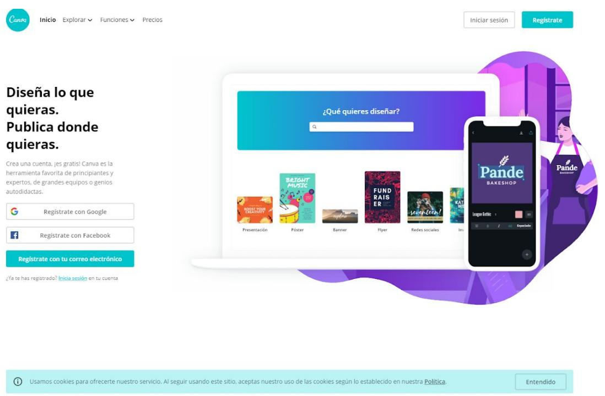

Se trata de una herramienta freemium, que cuenta con 3 planes: gratuito, Pro y Enterprise:

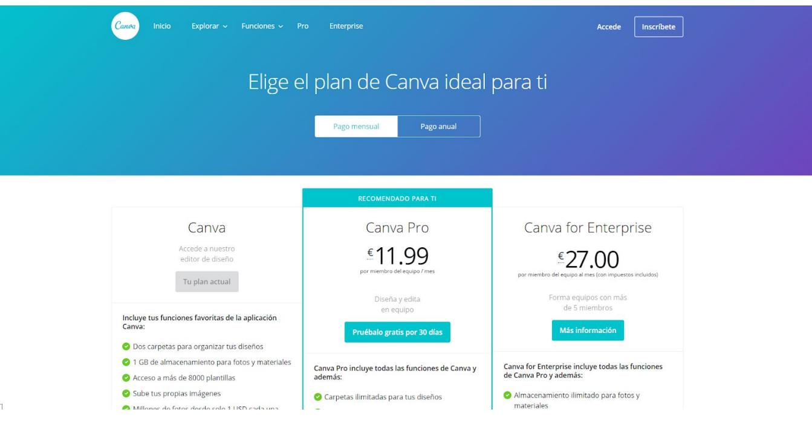

## 2. Crello

Crello es una de las principales alternativas a Canva, como herramienta online de diseño gráfico.

Las similitudes entre ambas herramientas son claras, si bien es cierto que Canva cuenta con un número superior de recursos (imágenes, elementos, etc.).

Por otro lado, la versión gratuita de Crello incorpora alguna funcionalidad que Canva no incluye, como la posibilidad de guardar imágenes PNG con fondo transparente, muy útil para crear logos.

Crello cuenta con un modelo freemium, con los siguientes planes. La diferencia es que, en la versión gratuita, los diseños se descargan con la etiqueta Crello (marca de agua).

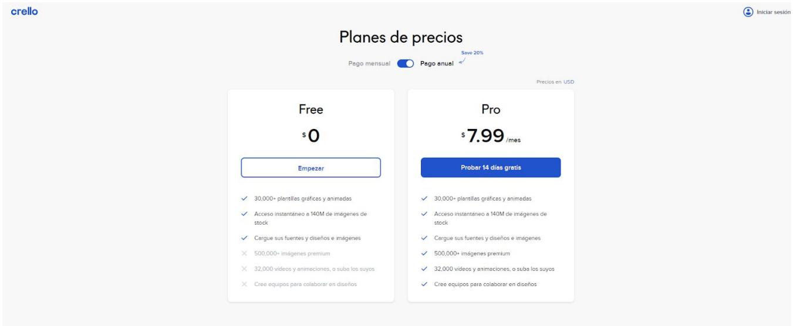  
Preguntas frecuentes

## 3. Snappa

Snappa es otra herramienta online de diseño, algo más sencilla que Canva y Crello. Cuenta también con un enorme banco de imágenes, templates, y recursos, aunque más limitado que Canva.

Snappa ofrece 3 planes. El gratuito limita a 3 el número de descargas mensuales:

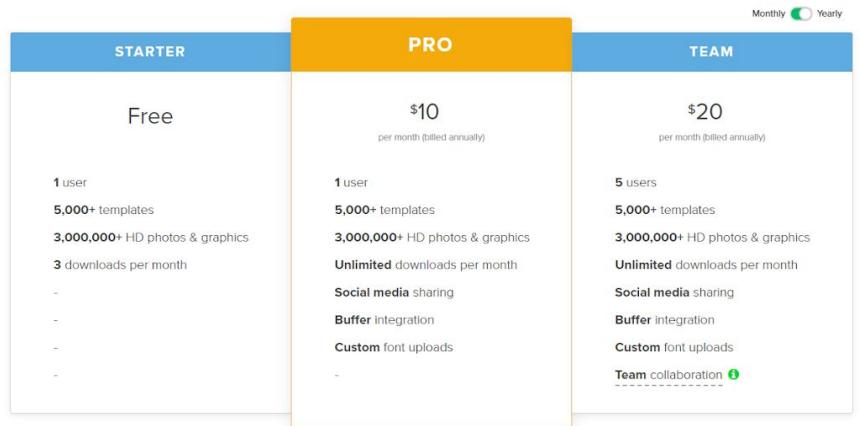

## 4. Pablo, by Buffer

Herramienta de diseño 100% gratuita creada por Buffer, el software de gestión de Redes Sociales.

El principal valor de Pablo es la facilidad para crear imágenes que podemos utilizar en nuestros anuncios o publicaciones orgánicas en social media. Por otro lado, las funcionalidades de esta herramienta son mucho más limitadas que las que pueden ofrecer Canva o Crello.

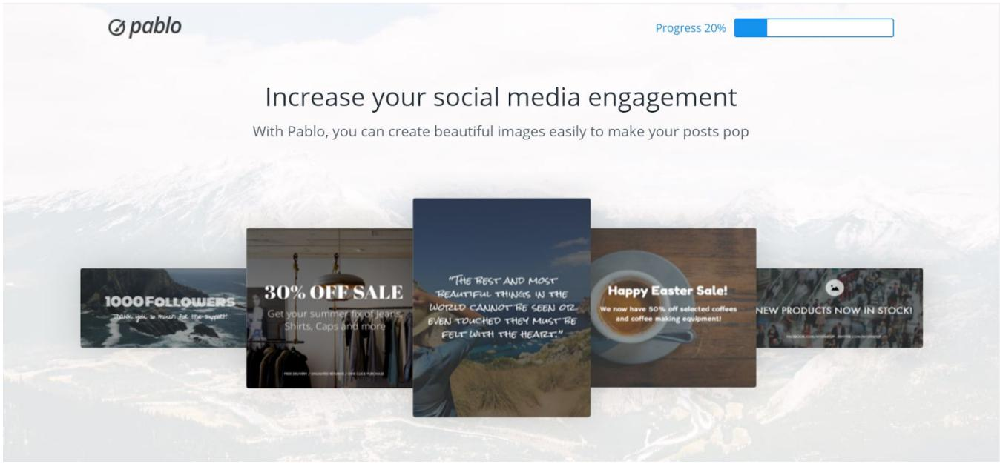

## 5. Stencil

Stencil es otro software en la nube para crear imágenes, muy orientado a social media, y a la creación y edición rápida de imágenes.

Similar al resto de opciones, ofrece 3 planes de precios. El Free permite la descarga de 10 imágenes al mes

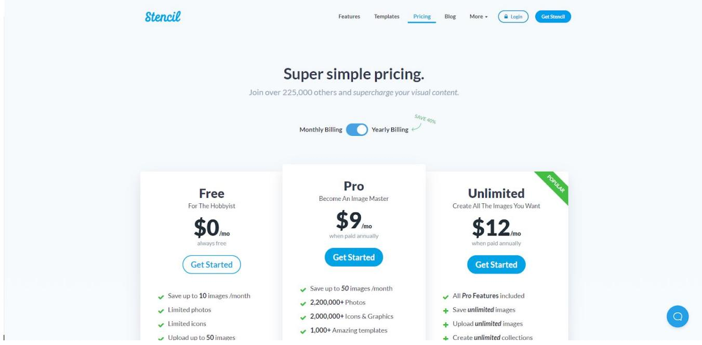

## Creación y edición de vídeos

## 1. Magisto

Magisto es una herramienta de edición de vídeo con inteligencia artificial, que permite crear vídeos de forma muy sencilla.

Una de las principales ventajas de Magisto es que su plan Business incorpora la biblioteca de imágenes y vídeos de iStock, que incluye 25 millones de fotos y 3 millones de vídeos.

## Planes de precios:

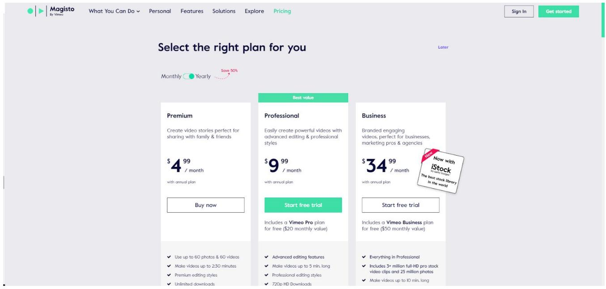

## 2. Lumen5

Lumen5 es otra herramienta muy potente para crear vídeos de Facebook, Instagram, etc.

Gracias a su inteligencia artificial, este software permite convertir a vídeo artículos o posts de un blog.

Planes de precios:

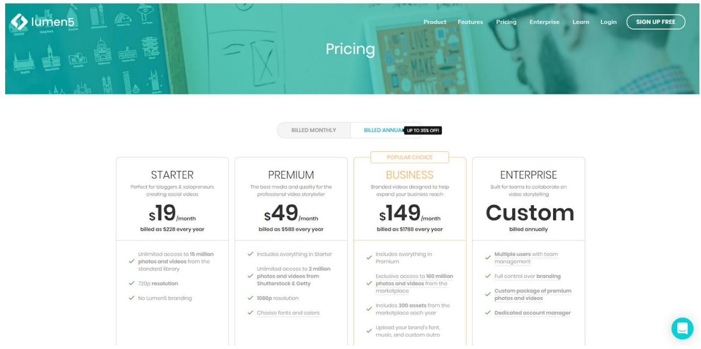  
No cuenta con una versión gratuita, pero sí ofrece pruebas gratis.

## 3. Biteable

Biteable permite crear vídeos a partir de una amplia variedad de plantillas, animaciones y fotos de stock.

Se trata de una herramienta muy sencilla, por lo que es realmente útil para anunciantes que están empezando y no cuentan con un equipo de diseño gráfico.

Cuenta con una opción gratuita, si bien no permite descargar vídeos sin la marca de agua. Es decir, puedes compartirlos en YouTube, Facebook o Twitter, o incluirlos en tu sitio web, pero con marca de agua.

## Planes de precios:

## Upgrade for full creative power

Try Biteable for free. Or unlock your potential with Biteable Premium.

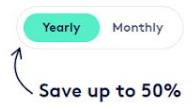  
Personal use and new businesses

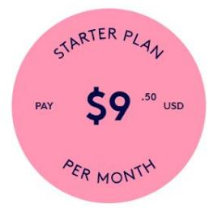  
Billed as \$114 each year 1 video per month No Biteghle watermark  
Small and big businesses

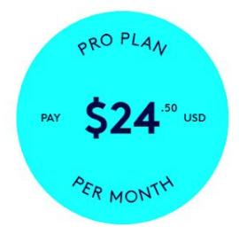  
Billed as \$294 each year  
3 videos per month No Biteghle watermark  
Content creators and teams

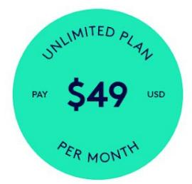  
Billed as \$588 each year /per team member  
Unlimited videos No Biteable watermark

## Otras herramientas de vídeo interesantes

Animoto: alternativa a Magisto •

Wondershare Filmora: alternativa a Adobe Premiere •

Kapwing: herramienta para crear vídeos con memes, pero también para redimensionar vídeos y adaptarlos a los diferentes formatos como Instagram story, Facebook feed…, añadir subtítulos, etc

Imágenes y vídeos gratuitos

Pexels

Pixabay

Unsplash (imágenes)

VisualHunt (imágenes)

Videvo (vídeos)

Videezy (vídeos)