# TO CART m ECOMMERCE PSYCHOLOGY

A GUIDE FOR MARKETERS AND Managers

NICK KOLENDA

## Hello...

I’m Nick Kolenda.

In this guide, you’ll find a list of practical techniques for eCommerce websites.

This PDF is free for everyone — send it to your team or colleagues.

Download my other guides here:

www.NickKolenda.com

## Contents

or use as checklist

## PRE-PURCHASE

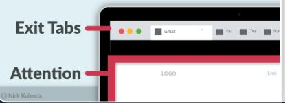

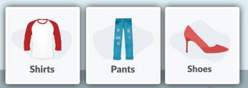

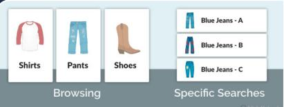

Darken the Top Border of the Interface 5   
Use Visuals in Early Stages of Choice   
Arrange Products Horizontally for Browsing 8   
Prime a Which-to-Choose Mindset 10   
Recommend an Option 12

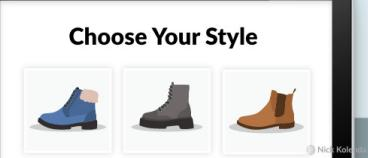

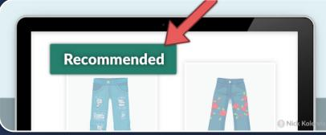

## PRODUCT EVALUATION

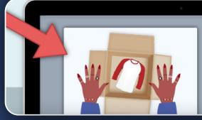

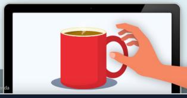

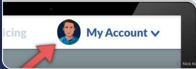

Show the Unboxing 14   
Help Users Imagine Touching the Product 16   
Insert the User’s Photo into the Interface 17   
Restrict the Quantity of Status Products 18

## REVIEWS

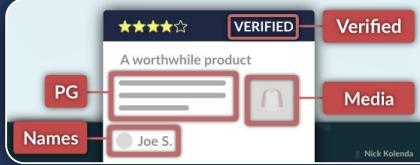

\*\*\*   
PROS CONS Show Imperfect Reviews 20   
\*\*\*\* VERIFIEDVerifed   
PG Media Insert Persuasive Content into Reviews 22   
Names Joe S.   
Horrible   
Response from Owner Respond to Negative Reviews 24   
soto harabout

## BUTTONS

Foreground   
S Buy Now Bring Buttons to the Foreground 26   
View on Amazon Buy on Amazon   
K Describe the Concrete Next Step 28   
Buy Now. Avoid Cutesy Text and Exclamation Points 29   
Buy Now   
Later Display Ugly Rejection Options 30   
Buy Now   
Instant Access Show a Positive Statement Nearby 31   
Tap to add item. Mention the Words “Click” or “Tap” Nearby 32

## CHECKOUT

>   
VShipped Ease the Symbolic Motion of Progress 34   
Arriving   
About Service Pricing Contact Hide Exit Links in the Checkout 36   
Have a Coupon? Deemphasize Your Coupon Field 37   
Order Confirmed   
Wan these? Reduce the Saliency of Competing Options 39

Brand A

Brand B

## PRE-PURCHASE

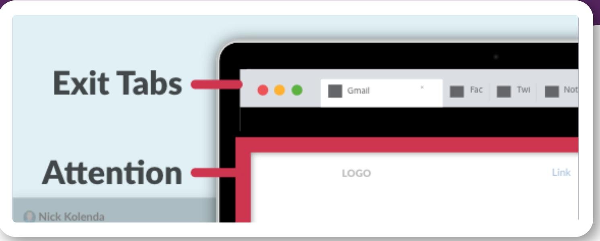

## Darken the Top Border of the Interface

White interfaces are good for actions (e.g., purchases).

But there’s a problem. Look at these rectangles:

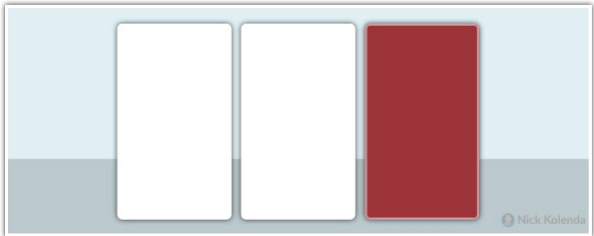

Your brain groups the two squares on the left because of “gestalt” principles of similarity.

And the same effect occurs with tabs in your browser. Look at your tabs right now. What color are they? They’re usually white or grey.

But if your website has a white background, then visitors will group your website with those tabs.

## And that’s bad.

If visitors click one of those tabs, they will leave your website. You need to push those tabs outside of their attention.

Perhaps designers could darken the top border of the interface. This dark bar becomes a conceptual bar that keeps their attention fixated on the website. Visitors will be less likely to click a tab (and leave your website).

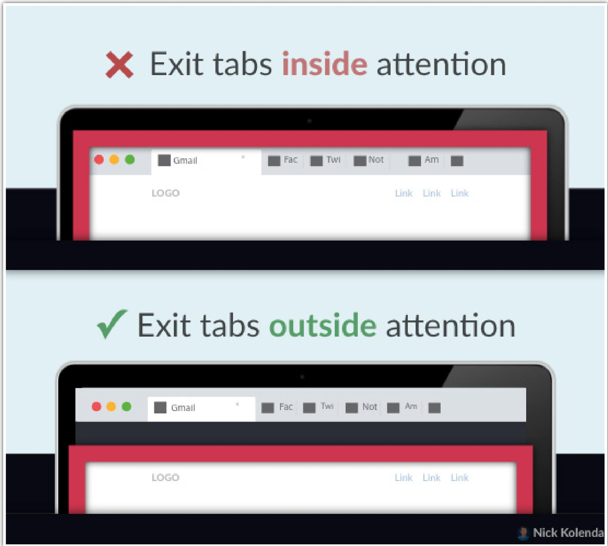

Caveat: It depends on the browser. If their tabs are dark, your interface would need the opposite color (e.g., a white border at the top).

## Use Visuals in Early Stages of Choice

Customers prefer selecting from visual options in the early stages of choice.

…it would be beneficial to have the upfront information about the store and its products presented in a visual manner [on the homepage]…Then, at the point of actual consideration for purchase, on the product offerings pages a more text-based interface should cause consumers to slow down, review each option more carefully (Townsend & Kahn, 2014, p. 19)

On your homepage, ease the visual choice by depicting products with thumbnail graphics.

## REFERENCES

Townsend, C., & Kahn, B. E. (2014). The “visual preference heuristic”: The influence of visual versus verbal depiction on assortment processing, perceived variety, and choice overload. Journal of Consumer Research, 40(5), 993-1015.

## Arrange Products Horizontally for Browsing

Customers browse horizontally.

Human eyes are aligned in a horizontal line, which makes it easier to scan horizontal assortments In turn, this speedy evaluation enhances the perceived variety of these options (Deng, Kahn, Unnava, & Lee, 2016).

However, horizontal assortments backfire when customers are seeking a specific option. These customers don’t want variety — they want to see the desired option as quickly as possible. Here, vertical lists are more effective because they position the desired option at the top of the list (in the exact location of their gaze).

On Amazon, a general search—books—results in a horizontal assortment. Amazon recognizes that this customer is browsing, so they want to increase the perceived variety of options.

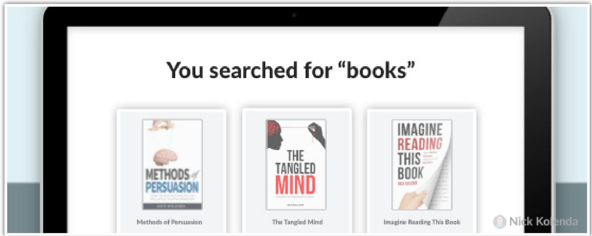

However, when I search for a specific book—Methods of Persuasion— they switch to a vertical list, which funnels my attention toward that option.  
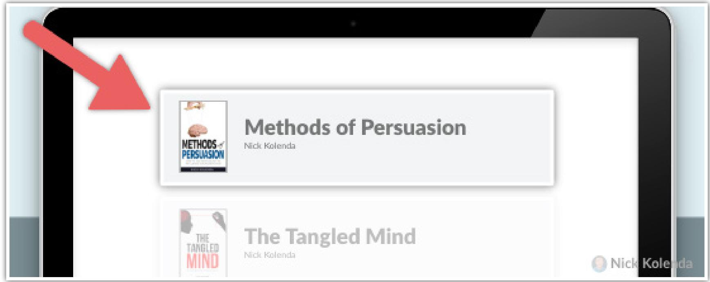

## REFERENCES

Deng, X., Kahn, B. E., Unnava, H. R., & Lee, H. (2016). A “wide” variety: Effects of horizontal versus vertical display on assortment processing, perceived variety, and choice. Journal of Marketing Research, 53(5), 682-698.

# Prime a Which-to-Choose Mindset

Which animal do you prefer: elephant or hippo?

Got your answer? Great.

Turns out, this question made people more likely to buy a computer (Xu & Wyer, 2008).

The reason involves the three stages of buying:

Stage 1: Whether to buy

Stage 2: Which to buy

Stage 3: How to buy

Any choice can prime a “which-to-choose” mindset. While viewing products, customers tend to skip the first stage of “whether” to buy. They proceed immediately to the second stage of “which” to buy.

Stating a preference appears to induce a which-to-buy mindset, leading people to think about which of several products they would like to buy under the implicit assumption that they have already decided to buy one of them. (Xu & Wyer, 2007, p. 564)

You can prime this mindset by simply asking people to choose from an assortment of categories. Instead of deciding whether to buy, customers will be more likely to decide which to buy.

## REFERENCES

Xu, A. J., & Wyer Jr, R. S. (2007). The effect of mind-sets on consumer decision strategies. Journal of Consumer Research, 34(4), 556-566.

Xu, A. J., & Wyer Jr, R. S. (2008). The comparative mind-set: From animal comparisons to increased purchase intentions. Psychological Science, 19(9), 859-864.

# Recommend an Option

People want easy choices.

So…help them. Recommend an option.

Even if customers don’t select this option, this contemplation triggers momentum. They start contemplating other options for comparison, and these steps push them further into the decision.

Ideally, you could customize your recommendations based on their viewing history. At the very least, emphasize the “most popular” option.

## PRODUCT EVALUATION

# Show the Unboxing

Show an image or video of somebody unboxing your product.

Like this stock pot:

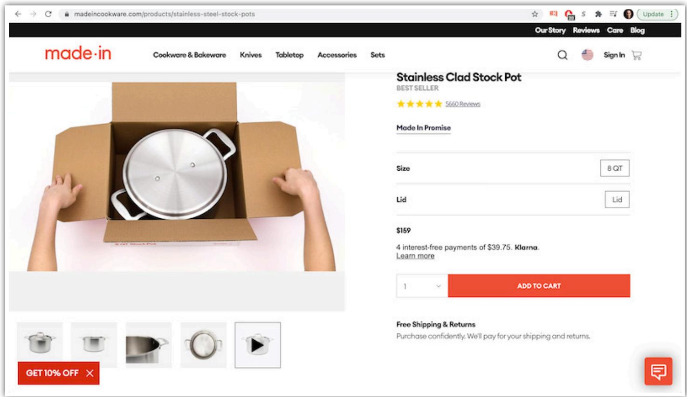

Customers evaluate every purchase decision by imagining themselves buying the product. Why? Because they need to assess their emotional reaction. If this imagery feels good, they’ll know that they want to buy (see my book Imagine Reading This Book).

Well, unboxing can ease those simulations.

Customers immerse themselves into the person opening the box — it feels like THEY are opening it. Suddenly they can imagine buying the product, and they misinterpret this vividness: Hmm, do I want to buy this pot? I can picture myself buying it. Therefore, I must want to buy it.

Plus, unboxing feels good, doesn’t it? It feels like a present. Therefore, unboxing will activate (1) a mental picture of buying and (2) positive emotions.

## da

## Help Users Imagine Touching the Product

Customers prefer products that are interactable.

For example, they prefer mugs when handles are facing their dominant hand because they can imagine grabbing the handle (Elder & Krishna, 2012).

Adjust your product to ease those simulations.

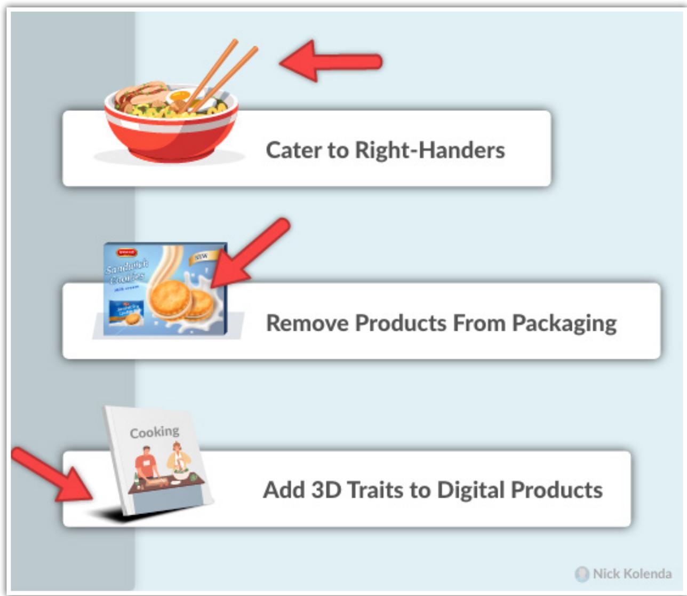

## REFERENCES

Elder, R. S., & Krishna, A. (2012). The “visual depiction effect” in advertising: Facilitating embodied mental simulation through product orientation. Journal of Consumer Research, 38(6), 988-1003.

## Insert the User’s Photo into the Interface

With the right (non-creepy) approach, you can help visitors imagine buying your product by inserting their photo into the interface.

This photo transforms a vague event into a tangible reality.

Although you could might be able to insert their Google photo without permission, I don’t recommend it. Instead, ask them to upload a profile photo when they create an account.

Keep this photo in the navigation menu so that it appears on every page. Any product will feel like a more realistic purchase because of the tangible cue from reality nearby.

## Restrict the Quantity of Status Products

Scarcity is a principle of persuasion. It has two types:

Quantity. Only 3 in stock.

Duration. Expires tomorrow.

Quantity scarcity works best for “conspicuous” products (e.g., clothing) because buyers need to compete with each other. These products become status symbols (Jang, Ko, Morris, & Chang, 2015).

Duration scarcity can work in any scenario. Perhaps you could reserve a product for 2 hours when somebody adds it to their cart.

## REFERENCES

Jang, W. E., Ko, Y. J., Morris, J. D., & Chang, Y. (2015). Scarcity message effects on consumption behavior: Limited edition product considerations. Psychology & Marketing, 32(10), 989-1001.

## REVIEWS

## Show Imperfect Reviews

Perfect ratings are overrated — literally.

Customers are more persuaded by reviews with moderately high ratings (4 to 4.5 stars; Maslowska, Malthouse, & Bernritter, 2017). And they prefer reviews with benefits and drawbacks (Doh & Hwang, 2009).

…providing consumers with positive information followed by a minor piece of negative information appears to enhance their overall evaluations of a target (Ein-Gar, Shiv, & Tormala, 2012, p. 855)

Imperfect reviews also boost the credibility of reviewers (Jensen, Averbeck, Zhang, & Wright, 2013).

## REFERENCES

Doh, S. J., & Hwang, J. S. (2009). How consumers evaluate eWOM (electronic word-ofmouth) messages. Cyberpsychology & behavior, 12(2), 193-197.

Ein-Gar, D., Shiv, B., & Tormala, Z. L. (2012). When blemishing leads to blossoming: The positive effect of negative information. Journal of Consumer Research, 38(5), 846-859.

Jensen, M. L., Averbeck, J. M., Zhang, Z., & Wright, K. B. (2013). Credibility of anonymous online product reviews: A language expectancy perspective. Journal of Management Information Systems, 30(1), 293-324.

Maslowska, E., Malthouse, E. C., & Bernritter, S. F. (2017). Too good to be true: the role of online reviews’ features in probability to buy. International Journal of Advertising, 36(1), 142-163.

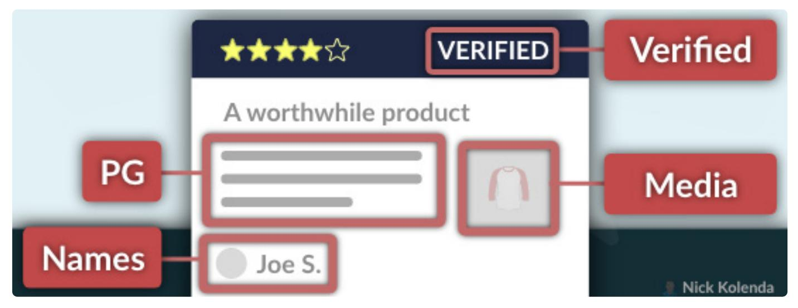

## Insert Persuasive Content into Reviews

What should you include in customer reviews? Here are some tips:

Detect and Fix Typos. Reviews are less persuasive with spelling or grammar errors (Schindler & Bickart, 2012).

Monitor Expletives. Censor your f\*\*king reviews. C’mon now. You’ll look more professional. Plus, angry reviews are less helpful (Lee & Koo, 2012).

Reward Users Who Add Media. Customers prefer reviews with images (Cheng & Ho, 2015) or video (Xu, Chen, Wu, & Santhanam, 2012).

Display Real Names. Real names (e.g., Joe S.) are more persuasive than usernames (e.g., jschmo; Liu & Park, 2015).

Show Proof of Consumption. Show reviews from “verified” purchasers (Bjering, Havro, & Moen, 2015). Or incentivize customers to upload selfies (Yang, Chen, & Tan, 2014).

Review Multiple Dimensions. Ask users to rate the price, quality, aesthetics, and any other relevant dimensions (Hong, Chen, & Hitt, 2012).

## REFERENCES

Bjering, E., Havro, L. J., & Moen, Ø. (2015). An empirical investigation of self-selection bias and factors influencing review helpfulness. International Journal of Business and Management, 10(7), 16.

Cheng, Y. H., & Ho, H. Y. (2015). Social influence’s impact on reader perceptions of online reviews. Journal of Business Research, 68(4), 883-887.

Hong, Y., Chen, P. Y., & Hitt, L. M. (2012). Measuring product type with dynamics of online product review variance. In Implications for Research and Practice, Proceedings of the 33rd International Conference on Information Systems (ICIS), Orlando, FL.

Lee, K. T., & Koo, D. M. (2012). Effects of attribute and valence of e-WOM on message adoption: Moderating roles of subjective knowledge and regulatory focus. Computers in Human Behavior, 28(5), 1974-1984.

Liu, Z., & Park, S. (2015). What makes a useful online review? Implication for travel product websites. Tourism management, 47, 140-151.

Schindler, R. M., & Bickart, B. (2012). Perceived helpfulness of online consumer reviews: The role of message content and style. Journal of Consumer Behaviour, 11(3), 234-243.

Xu, P., Chen, L., Wu, L., & Santhanam, R. (2012). Visual Presentation Modes in Online Product Reviews and Their Effects on Consumer Responses.

Yang, L., Chen, J., & Tan, B. C. (2014). Peer in the Picture: an Explorative Study of Online Pictorial Reviews.

## Respond to Negative Reviews

Responding to negative reviews can help in various ways.

• Hotel bookings increased by 60% (Ye, Gu, Chen, & Law, 2008)

• Ratings increased 20% (McIlroy, Shang, Ali, & Hassan, 2015)

Review volume increased by 17% (Xie et al., 2016)

Based on reviews in TripAdvisor, less than 4 percent of businesses respond to negative reviews (Xie et al., 2016). That gives you an opportunity to stand out.

## REFERENCES

McIlroy, S., Shang, W., Ali, N., & Hassan, A. E. (2015). Is it worth responding to reviews? studying the top free apps in google play. IEEE Software, 34(3), 64-71.

Xie, K. L., Zhang, Z., Zhang, Z., Singh, A., & Lee, S. K. (2016). Effects of managerial response on consumer eWOM and hotel performance: Evidence from TripAdvisor. International Journal of Contemporary Hospitality Management.

Ye, Q., Gu, B., Chen, W., & Law, R. (2008). Measuring the value of managerial responses to online reviews-A natural experiment of two online travel agencies.

## ABuy Now

## BUTTONS

# Bring Buttons to the Foreground

Customers evaluate purchase decisions by imagining the why and how — in other words, these two scenarios:

Outcome: Consuming the product

Process: Completing the transaction

Strengthening those two simulations will influence people to buy.

Buttons seem irrelevant to a purchase, but they comprise the second simulation. Customers are more likely to buy your products if they can imagine clicking the purchase button.

Some interfaces, like Apple, position the purchase button at the bottom of the screen. This location is closer to the user’s fingers, so they can imagine pressing this button more easily.

You can also bring buttons to the foreground by inserting something behind them (e.g., shadow, background). Your buttons should feel more clickable if they seem physically closer to users.

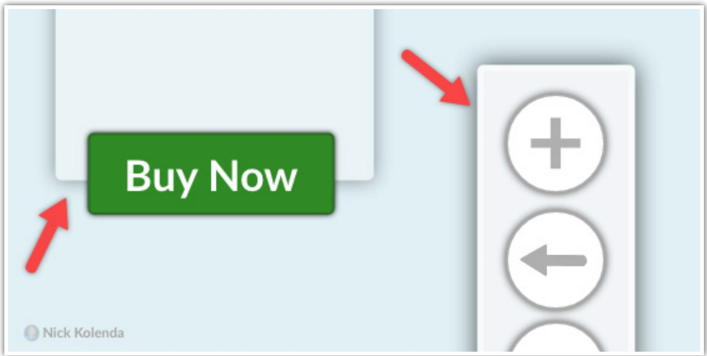

# Describe the Concrete Next Step

You might be tempted to choose the button text: “Buy on Amazon.”

However, “buying” isn’t the next step. People still need to read the description and evaluate the purchase.

Your button should indicate the next step: “View on Amazon.”

This framing feels less effortful, and it symbolizes the next logical step.   
Visitors can easily simulate this behavior.

Caveat: A “larger investment” button (e.g., Buy on Amazon) will usually reduce the click-through rate, but these buttons can increase conversions in later stages. For users who click a “buy” button, they generate a mental image of the purchase. This purchase becomes more realistic and desirable, which motivates them to complete the purchase.

Regardless, always choose concrete words that depict a vivid image of the action (e.g., “View on Amazon” is more concrete than “View”).

# Buy Now. cYanmaGntaYaGtYelowb

## Avoid Cutesy Text and Exclamation Points

When you read, you speak each word inside your mind. It’s called inner speech (Alderson-Day & Fernyhough, 2015).

Certain buttons can be problematic because any text that is cutesy (e.g., Count Me In) or exclamatory (e.g., Buy Now!) will produce inner speech that is disfluent. Something will feel wrong. And, if something feels wrong, customers will attribute this feeling to the purchase.

Always choose text that sounds natural. Something that people would normally say in real life.

## REFERENCES

Alderson-Day, B., & Fernyhough, C. (2015). Inner speech: development, cognitive functions, phenomenology, and neurobiology. Psychological bulletin, 141(5), 931.

## Display Ugly Rejection Options

Purchase buttons should look pretty. Customers will attribute these positive traits to the purchase.

Why not do the reciprocal? Show ugly rejection options so that customers attribute those negative traits: Hmm, something about this rejection option feels wrong. I must want to choose the “buy” option.

You could uglify rejection options with weird fonts, unbalanced positioning, or wide letter-spacing.

## Show a Positive Statement Nearby

Add positive statements near your main buttons. Statements like: Instant Access, 100% Secure, 30-Day Guarantee.

Your buttons trigger the purchase simulation— that is, people look at your buttons and imagine the purchase so that they can gauge their desire. Any nearby statement — positive or negative — will infiltrate this mental image.

Insert a positive statement nearby to penetrate the imagery of the purchase.

## Mention the Words “Click” or “Tap” Nearby

While reading verbs, you simulate the depicted motor actions.

In one study, people turned a knob counter-clockwise once they understood a sentence. They were faster with sentences like:

Katie opened the water bottle.

People turned the knob faster because this rotation matched the motor action in the sentence (Zwaan & Taylor, 2006).

On your product pages, perhaps you could mention the word “click” nearby (or “tap” on mobile devices). These verbs activate the muscles that perform these motor actions. While these muscles are activated, buttons should seem more clickable.

## REFERENCES

Zwaan, R. A., & Taylor, L. J. (2006). Seeing, acting, understanding: Motor resonance in language comprehension. Journal of Experimental Psychology: General, 135(1), 1.

Confirm Order m

CHECKOUT

## Ease the Symbolic Motion of Progress

Depict the number of steps remaining in the checkout.

Ideally, use downward motion to symbolize this progress.

In one study, a moving square vanished. Everyone believed that this box vanished farther ahead because of the momentum. And this misjudgment was stronger with downward motion (Hubbard, 2005).

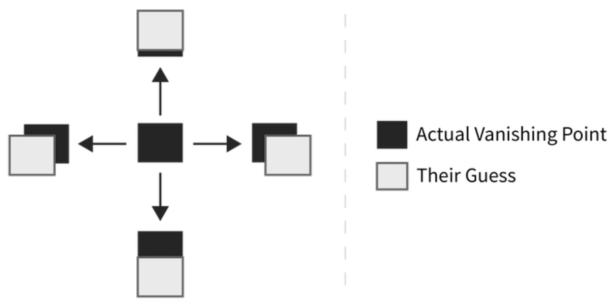

Downward motion seems stronger because of gravity.

You should depict steps with downward motion because users can imagine this bar moving to the later steps (e.g., delivery) more easily. They will imagine receiving their package faster.

Or, if you need to display horizontal progress, you can ease the motion in other ways. Perhaps add a linear gradient that changes color from left to right. Or position the bar close to the final step so that users can imagine reaching the finish line more easily.

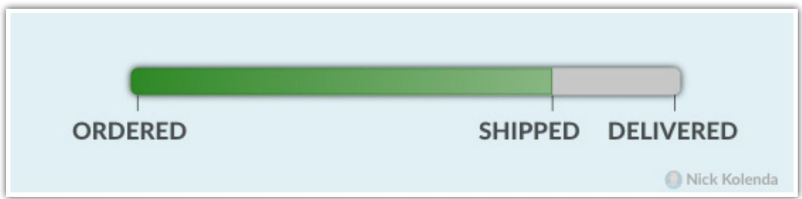

See my book The Tangled Mind for other applications.

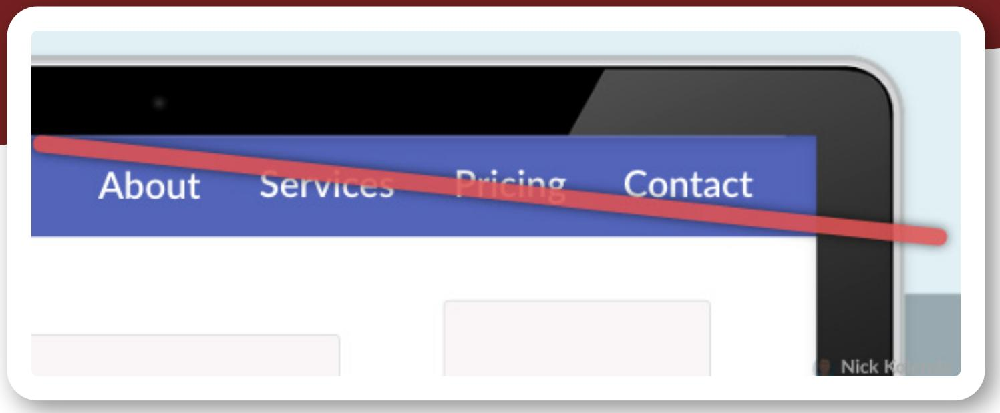

# Hide Exit Links in the Checkout

Menu links will dilute the purchase.

Customers will imagine visiting those pages to determine whether they want to visit them. Even if they decide to remain in the checkout, those simulations will dilute the strength of the purchase simulation.

Remove exit links from your checkout so that you remove any stimuli that will prompt competing simulations.

# Deemphasize Your Coupon Field

Customers want a fair price. Oftentimes, they compare their price to the prices that other people paid:

…perceptions of fairness are induced when a person compares an outcome (e.g., input and output ratio) with a comparative other’s outcome (Xia, Monroe, & Cox, 2004, p. 1)

Customers are less likely to buy if other customers paid less money. And that sparks a dilemma with coupon fields.

If customers see a discount field—and if they don’t have one—they infer that other customers are paying a lower price. That’s painful.

You don’t need to remove this field entirely. Just reduce the saliency of it. Instead of displaying an empty field, show a text link: “Have a discount code?”

This format is less painful than staring at an empty discount field.

## REFERENCES

Xia, L., Monroe, K. B., & Cox, J. L. (2004). The price is unfair! A conceptual framework of price fairness perceptions. Journal of marketing, 68(4), 1-15.

## Reduce the Saliency of Competing Options

Once customers complete the checkout, fixate their attention on the final product by hiding the options that they didn’t choose.

In one study, chocolate seemed better when people closed the lid after choosing In another study, tea seemed better when people closed the menu (Gu, Botti, & Faro, 2013).

You can still upsell or cross-sell other products. Just verify that these products don’t compete with the chosen product. Otherwise, they will second-guess themselves.

## REFERENCES

Gu, Y., Botti, S., & Faro, D. (2013). Turning the page: The impact of choice closure on satisfaction. Journal of Consumer Research, 40(2), 268-283.

## Next Step...

You learned some tactics.

But how do you apply them in a real website?

For this next step, you can peek over my shoulder while I optimize real websites.

View my course on Website Behavior:

www.NickKolenda.com/video-courses