## O Psychology

A GUIDE FOR MARKETERS AND Designers

NICK KOLENDA

## Hello...

I’m Nick Kolenda.

In this guide, you’ll learn the practical science of fonts — which fonts are better (and why).

This PDF is free for everyone, so share it with your team or colleagues.

Download my other guides here:

www.NickKolenda.com

## Why Do Fonts Have Meaning?

Look at these fonts:

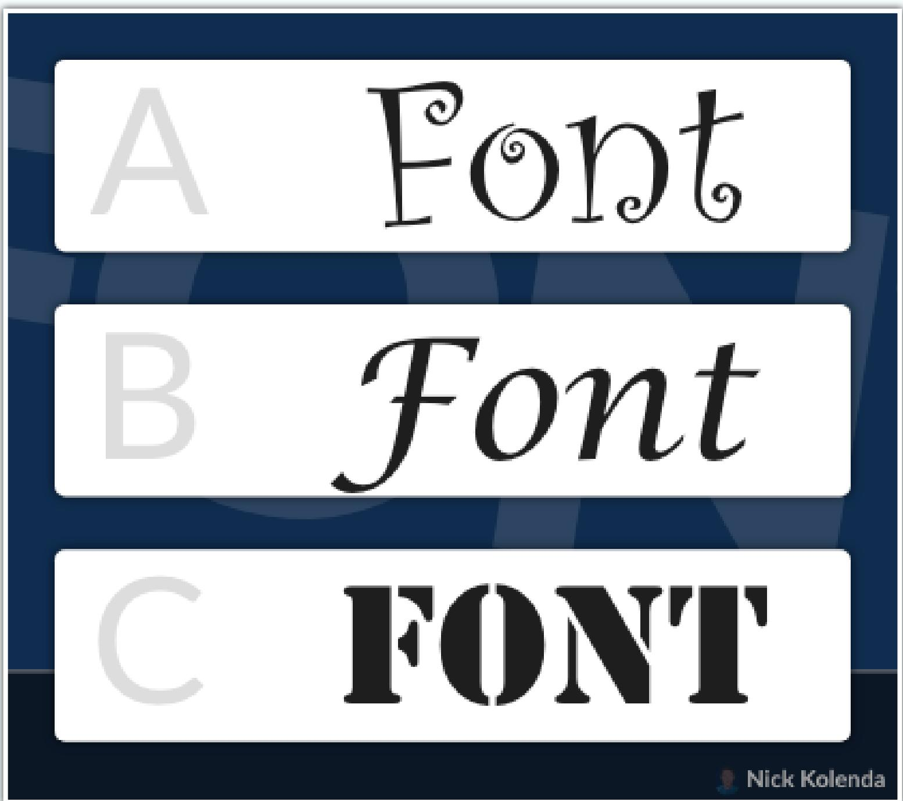

Which font is better for: fitness class, board game, makeup.

You probably chose C, A, B, huh?

But why? They just…felt right?

Sure — but why did they feel right? Most people can’t articulate the reason, so let’s disentangle this mechanism.

## Primitive Traits

Every time that you see a font, your brain will activate the visual traits:

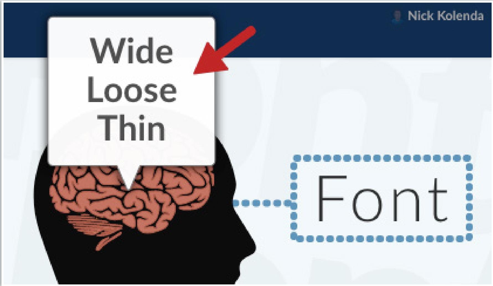

Look at those traits — wide, loose, thin.

Notice anything? Those are general traits, right?

Indeed, fonts resemble objects from the sensory world.

Real-Wold Traits

Font Traits

Lean Forward

1 .

Short   
Bold   
Condensed

TallLight

Touching

## Want to choose the right font? Choose traits that resemble your context.

For example, ads for a “slim” phone performed better with a slim font. Ads for an “elegant” phone performed better with an elegant font (Choi & Kang, 2013).

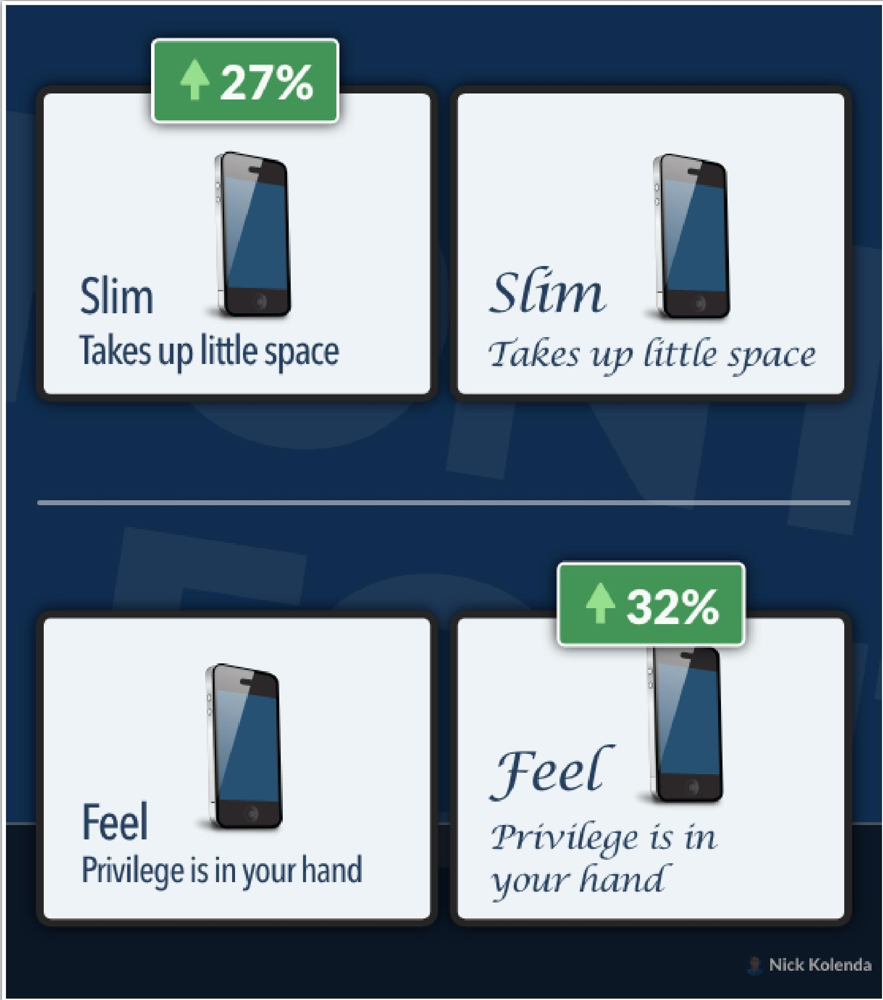

## Fonts also activate past experience:

The typeface Fraktur has many associations with Nazi Germany, and Helvetica is commonly associated with the U.S. government since it is used by the IRS on tax forms. (Shaikh, 2007, p. 21)

Seeing a font (e.g., Fraktur) will activate its past meaning — including the semantic meaning (e.g., Nazi Germany) and emotional meaning (e.g., disgust).

And you constantly update fonts in your brain. Fonts with...

• ...similar experiences will strengthen connections.

• ...dissimilar experiences will weaken connections.

• ...new experiences will add connections.

That’s how fonts (and other stimuli) acquire meaning.

If you want more details on the underlying mechanisms, you can refer to my book The Tangled Mind.

## Spreading Activation

Your brain has an associative network.

All concepts are connected to related concepts.

For example, your node for “toothpaste” is connected to floss, mouthwash, and everything else that you associate with toothpaste.

You also experience spreading activation: Activating a concept will activate all concepts that are connected to it (Collins & Loftus, 1975).

Suppose you see the logo for Avon:

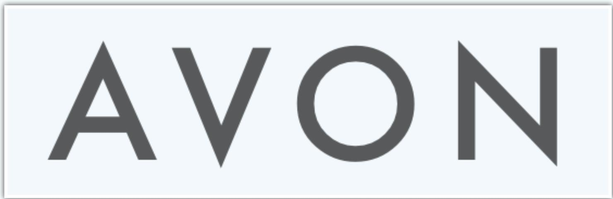

Your brain will activate the visual traits of this font, such as tall and thin. And then activation will spread toward related concepts.

Hmm, tall and thin? Aren’t those traits related to beauty?

Indeed, they are.

At this point, you might be thinking: Well, if the node for beauty is activated, then the font (and product) will seem more beautiful.

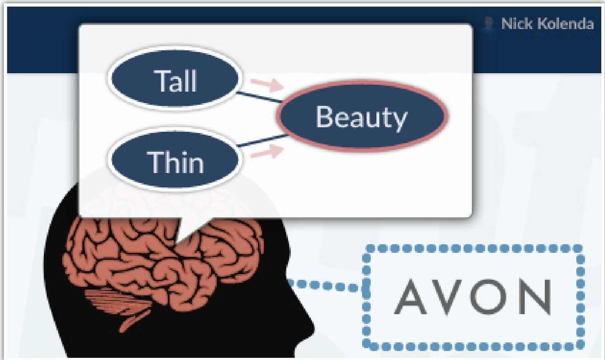

But, not quite — this process is more nuanced. Consider the Fraktur font from Nazi propaganda:

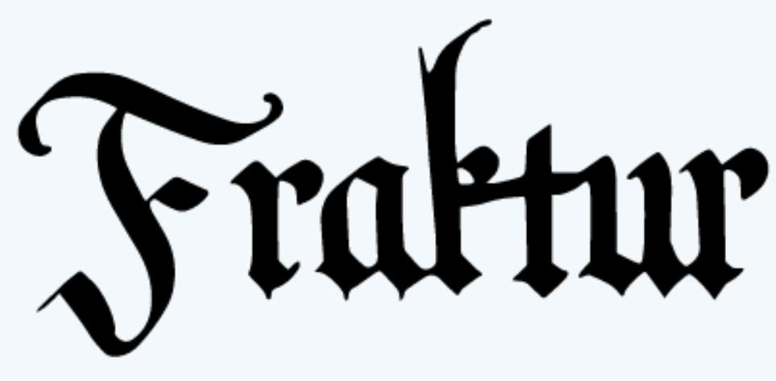

Based on spreading activation, you should NEVER use Fraktur because of the strong negative emotions. But it doesn’t work that way. Your brain considers the appropriateness of contexts (see Doyle & Bottomley, 2004). You can use Frankfurt in documentaries because the font seems “fitting” for that context.

In sum, seeing the logo for Avon activates beauty. Since this business sells beauty products, this congruence feels good — and people misattribute these positive emotions to the font and business. The font simply “feels right.”

## Which Fonts Should You Choose?

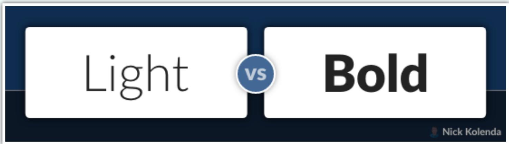

## Long Thin Lines Convey Beauty

In most countries, the “standard” for beauty is tall and then. Seeing these traits in a font will activate your concept of beauty:

Typefaces that are lighter in weight (in width and stroke thickness) are seen as delicate, gentle, and feminine, while heavier typefaces are strong, aggressive, and masculine. (Brumberger, 2003, p. 208)

## Bold Fonts Are Powerful and Masculine

## Bold fonts seem extreme:

Bold can be made to mean ‘daring’, ‘assertive’, or ‘solid’ and ‘substantial’, for instance, and its opposite can be made to mean ‘timid’, or ‘insubstantial’. But the values may also be reversed. Boldness may have a more negative meaning. It may be made to mean ‘domineering’, ‘overbearing’. (Van Leeuwen, 2006, p. 148)

Bold fonts also seem masculine because of their resemblance to a bulky stature (Lieven et al., 2015).

Researchers displayed the word “Memphis” in different font weights to determine the optimal readability. Medium weights were most readable (Luckiesh & Moss, 1940).

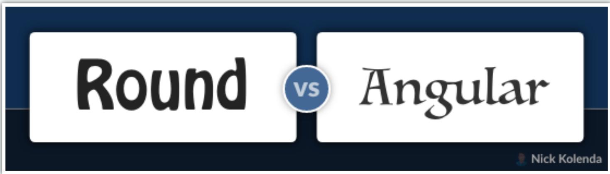

## Round Fonts Convey Comfort and Softness

Humans prefer round objects because sharp objects feel threatening:

…sharp transitions in contour might convey a sense of threat, and therefore trigger a negative bias (Bar & Neta, 2006, p. 645)

Round fonts are particularly effective for:

• Softness or comfort (Jiang et al., 2016)

• Femininity or beauty (Lieven et al., 2015)

• Sweet foods (Velasco et al., 2015)

## However, angular fonts are better for:

• A formal and official tone (Brumberger, 2003)

• Masculine traits (Lieven et al., 2015)

Foods that are bitter, salty, or sour (Velasco et al., 2015)

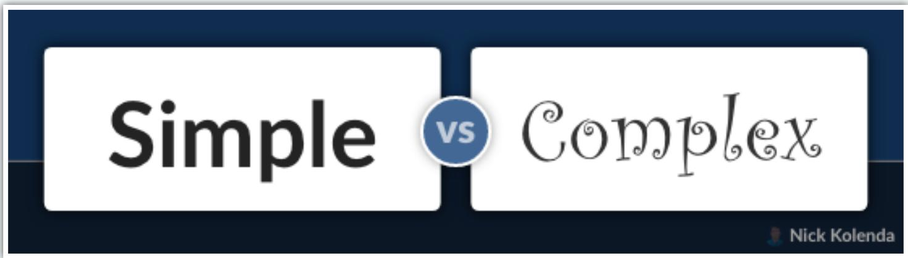

## Simple Fonts Convey Directness

Rigid typefaces are better for straightforward messages because this visual simplicity matches the simple nature of this context (Li & Suen, 2010).

## Complex Fonts Convey Uniqueness

In one study, people were more likely to buy a gourmet cheese when the font was difficult to read:

In the context of everyday products, increased fluency is a positive cue that the product is familiar and safe which leads to higher evaluation of products…However, in the context of special occasion high-end products, higher fluency serves as a negative cue that indicates abundance and familiarity of products that translates into lower value… Thus, difficulty (and not ease) of processing of such products will make them feel more special. (Pocheptsova, Labroo, & Dhar, 2010, pg. 9)

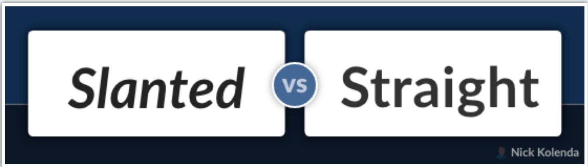

## Slanted Fonts Covey Fast Movement

Imagine something moving fast. How does it look? Is it tilting forward?

What artistic conventions are used to convey the motion of animate and inanimate items in still images, such as drawings and photographs? One graphic convention involves depicting items leaning forward into their movement, with greater leaning conveying greater speed. (Walker, 2015, p. 111)

Indeed, people are quicker to identify “fast” words in slanted fonts (Lewis & Walker, 1989).

Therefore, use slanted orientation (e.g., italics) when you want to communicate a fast speed, like speedy customer service.

## Straight Fonts Convey Stability

Straight fonts — with their rigid structure — convey stability and durability.

## Serif vs. Sans-Serif

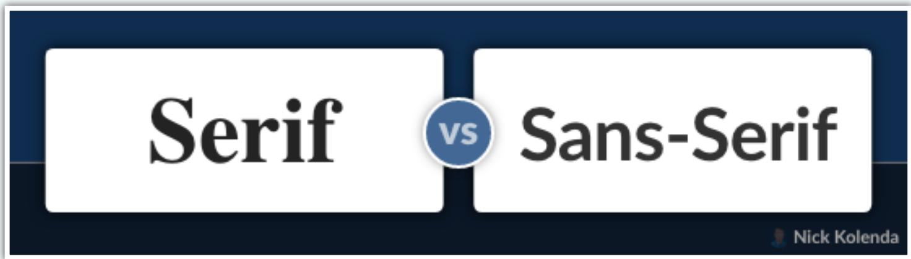

Sans-Serifs Are More Readable Via Screens

Computer screens display information in a box-like grid, which can degrade the readability of serif fonts. They might not fit inside this grid.

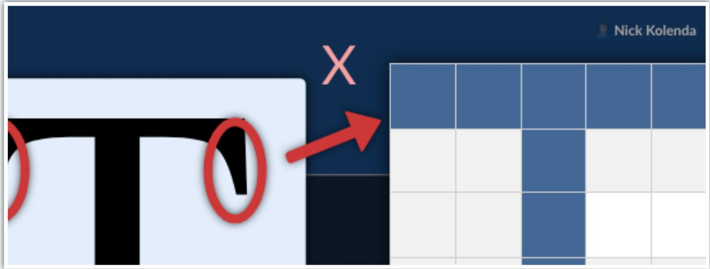

But modern technology has mostly solved this issue.

Conversely, serif fonts are more readable via print:

Roman typefaces are more legible because the theory states that serifs assist in the horizontal flow of reading and eye movements. (De Lange et al., 1993, p. 246)

Generally, serif fonts seem scientific (Kaspar et al., 2015) and elegant (Tantillo, Lorenzo-Aiss, & Mathisen, 1995).

## Sans-Serifs Are More Informal and Innovative

Sans-serif fonts can seem modern and cutting-edge (Tantillo, Lorenzo-Aiss, & Mathisen, 1995).

## Lowercase Conveys Compassion and Innovation

Lowercase letters are effective with “caregiver” brands that promote compassion and altruism (Oosterhout, 2013).

## Uppercase Conveys Power and Strength

Uppercase letters are effective for “hero” brands that convey energy, courageousness, and focus:

BWM, Diesel, Duracell, Nike and Sony are also using capitals in their word marks, to express their power and strength. (Oosterhout, 2013, p. 39)

## Mixed Case Letters Are Most Readable

Mixed cased are most readable (Garvey, Pietucha, & Meeker, 1997).

## For these reasons:

Expectations. People expect to see road signs in mixed case, so their brain is looking for this pattern.

Greater Distinction. Uppercase letters are less distinguishable because they share the same height.

## Condensed vs. Spacious

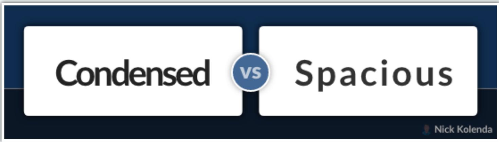

## Condensed Fonts Convey Tightness and Precision

Slim fonts perform better with slim products, like cell phones:

Maximally condensed typefaces make maximal use of limited space. They are precise, economical, packing the page with content. Wide typefaces, by contrast, spread themselves around, using space as if it is in unlimited supply. (Choi & Kang, 2013, p. 148)

If the letters start touching, this physical contact can also convey closeness:

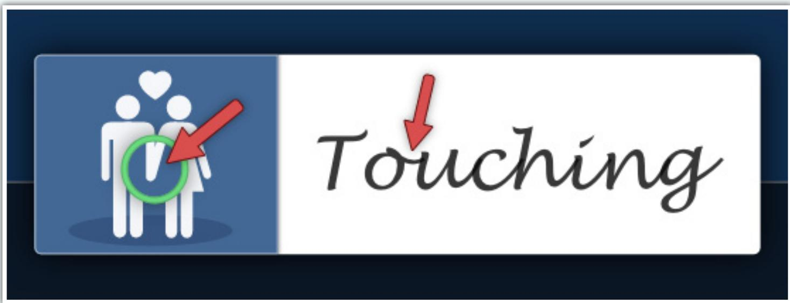

## Extra space can feel relaxing:

Wide typefaces may also be seen in a positive light, as providing room to breathe, room to move, while condensed typefaces may, by contrast, be seen as cramped, overcrowded, restrictive of movement. (Choi & Kang, 2013, p. 148)

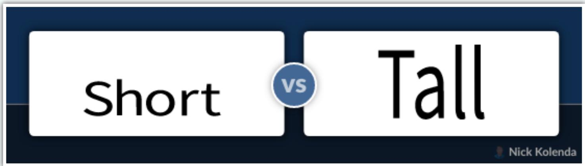

## Short Fonts Convey Heaviness and Stability

Font height resembles gravity. Short fonts are closer to the ground, so they feel more stable.

The meaning potential of horizontality and verticality is ultimately based on our experience of gravity, and of walking upright. Horizontal orientation, for instance, could suggest ‘heaviness’, ‘solidity’, but also ‘inertia’, ‘self-satisfaction’ (Choi & Kang, 2013, p. 149)

Short fonts can make products feel durable and immovable.

## Tall Fonts Convey Lightness and Luxury

Tall fonts convey lightness and quickness. They can also feel aspirational (Choi & Kang, 2013) and luxurious (Van Rompay, De Vries, Bontekoe, & Tanja Dijkstra, 2012).

## References

Bar, M., & Neta, M. (2006). Humans prefer curved visual objects. Psychological science, 17(8), 645-648.

Brumberger, E. R. (2003). The rhetoric of typography: The persona of typeface and text. Technical communication, 50(2), 206-223.

Choi, S. M., & Kang, M. (2013). The effect of typeface on advertising and brand evaluations: The role of semantic congruence. J. Advertising and Promotion Research, 2(2), 25-52.

Collins, A. M., & Loftus, E. F. (1975). A spreading-activation theory of semantic processing. Psychological review, 82(6), 407.

De Lange, R. W., Esterhuizen, H. L., & Beatty, D. (1993). Performance differences between Times and Helvetica in a reading task. ELECTRONIC PUBLISHING-CHICHESTER-, 6, 241-241.

Doyle, J. R., & Bottomley, P. A. (2004). Font appropriateness and brand choice. Journal of business research, 57(8), 873-880.

Garvey, P. M., Pietrucha, M. T., & Meeker, D. (1997). Effects of font and capitalization on legibility of guide signs. Transportation Research Record, 1605(1), 73-79.

Jiang, Y., Gorn, G. J., Galli, M., & Chattopadhyay, A. (2016). Does your company have the right logo? How and why circular-and angular-logo shapes influence brand attribute judgments. Journal of Consumer Research, 42(5), 709-726.

Kaspar, K., Wehlitz, T., von Knobelsdorff, S., Wulf, T., & von Saldern, M. A. O. (2015). A matter of font type: The effect of serifs on the evaluation of scientific abstracts. International Journal of Psychology, 50(5), 372-378.

Lewis, C., & Walker, P. (1989). Typographic influences on reading. British Journal of Psychology, 80(2), 241-257.

Li, Y., & Suen, C. Y. (2010). Typeface personality traits and their design characteristics. In proceedings of the 9th IAPR International Workshop on Document Analysis Systems (pp. 231-238).

Lieven, T., Grohmann, B., Herrmann, A., Landwehr, J. R., & Van Tilburg, M. (2015). The effect of brand design on brand gender perceptions and brand preference. European Journal of Marketing.

Luckiesh, M. A. T. T. H. E. W., & Moss, F. K. (1940). Boldness as a factor in type-design and typography. Journal of Applied Psychology, 24(2), 170.

Oosterhout, L. (2013). Word marks: a helpful tool to express your identity: an empirical study regarding fonts of word marks as a tool for transmitting an archetypal identity (Master’s thesis, University of Twente).

Pocheptsova, A., Labroo, A. A., & Dhar, R. (2010). Making products feel special: When metacognitive difficulty enhances evaluation. Journal of Marketing Research, 47(6), 1059-1069.

Shaikh, A. D. (2007). Psychology of onscreen type: Investigations regarding typeface personality, appropriateness, and impact on document perception (Doctoral dissertation).

Tantillo, J., Lorenzo‐Aiss, J. D., & Mathisen, R. E. (1995). Quantifying perceived differences in type styles: An exploratory study. Psychology & Marketing, 12(5), 447-457.

Van Rompay, T. J., De Vries, P. W., Bontekoe, F., & Tanja‐Dijkstra, K. (2012). Embodied product perception: Effects of verticality cues in advertising and packaging design on consumer impressions and price expectations. Psychology & Marketing, 29(12), 919-928.

Velasco, C., Woods, A. T., Hyndman, S., & Spence, C. (2015). The taste of typeface. i-Perception, 6(4), 2041669515593040.

Walker, P. (2015). Depicting visual motion in still images: forward leaning and a left to right bias for lateral movement. Perception, 44(2), 111-128.

## Next Step...

You learned the science of fonts.

But how do you apply this knowledge in a real-world design context?

For this next step, I filmed a few case studies. You can peek over my shoulder while I tweak the design of websites and interfaces.

View my course on Website Behavior:

www.NickKolenda.com/video-courses