NICK KOLENDA

## − −−. −A PRODUCT HOW TO CHOOSE THERIGHT SOUNDS, LETTERSAND COMPOSITION

Naming a Product: How to Choose the Right Sounds, Letters, and Composition

Nick Kolenda © Copyright 2015, 2022

More Free Guides:

www.NickKolenda.com

## Contents

1. Choose the Type of Name 12   
2. Choose the Sounds and Letters 27   
3. Build Potential Names 51   
4. Choose the Best Name 82   
5. Add a Version or Number 89

# Introduction

Which shape is kiki? And which is bouba?

Did you guess:

» Kiki = Pointy Shape

» Bouba = Round Shape

Same here.

But can you explain why? Probably not, huh? For most people, those names just “feel right.”

So then, why do 95% of people choose the same labels (Ramachandran & Hubbard, 2001)?

More importantly, why do names “feel right” for certain products? In 1970, Exxon paid \$100 million to generate their name (Kotler et al., 2015).

## One Name = \$100 Million.

So, what’s the secret? I spent hundreds of hours reading academic research on linguistics, and I compiled a methodology.

Here’s a video summary.

Or you can follow the steps in the next few pages.

## STEP 1

## Choose the Type of Name

DEVIANT

Apple Amazon Pandora

DESCRIPTIVE

General Motors Electronic Arts General Electric

WORD

NEOLOGISTIC

Spotify Kodak Zynga

ASSOCIATIVE

Facebook Linkedln YouTube

RELEVANCE

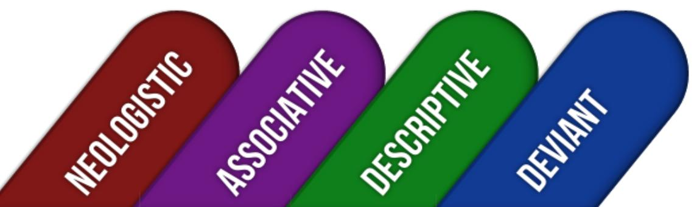

<table><tr><td rowspan=1 colspan=1>Persuasive</td><td rowspan=1 colspan=1></td><td rowspan=1 colspan=1></td><td rowspan=1 colspan=1></td><td rowspan=1 colspan=1></td></tr><tr><td rowspan=1 colspan=1>Memorable</td><td rowspan=1 colspan=1></td><td rowspan=1 colspan=1></td><td rowspan=1 colspan=1></td><td rowspan=1 colspan=1></td></tr><tr><td rowspan=1 colspan=1>Distinctive</td><td rowspan=1 colspan=1></td><td rowspan=1 colspan=1></td><td rowspan=1 colspan=1></td><td rowspan=1 colspan=1></td></tr><tr><td rowspan=1 colspan=1>Relevant</td><td rowspan=1 colspan=1></td><td rowspan=1 colspan=1></td><td rowspan=1 colspan=1></td><td rowspan=1 colspan=1></td></tr><tr><td rowspan=1 colspan=1>Emotional</td><td rowspan=1 colspan=1></td><td rowspan=1 colspan=1></td><td rowspan=1 colspan=1></td><td rowspan=1 colspan=1></td></tr><tr><td rowspan=1 colspan=1>Scalable</td><td rowspan=1 colspan=1></td><td rowspan=1 colspan=1></td><td rowspan=1 colspan=1></td><td rowspan=1 colspan=1></td></tr><tr><td rowspan=1 colspan=1>Protectable</td><td rowspan=1 colspan=1>L</td><td rowspan=1 colspan=1></td><td rowspan=1 colspan=1></td><td rowspan=1 colspan=1></td></tr><tr><td rowspan=1 colspan=1>SEO</td><td rowspan=1 colspan=1></td><td rowspan=1 colspan=1></td><td rowspan=1 colspan=1></td><td rowspan=1 colspan=1></td></tr></table>

## Choose the Sounds

small

Angular   
Fast   
Sophisticated   
Short-Term   
Female   
FRONT VOWELS   
ē, i, ā, e, a   
VOICELESS   
ch, f, h, k, p, s,   
sh, t, th   
FRICATIVES   
f, h, s, sh, th, v,

2

Large   
Round   
Slow   
Dark   
Rugged   
Long-Term →   
i Male   
BACK VOWELS   
ō, o, ä, u, ü   
VOICED   
b, d, g, j, I, m, n, r,   
th, v, w, y, z   
STOPS   
b, d, g, k, p, t

## Build Potential Names

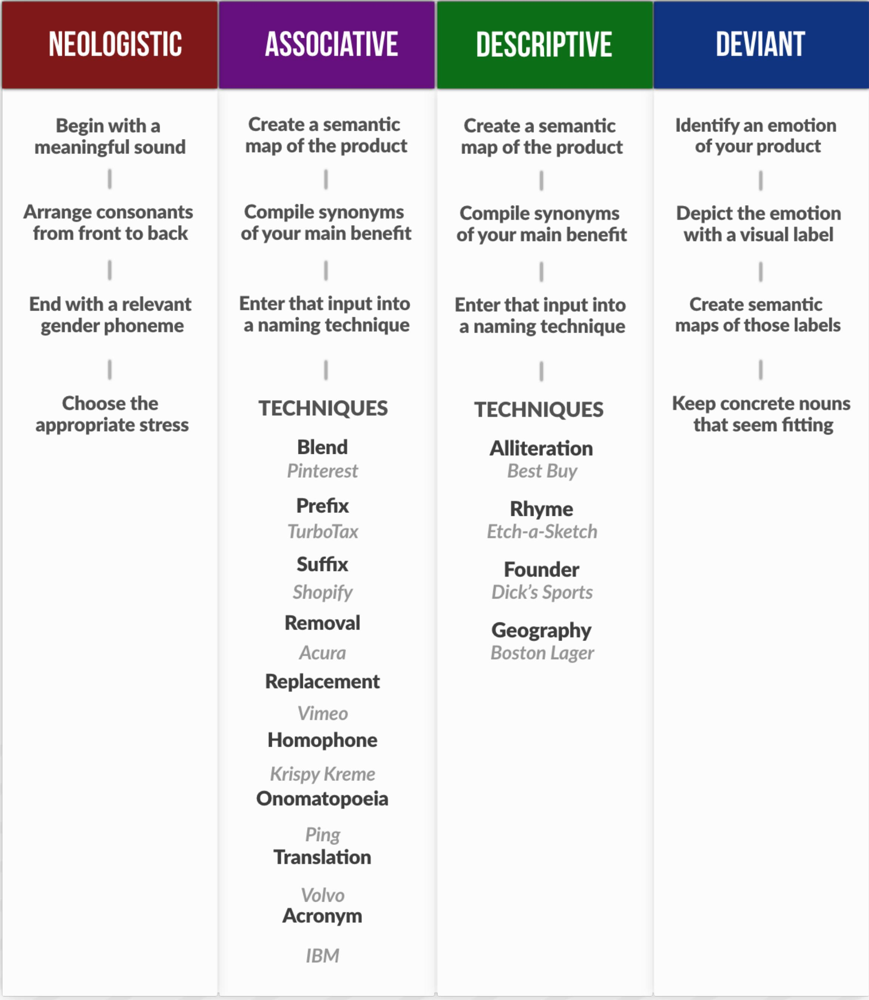

## STEP 4 Filter the Names

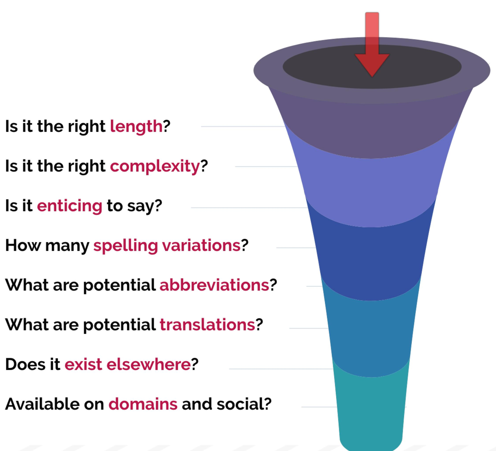

1. Choose the Type of Name   
2. Choose the Sounds and Letters   
3. Build Potential Names   
4. Choose the Best Name   
5. Add a Version or Number

## Types of Name

Certain names are better for certain products.

I noticed that two factors seemed most important: wording and relevance. So I created this 2 x 2 matrix:

## PRODUCT NAME MATRIX

DEVIANT

Apple Amazon Pandora

DESCRIPTIVE

General Motors Electronic Arts General Electric

WORD

NEOLOGISTIC

Spotify Kodak Zynga

ASSOCIATIVE

Facebook Linkedln YouTube

RELEVANCE

We now see four types of names:

» Descriptive – Words that describe the product

» Associative – Nonwords that describe the product

» Deviant – Words with no relevance to the product

» Neologistic – Nonwords with no relevance to the product

However, those two dimensions (wording and relevance) are spectrums. We need to transform this matrix into a scatterplot.

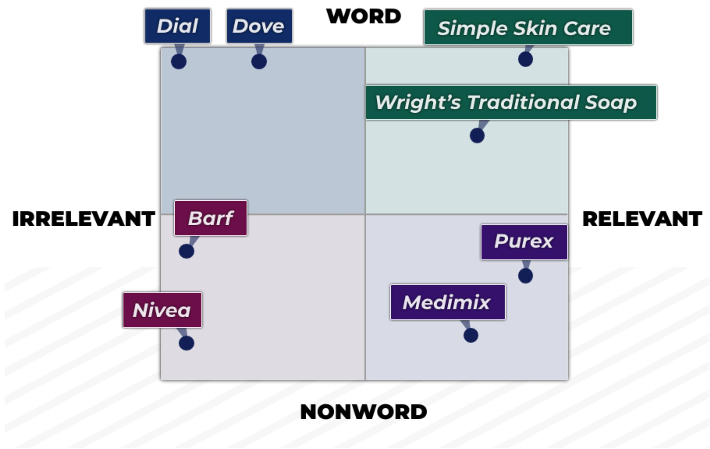  
Look at the neologistic names (bottom-left).

Barf isn’t a typo. It means “snow” in Persian. Perhaps this business has no intentions of targeting English speakers. Or maybe they want an eccentric market. Who knows.

Regardless, for English speakers, Barf and Nivea are irrelevant to soap. Yet Barf is a word, whereas Nivea is a nonword.

But here’s the point: Categorizations are subjective. Barf is a Deviant name in the Persian market, yet a Neologistic name in the English market. Use your judgment when categorizing names – there is no “right” answer.

Now that we categorized names, which names are better?

It depends on your goal.

## Which Names Are Persuasive?

Names are most persuasive when they are slightly irrelevant.

Researchers found a U-shaped relationship between the persuasiveness of a brand name and its congruency with the product (Meyers-Levy, Louie, & Curren, 1994).

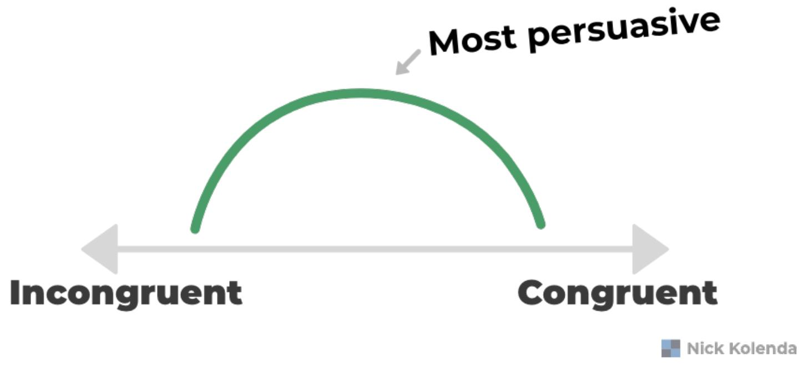

Consider the names of board games.

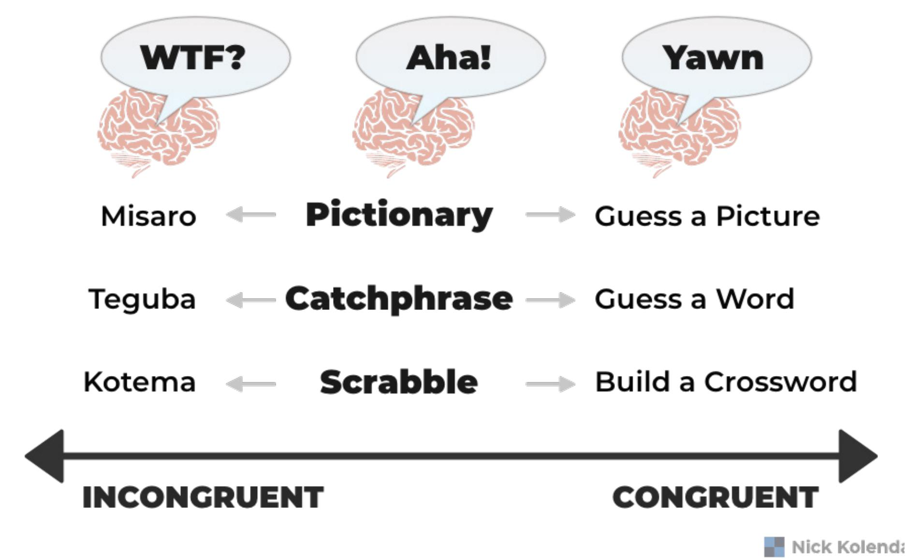

Irrelevant names nudge the customer to search for meaning:

…consumers may assume that all information offered to them by the marketer is meant to be relevant or informative and they will consequently try to make sense of it. If the ambiguous name is uninformative in the literal or semantic sense, consumers will search for a pragmatic meaning or reason for the communication. (Miller & Kahn, 2005, p. 87)

In other words, customers search for meaning behind an irrelevant name. Once they discover a connection, this “aha” moment feels good—and they misattribute this sensation to the product.

» Fully Congruent Names: We have no puzzle to solve

» Fully Incongruent Names: We can’t solve the puzzle

Therefore, always avoid the top-right and bottom-left of the scatterplot.

Persuasive Names  
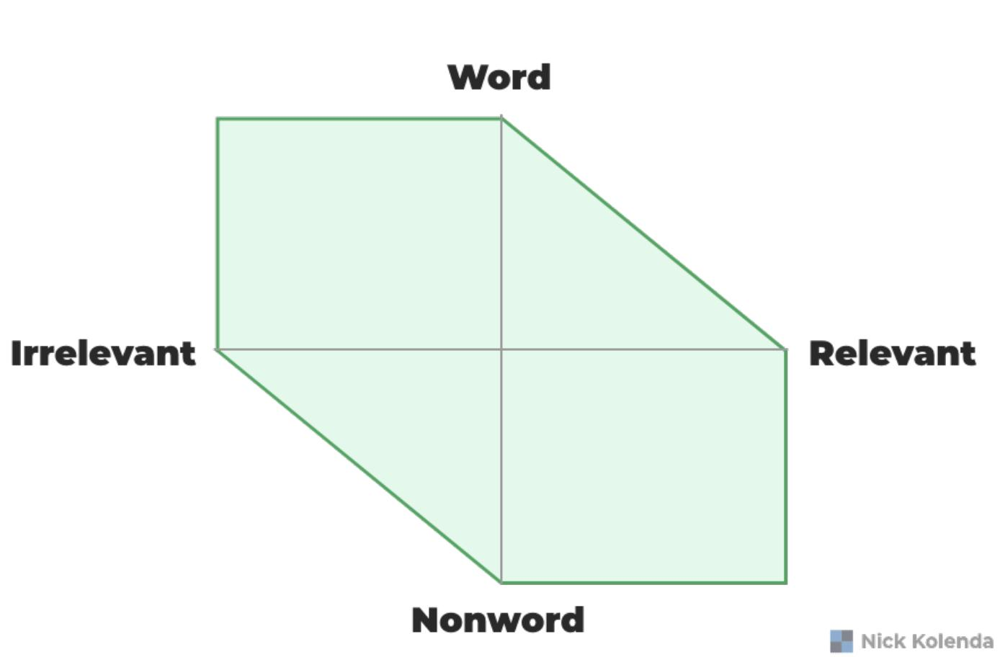

## Which Names Are Memorable?

Descriptive names are most common, yet least memorable.

But how? How could a relevant name be less memorable than a nonword—a name with no relevance to the product?

Here’s the reason: Based on EEG patterns, we think of brand names in the same way that we think of people:

…brand names tend to be processed through semantic routes. Similar to proper names and nonwords, they are represented in the lexical systems of both hemispheres. (Cheung, Chan, & Sze, 2010, p. 1)

A brand names resembles a proper name (e.g., John, Fred, Mary).

But when is the last time you met somebody named Tall Skinny Man? You haven’t. Not only would that name sound unusual, but your brain would struggle to encode it.

Therefore, avoid the top right of the scatterplot: Wright’s Traditional Soap is more memorable than Simple Skin Care.

You should also avoid extreme deviant and neologistic names. Memorable names need moderate congruence with the product (Robertson, 1989).

Therefore, avoid the top-right and extreme left of the scatterplot:

Memorable Names

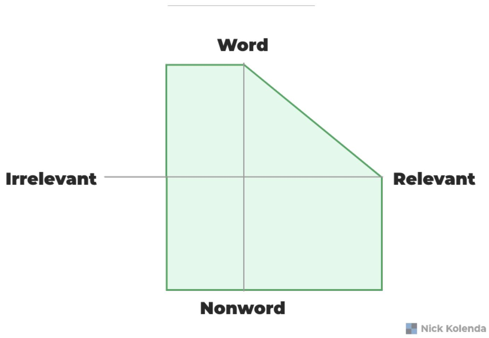

## Which Names Are Distinctive?

Descriptive names are also least distinctive:

…the name is most essential to pave the road to distinction. Because unique names – unexpected names – interesting names – not only stick with us, but also frame our expectations for the broader brand experience. (The Naming Group, 2016)

Distinctive Names  
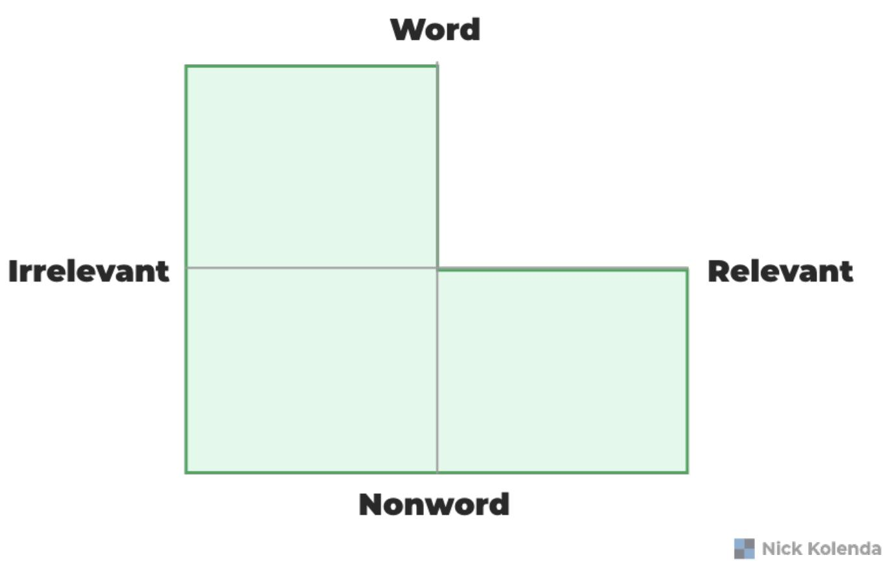

## Which Names Are Relevant?

Descriptive names have one benefit: Relevance.

Relevance can be useful for informational products (e.g., nonfiction books), but most context can benefit from irrelevance.

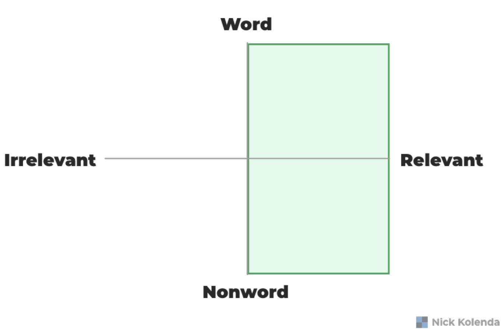

## Which Names Are Emotional?

Suppose that you want a name that communicates these traits: delicate, beautiful, innocent, and pure.

A descriptive name can’t communicate that much information in a concise way. Yet a deviant name could communicate all of that information in four letters: Dove.

Deviant names are most emotional because they can pack more emotional content into a tight space.

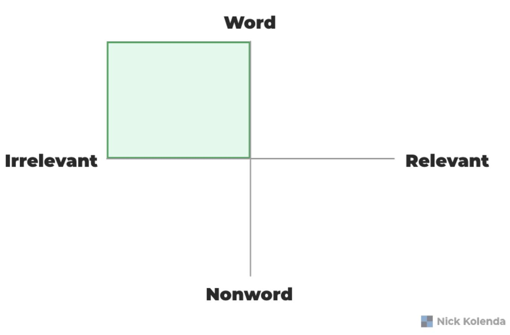

## Which Names Are Scalable?

Neologistic names are most scalable because you start with a blank canvas.

…with a nonmeaningful name (e.g. Exxon), the marketer begins with a “clean slate” and can generate product images without interference from existing perceptions. (Robertson, 1989, p. 66)

Over time, you can paint the exact perception that you want— which helps you expand to other countries:

The increasingly global nature of many markets requires that meaningful brand names be translated to achieve consistent meaning…If flexibility and adaptability are given higher priority, then a non-meaningful name is attractive. (Kohli, Harich, & Leuthesser, 2005, p. 1507)

Caveat: A relevant name can perform better with smaller budgets.

…for a given promotional budget, it would be easier to attain a desired image by building upon the base of existing, meaningful perceptions rather than starting with no such perceptual base. (Robertson, 1989, p. 66)

Think of it like car: Automatic transmission is easier, yet manual transmission has greater control. Therefore…

» Large budget? Choose greater control (neologistic)

» Small budget? Choose easier routes (descriptive, deviant, associative)

Scalable Names  
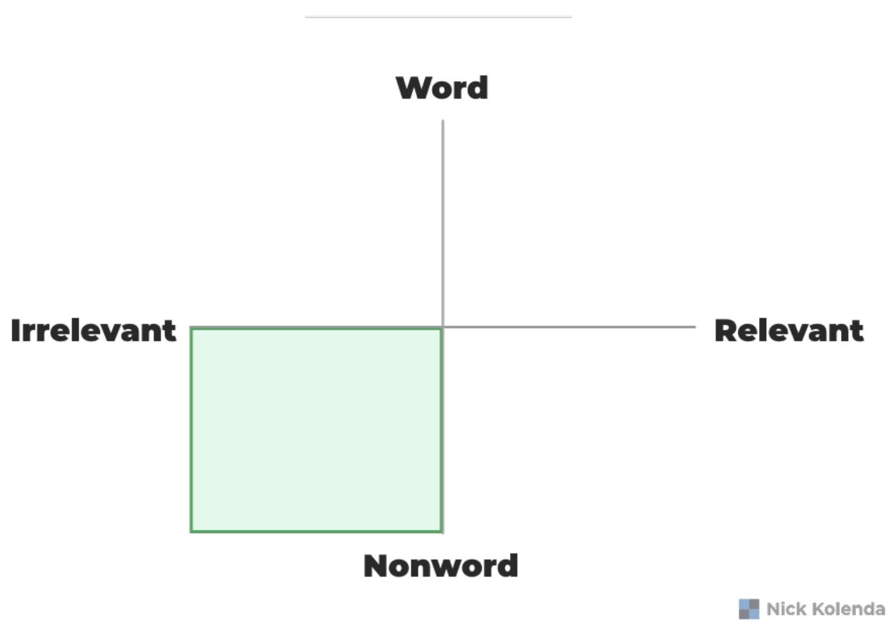

## Which Names Are More Protectable?

Ross Petty, a professor of Marketing Law at Babson, describes four categories of trademark strength. Coincidentally, these categories align perfectly with the four names in this article:

Most countries recognise roughly four categories of intrinsic trademark strength. The strongest trade marks and brand names are fanciful—made-up words or numbers that have no prior meaning such as KODAK…The next strongest are arbitrary marks—words that have meaning but no association with a particular use such as APPLE computers or CAMEL cigarettes. The third level of strength is suggestive marks—words that allude to product features or performance without actually describing them such as RAIN DANCE car wax of SURFVIVOR suntan lotion…The fourth and weakest category of trade names is descriptive words—words that describe the product, the company founder’s family name or the geographic origin of the product. (Petty, 2008, pp. 191-192)

In sum, from strongest to weakest:

1. Neologistic

2. Deviant

3. Associative

4. Descriptive

Protectable Names  
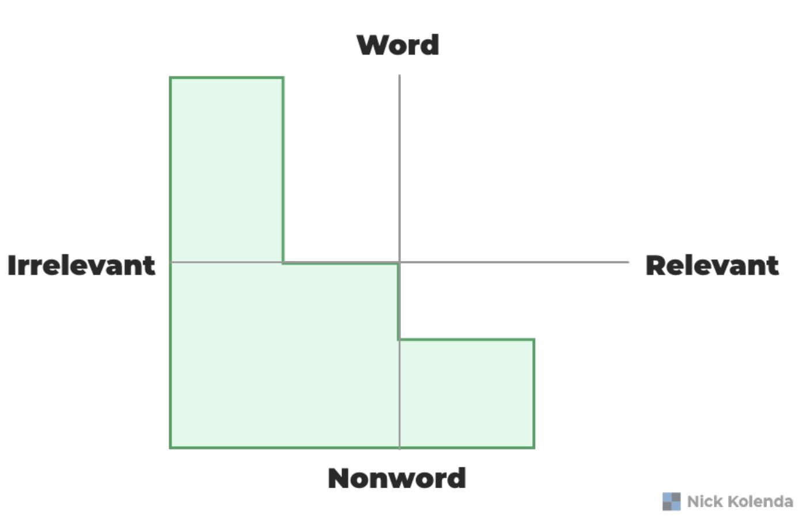

## Which Names Are Better for SEO?

Nowadays, a catchy brand name is more likely to rank in search results than a name filled with keywords.

If anything, descriptive names might hurt your ranking. Search engines will struggle to distinguish your name from the descriptive topic.

That’s why nonwords are great. Neologisms have no semantic connections—search engines can easily identify your name.

But deviant names can also work. Apple doesn’t describe their collection of “Red Delicious” or “Granny Smith” products. Therefore, search engines know that “Apple” is referring to the technology company.

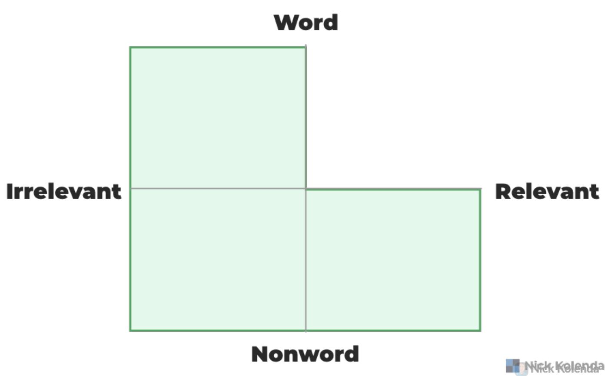

At the very least, merge a descriptive name with a unique name. Perhaps you could create a unique name (e.g., Colormatik) that you insert into services (e.g., Colormatik Logo Design, Web Design by Colormatik). Your name will appear near those keywords, so search engines will associate your name with those topics.

## Recap

Ultimately, any name can work.

But here’s the most universal suggestion: Avoid descriptive names in the top-right of the scatterplot.

…in their simplicity, [descriptive names] pave the way to daunting brand challenges: competitor encroachment, loss of trademark, lack of distinguishing identity, and the hidden killer, consumer apathy. A name that does not challenge us, does not excite us or tell us something new is a name that’s far more likely to blend. And blending is the antithesis of branding. (The Naming Group, 2016)

1. Choose the Type of Name

2. Choose the Sounds and Letters

3. Build Potential Names   
4. Choose the Best Name   
5. Add a Version or Number

Which table is mil? Which is mal?

Over 80% of people assign mal to the big table (Sapir, 1929). Did you?

Why do certain sounds feel meaningful?

Researchers used to believe that language was arbitrary. Sounds were meaningless, except for onomatopes (e.g., woof, bang, fizz).

But that belief has been debunked, thanks to interesting findings:

» Sounds are meaningful across languages. The bouba-kiki effect occurred for the Himba of Northern Namibia, a remote population with no written language (Bremner et al., 2013).

» People can decipher words in other languages. English speakers could choose which Japanese words meant “pain” (Iwasaki, Vinson, & Vigliocco, 2007).

» Sounds are meaningful in children. Babies experience the bouba-kiki effect (Maurer, Pathman, & Mondloch, 2006).

Today, most researchers believe that sounds are meaningful (an idea called sound symbolism; see Lockwood & Dingemanse, 2015 for a review).

For example, the sound ‘sn’ is often associated with the mouth and nose (e.g., snore, snout, snack, snort, sniff, sneeze).

Why not make all communication symbolic?

We actually tried.

In 1668, John Wilkins wrote a paper that proposed a new vocabulary. In any given word, the first two letters referred to a semantic category, while the remaining letters provided more detail.

It might sound good in theory, but it failed in practice.

Our language needs arbitrariness. Otherwise, we’d create mass confusion:

…if there were a close correspondence between form and meaning then the possibility of confusing the word for sheep with the one for cow is increased (e.g., if the two animals were referred to as feb and peb, respectively; Monaghan, Christiansen, & Fitneva, 2011, p. 327)

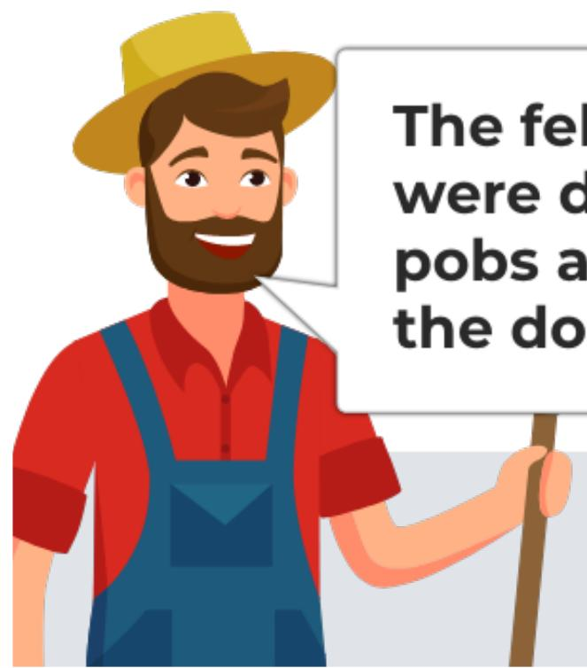  
The febs and pebs were debing with pobs and fobs on the dob today.

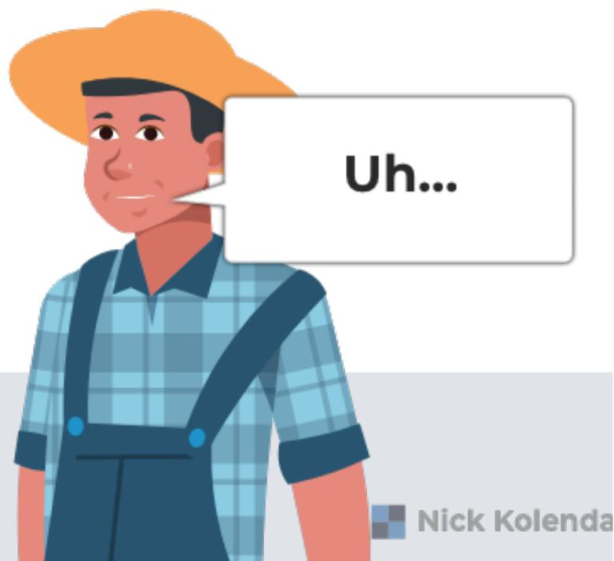

## We need both:

» Sound Symbolism—Makes communication more vivid because it reinforces the intended meaning.

» Arbitrariness—Makes communication more efficient because it allows a wider selection of letters.

# How Do Sounds Acquire Meaning?

## Certain sounds can be emotional.

…back vowels such as the [u] sound in dull or ugh are often found in English words expressing disgust or dislike (e.g., blunder, bung, bungle, clumsy, muck), and words beginning with sl also tend to have a negative connotation (slouch, slut, slime, sloven; Duduciuc, 2015, p. 113)

## Sounds can also convey semantic topics.

Exposing people to the word “bye” influences them to purchase a product because of the phonetic similarity with “buy” (Davis & Herr, 2014).

## Sounds absurd, right?

But whenever you read a word, you subvocalize those sounds—and you activate all meaning with those sounds:

…consider a consumer reading quietly. She reads an article ending with ‘bye’ and subvocalizes the word sound associated with ‘bye.’ This word sound is also associated with ‘buy.’ At this point, meanings associated with both ‘bye’ and ‘buy’ are automatically retrieved from memory. (Davis & Herr, 2014, pp. 1064-1065)

At this point, we use “homophone suppression” to ignore unrelated meanings.

However, our brains might skip that process. Unrelated meanings can creep into our perception and behavior. That’s why bye can make you buy.

Don’t jump the gun, though. Before naming your product Byminow (catchy, right?), where did these meanings come from? Why do we associate certain sounds with emotions and semantic topics?

You can blame five sources:

1. Frequency Code

2. Perceptual Fluency

3. Kinesthetic Fluency

4. Facial Feedback Hypothesis

5. Blending

## 1. Frequency Code

High-pitched sounds seem smaller because of the “frequency code” (Ohala, 1984).

Across evolution, our ancestors projected different sounds. Men projected a low-pitched bellow to intimidate predators. Women, however, needed to be cautious. They needed to alert help without attracting too much attention—otherwise more predators would find them.

Consequently, they developed a high-pitch yell:

Because high-frequency sounds are absorbed into the air far more readily than low-frequency sounds, the highpitched female scream is perfect for summoning help without signaling other predators (Feinson, 2004)

You can see this behavior in other animals:

» When a dog is aggressive, it growls.

» When a dog is submissive, it yelps.

In fact, we raise the intonation of our voice while asking questions:

…asking a question can be viewed as requiring the cooperation of the person to whom the question is addressed. Therefore a supplicating intonation is appropriate. (Ohala, Hinton, & Nicholas, 1997, p. 3)

## 2. Perceptual Fluency

Visual traits of letters can be meaningful. Think of the bouba-kiki effect:

…people might only consider the sound [b] to be rounder than the sound [k] because the letter b is rounder than the letter k. (Lockwood & Dingemanse, 2015, p. 8)

## 3. Kinesthetic Fluency

Sounds are meaningful by how we speak them. Kiki feels sharp because this shape matches the angular nature of our mouth during this speech:

…articulating kiki involves sharp inflections of the tongue and relates to the sharpness of the jagged image and the rounding of the lips and oral cavity during the articulation of bouba relates to the roundedness of the images. (Yardy, 2010, p. 8)

## 4. Facial Feedback Hypothesis

A cartoon seemed funnier when people held a pencil in their mouth, which forced them to smile (Strack, Martin, & Stepper, 1988).

Similar effects occur with sounds. People were more likely to help someone if their named ended in a hard “e” sound because this phoneme forced them to smile (Kniffin & Shimizu, 2014).

…the very pronunciation of these sounds require a specific distortion of the speaker’s face, which reinforces the emotion-response of the listener. (Feinson, 2004)

Coincidentally, some researchers found that firms with “e” sounds in their name are more successful (Pogacar, Plant, Rosulek, & Kouril, 2014). But that’s probably overkill.

## 5. Blending

This final factor is the most powerful.

Over time, our language has experienced blending: We create new words by combining existing words (see Smith, 2014).

Look at the specific years that these words entered our language:

We insert the same sounds into similar words—for example, we insert “-ash” into words related to hitting. Naturally, those sounds (-ash) seem related to hitting because we see those sounds in different hitting words.

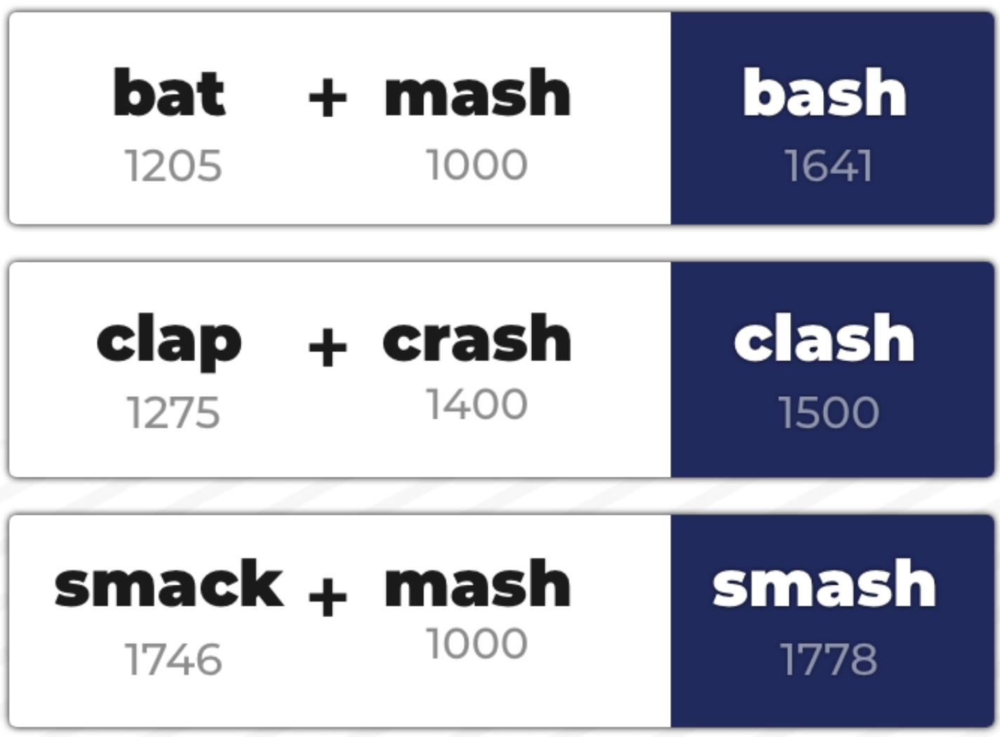

# Types of Phonemes

Every word contains one or more phonemes—the smallest units of sound (see Yorkston & Menon, 2004).

Consider the word “the”—

» 3 Letters: t – h – e

» 1 Syllable: the

» 2 Phonemes: th – uh

Roughly 44 phonemes exist (Harrington & Johnstone, 1987).

You might assume that each phoneme contains meaning. For example:

» An “a” sound means \_

» A “b” sound means

» A “c” sound means

Unfortunately, it’s not that simple. Instead of individual letters, groups of phonemes acquire meaning.

## Front vs. Back

Vowels can be front vs. back (see Klink, 2000).

» Front Vowels: Tongue is near the front (e.g., e, i, e)

» Back Vowels: Tongue is near the back (e.g., o, a, u)

This category is a spectrum (Yorkston & Menon, 2004).

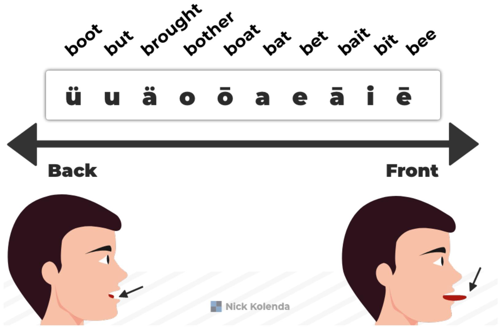

Generally, vowels toward the outer edges will contain stronger meaning.

## Voiced vs. Voiceless

Consonants can be categorized by the vibration of the vocal cords:

» Voiced: Sounds that vibrate your cords (e.g., b, d, g)

» Voiceless: Sounds that don’t vibrate your cords (e.g., p, t, f)

## Fricatives vs. Stops

Consonants can also differ by air flow:

» Fricatives: Air escapes the mouth (e.g., s, f, z)

» Stops: Air stops at the mouth (e.g., p, k, b)

## CONSONANTS

## Voiced

Vibration

B

D

G gap

V

TH

Z Zoo

J gym

M mail

N

W

Y yard

No Vibration

P pat

T

K cap

CH

Air Escapes

F   
V   
TH   
TH   
S sue   
Z Zoo   
SH   
H

Air Stops

P pat

B

T tot

gap

<table><tr><td rowspan=1 colspan=3>small</td></tr><tr><td></td><td rowspan=1 colspan=1>FrontVowels</td><td rowspan=1 colspan=1>ē, i, ā, e, a</td></tr><tr><td></td><td rowspan=1 colspan=1>Voiceless</td><td rowspan=1 colspan=1>ch, f, h, k, p,s, sh, t, th</td></tr><tr><td rowspan=1 colspan=2>Fricatives</td><td rowspan=1 colspan=1>f, h, s, sh, th,V, Z</td></tr></table>

## Meaning of Phonemes

In order to build a meaningful name , you need to insert relevant sounds into your name so that it “feels right.”

This section will describe the meaning of certain sounds.

## Physical Size

Sounds can feel small vs. large.

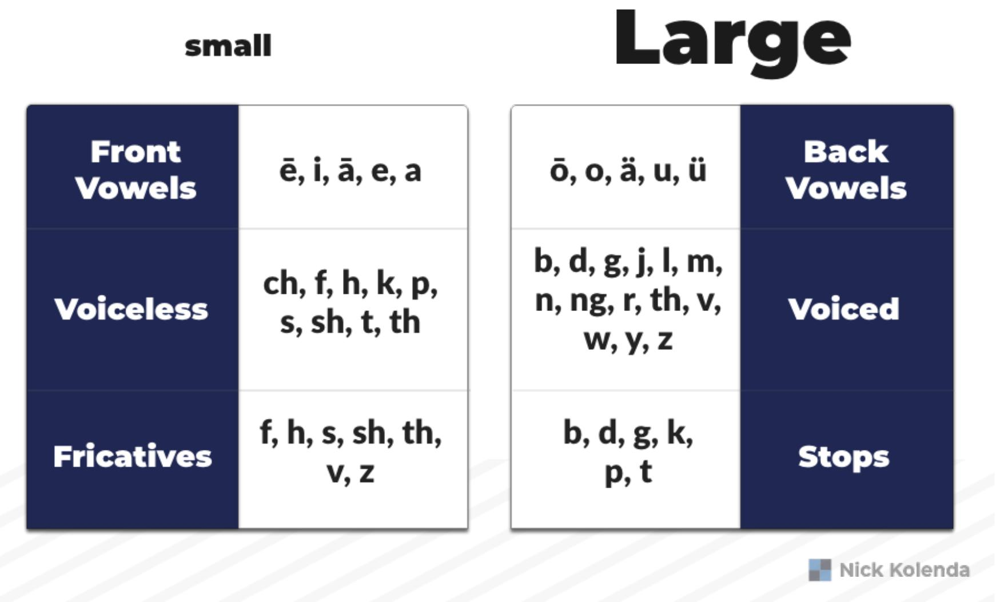  
Sources: Duduciuc (2015), Klink (2000), Lowrey and Shrum (2007)

You saw this effect earlier: A large table is “mal” (and a small table is “mil”).

Researchers also analyzed cancer medications. Most names incorporated voiceless consonants (p, t, f) to portray a smaller size of treatment (Abel & Gilnert, 2008).

## Shape

Sounds can feel angular vs. round.

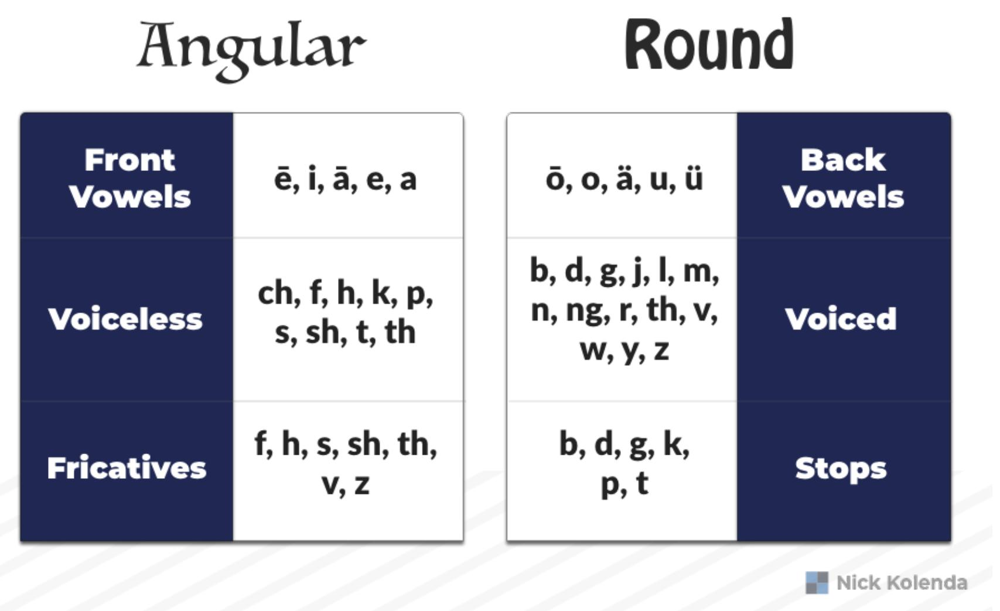

Sources: Klink (2000), Klink (2003), Yorkston and Menon (2004)

Brimley was better for a knife, yet Bromley was better for a hammer (Lowrey & Shrum, 2007).

For ice cream, people preferred a round name (Frosh) compared to an angular name (Frish) because the round name conveyed smooth and creamy ice cream (Yorkston & Menon, 2004).

## Speed

Sounds can feel fast vs. slow.

<table><tr><td rowspan=1 colspan=1>FrontVowels</td><td rowspan=1 colspan=1>ē, i, ā, e, a</td><td rowspan=1 colspan=1></td><td rowspan=1 colspan=1>ō, o, ä, u, </td><td rowspan=1 colspan=1>BackVowels</td></tr><tr><td rowspan=1 colspan=1>Voiceless</td><td rowspan=1 colspan=1>ch, f, h, k, p,s, sh, t, th</td><td rowspan=2 colspan=1></td><td rowspan=1 colspan=1>b, d, g, j, I, m,n, ng, r, th, v,w, y, z</td><td rowspan=1 colspan=1>Voiced</td></tr><tr><td rowspan=1 colspan=1>Fricatives</td><td rowspan=1 colspan=1>f, h, s, sh, th,V, Z</td><td rowspan=1 colspan=1>b, d, g, k,p, t</td><td rowspan=1 colspan=1>Stops</td></tr></table>

Sources: Robertson (1989), Klink (2000)

## Light

Sounds can feel bright vs. dark.

<table><tr><td rowspan=1 colspan=1>FrontVowels</td><td rowspan=1 colspan=1>ē, i, ā, e, a</td></tr><tr><td rowspan=1 colspan=1>Voiceless</td><td rowspan=1 colspan=1>ch, f, h, k, p,s, sh, t, th</td></tr><tr><td rowspan=1 colspan=1>Fricatives</td><td rowspan=1 colspan=1>f, h, s, sh, th,V, Z</td></tr></table>

Dark
<table><tr><td rowspan=1 colspan=1>ō, o, ä, u, ü</td><td rowspan=1 colspan=1>BackVowels</td></tr><tr><td rowspan=1 colspan=1>b, d, g, j, I, m,n, ng, r, th, v,w, y, z</td><td rowspan=1 colspan=1>Voiced</td></tr><tr><td rowspan=1 colspan=1>b, d, g, k,p, t</td><td rowspan=1 colspan=1>Stops</td></tr></table>

Sources: Robertson (1989), Klink (2003), Hirata, Ukita, & Kita (2011)

## Beauty

Sounds can feel sophisticated vs. rugged.

Sophisticated

<table><tr><td rowspan=2 colspan=1>FrontVowels</td><td></td></tr><tr><td rowspan=1 colspan=1>ē, i, ā, e, a</td></tr><tr><td rowspan=1 colspan=1>Voiceless</td><td rowspan=1 colspan=1>ch, f, h, k, p,s, sh, t, th</td></tr><tr><td rowspan=1 colspan=1>Fricatives</td><td rowspan=1 colspan=1>f, h, s, sh, th,V, Z</td></tr></table>

Rugged
<table><tr><td rowspan=1 colspan=1>ō, o, ä, u, ü</td><td rowspan=1 colspan=1>BackVowels</td></tr><tr><td rowspan=1 colspan=1>b, d, g, j, I, m,n, ng, r, th, v,w, y, z</td><td rowspan=1 colspan=1>Voiced</td></tr><tr><td rowspan=1 colspan=1>b, d, g, k,p, t</td><td rowspan=1 colspan=1>Stops</td></tr></table>

I could only find evidence with vowels (Klink & Athaide, 2012), but I suspect that the consonants in that graphic would play a role too.

## Benefits

Sounds can feel short-term vs. long-term.

## Short-Term

## Long-Term

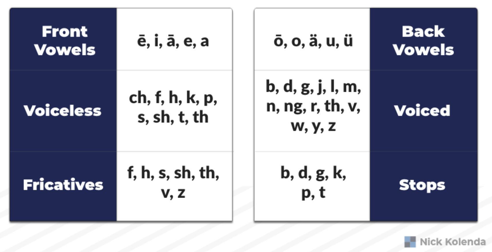

Researchers showed people a medical treatment: Dari was better for short-term treatments, whereas Daru as better for long-term treatments (Maglio, Rabaglia, Feder, Krehm, & Trope, 2014).

The reason is interesting, but a little complex—it involves a concept called construal level. You can refer to my book The Tangled Mind to learn more.

<table><tr><td>Front Vowels</td><td>ē, i, ā, e, a</td><td>ō, o, ä, u, </td><td>Back Vowels</td></tr><tr><td>Voiceless</td><td>ch, f, h, k, p, s, sh, t, th</td><td>b, d, g, j, l, m, n, ng, r, th, v, w, y, z</td><td>Voiced</td></tr><tr><td>Fricatives</td><td>f, h, s, sh, th, V, Z</td><td>b, d, g, k, p, t</td><td>Stops</td></tr></table>

Female  
Male

## Gender

Sounds can feel feminine vs. masculine.

Sources: Wu, Klink, & Guo (2013), Klink (2000), Guevremont & Grohmann (2015)

## Recap

For any name, refer to this summary chart:

1

small

Angular   
Fast   
Sophisticated   
Short-Term ↓   
Female

\- NT VOW ē, i, ā, e, a

VOICELESS ch, f, h, k, p, s, sh, t, th

FRICATIVES f, h, s, sh, th,

2

Large Round Slow Dark Rugged Long-Term Male

BACK VOWELS   
ō, o, ä, u, ü   
b, d, g, j, I, m, n,   
r, th, v, w, y, z   
b, d, g, k, p, t

Just look at which side—left or right—feels more fitting.

For example, a beer could be “cold, clean, and crisp” or “smooth, mellow, and rich.” None of those adjectives appeared in the previous groups, but you can sense that Group 1 is better for “cold, clean, and crisp” while Group 2 is better for “smooth, mellow, and rich” (see Lowrey & Shrum, 2007).

# Meaning of Phonaesthemes

What’s the meaning of glon? It’s a nonword, so give it a definition.

Got it?

Turns out, over 25% of people gave definitions related to light or vision (Magnus, 2000).

Here’s another exercise. Make up a word that describes this action: Removing the black stuff from burnt toast.

Got your word?

Turns out, 27% of people created a word that started with sk-(Magnus, 2000)

Why is there so much consistency?

In those examples, sk- and gl- are called phonaesthemes. These sounds are distinct from suffixes and prefixes (-ing, -ly, -ed) because they can’t be added to (or subtracted from) words. But they still contain meaning.

## For example:

» GL- conveys light (e.g., glimmer, glisten, glitter, gleam, glow, glare, glint).

» SN- conveys the mouth (e.g., snore, snack, snout, sniff, sneeze)

Phonaesthemes acquire meaning through blending (bat + mash = bash). Eventually, many similar words will share the same sounds:

According to such “snowballing effect” theory, a group of phonemes in related words (for example, by common etymology) becomes over time associated with the meaning of these words and given the right conditions starts to attract other words with the same phoneme into a cluster. (Abramova, Fernandez, & Sangati, 2013 p. 1696)

Sources: Otis & Sagi (2008); Abramova, Fernandez, & Sangati (2013); Feinson (2004); Kwon (2015); Smith (2014)

<table><tr><td>BL- BR-</td><td>BLOW BRIGHT</td><td>blast, blurt, blaze breezy, brisk, brilliant</td></tr><tr><td>CL-</td><td>CLANG</td><td>clank, clash, clap</td></tr><tr><td>CR-</td><td>CRANKY</td><td>crabby, crazy, cry</td></tr><tr><td>DR-</td><td>DRAG</td><td>drift, droop, drape</td></tr><tr><td>FL-</td><td>FLOW</td><td>float, flush, flee</td></tr><tr><td>FR-</td><td>FRANTIC</td><td>frazzle, fray, freaky</td></tr><tr><td>GL-</td><td>GLEAM</td><td>glow, glint, gloss</td></tr><tr><td>GR-</td><td>GROWL</td><td>grunt, groan, gruff</td></tr><tr><td>PL-</td><td>PLEASANT</td><td>playful, platonic, plentiful</td></tr><tr><td>PR-</td><td>PRIZED</td><td>present, praise, prince</td></tr><tr><td>SK-</td><td>SKIM</td><td>skid, skip, skate</td></tr><tr><td>SCR-</td><td>SCREECH</td><td>scream, scrape, scratch</td></tr><tr><td>SL-</td><td>SLIDE</td><td>slip, slope, slant</td></tr><tr><td>SN-</td><td>SNOUT</td><td>sniff, snort, sneeze</td></tr><tr><td>SPL-</td><td>SPLIT</td><td>splice, splinter, splatter</td></tr><tr><td>SQU-</td><td>SQUEEZE</td><td>squash, squirt, squirm</td></tr><tr><td>STR-</td><td>STRAIGHT</td><td>stripe, strip, stretch</td></tr><tr><td>sw-</td><td>SWING</td><td>swish, swoop, swipe</td></tr><tr><td>TR-</td><td>TREAD</td><td>trudge, trot, tramp</td></tr><tr><td>TW-</td><td>TWIST</td><td>twirl, twine, tweak</td></tr><tr><td>WH-</td><td>WHACK</td><td>whip, whoosh, whoop</td></tr><tr><td>WR-</td><td>WRITHE</td><td>wring, wrap, wrath</td></tr></table>

. Choose the Type of Name 2. Choose the Sounds and Letters

3. Build Potential Names

4. Choose the Best Name   
5. Add a Version or Number

You accomplished these steps:

» Choose the type of name (Step 1)

» Find meaningful phonemes (Step 2)

Now you need to build potential names. This section will describe a step-by-step process for the four types of names.

You should read all four methods. Each method contains information that will apply to any name.

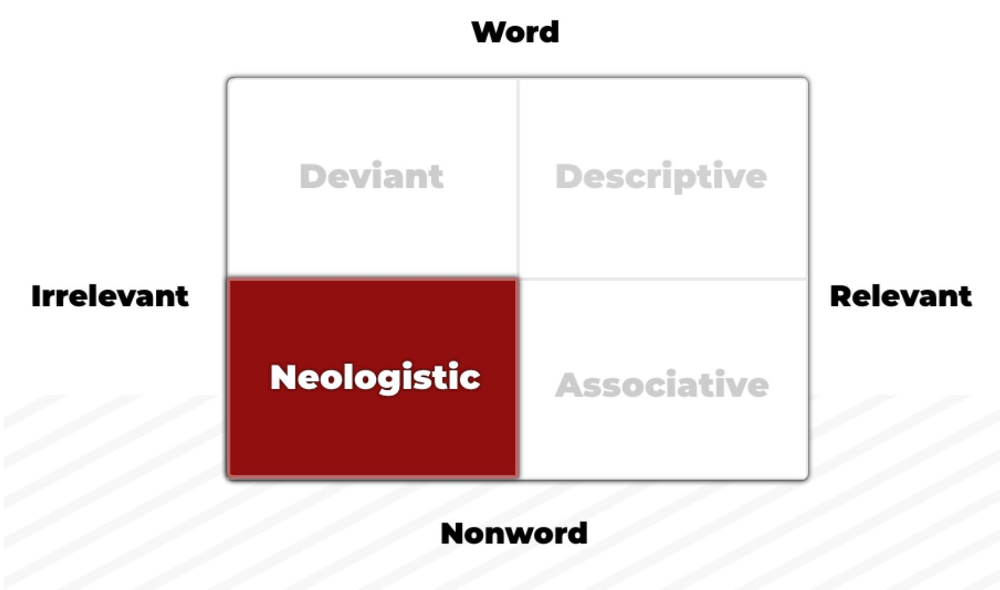

## Neologistic Names

To compose a neologistic name, follow these steps:

» A1: Begin With a Meaningful Prefix

» A2: Arrange Consonants From Front to Back

» A3: End With a Relevant Gender Phoneme

» A4: Choose the Appropriate Stress

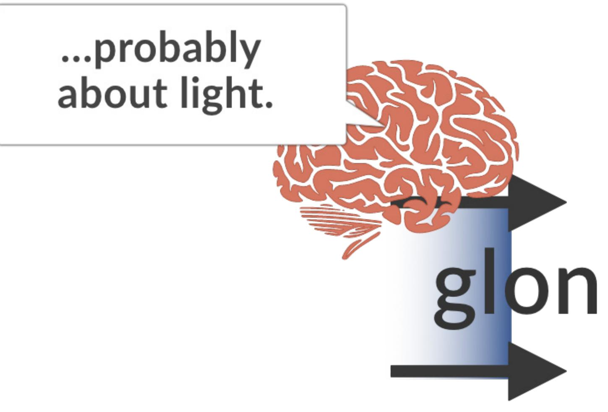

## A1) Begin With a Meaningful Prefix

The beginning of your name is crucial.

Consider charm prices. People believe that \$2.99 is much cheaper than \$3.00 because their brain encodes the price before they finish reading the number:

…while evaluating “2.99,” the magnitude encoding process starts as soon as our eyes encounter the digit “2.” Consequently, the encoded magnitude of \$2.99 gets anchored on the leftmost digit (i.e., \$2) and becomes significantly lower than the encoded magnitude of \$3.00 (Thomas & Morwitz, 2005, p. 55).

Names work the same way. People start encoding your name before they reach the end. Therefore, those initial phonemes taint the perception of the remaining name.

Scan the list of phonaesthemes for relevant letters that you could place at the beginning of your name

If you find one, huzzah!

If not, scan this list of Latin prefixes.

If you still can’t find anything, then use a plosive consonant:

Plosives are consonants such as b, c, d, g, k, p, and t, which, when pronounced, produce an explosive, popping sound. Brand names beginning with plosives were found to produce significantly better recall and recognition. (Robertson, 1989, p. 63)

## A2) Arrange Consonants From Front to Back

In a study, guess which column of names people preferred?

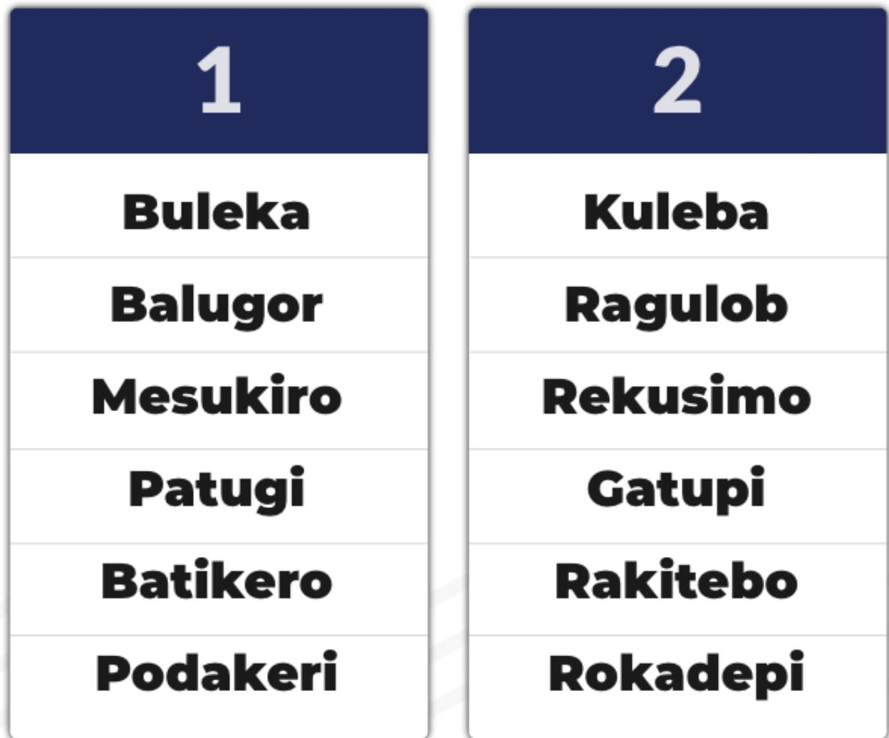

Answer: First column (Topolinski, Maschmann, Pecher, & Winkielman, 2014)

Those names simply felt right. But why?

The answer involves the direction of articulation.

In the first column, you say the beginning letters (B, F, M, P) with the front of your mouth. You say the ending letters (K, G) with the back of your mouth.

This articulation triggers an effect because of our digestive system.

…the mere articulation of inward words (featuring consonantal stricture spots wandering from the front to the rear of the mouth) would induce an affective and motivational state associated with deglutition [i.e., swallowing], namely a positive state of approach. In contrast, the articulation of outward words (featuring consonantal stricture spots wandering from the rear to the front of the mouth) would induce an affective and motivational state associated with expectoration [i.e., spitting], namely a negative state of avoidance. (Topolinsk et al, 2014, pp. 6-7)

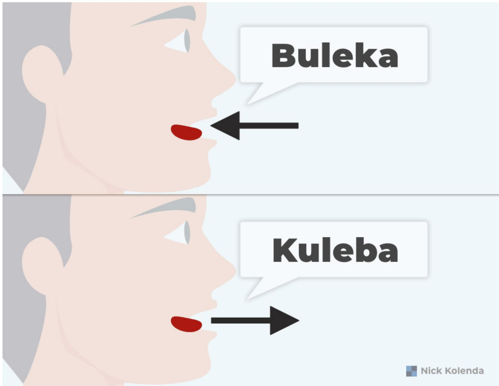

Inward names generate a higher willingness-to-pay, among other benefits (Topolisnki, Zurn, & Schneider, 2015).

## Still not convinced?

I found a dissertation by one of their students who noticed that “inward” compositions are simply more common in languages (Bakhtiari, 2015). You develop a higher “pronunciation fluency” for those words—you can speak them faster, which feels good.

The takeaway: Once you’ve chosen meaningful sounds—Group 1 or Group 2—arrange the consonants from front to back.

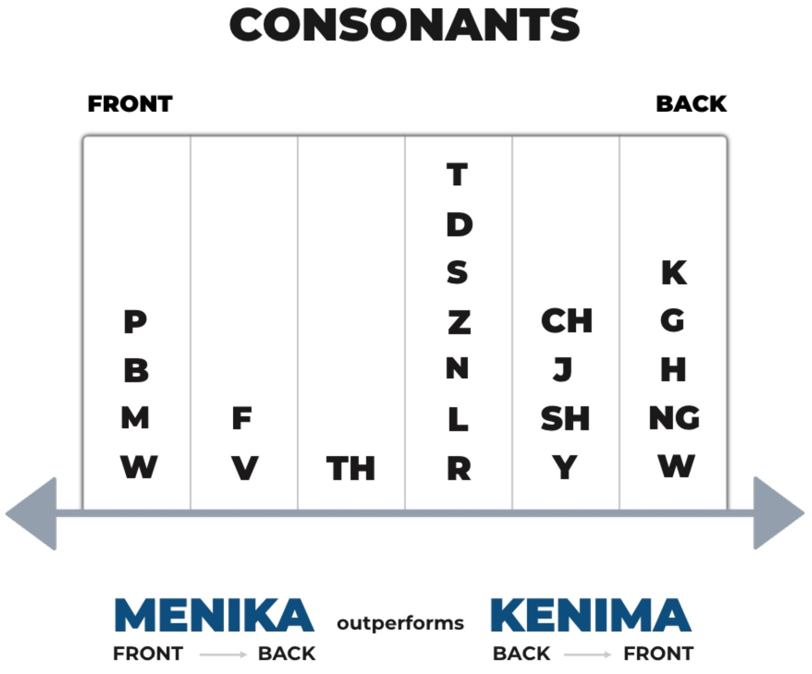

## A3) End With a Relevant Gender Phoneme

Sounds convey gender: Male names are more likely to end in consonants (e.g., Bob, Ted) whereas female names are more likely to end in vowels (e.g., Sue, Katie; Cassidy, Kelly, & Sharoni, 1999).

Consider the name Chris. It’s usually a male name, but we can transform this name into a female name by adding vowels at the end:

» Chris → Christie

» Chris → Chrissy

» Chris → Krista

We do it often. With many names:

» Nick → Nicki

» James → Jamie

» Carl → Carla

» Pat → Patti

» Vic → Vicki

And the list goes on.

Use that insight in your product name:

» Targeting Men? End with a consonant

» Targeting Women? End with a vowel

Or end with a relevant Latin suffix (see this list).

## A4) Choose the Appropriate Stress

After building a name, you need to consider the stress. For example, you could pronounce “Buleka” in different ways:

» BOO-LAY-KUH

» BOO-LEE-KUH

Those options stress the second syllable, but perhaps you should stress the first syllable:

» BEW-LUH-KUH

How do you choose the best pronunciation?

Choose a name that “feels right.” If it sounds right to you, it probably sounds right to your customers.

That said, you can consider the part of speech. Is your name a noun or a verb?

» Want a noun? Stress the first syllable

» Want a verb? Stress the later syllables

Consider these words: record, permit, and compound. Those words change meaning from nouns to verbs depending on the stress (see Bergen, 2001).

Research confirms that people tend to classify a nonword as a noun if the first syllable is stressed (Kelly, 1988).

## Case Study: Calculator

Suppose that I invented an upscale calculator. Let’s build a neologistic name.

## 1) Begin With a Meaningful Prefix

I searched for phonaesthemes and Latin prefixes, and I found these:

» BR: Bright (breezy, brisk, brilliant)

» PR: Prized (present, praise, prince)

» UTIL: Useful (utility, utilitarian)

They’re not super relevant to a calculator, so I might change them.   
We’ll see.

## 2) Arrange Consonants From Front to Back

I’ll choose Group 1 phonemes because they have fast and sophisticated. I also highlighted these phonemes in the consonant spectrum.

GROUP 1
<table><tr><td rowspan=1 colspan=1>FrontVowels</td><td rowspan=1 colspan=1>ē, i, ā, e, a</td></tr><tr><td rowspan=1 colspan=1>Voiceless</td><td rowspan=1 colspan=1>ch, f, h, k, p,s, sh, t, th</td></tr><tr><td rowspan=1 colspan=1>Fricatives</td><td rowspan=1 colspan=1>f, h, s, sh, th,V, Z</td></tr></table>

BACK  
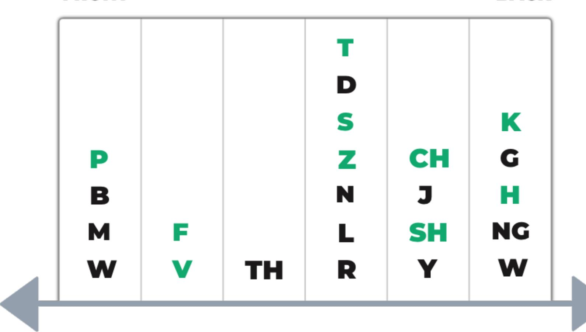

## 3) End With a Relevant Gender Phoneme

Group 1 is also masculine, so I’ll end it with a consonant plosive.   
Looking through the consonant spectrum, I notice a “K” at the end.

Now I’ll look at the arrangement of consonants, and I will test pathways that lead to a “K” at the end. I generated these names:

» Utilik » Previk » Prezik » Prazik » Privelik » Brevik » Brezik » Brazik » Brivelik

## 4) Choose the Appropriate Stress

I want my name to be a noun, so I’ll stress the first syllable (except for trisyllabic names, which sound better stressing the middle syllable).

At this point, we have a list of potential names. Now we can proceed to Step 5 to choose the final name. But first, let’s see the other naming methods.

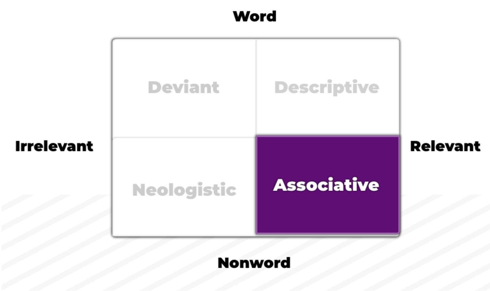

## Associative Names

You can build Associative names by following these steps:

» B1: Create a Semantic Map of Your Product

» B2: Compile Synonyms of Your Main Benefit

» B3: Use Naming Techniques to Generate Names

In this method, the first two steps will generate relevance. The final step will morph this relevance into a nonword that “feels right.”

# B1) Create a Semantic Map of Your Product

You need words that are related to your product.

Let’s stick with our calculator. I’ll create a semantic map of the core product:

Don’t write adjectives. You’re only interested in concrete topics.

And don’t stray far from the central bubble. All words should have some association with a calculator.

<table><tr><td rowspan=1 colspan=1>Price</td><td rowspan=1 colspan=1></td><td rowspan=1 colspan=1>Appearance</td><td rowspan=1 colspan=1></td><td rowspan=1 colspan=1>Usage</td></tr><tr><td rowspan=1 colspan=1>Cheap</td><td rowspan=1 colspan=1></td><td rowspan=1 colspan=1>Pretty</td><td rowspan=1 colspan=1></td><td rowspan=1 colspan=1>Fast</td></tr><tr><td rowspan=1 colspan=1>Affordable</td><td rowspan=1 colspan=1></td><td rowspan=1 colspan=1>Sleek</td><td rowspan=1 colspan=1></td><td rowspan=1 colspan=1>Powerful</td></tr><tr><td rowspan=1 colspan=1>Low</td><td rowspan=1 colspan=1></td><td rowspan=1 colspan=1>Elegant</td><td rowspan=1 colspan=1></td><td rowspan=1 colspan=1>Easy</td></tr><tr><td rowspan=1 colspan=1>Bargain</td><td rowspan=1 colspan=1></td><td rowspan=1 colspan=1>Luxury</td><td rowspan=1 colspan=1></td><td rowspan=1 colspan=1>Fun</td></tr><tr><td rowspan=1 colspan=1>Budget</td><td rowspan=1 colspan=1></td><td rowspan=1 colspan=1>Stylish</td><td rowspan=1 colspan=1></td><td rowspan=1 colspan=1>Versatile</td></tr><tr><td rowspan=1 colspan=1>Thrifty</td><td rowspan=1 colspan=1></td><td rowspan=1 colspan=1>Smooth</td><td rowspan=1 colspan=1></td><td rowspan=1 colspan=1>Intelligent</td></tr></table>

## B2) Generate Synonyms of the Main Benefit

Next, we can find a benefit to incorporate in the name. People evaluate names more favorably when they contain a positive attribute (Kohli, Harich, & Leuthesser, 2005).

Determine why people should buy your product over competitors. Then choose one or two benefits. Some examples:

I’ll choose elegant and intelligent for our calculator. I’ll enter these benefits into a thesaurus to generate synonyms.

## Semantic Domain

## Benefits

CALCULATOR
<table><tr><td rowspan=1 colspan=1>Machine</td></tr><tr><td rowspan=1 colspan=1>Device</td></tr><tr><td rowspan=1 colspan=1>Math</td></tr><tr><td rowspan=1 colspan=1>Algebra</td></tr><tr><td rowspan=1 colspan=1>Calculus</td></tr><tr><td rowspan=1 colspan=1>Geometry</td></tr><tr><td rowspan=1 colspan=1>Shapes</td></tr><tr><td rowspan=1 colspan=1>Trigonometry</td></tr><tr><td rowspan=1 colspan=1>Triangles</td></tr><tr><td rowspan=1 colspan=1>Equations</td></tr><tr><td rowspan=1 colspan=1>Student</td></tr><tr><td rowspan=1 colspan=1>Grades</td></tr><tr><td rowspan=1 colspan=1>Geek</td></tr><tr><td rowspan=1 colspan=1>Genius</td></tr></table>

INTELLIGENT  
ELEGANT
<table><tr><td rowspan=1 colspan=2>Astute</td><td rowspan=1 colspan=1>Fancy</td></tr><tr><td rowspan=1 colspan=1>Brainy</td><td rowspan=1 colspan=1></td><td rowspan=1 colspan=1>Grace</td></tr><tr><td rowspan=1 colspan=1>Brilliant</td><td rowspan=1 colspan=1></td><td rowspan=1 colspan=1>Grand</td></tr><tr><td rowspan=1 colspan=1>Creative</td><td rowspan=1 colspan=1></td><td rowspan=1 colspan=1>Luxurious</td></tr><tr><td rowspan=1 colspan=1>Rational</td><td rowspan=1 colspan=1></td><td rowspan=1 colspan=1>Opulent</td></tr><tr><td rowspan=1 colspan=1>Smart</td><td rowspan=1 colspan=1></td><td rowspan=1 colspan=1>Ornate</td></tr><tr><td></td><td></td><td rowspan=1 colspan=1>Stylish</td></tr></table>

# B3) Use Naming Techniques to Generate Names

I compiled the following naming techniques to help transform your input into something meaningful.

## BLEND TECHNIQUE Combine Two Words

<table><tr><td>Picture</td><td>+</td><td>Dictionary</td><td>Pictionary</td></tr><tr><td>Pin</td><td>+</td><td>Interest</td><td>Pinterest</td></tr></table>

<table><tr><td>Intelligent</td><td>Calculator +</td><td>IntelliCalc</td></tr><tr><td>Intelligent +</td><td>Device</td><td>Intellivice</td></tr><tr><td>+ Intelligent</td><td>Calculus</td><td>Intellicus</td></tr><tr><td>+ Intelligent</td><td>Algebra</td><td>Intellibra</td></tr><tr><td>Equations</td><td>+ Grade</td><td>Equade</td></tr><tr><td>Algebra</td><td>+ Intelligent</td><td>Algent</td></tr></table>

## PREFIX TECHNIQUE

## Add a Relevant Prefix

<table><tr><td>Turbo +</td><td>Tax</td><td>TurboTax</td></tr><tr><td>Web</td><td>MD +</td><td>WebMD</td></tr></table>

<table><tr><td>i</td><td>+</td><td>Calculator</td><td>iCalc</td></tr><tr><td>i</td><td>+</td><td>Trig</td><td>iTrig</td></tr></table>

## SUFFIX TECHNIQUE

Add a Relevant Suffix

<table><tr><td>Shop +</td><td>ify</td><td>Shopify</td></tr><tr><td>Bit</td><td>+ ly</td><td>Bitly</td></tr></table>

<table><tr><td>Geek</td><td> $+ \mathrm { i } \hbar \mathbf { y }$ </td><td>Geekify</td></tr><tr><td>Equations</td><td> $+ \in r \circ$ </td><td>Equatero</td></tr></table>

Nick Kolenda

## REMOVAL TECHNIQUE

## Remove Various Letters

<table><tr><td>Accurate</td><td>te</td><td>Acura</td></tr><tr><td>Excellent</td><td>lent</td><td>Excel</td></tr></table>

<table><tr><td>Geometry</td><td>ry</td><td>Geomet</td></tr><tr><td>Student</td><td>ent</td><td>Stud</td></tr><tr><td>Trigonometry</td><td>onometry</td><td>Trig</td></tr></table>

## REPLACEMENT TECHNIQUE

Replace Various Letters

<table><tr><td>Video</td><td>+</td><td>m</td><td>Vimeo</td></tr></table>

<table><tr><td>Intelligent</td><td>+ V</td><td>Intellivent</td></tr><tr><td>Elegant</td><td>+ V</td><td>Elevant</td></tr></table>

## HOMOPHONE TECHNIQUE

## Change the Spelling

<table><tr><td>Fantastic</td><td> $+ ~ \bf { k }$ </td><td></td><td>Fantastik</td></tr><tr><td>Crispy Cream</td><td> $+ \ \textbf { k }$ </td><td></td><td>Krispy Kreme</td></tr></table>

<table><tr><td></td><td> $w i s e + z$ </td><td>Wize</td></tr><tr><td>Acute</td><td>+ Akut</td><td>Aküt</td></tr></table>

## ONOMATOPOEIA TECHNIQUE

Imitate the Sound of Your Product

Wii

Ping

Whiz

<table><tr><td>I roll —→</td><td>Latin</td><td>Volvo</td></tr><tr><td>Humanity</td><td>Zulu</td><td>Ubuntu</td></tr><tr><td></td><td></td><td></td></tr><tr><td></td><td></td><td></td></tr><tr><td>Wise</td><td>Spanish</td><td>Sabio</td></tr><tr><td>Geek</td><td>Spanish</td><td>Friki</td></tr><tr><td>Triangle</td><td>Danish</td><td>Trekant</td></tr><tr><td>Nerd</td><td>Finnish —&gt;</td><td>Kone</td></tr><tr><td>Smart</td><td>Finnish —→</td><td>Fiksu</td></tr><tr><td>Triangle</td><td>Latin</td><td>Triangulum</td></tr></table>

## TRANSLATION TECHNIQUE

## Translate a Semantic Term

## ACRONYM TECHNIQUE

## Abbreviate a Descriptive Name

<table><tr><td>International Business Machine</td><td>IBM</td></tr><tr><td>Help a Reporter Out</td><td>HARO</td></tr></table>

<table><tr><td>The Intelligent Calculator</td><td>TIC</td></tr><tr><td>The Elegant Calculator</td><td>TEC</td></tr></table>

## Blend

IntelliCalc Intellivice Intellicus Intellibra Equade Algent

## Prefix

iCalc iTrig

## Suffix

Geekify Equatero

## Removal

Geomet   
Stud   
Trig

## Replacement

Intellivent Elevant

## Homophone

Wize Aküt

## Onomatopoeia Whiz

## Translation

Friki Sabio

Trekant

Kone

Fiksu

## Acronym

TIC TEC

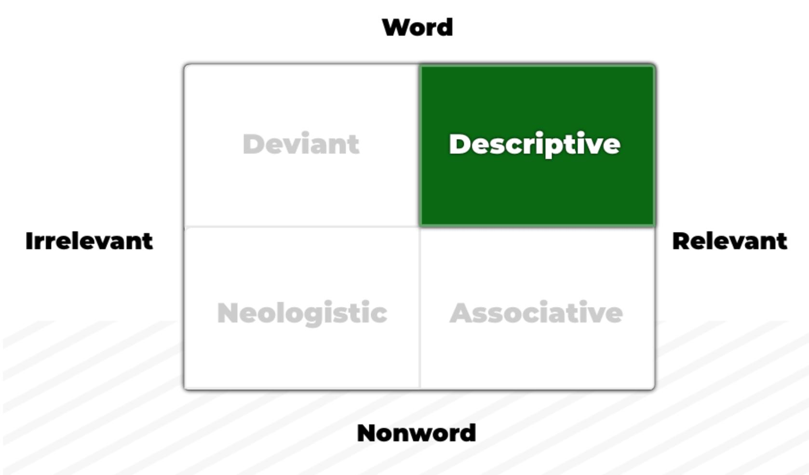

## Descriptive Names

Rarely choose a descriptive name. Names are more persuasive when they require an inference or interpretation.

But descriptive names can be useful if relevance is highly important for your product. In this scenario, follow these steps:

» C1: Identify a Descriptive Term for Your Product

» C2: Generate Synonyms of the Primary Benefits

» C3: Use a Relevant Naming Technique

## C1) Identify a Descriptive Term for Your Product

You don’t need a semantic map. Just identify the primary terms for your product or business. In our example, it’s calculator.

## C2) Generate Synonyms of the Primary Benefit

Enter your benefits into a thesaurus to find synonyms. We can use the same output from earlier:

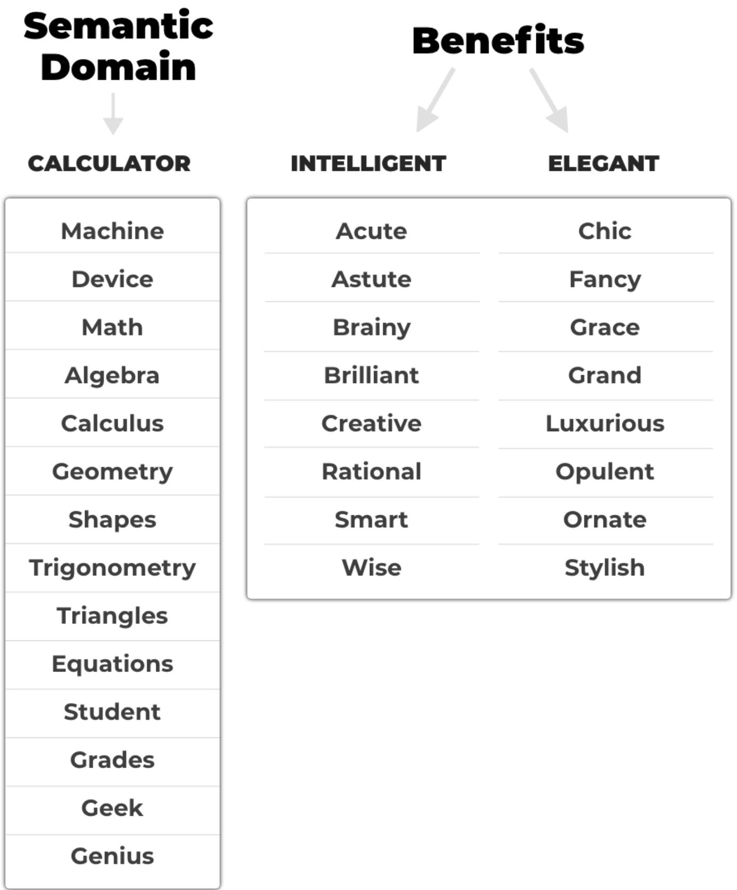

## C3) Use a Relevant Naming Technique

## ALLITERATION TECHNIQUE

## Repeat Beginning Phonemes

Better Business Bureau

Best Buy

Math Machine

## RHYME TECHNIQUE

Repeat Ending Phonemes

Etch-a-Sketch

FitBit

Chic Geek

## FOUNDER TECHNIQUEIncorporate the Founder's Name

Cici's Pizza

Dick's Sporting Goods

Kolenda Calc

## GEOGRAPHY TECHNIQUE

Incorporate the Specific Location

Boston Lager

Santa Barbara Winery

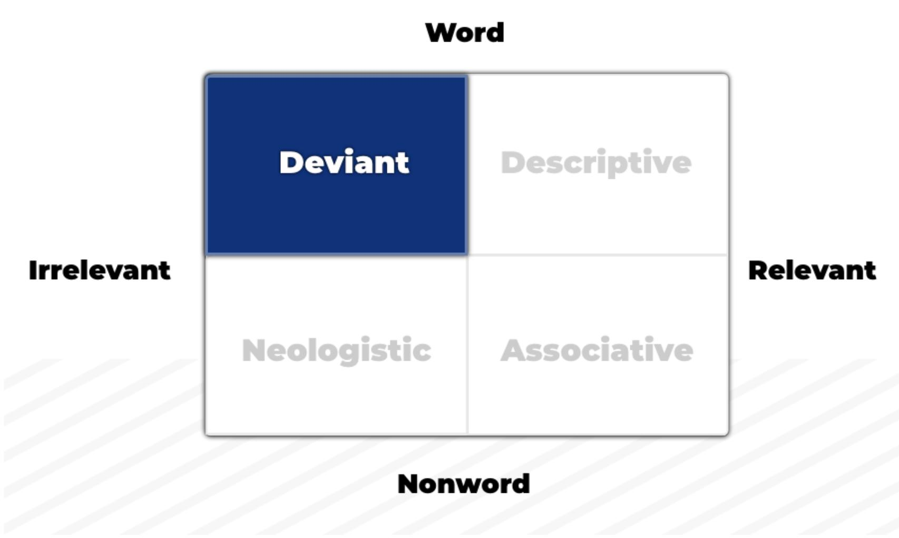

## Deviant Names

To find a Deviant name, follow these steps:

» D1: Identify the Primary Emotions of Your Product

» D2: Transform Those Emotions into Visual Labels

» D3: Create Semantic Maps Surrounding Those Labels

» D4: Keep Concrete Nouns that Spark Your Interest

## D1) Identify the Primary Emotions of Your Product

Let’s stick with our calculator. What type of emotions would customers experience with a calculator? It depends on the positioning, right?

Suppose that your calculator is very robust. It has tons of features.   
One emotion could be feeling overwhelmed (in a good way).

## D2) Transform Those Emotions into Visual Labels

Next, transform this emotion into a tangible representation.

When I visualize feeling overwhelmed, I think of a giant monster overlooking me. So I’ll choose “giant” or “monster” as the label.

## D3) Create Semantic Maps Surrounding Those Labels

I created a semantic map:

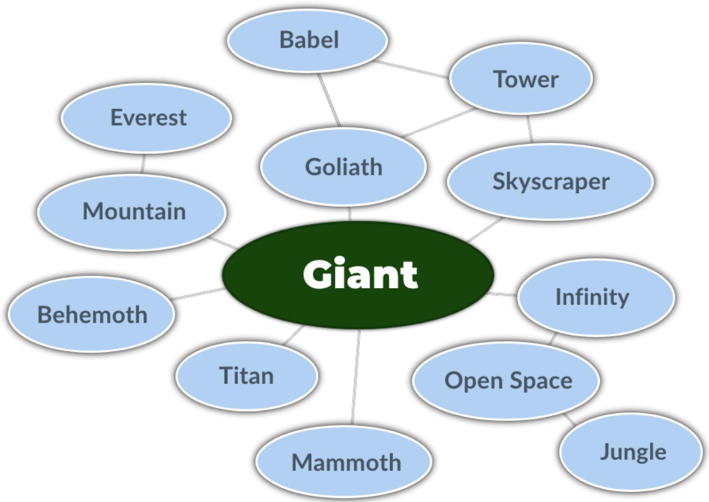

## D4) Keep Concrete Nouns that Spark Your Interest

Next, eliminate everything except concrete nouns. Nouns will make your name more memorable:

Concrete nouns, with tangible, visual referents (e.g., “dog”) more easily elicit these mental images than abstract nouns (e.g., “justice”). Therefore, concrete brand names such as Dove, Mustang, Rabbit, and Apple should inherently be more easily learned and/or retrieved from memory than abstract names such as Pledge, Tempo, Ban or Bold. (Robertson, 1989, p. 65)

Plus, nouns can be triggered. Seeing an apple will subconsciously activate the company Apple (Fitzsimons, Chartrand, & Fitzsimons, 2008).

Ultimately, I liked these names:

» Goliath   
» Babel   
» Behemoth   
» Mammoth   
» Titan

Don’t be afraid to tweak those deviant names with other naming techniques:

» Homophone: Behemoth → Behemath

» Blend: Behemoth + Genius = Behemius

» Suffix: Titan + -icus = Titanicus

1. Choose the Type of Name   
2. Choose the Sounds and Letters   
3. Build Potential Names

4. Choose the Best Name

5. Add a Version or Number

In this step, we’ll find the best name by filtering these factors:

POUR NAMES  
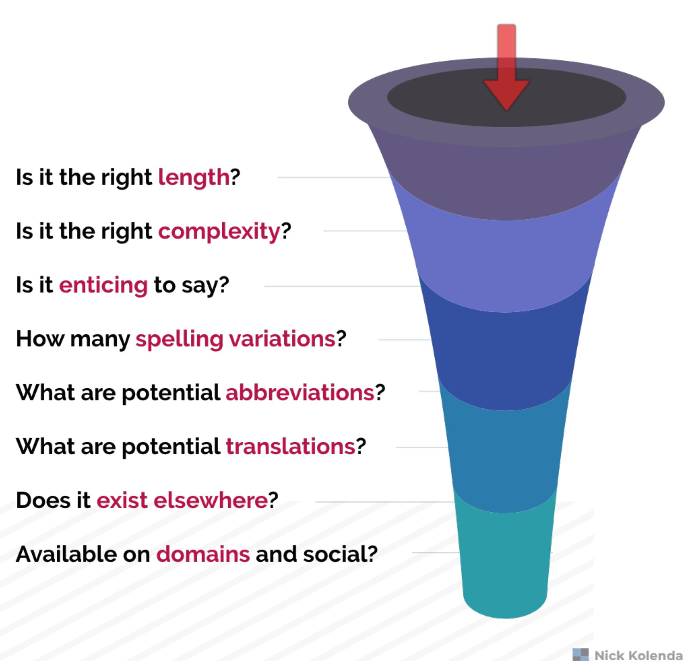

## Length

Quick. Invent a name for each polygon:

I’ll get to your names later.

For now, short names are usually good—but not always. Over time, words become longer and more complex because of the evolutionary forces of language:

We can often deduce at what point a particular word entered our language purely by evaluating the word’s simplicity. Think about domain names on the Internet. When we see a website called Books.com, Buy.com, or Frames.com, we know those sites must have been reserved fairly early in the creation of the Internet in comparison to sites like Buybookshere.com…words associated with fundamental survival needs tend to be short and simple (cow, dog, head, face, ear, eye, nose, toe, stone)…This concept also affects the way people perceive our names. Names that are short, abrupt, and simple tend to signify no-nonsense, down-toearth, active individuals, while longer multi-syllable names evoke complex and imaginative personalities. (Feinson, 2004)

Longer words usually depict more complex ideas.

Remember your polygon names? People invented longer words for the complex polygon (Topolinski et al., 2014). Did you?

Name length can also imply physical size. Prices seem smaller when they are visually smaller (Coulter & Coulter, 2005).

Same with language. Consider these two sentences:

» The pie was huge.

» The pie was huuuuuuuge.

You extend the length of “huge” to convey a larger size. Apply this finding to your product name:

Short names are better for “small” products (e.g., simple calculator)

Long names are better for “large” products (e.g., robust calculator)

## Pronunciation

Easy names feel familiar.

Familiarity is usually good, but there are exceptions. For example, the names of roller coasters influence the perceived intensity (Song & Schwarz, 2009).

» Easy names seem less intense (e.g., Chunta, Ohanzee)

» Complex names seem more exiting (e.g., Tsiischili, Heammawihio)

Same with products that are technologically advanced—you don’t want familiarity. A complex name might work better:

…depending on how the fluency feeling is interpreted in the context of initial judgment task (e.g. advancedness vs. risk), disfluent drug names can positively influence a patient’s perception of the drug, reversing the typical fluency effect. (Cho, 2014)

In addition to the ease of pronunciation, you could also add phonetic repetition, like alliteration (e.g., Best Buy) or rhyming (e.g., FitBit).

The presence of such repetitive sounds is usually pleasing to the ear and helps to generate a general pleasant feeling (Robertson, 1989, p. 67)

Repetitive sounds make your name more tantalizing (Argo, Popa, & Smith, 2010).

## Spelling Variations

Most words can be spelled more than one way (Ziegler, Stone, & Jacobs, 1997).

That can be problematic when customers hear your name. You might want to choose a name with fewer spelling variations:

…upon hearing an ad for the laundry detergent Purex a literate English speaker would know to spell it as p-u-re-x….the letters p-u-r-e-x are the only letters that would produce such a sound in English (Luna, Carnevale, & Lerman, 2013, p. 37)

If not, you could prime the correct spelling by including a similarly spelled word near your name:

…in lexical priming a real word that sounds and is spelled like the nonword is presented before the nonword (e.g., “rose” before Bose). (Luna, Carnevale, & Lerman, 2013, p. 38)

## Abbreviations

Eventually, people will abbreviate your name whether you like it or not.

So if your name is the Amazing New Ultimate Store. Well…guess what? You got a problem, ANUS.

Choose a name that—when abbreviated—is still brandable.

Ideally, abbreviations should be easy-to-pronounce. Stocks with easy-to-pronounce ticker symbols (e.g., COF) outperform stocks with difficult-to-pronounce symbols (e.g., XRI; Alter & Oppenheimer, 2006).

## Translations

The Honda Fitta sounds great, doesn’t it?

It’s cool. It’s young. It’s hip.

And it’s also Swedish for female genitalia.

Honda wasn’t too happy. Though I wonder if they changed their slogan: Small on the outside, big on the inside.

Anyway, here are other blunders:

» Mazda renamed their Laputa minivan because “puta” means “prostitute” in Spanish.

» Clairol renamed their Mist Stick because “mist” means manure in German.

» Mitsubishi renamed their Pajero because “pajero” meanings “wanker” in Spanish.

» Reebok renamed their Incubus sneaker because, in medieval folklore, an “incubus” was a demon who ravished women in their sleep.

» Exxon had tested names in 54 languages. They discovered that one name—Enco—referred to a stalled engine in Japanese.

## Availability

Search your name in Google. What shows?

And what about the domain availability? You might not need the .com domain, but it could still be useful.

Or how about social platforms? Availability might play a role in your marketing strategy.

1. Choose the Type of Name   
2. Choose the Sounds and Letters   
3. Build Potential Names   
4. Choose the Best Name

5. Add a Version or Number

Many products include numbers:

» WD-40

» 7-UP

Boeing 767

» Xbox 360

» Canon T5i

Here are some real calculator names:

» Ti-84

» Casio fx-115ES

» Avalon A-25X

» Sharp EL-501XBWH

Should your name include a version or number? These “alphanumeric names” usually work best for two types of products:

» Technical (e.g., electronic, computers, calculators)

» Chemically Formulated (e.g., drugs, fuels, vitamins)

Why do they work?

Those numbers imply certain traits about the product (Pavia & Costa, 1993). For example, people estimated a higher seat capacity in an aircraft:

…we asked participants to estimate the number of seats in two aircrafts of equivalent capacity (i.e., Airbus A330 vs.

Boeing B767)… Consistent with our premise, 25 of the 61 participants (i.e., 41%) thought that “767” stands for the number of passengers, capacity, number of seats, etc (Yan & Duclos, 2013, pp. 180-181)

## Size

Which computer do you prefer: X-100 vs. X-200?

All else equal, consumers prefer the X-200 because of a “higher is better” heuristic. Those products seem more advanced (Gunasti & Ross, 2010).

Check your competitors. What versions or numbers are they using? Consider using a higher magnitude.

You’ll also trigger anchoring. A \$500 MP3 player seemed like a better value when it was called M-600 (rather than M-500; Yan & Duclos, 2013).

## Complexity

If you chose Titan because it was short and simple, then Titan BH-X25GHL defeats the purpose. Choose a simple number (e.g., Titan 200).

## Alliteration

I didn’t choose Titan 200 arbitrarily. Alliterative numbers are better:

Participants found the fully alliterative presentation (10 Teven for \$10) to be a more attractive offer, more attention

grabbing, had higher purchase intentions for the product, were happier with the deal, and thought the deal was a better value (Davis, Bagchi, & Block, 2012, p. 600)

## Roundness

People prefer round numbers because of their simplicity:

…people prefer numbers that are products of 25 and 10 (e.g., 50%, \$125). People rate risky prospects comprised of those numbers as more attractive, and choose those prospects over similar prospects comprised of nonfluent numbers. (Janiszewski & King, 2010, p. 150)

## Composite Numbers

If you don’t use a round number, then at least use a composite number (a number that isn’t prime; Janiszewski & King, 2011).

» Cars: Volvo S12 was better than Volvo S29

» Body Spray: Axe 16 was better than Axe 17

» Contact Lenses: Solus 36 was better than Solus 37

When possible, show divisors near the number. Researchers created ads for the previous products.

» Volvo S12: They displayed a 62 in the license plate (6 x 2 = 12)

» Axe 16: They displayed a 4 on a hotel door.

» Solus 36: They emphasized “6 colors. 6 fits.”

Those divisors increase fluency, so people evaluate the names more favorably (Janiszewski & King, 2011).

## References

Abel, G. A., & Glinert, L. H. (2008). Chemotherapy as language: Sound symbolism in cancer medication names. Social Science & Medicine, 66(8), 1863-1869.

Abramova, E., Fernández, R., & Sangati, F. (2013). Automatic labeling of phonesthemic senses. In Proceedings of the Annual Meeting of the Cognitive Science Society (Vol. 35, No. 35).

Argo, J. J., Popa, M., & Smith, M. C. (2010). The sound of brands. Journal of Marketing, 74(4), 97-109.

Bakhtiari, G. (2015). The role of fluency in oral approach and avoidance (Doctoral dissertation, Universität Würzburg).

Bergen, B. K. (2001). Of sound, mind, and body: neural explanations for non-categorical phonology. University of California, Berkeley.

Bremner, A. J., Caparos, S., Davidoff, J., de Fockert, J., Linnell, K. J., & Spence, C. (2013). “Bouba” and “Kiki” in Namibia? A remote culture make similar shape–sound matches, but different shape–taste matches to Westerners. Cognition, 126(2), 165-172.

Cassidy, K. W., Kelly, M. H., & Sharoni, L. A. J. (1999). Inferring gender from name phonology. Journal of Experimental Psychology: General, 128(3), 362.

Cheung, M. C., Chan, A. S., & Sze, S. L. (2010). Electrophysiological correlates of brand names. Neuroscience letters, 485(3), 178-182.

Cho, H. (2015). The malleable effect of name fluency on pharmaceutical drug perception. Journal of health psychology, 20(10), 1369-1374.

Coulter, K. S., & Coulter, R. A. (2005). Size does matter: The effects of magnitude representation congruency on price perceptions and purchase likelihood. Journal of Consumer Psychology, 15(1), 64-76.

Davis, D., Bagchi, R., & Block, L. (2012). Alliteration Alters: Its Influence in Perceptions Fo Product Promotions and Pricing. ACR North American Advances.

Davis, D. F., & Herr, P. M. (2014). From bye to buy: Homophones as a phonological route to priming. Journal of Consumer Research, 40(6), 1063-1077.

Duduciuc, A. (2015). Social psychology applied to advertising: The effect of sound symbolism on perceived characteristics of brands. Psihologia sociala, (35), 53-61.

Iwasaki, N., Vinson, D. P., & Vigliocco, G. (2007). Chapter one how does it hurt, kiri-kiri or siku-sikui: Japanese Mimetic Words oF Pain Perceived By Japanese Speakers and English Speakers. Applying theory and research to learning Japanese as a foreign language, 2.

Feinson, R., & Imle, K. B. (2004). The Secret Universe of Names: The Dynamic Interplay of Names and Destiny. Overlook Duckworth.

Fitzsimons, G. M., Chartrand, T. L., & Fitzsimons, G. J. (2008). Automatic effects of brand exposure on motivated behavior: how apple makes you “think different”. Journal of consumer research, 35(1), 21-35.

Guevremont, A., & Grohmann, B. (2015). Consonants in brand names influence brand gender perceptions. European Journal of Marketing.

Gunasti, K., & Ross Jr, W. T. (2010). How and when alphanumeric brand names affect consumer preferences. Journal of Marketing Research, 47(6), 1177-1192.

Harrington, J., & Johnstone, A. (1987). The effects of equivalence classes on parsing phonemes into words in continuous speech recognition. Computer Speech & Language, 2(3-4), 273-288.

Hirata, S., Ukita, J., & Kita, S. (2011). Implicit phonetic symbolism in voicing of consonants and visual lightness using Garner’s speeded classification task. Perceptual and Motor Skills, 113(3), 929-940.

Janiszewski, C., & King, D. (2010). The Affective Consequences of Alpha-Numeric Branding. ACR North American Advances.

Kelly, M. H. (1988). Phonological biases in grammatical category shifts. Journal of memory and language, 27(4), 343-358.

King, D., & Janiszewski, C. (2011). The sources and consequences of the fluent processing of numbers. Journal of Marketing Research, 48(2), 327-341.

Klink, R. R. (2000). Creating brand names with meaning: The use of sound symbolism. Marketing letters, 11(1), 5-20.

Kohli, C. S., Harich, K. R., & Leuthesser, L. (2005). Creating brand identity: a study of evaluation of new brand names. Journal of business research, 58(11), 1506-1515.

Kotler, P., Burton, S., Deans, K., Brown, L., & Armstrong, G. (2015). Marketing. AU: Pearson Higher Education.

Kniffin, K. M., & Shimizu, M. (2016). Sounds that make you smile and share: a phonetic key to prosociality and engagement. Marketing Letters, 27(2), 273-283.

Kwon, N. (2015). The natural motivation of sound symbolism.

Lockwood, G., & Dingemanse, M. (2015). Iconicity in the lab: A review of behavioral, developmental, and neuroimaging research into sound-symbolism. Frontiers in psychology, 6, 1246.

Lowrey, T. M., & Shrum, L. J. (2007). Phonetic symbolism and brand name preference. Journal of Consumer Research, 34(3), 406-414.

Luna, D., Carnevale, M., & Lerman, D. (2013). Does brand spelling influence memory? The case of auditorily presented brand names. Journal of Consumer Psychology, 23(1), 36-48.

Maglio, S. J., Rabaglia, C. D., Feder, M. A., Krehm, M., & Trope, Y. (2014). Vowel sounds in words affect mental construal and shift preferences for targets. Journal of Experimental Psychology: General, 143(3), 1082.

Magnus, M. (2001). What’s in a Word?: Studies in Phonosemantics. Det historisk-filosofiske fakultet.

Maurer, D., Pathman, T., & Mondloch, C. J. (2006). The shape of boubas: Sound–shape correspondences in toddlers and adults. Developmental science, 9(3), 316-322.

Meyers-Levy, J., Louie, T. A., & Curren, M. T. (1994). How does the congruity of brand names affect evaluations of brand name extensions?. Journal of Applied Psychology, 79(1), 46.

Miller, E. G., & Kahn, B. E. (2005). Shades of meaning: the effect of color and flavor names on consumer choice. Journal of consumer research, 32(1), 86-92.

Monaghan, Padraic, Morten H. Christiansen, and Stanka A. Fitneva. “The arbitrariness of the sign: learning

advantages from the structure of the vocabulary.” Journal of Experimental Psychology: General 140, no. 3 (2011): 325.

Ohala, J. J. (1984). An ethological perspective on common cross-language utilization of $\mathsf { F } _ { 0 }$ of voice. Phonetica, 41(1), 1-16. Psychology: General, 140(3), 325.

Ohala, J. J., Hinton, L., & Nichols, J. (1997). Sound symbolism. In Proc. 4th Seoul International Conference on Linguistics [SICOL] (pp. 98-103).

Otis, K., & Sagi, E. (2008). Phonaesthemes: A corpus-based analysis. In Proceedings of the Annual Meeting of the Cognitive Science Society (Vol. 30, No. 30).

Pavia, T. M., & Costa, J. A. (1993). The winning number: Consumer perceptions of alpha-numeric brand names. Journal of Marketing, 57(3), 85-98.

Petty, R. D. (2008). Naming names: Trademark strategy and beyond: Part one—Selecting a brand name. Journal of Brand Management, 15(3), 190-197.

Pogacar, R., Plant, E., Rosulek, L. F., & Kouril, M. (2015). Sounds good: Phonetic sound patterns in top brand names. Marketing Letters, 26(4), 549-563.

Ramachandran, V. S., & Hubbard, E. M. (2001). Synaesthesia--a window into perception, thought and language. Journal of consciousness studies, 8(12), 3-34.

Robertson, K. (1989). Strategically desirable brand name characteristics. Journal of Consumer Marketing.

Sapir, E. (1929). A study in phonetic symbolism. Journal of experimental psychology, 12(3), 225.

Smith, C. (2014). The phonesthetics of blends: A lexicographic study of cognitive blends in the OED. Explorations in English Language and Linguistics, 2(1), 12-45.

Song, H., & Schwarz, N. (2009). If it’s difficult to pronounce, it must be risky: Fluency, familiarity, and risk perception. Psychological Science, 20(2), 135-138.

Strack, F., Martin, L. L., & Stepper, S. (1988). Inhibiting and facilitating conditions of the human smile: a nonobtrusive test of the facial feedback hypothesis. Journal of personality and social psychology, 54(5), 768.

Topolinski, S., Maschmann, I. T., Pecher, D., & Winkielman, P. (2014). Oral approach–avoidance: Affective consequences of muscular articulation dynamics. Journal of personality and social psychology, 106(6), 885.

Topolinski, S., Zürn, M., & Schneider, I. K. (2015). What’s in and what’s out in branding? A novel articulation effect for brand names. Frontiers in Psychology, 6, 585.

Yan, D., & Duclos, R. (2013). Making sense of numbers: Effects of alphanumeric brands on consumer inference. International Journal of Research in Marketing, 30(2), 179-184.

Yardy, B. J. (2010). Sound symbolism, sonority, and swearing: An affect induction perspective (Doctoral dissertation, Lethbridge, Alta.: University of Lethbridge, Dept. of Psychology, 2010).

Yorkston, E., & Menon, G. (2004). A sound idea: Phonetic effects of brand names on consumer judgments. Journal of consumer research, 31(1), 43-51.

Ziegler, J. C., Stone, G. O., & Jacobs, A. M. (1997). What is the pronunciation for-ough and the spelling for/u/? A database for computing feedforward and feedback consistency in English. Behavior Research Methods, Instruments, & Computers, 29(4), 600-618.

## Next Step

If you enjoyed this guide, you’d enjoy my other (free) guides on psychology and marketing.

www.NickKolenda.com