# NEGOTIATION TACTICS

A GUIDE FOR MANAGERS AND SALESpEOPLE

NICK KOLENDA

## Hello...

I’m Nick Kolenda.

I compiled this list of negotiation tactics. You’ll see a description of each technique, along with the research.

This PDF is free for everyone — send it to your team or colleagues.

Download my other guides here:

www.NickKolenda.com

## Contents

## or use as checklist

## BEFORE THE NEGOTIATION

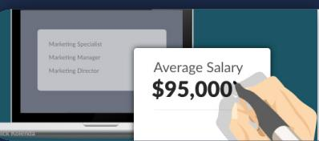

Gather Benchmark Data

You applied to... e

Enhance Your BATNAs

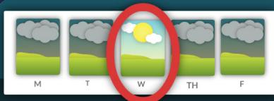

Choose a Day With Nice Weather

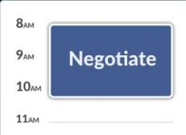

Choose an Early Time

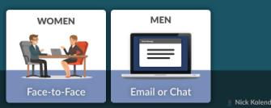

Choose the Medium of Communication

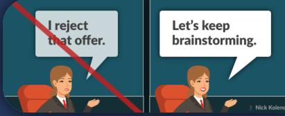

Avoid Negotiation Terminology

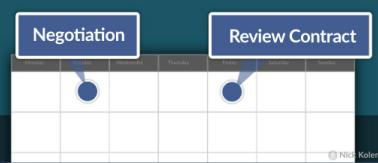

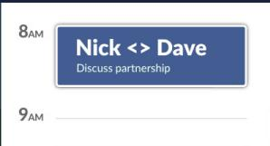

Schedule a Future Interaction

Pair Your Names in a Calendar Invite

Negotiation Tactics: A Guide for Managers and Salespeople

Nick Kolenda / Kolenda Group LLC © 2015, 2021

## DURING THE NEGOTIATION

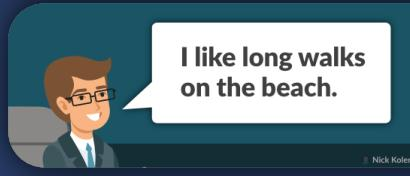

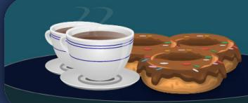

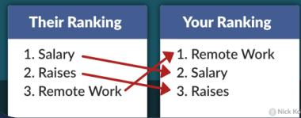

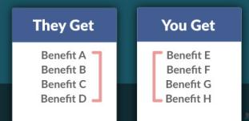

Schmooze Over Personal Details 19   
Bring Pastries and Coffee 20   
Here are slides about us. We use   
these to train new employees. Frame Any Sales Information as Training Information 22   
Give Your Counterpart a Soft and Low Chair 25   
I'm also interviewing at   
[company] and [company]. Mention Your BATNAs 27   
  
I hate to ask, but.. Avoid Disclaimers and Weak Language 28   
Your offer is lower Show Signs of Anger and Disappointment 29   
SaJoB FFERS Address All Relevant Terms 30   
Benefits Vacation   
Their Ranking Your Ranking   
1. Salary 1. Remote Work Rank Order the Terms 31   
2. Raises   
. Remoe Work   
You get [BENEFI]and [BENEFI ]   
You get [BENEFIT 1] Separate Each Gain Into Individual Components 34   
You get [BENEFIT 2]   
They Get You Get   
Depict a Visual Balance of Fairness 36   
How's.. I'd like \$90k.   
Make the First Offer 38   
I'm looking for \$93-\$95k.   
Ask for a High Precise Range 40   
If you offer health insurance,   
I could do \$93k to \$95k. Add a Simple Contingency to Your Offer 42

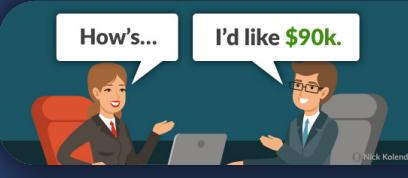

## CONTENTS / CHECKLIST

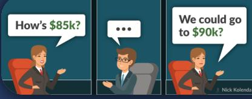

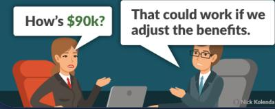

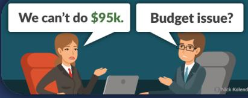

yearly   
What's your monthly revenue? Prime Their Ability to Execute the Deal 43   
  
How's \$85k? Pause After They Make an Offer 45   
<   
How's \$90k? That tothld rk if w   
Always Counter Their First Offer 47   
We can't do \$95k. Budget issue?   
Diagnose the Reasons Behind Their Responses 48

## AFTER THE NEGOTIATION

Hi Jane,

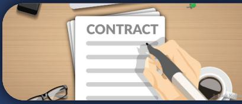

Great chatting.

Just to summarize our call..

Follow Up With an Email Summary 50   
Be the First to Draft the Contract 51

BEFORE

THE NEGOTIATION

DURING THE NEGOTIATION

AFTER

THE NEGOTIATION

INCREASE YOUR POWER

CONTROL THE LOGISTICS

ENCOURAGE COOPERATION

BUILD RAPPORT

DEMONSTRATE YOUR POWER

ADDRESS THE TERMS

ANCHOR YOUR OFFER

COUNTER THEIR OFFER

FINALIZE THE DEAL

## Gather Benchmark Data

Determine the type of deal that you should be receiving.

Negotiating a job offer? Get data on salaries (e.g., PayScale, LinkedIn, recruiters). Without this knowledge, you’ll be at the mercy of your counterparts.

## Enhance Your BATNAs

In any negotiation, you can boost your power in two ways:

1. Importance. Which party needs the agreement?

2. Alternatives. How many alternatives does each party have?

The second factor is called a BATNA: Best Alternative to a Negotiated Agreement (Fisher, Ury, & Patton, 2011). You can boost your power by raising the (a) quantity, (b) quality, and (c) plausibility of your BATNAs (Kim, Pinkley, & Fragale, 2005).

Negotiating a job offer? Interview at multiple companies so that you reduce your reliance on any single company.

## REFERENCES

Fisher, R., Ury, W. L., & Patton, B. (2011). Getting to yes: Negotiating agreement without giving in. Penguin.

Kim, P. H., Pinkley, R. L., & Fragale, A. R. (2005). Power dynamics in negotiation. Academy of Management Review, 30(4), 799-822.

BEFORE THE NEGOTIATION

DURING THE NEGOTIATION

AFTER

THE NEGOTIATION

INCREASE YOUR POWER

CONTROL THE LOGISTICS

ENCOURAGE COOPERATION

BUILD RAPPORT

DEMONSTRATE YOUR POWER

ADDRESS THE TERMS

ANCHOR YOUR OFFER

COUNTER THEIR OFFER

FINALIZE THE DEAL

# Choose a Day With Nice Weather

Weather has a powerful effect on behavior. You’re more likely to help other people during pleasant weather (Cunningham, 1979).

You feel happier in good weather, so you misattribute these positive emotions to the surrounding context.

If you need to negotiate during bad weather, discuss the weather before negotiating. This discussion will eliminate the negative effects (see Schwartz & Clore, 1983).

## REFERENCES

Cunningham, M. R. (1979). Weather, mood, and helping behavior: Quasi experiments with the sunshine samaritan. Journal of personality and social psychology, 37(11), 1947.

Schwarz, N., & Clore, G. L. (1983). Mood, misattribution, and judgments of well-being: informative and directive functions of affective states. Journal of personality and social psychology, 45(3), 513.

Negotiate

## Choose an Early Time

Suggest an early time, perhaps 8:00 to 10:00am.

First, you’ll have ample time to negotiate. If you extract a longer investment of time, your counterpart will be more invested in finalizing an agreement (Malhotra & Bazerman, 2008).

Second, you trigger a primacy effect: Information early in a sequence will become entrenched in long-term memory (Murdock, 1962).

Strive to be the first candidate in any sequence of interviews. While managers choose the best candidate, your interview will pop into their mind more easily – and they will misattribute this ease with a desire to hire you (see Whittlesea, 1993).

If an early time isn’t possible, choose a later time (perhaps 4:00 to 5:00pm). If you can’t be the first interview, strive to be the last interview to trigger a recency effect.

## REFERENCES

Malhotra, D., & Bazerman, M. H. (2008). Psychological influence in negotiation: An introduction long overdue. Journal of Management, 34(3), 509-531.

Murdock Jr, B. B. (1962). The serial position effect of free recall. Journal of experimental psychology, 64(5), 482.

Whittlesea, B. W. (1993). Illusions of familiarity. Journal of Experimental Psychology: Learning, Memory, and Cognition, 19(6), 1235.

# Choose the Medium of Communication

Should you negotiate via face-to-face or email?

Face-to-face builds more rapport, and it promotes more clarity because of the nonverbal cues (Drolet & Morris, 1999; DePaulo & Friedman 1998). Some studies argue that it’s more effective than email negotiations (Valley, Moag, & Bazerman, 1998).

However, other studies found the opposite: Email was better. Negotiators can leave an email thread more easily, so the parties are more motivated to reach an agreement (Hatta, Ohbuchi, & Fukuno 2007; Croson, 1999).

So, which is better?

Surprisingly, it depends on gender (Swab & Swab, 2008). Face-to-face has more tension and arousal, so people resort to their instinctive gender roles:

Women are caring and communicative.

Men are dominant and aggressive.

Negotiating with men? Reduce their urge to show dominance by removing nonverbal cues from the conversation — negotiate via email or phone. At the very least, minimize eye contact in person.

Do the opposite for females: Increase nonverbal cues.

## REFERENCES

Croson, R. T. (1999). Look at me when you say that: An electronic negotiation simulation. Simulation & Gaming, 30(1), 23-37.

Depaulo, B. M., & Friedman, H. S. (1998). Nonverbal communication. In D. T. Gilbert, S. T. Fiske, & G. Lindzey (Eds.), The handbook of social psychology (pp. 3–40). McGraw-Hill.

Drolet, A. L., & Morris, M. W. (2000). Rapport in conflict resolution: Accounting for how face-to-face contact fosters mutual cooperation in mixed-motive conflicts. Journal of Experimental Social Psychology, 36(1), 26-50.

Hatta, T., Ohbuchi, K. I., & Fukuno, M. (2007). An experimental study on the effects of exitability and correctability on electronic negotiation. Negotiation Journal, 23(3), 283- 305.

Swaab, R. I., & Swaab, D. F. (2009). Sex differences in the effects of visual contact and eye contact in negotiations. Journal of Experimental Social Psychology, 45(1), 129-136.

Valley, K. L., Moag, J., & Bazerman, M. H. (1998). A matter of trust’: Effects of communication on the efficiency and distribution of outcomes. Journal of Economic Behavior & Organization, 34(2), 211-238.

BEFORE THE NEGOTIATION

DURING THE NEGOTIATION

AFTER

THE NEGOTIATION

INCREASE YOUR POWER

CONTROL THE LOGISTICS

ENCOURAGE COOPERATION

BUILD RAPPORT

DEMONSTRATE YOUR POWER

ADDRESS THE TERMS

ANCHOR YOUR OFFER

COUNTER THEIR OFFER

FINALIZE THE DEAL

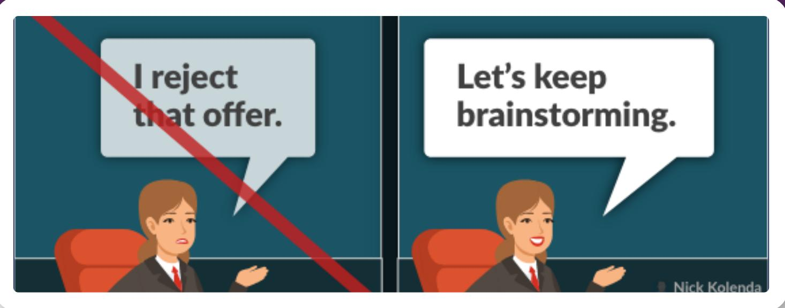

# Avoid Negotiation Terminology

Negotiation has a bad reputation in Western cultures. It seems combative — only one winner can emerge.

This philosophy influenced negotiation styles. Rather than look for mutual gains, people fixate on defending and reinforcing their position — which weakens the final deal for both parties (Fisher, Ury, & Patton, 2011).

To earn the best deal, you need a cooperative mindset. How? Choose your words carefully.

Avoid words that frame the discussion as a negotiation. Even simple words like “accepting” and “rejecting” increase aggressive tendencies (Larrick & Blount, 1997).

Use cooperative words (e.g., collaborate, brainstorm, work together). Even 1st person pronouns (e.g., us, we, our) boost cooperation (Perdue, Dovidio, Gurtman, & Tyler, 1990).

## REFERENCES

Fisher, R., Ury, W. L., & Patton, B. (2011). Getting to yes: Negotiating agreement without giving in. Penguin.

Larrick, R. P., & Blount, S. (1997). The claiming effect: Why players are more generous in social dilemmas than in ultimatum games. Journal of Personality and Social Psychology, 72(4), 810.

Perdue, C. W., Dovidio, J. F., Gurtman, M. B., & Tyler, R. B. (1990). Us and them: Social categorization and the process of intergroup bias. Journal of personality and social psychology, 59(3), 475.

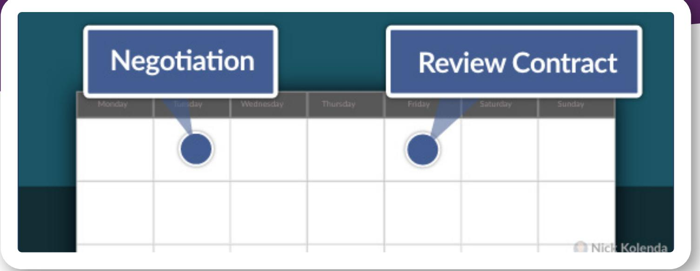

# Schedule a Future Interaction

Your counterpart will negotiate less aggressively if you schedule a future time to meet (Murninghan & Roth, 1983).

When social dilemmas involve repeated interaction over a period of time, people often develop a readiness for mutual cooperation… [This] implies that the only way to succeed is to get the other(s) to cooperate. (Pruitt, 1998, p. 474)

Perhaps you could schedule a future meeting to review the contract.

## REFERENCES

Murnighan, J. K., & Roth, A. E. (1983). Expecting continued play in prisoner’s dilemma games: A test of several models. Journal of conflict resolution, 27(2), 279-300.

Pruitt, D. G. (1998). Social conflict.

# Pair Your Names in a Calendar Invite

Group your name with their name.

In my work, I’ve argued that “gestalt grouping” is the mechanism behind empathy. We desire to help other people because our brain groups our identity with them — it feels like we are helping ourselves (see my video on The Origin of Human Empathy).

Grouping your names will trigger this effect.

If your counterpart sees your name next to their name, the positive feelings from their name will transfer to your name.

It’s similar to classical conditioning. Pavlov conditioned his dogs by pairing an emotional stimulus (food) with a neutral stimulus (bell). Their name is the emotional stimulus. Your name is the neutral stimulus. Positive emotions from their name will transfer to your name (see Chapter 4 of my book The Tangled Mind for other examples).

BEFORE THE NEGOTIATION

## DURING

## THE NEGOTIATION

## AFTER

THE NEGOTIATION

INCREASE YOUR POWER

CONTROL THE LOGISTICS

ENCOURAGE COOPERATION

## BUILD RAPPORT

DEMONSTRATE YOUR POWER

ADDRESS THE TERMS

ANCHOR YOUR OFFER

COUNTER THEIR OFFER

FINALIZE THE DEAL

# Schmooze Over Personal Details

Don’t underestimate schmoozing.

People receive better deals when they schmooze beforehand:

…schmoozing greases the wheels of sociality and commerce, allowing relationships and deals to develop despite the friction involved in negotiations. (Morris, Nadler, Kurtzberg, & Thompson, 2002, p. 99)

Personal information (e.g., what’s happening in your life) is particularly effective (Worthy, Albert, & Gay, 1969).

## REFERENCES

Morris, M., Nadler, J., Kurtzberg, T., & Thompson, L. (2002). Schmooze or lose: Social friction and lubrication in e-mail negotiations. Group Dynamics: Theory, Research, and Practice, 6(1), 89.

Worthy, M., Gary, A. L., & Kahn, G. M. (1969). Self-disclosure as an exchange process. Journal of personality and social psychology, 13(1), 59.

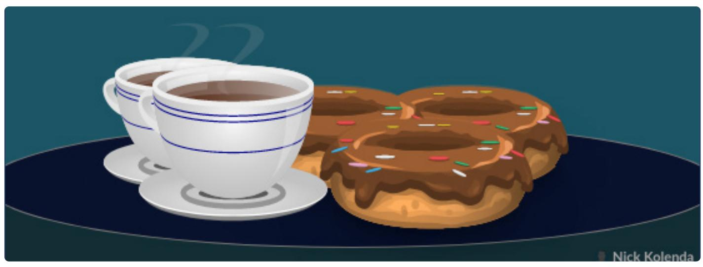

# Bring Pastries and Coffee

This tactic seems cute — but it’s devious.

Bring pastries and coffee to your next negotiation. It does four things:

Mimics Their Behavior. Both of you will be eating — and this mimicry builds rapport (see Chartrand & Bargh, 1999). Research confirms that eating improves negotiations (Maddux, Mullen, & Galinsky, 2008; Balachandra, 2013).

Provides an Unsolicited Favor. Even if your counterpart hates pastries and coffee, this unsolicited favor will trigger an urge to reciprocate (e.g., make concessions; Cialdini, 2006).

Increases Their Glucose. People behave aggressively if their glucose is low (Donohoe & Benton, 1999). Conversely, increasing glucose can boost cooperation (Denson, von Hippel, Kemp, & Teo, 2010). Pastries and coffee increase glucose levels, so they should reduce aggression (Lane, 2011).

Activates Physical Warmth. Our brain confuses physical warmth with personal warmth. Holding a warm beverage (e.g., coffee) boosts our interpersonal warmth and cooperative behavior (Williams & Bargh, 2008).

## REFERENCES

Balachandra, L. (2013). Should you eat while you negotiate. Harvard Business Review.

Chartrand, T. L., & Bargh, J. A. (1999). The chameleon effect: the perception–behavior link and social interaction. Journal of personality and social psychology, 76(6), 893.

Cialdini, R. B. (2006). Influence: the psychology of persuasion, revised edition. New York: William Morrow.

Denson, T. F., von Hippel, W., Kemp, R. I., & Teo, L. S. (2010). Glucose consumption decreases impulsive aggression in response to provocation in aggressive individuals. Journal of Experimental Social Psychology, 46(6), 1023-1028.

Donohoe, R. T., & Benton, D. (1999). Blood glucose control and aggressiveness in females. Personality and Individual Differences, 26(5), 905-911.

Lane, J. D. (2011). Caffeine, glucose metabolism, and type 2 diabetes. Journal of caffeine research, 1(1), 23-28.

Maddux, W. W., Mullen, E., & Galinsky, A. D. (2008). Chameleons bake bigger pies and take bigger pieces: Strategic behavioral mimicry facilitates negotiation outcomes. Journal of Experimental Social Psychology, 44(2), 461-468.

Williams, L. E., & Bargh, J. A. (2008). Experiencing physical warmth promotes interpersonal warmth. Science, 322(5901), 606-607.

# Frame Any Sales Information as Training Information

Humans experience psychological reactance.

If they believe that someone is trying to influence their behavior, they resist (Brehm, 1966).

Be careful with any slideshow or formal presentation. Once they see your slides, your counterparts will think: Hmm, okay. These slides are meant to persuade me.

Whoops — they will now resist anything you say (DeCarlo, 2005).

How can you prevent this harmful mindset? Simply reframe your slides by saying: Yeah, I’ll show you. We have a slide deck for new employees. It has information about our company.

It’s the same presentation, yet this subtle framing bypasses reactance because it’s no longer a “sales” presentation. These slides were designed for new employees.

## REFERENCES

Brehm, J. W. (1966). A theory of psychological reactance.

DeCarlo, T. E. (2005). The effects of sales message and suspicion of ulterior motives on salesperson evaluation. Journal of Consumer Psychology, 15(3), 238-249.

BEFORE THE NEGOTIATION

## DURING

## THE NEGOTIATION

## AFTER

THE NEGOTIATION

INCREASE YOUR POWER

CONTROL THE LOGISTICS

ENCOURAGE COOPERATION

BUILD RAPPORT

## DEMONSTRATE YOUR POWER

ADDRESS THE TERMS

ANCHOR YOUR OFFER

COUNTER THEIR OFFER

FINALIZE THE DEAL

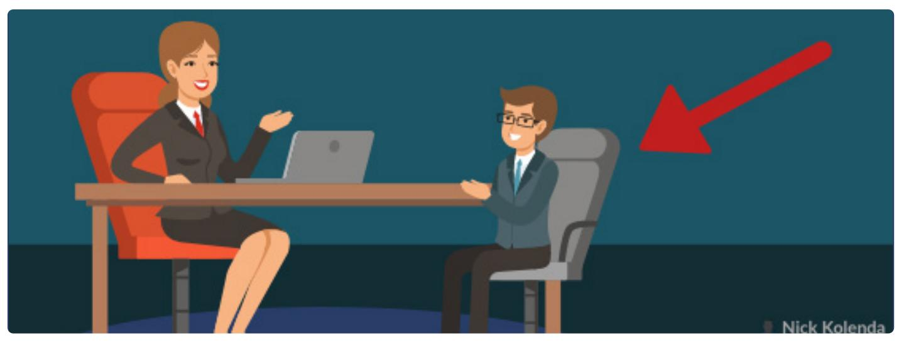

# Give Your Counterpart a Soft and Low Chair

Change the body language of your counterpart to reduce their power.

For example, give them a soft and low chair for these reasons:

Upward Angle. Your counterpart should look up at you. These angles boost your power. Even white rice seems more powerful with an upward perspective (Van Rompay, De Vries, Bontekoe, & Tanja-Dijkstra, 2012). If you’re negotiating through video chat, you could achieve a similar effect by tilting your camera upward.

Contracted Posture. Ideally, give them an awkward chair — small enough so that they need to cram into it. This posture will trigger a biological response that weakens their power (Carney, Cuddy, & Yap, 2010).

Flexible Negotiation. Why a soft chair? Because a rigid chair will extract rigid behavior. In one study, people who sat in hard chairs were more rigid while negotiating — their counteroffers were less flexible (Ackerman, Nocera, & Bargh, 2010). It seems weird, but refer to my book The Tangled Mind for the reasons behind this sensory confusion.

## REFERENCES

Ackerman, J. M., Nocera, C. C., & Bargh, J. A. (2010). Incidental haptic sensations influence social judgments and decisions. Science, 328(5986), 1712-1715.

Carney, D. R., Cuddy, A. J., & Yap, A. J. (2010). Power posing: Brief nonverbal displays affect neuroendocrine levels and risk tolerance. Psychological science, 21(10), 1363-1368.

Van Rompay, T. J., De Vries, P. W., Bontekoe, F., & Tanja‐Dijkstra, K. (2012). Embodied product perception: Effects of verticality cues in advertising and packaging design on consumer impressions and price expectations. Psychology & Marketing, 29(12), 919-928.

## Mention Your BATNAs

Be honest with your BATNAs (DeRue, Conlon, Moon, & Willaby, 2009).

Negotiators who are perceived to have many (rather than few) alternatives (1) will be considered more attractive negotiation partners, (2) will be less likely to have others negotiate aggressively with them, (3) will more easily reach an agreement, and (4) will capture a higher percentage of the value in negotiations. (Malhotra & Bazerman, 2008)

Plus, this disclosure gets your counterpart to be honest as well (Collins & Miller, 1994). You’ll hear a more accurate portrayal of their needs — which can lead to better outcomes for you and them.

## REFERENCES

Collins, N. L., & Miller, L. C. (1994). Self-disclosure and liking: a meta-analytic review. Psychological bulletin, 116(3), 457.

DeRue, D. S., Conlon, D. E., Moon, H., & Willaby, H. W. (2009). When is straightforwardness a liability in negotiations? The role of integrative potential and structural power. Journal of Applied Psychology, 94(4), 1032.

Malhotra, D., & Bazerman, M. H. (2008). Psychological influence in negotiation: An introduction long overdue. Journal of Management, 34(3), 509-531.

# Avoid Disclaimers and Weak Language

Sometimes you will negotiate with a “powerful” counterpart, such as your boss. In these scenarios, you might feel pressured to use disclaimers:

“I know this might sound like a lot, but ))

“I hate to ask for this, but )i

“Would you possibly consider ?”

Eliminate these words. Your counterparts will negotiate more aggressively, giving you a worse deal. (Van Kleef, De Dreu, & Manstead, 2006). You receive better deals when you are firm and confident (Tiedens & Fragale 2003).

## REFERENCES

Tiedens, L. Z., & Fragale, A. R. (2003). Power moves: complementarity in dominant and submissive nonverbal behavior. Journal of personality and social psychology, 84(3), 558.

Van Kleef, G. A., De Dreu, C. K., & Manstead, A. S. (2006). Supplication and appeasement in conflict and negotiation: The interpersonal effects of disappointment, worry, guilt, and regret. Journal of personality and social psychology, 91(1), 124.

## Show Signs of Anger and Disappointment

In later stages of negotiations, show anger and disappointment to get larger concessions (Van Kleef, De Dreu, & Manstead, 2006, Van Kleef, De Dreu, & Manstead, 2004).

Caveat: Your response must be reasonable (Steinel, Van Kleef, Harnick, 2008).

Plus, there’s another benefit of disappointment.

Most people guess that the most important outcome of a negotiation is the economic value of a deal (i.e., money). But there’s a bigger factor: Perceived performance.

MBA graduates were more satisfied with their job (and stayed longer) if they believed they performed well in their job negotiation. Their actual salaries had no effect (Curhan, Elfenbein, & Kilduff, 2009).

Therefore, your counterpart will feel better about their deal if you show signs of disappointment (Thompson, Valley, & Kramer, 1995).

Caveat: Your counterpart might also develop a negative perception of you (Kopelman, Rosette, & Thompson, 2006). Consider using this tactic only for short-term relationships. And always direct your anger toward the offer – never at the person.

## REFERENCES

Curhan, J. R., Elfenbein, H. A., & Kilduff, G. J. (2009). Getting off on the right foot: Subjective value versus economic value in predicting longitudinal job outcomes from job offer negotiations. Journal of Applied Psychology, 94(2), 524.

Kopelman, S., Rosette, A. S., & Thompson, L. (2006). The three faces of Eve: Strategic displays of positive, negative, and neutral emotions in negotiations. Organizational Behavior and Human Decision Processes, 99(1), 81-101.

Steinel, W., Van Kleef, G. A., & Harinck, F. (2008). Are you talking to me?! Separating the people from the problem when expressing emotions in negotiation. Journal of Experimental Social Psychology, 44(2), 362-369.

Thompson, L., Valley, K. L., & Kramer, R. M. (1995). The bittersweet feeling of success: An examination of social perception in negotiation. Journal of Experimental Social Psychology, 31(6), 467-492.

Van Kleef, G. A., De Dreu, C. K., & Manstead, A. S. (2004). The interpersonal effects of anger and happiness in negotiations. Journal of personality and social psychology, 86(1), 57.

Van Kleef, G. A., De Dreu, C. K., & Manstead, A. S. (2006). Supplication and appeasement in conflict and negotiation: The interpersonal effects of disappointment, worry, guilt, and regret. Journal of personality and social psychology, 91(1), 124.

BEFORE THE NEGOTIATION

## DURING

## THE NEGOTIATION

## AFTER

THE NEGOTIATION

INCREASE YOUR POWER

CONTROL THE LOGISTICS

ENCOURAGE COOPERATION

BUILD RAPPORT

DEMONSTRATE YOUR POWER

## ADDRESS THE TERMS

ANCHOR YOUR OFFER

COUNTER THEIR OFFER

FINALIZE THE DEAL

## Address All Relevant Terms

In negotiations, your biggest enemy is a fixed pie mentality.

Consider a job negotiation. The employer offers \$110,000. But you want \$130,000. With a fixed pie, at least one party needs to concede. Typically, both parties concede to the middle — in this case \$120,000.

But this final agreement is worse for both parties. With the right approach, your deals can be favorable to both parties.

How? Avoid fixating on a single metric (e.g., salary).

Instead, you need to address all terms. For job negotiations, address the terms beyond salary:

Benefits

Working from home

Vacation days

Scheduled raises

Commissions

Other perks

By listing all terms, your negotiation becomes more flexible. You might accept the \$110,000 salary if you can work from home for two days each week.

## Rank Order the Terms

After listing the terms, rank them in order of importance:

…information about positions and preferences is more distributive in that it highlights differences, whereas information about priorities is more integrative in that it identifies potential trade-offs. (Weingart & Olekalns, 2004, p. 146)

Ranked lists will help you see the areas of flexibility: You might place a large value on commissions, and your employer might be more flexible with commissions.

However, never address terms sequentially. Don’t resolve salary. THEN commissions. THEN vacation days. Resolve everything at once. Lumping everything will maintain your bargaining power. You can concede in less important areas to receive value in more important areas.

## REFERENCES

Weingart, L. R., & Olekalns, M. (2004). Communication processes in negotiation: Frequencies, sequences, and phases. The handbook of negotiation and culture, 143-157.

# Separate Each Gain Into Individual Components

Which option is better:

You find a \$20 bill

• You find a \$10 bill. Then another \$10 bill

Both outcomes are the same, yet the second outcome feels better (Kahneman & Tversky, 1979).

Follow that guideline in negotiations. Consider this benefit:

• The project will be completed under budget by May 3 You could separate that benefit into smaller pieces:

• The project will meet all quality requirements

• The project will be completed under budget

• The project will be completed by May 3

Voila. You turned one benefit into three. Your counterpart will perceive more value in the deal (Malhotra & Bazerman, 2008).

## REFERENCES

Malhotra, D., & Bazerman, M. H. (2008). Psychological influence in negotiation: An introduction long overdue. Journal of Management, 34(3), 509-531.

Kahneman, D., & Tversky, A. (1979). Prospect Theory: An Analysis of Decision under Risk. Econometrica, 47(2), 263-292.

# Depict a Visual Balance of Fairness

People care about relative value. How much do they receive compared to you?

In one study, researchers asked people to participate in an experiment:

One group was offered \$7.

Another group was offered \$8 (but they were told that other participants were paid \$10).

The second group was less likely to participate, even though they were offered more money (Blount & Bazerman, 1996).

In negotiations, you need a sense of equality. Your list of benefits should never seem visually longer (Petty & Cacioppo, 1984).

## REFERENCES

Blount, S., & Bazerman, M. H. (1996). The inconsistent evaluation of absolute versus comparative payoffs in labor supply and bargaining. Journal of Economic Behavior & Organization, 30(2), 227-240.

Petty, R. E., & Cacioppo, J. T. (1984). Source factors and the elaboration likelihood model of persuasion. ACR North American Advances.

BEFORE THE NEGOTIATION

## DURING

## THE NEGOTIATION

AFTER

THE NEGOTIATION

INCREASE YOUR POWER

CONTROL THE LOGISTICS

ENCOURAGE COOPERATION

BUILD RAPPORT

DEMONSTRATE YOUR POWER

ADDRESS THE TERMS

ANCHOR YOUR OFFER

COUNTER THEIR OFFER

FINALIZE THE DEAL

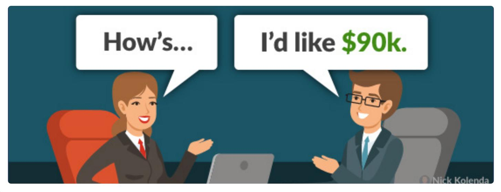

# Make the First Offer

## Always make the first offer:

When I poll executives, more than three quarters believe that it’s usually best not to make the first offer…There’s only one problem with this assumption: it’s wrong. One thorough analysis of negotiation experiments showed that every dollar higher in the first offer translates into about 50 cents more in the final agreement. (Grant, 2013).

## Why?

First, your counterpart will focus on the best qualities about your offer.

…a high list price directed real estate agents’ attention to the house’s positive features (such as spacious rooms or a new roof) while pushing negative features (such as a small yard or an old furnace) to the back recesses of their minds. (Galinsky, 2004)

Negotiating a job offer? Requesting a high salary will orient this employer to look for your best qualities that justify this cost.

Second, you trigger an anchoring effect (see Epley & Gilovich, 2006).

Most employers are considering a range of salaries, such as \$70k - \$95k. Your requested salary (\$100k) will pull them to the higher end of their range (\$95k).

Without an anchor, your salary would settle near the midpoint of their range — in this case \$82.5k (which is \$12.5k less than you would have received).

## REFERENCES

Epley, N., & Gilovich, T. (2006). The anchoring-and-adjustment heuristic: Why the adjustments are insufficient. Psychological science, 17(4), 311-318.

Galinsky, A. D. (2004). When to make the first offer in negotiations. Harvard Business School Working Knowledge.

## Ask for a High Precise Range

While negotiating, you should ask for a range of prices.

Researchers compared different requests for an \$80k salary:

Backdown Range: \$70k - \$80k (target at top)

• Bracketing Range: \$75 - \$85k (target in middle)

• Bolstering Range: \$80k - \$90k (target at bottom)

Bump Up Point: \$90k (single high point)

A bolstering range produced the highest salary (Ames & Mason, 2015).

You should also request a precise range (e.g., \$81k to \$84k).

Precise numbers activate a precise mental ruler. One interval in this scale is less distance than one interval in a “zoomed out” scale.

...the resolution of this scale might also influence the amount of adjustment. X units of adjustment along a fine-resolution scale will cover less objective distance than the same number of units

of adjustment along a coarse-resolution scale. (Janiszewski & Uy, 2008, p. 121)

# Your counterpart will be less likely to move away from a precise range because this movement feels larger.

## REFERENCES

Ames, D. R., & Mason, M. F. (2015). Tandem anchoring: Informational and politeness effects of range offers in social exchange. Journal of personality and social psychology, 108(2), 254.

Janiszewski, C., & Uy, D. (2008). Precision of the anchor influences the amount of adjustment. Psychological Science, 19(2), 121-127.

## Add a Simple Contingency to Your Offer

Paradoxically, you can enhance your offer by asking for more value.

Research confirms that contingencies are persuasive: Hmm, I could sell the product for \$64 if you agree to post a review afterward (Blanchard & Carlson, 2016).

Contingencies make it seem like you are sacrificing. Thus, buyers want to reciprocate by accepting.

This strategy can bypass the tug-of-war in salary negotiation: You request \$95k…they counter with \$85k… you meet at \$90k.

Instead, a contingency can distract them from this instinctive compromise: I could do \$95k if there’s a good benefits package.

Perhaps you already know they offer good benefits. It doesn’t matter — this mere request will frame your offer as a sacrifice. Your counterpart will perceive less room to negotiate.

## REFERENCES

Blanchard, S. J., Carlson, K. A., & Hyodo, J. D. (2016). The favor request effect: requesting a favor from consumers to seal the deal. Journal of Consumer Research, 42(6), 985-1001.

# Prime Their Ability to Execute the Deal

Decisions are made via simulation.

If you ask for a salary of \$95k, your counterpart will imagine giving you \$95k to gauge how it feels (see my book Imagine Reading This Book).

Subtle words can influence this mechanism. Compare these two questions:

How much is monthly revenue?

How much is yearly revenue?

Both questions ascertain the amount of revenue. Yet the second framing — yearly revenue — is better.

This question orients their focus toward a larger version of revenue. While simulating your offer, they will imagine withdrawing \$95k from this larger number, which feels easier and less painful.

BEFORE THE NEGOTIATION

## DURING

## THE NEGOTIATION

## AFTER

THE NEGOTIATION

INCREASE YOUR POWER

CONTROL THE LOGISTICS

ENCOURAGE COOPERATION

BUILD RAPPORT

DEMONSTRATE YOUR POWER

ADDRESS THE TERMS

ANCHOR YOUR OFFER

COUNTER THEIR OFFER

FINALIZE THE DEAL

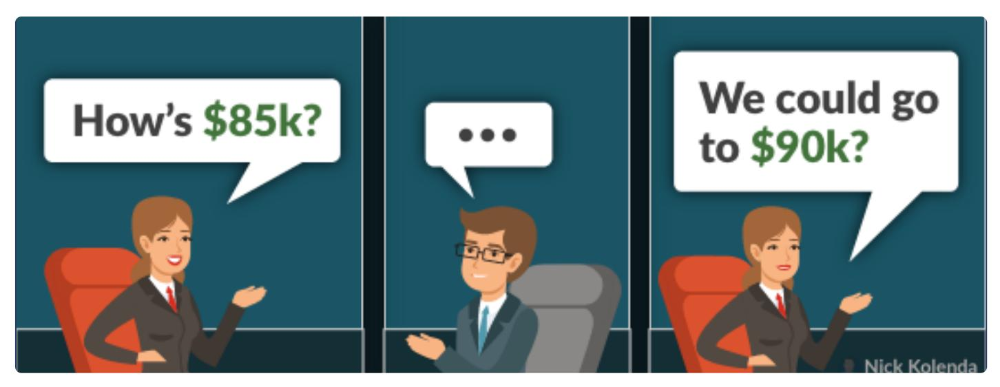

# Pause After They Make an Offer

Your counterpart made a generous offer that you don’t want to counter.   
At this moment, pause for a few seconds before accepting.

Your silence will make them uncomfortable — and they might preemptively enhance their offer before you answer:

Them: How is \$85,000 for the salary?

You: [pause for 5 seconds]

Them: We could go up to \$90,000.

If they interject, then great. If not, then accept or counter. Either way, your silence was simply a moment to ponder the offer.

If anything, immediate concessions can be harmful. Counterparts feel regretful, as if they are overvaluing your offer:

…concessions, especially immediate ones, will be interpreted as signaling a defective or overpriced object that the other party is trying to unload rather than a conciliatory move designed to aid the focal negotiator. (Kwon & Weingart, 2005, p. 4).

## REFERENCES

Kwon, S., & Weingart, L. R. (2008). Social motive expectations and the concession timing effect. In IACM 21st Annual Conference Paper.

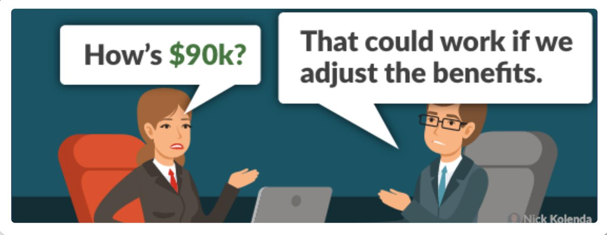

# Always Counter Their First Offer

Don’t be greedy — but counter their first offer.

Countering is good for you and the counterpart. Why? Because they will be happier with the deal (Galinsky, Seiden, Kim, & Medvec, 2002).

If you accept their first offer, they feel regretful — as if they received a suboptimal deal. Countering will make them happier with the final deal.

Now, should you counter a counteroffer?

Never counter for the sake of countering. Compare this counteroffer to your benchmark data. What deal were you hoping to secure? If this offer is generous — and it matches your intended deal — then accept.

## REFERENCES

Galinsky, A. D., Seiden, V. L., Kim, P. H., & Medvec, V. H. (2002). The dissatisfaction of having your first offer accepted: The role of counterfactual thinking in negotiations. Personality and Social Psychology Bulletin, 28(2), 271-283.

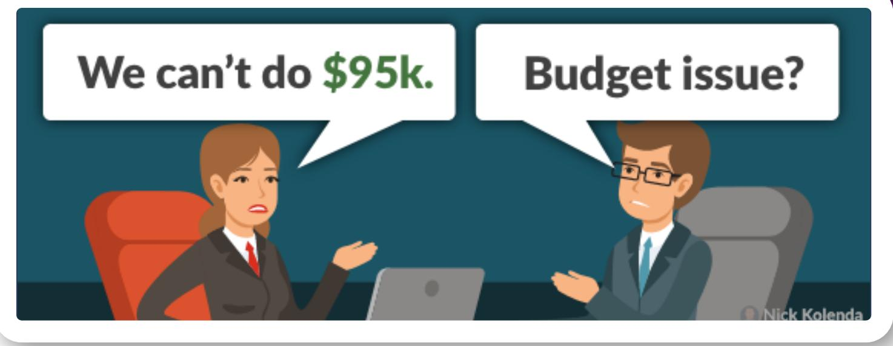

# Diagnose the Reasons Behind Their Responses

Your boss tells you that a raise isn’t doable. No reason. No explanation.   
Just…no.

Always diagnose the reason: What’s the issue? Budget? Timing? Performance?

Once you get these answers, find a solution. When will the budget open up? When will the timing be better? What will it take to earn that raise?

BEFORE THE NEGOTIATION

DURING THE NEGOTIATION

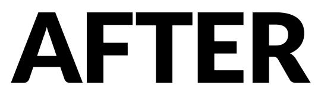

THE NEGOTIATION

INCREASE YOUR POWER

CONTROL THE LOGISTICS

ENCOURAGE COOPERATION

BUILD RAPPORT

DEMONSTRATE YOUR POWER

ADDRESS THE TERMS

ANCHOR YOUR OFFER

COUNTER THEIR OFFER

FINALIZE THE DEAL

## Follow Up With an Email Summary

Get written proof as quickly as possible. Follow up via email and thank your counterpart for the opportunity to talk. Use this email to summarize the terms that you discussed.

Confirm a response so that you’ll have written proof while drafting the formal agreement.

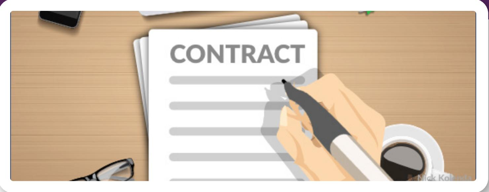

# Be the First to Draft the Contract

When possible, you should draft the contract.

Not only will you finalize the agreement faster, but you can also control the terms.

…the party who introduces its boilerplate contract will have a significant advantage in the negotiation: even strategically placed defaults on important contractual elements (such as contract length, penalties, and termination clauses) are likely to be stickier when they are pre-written into the contract. (Malhotra & Bazerman, 2008, p. 18)

Don’t be manipulative. Always be transparent with the agreement. But take this initiative so that you can structure the terms.

## REFERENCES

Malhotra, D., & Bazerman, M. H. (2008). Psychological influence in negotiation: An introduction long overdue. Journal of Management, 34(3), 509-531.

## Next Step...

Did you read this guide to improve your skills in selling?

I compiled a step-by-step methodology to help sell any product or service. Check out my course on Sales Psychology:

www.NickKolenda.com/video-courses