Psy cholog y

#

Nick Kolenda

## BEST SIZE SHAPE MATERIAL DESIGN OF PRODUCT PACKAGES

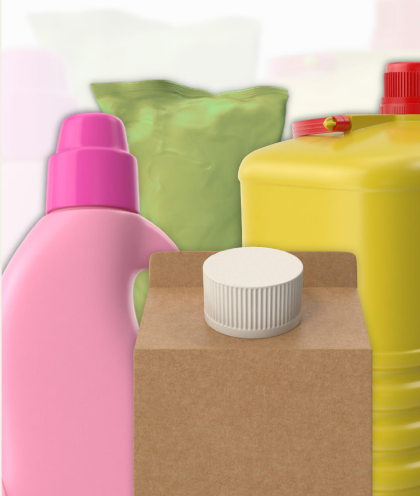

Packaging Psychology: The Best Size, Shape, Material, and Design of Product Packages

Nick Kolenda © Copyright 2022

More Free Guides: www.NickKolenda.com

## Con

## SIZE

Tall Packages Seem Larger 4   
Tall Packages Seem Healthy and Luxurious 5   
Wide Packages Seem Heavier 7   
Small Packages Seem Dense and Powerful 9   
SHAPE   
Round Packages Seem Sweet and Feminine 12   
Maintain the Full Shape of Your Package 13   
Transparent Windows Convey Freshness 14   
MATERIAL   
Remove Packaging From Fresh Products 16   
Matte Packages Seem Healthy 17   
Rough Textures Seem Masculine 18   
Glass Seems Better Than Plastic 20   
DESIGN   
Unknown Brands Should Invest in Packaging 22   
Show More Product Units on the Package 23   
Display Realistic Images for Emotional Products   
Place Heavy Products in the Bottom or Right   
Choose Light and Natural Colors for Healthy Products

## Size Shape Mat erial Design

## Tall Packages Seem Larger

Customers use height to estimate sizes.

Bottles of beer seem larger than cans of beer because customers fixate on the height (Raghubir Krishna, 1999).

However, elongated packages come with a drawback: Since these packages seem larger, customers buy less.

Researchers analyzed 20,000+ purchases of light beer. Turns out, customers buy cans at a 64% higher quantity than bottles (Yang & Raghubir, 2005).

The Takeaway: Tall packages might perform better for one-time purchases because they seem larger, but wider packages might perform better for bulk purchases because customers buy more.

## Tall Packages Seem Healthy and Luxurious

We’re wired to see human traits in objects. It’s called anthropomorphism.

Packaging is no exception.

Customers subconsciously compare packaging traits to humans, which can mold their perception of a brand—e.g., tall packages seem healthy because they remind customers of a tall and slender person (van Ooijen, Fransen, Verlegh, & Smit, 2017).

$$
1 = 1
$$

Tall packages seem luxurious, too. Participants believed that tall and thin people belonged in a higher socioeconomic class, and—in turn—they believed that tall packages would be more effective in high-end markets (Chen, Pang, Koo, & Patrick, 2020).

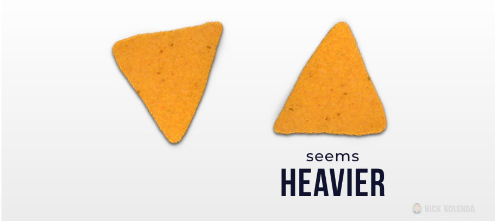

## Wide Packages Seem Heavier

Heavy objects are stable.

And customers erroneously believe the reverse: Stable objects seem heavier (Yang, Yan, & Raghubir, 2021).

Researchers varied stability for three food items—chips, chocolate, yogurt—by adjusting their orientations. The “stable” food seemed heavier, and participants were willing to pay a higher price (Yang, Yan, & Raghubir, 2021).

Selling yogurt? Wide packages should perform better for a rich and creamy brand because these containers seem heavier.

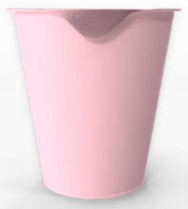  
better for LIGHT yogurt

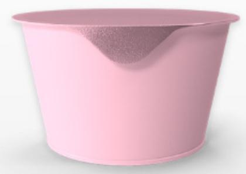  
better for CREAMY yogurt

You can also manipulate the package shape. A “healthy” brand should shorten the width at the bottom of their package because this instability will make the container seem lighter.

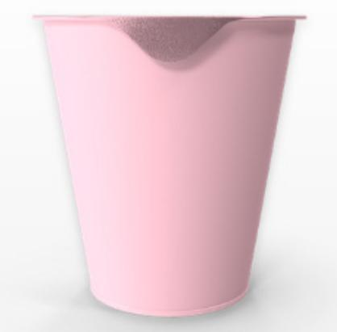  
UNSTABLE (lighter)

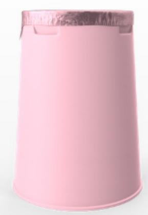  
STABLE (heavier)

# Small Packages Seem Dense and Powerful

Products seem tighter and denser in small packages.

For example, coffee seems more intense and bitter from a narrow cup (Van Doorn et al., 2017).

## Reasons:

» Condensed Average. Imagine an averaged sized cup of coffee. If you see a smaller cup, you might conceptualize this transformation in two ways. The smaller cup is (1) a smaller sample from the average cup, or (2) a condensed version of the average cup. The second transformation will make the coffee seem more intense.

» Higher Price Per Unit. Products in small packages are more expensive per unit, which inflates the perceived quality. Customers preferred the taste of Pringles chips from a small (vs. large) can because their expectations were higher (Yan, Sengupta, & Wyer Jr, 2014).

» Full Portion. Participants preferred a 1 oz. serving of Gatorade when it came from an individual packet (vs. a

32 oz. container; Ilyuk & Block, 2016). Customers prefer individual servings because they seem like a full portion. When you extract a serving from a large inventory, it feels like a partial serving (and thus less effective). Perhaps that’s why some brands of laundry detergent are now selling individual capsules (e.g., Tide Pods).

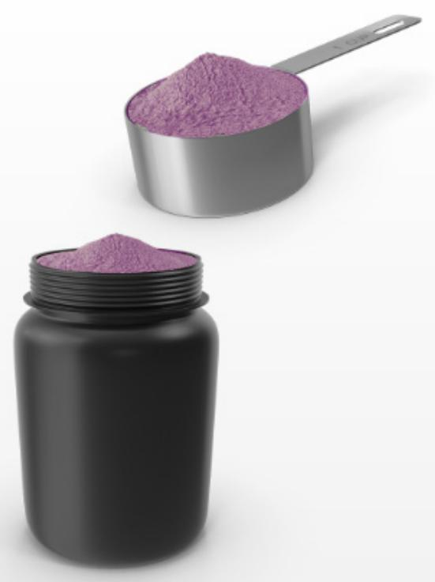  
PARTIAL serving

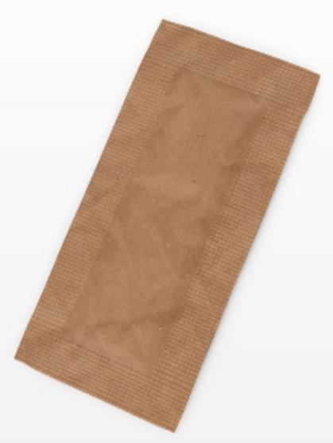  
FULL serving

## Size Shape Ma erial Design

# Round Packages Seem Sweet and Feminine

Customers evaluate brands by comparing them to humans.

For example, shapes imply gender: Angularity seems masculine, while roundness seems feminine because of evolutionary roots (e.g., female bodies are more curved; see Van Tilburg, Lieven, Herrmann, & Townsend, 2015).

In turn, this belief affects packaging: Angular packages seem masculine, while round packages seem feminine (Pang & Ding, 2021).

Gender has other traits, too. Round packages seem feminine, so they inherit feminine traits, such as sweetness (Velasco, Salgado-Montejo, Marmolejo-Ramos, & Spence, 2014). Choose a round package for sweet chocolate, yet an angular package for spicy food.

# Maintain the Full Shape of Your Package

Some brands insert a hole in their package for functional or aesthetic reasons.

But any missing section makes the package seem smaller and less desirable (Sevilla & Kahn, 2014).

Instead of using empty gaps as makeshift handles, consider adding a separate attachment.

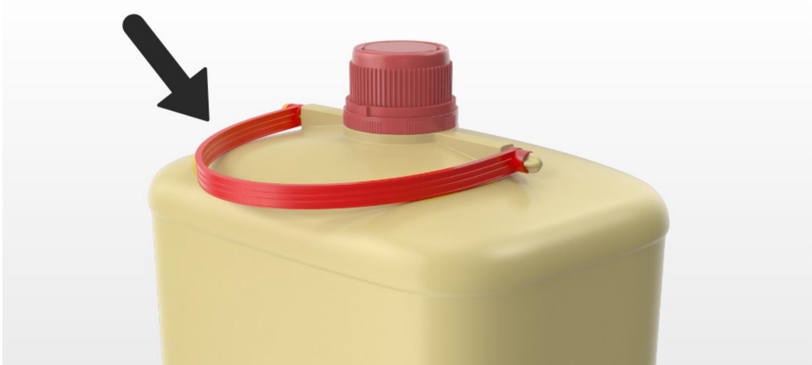

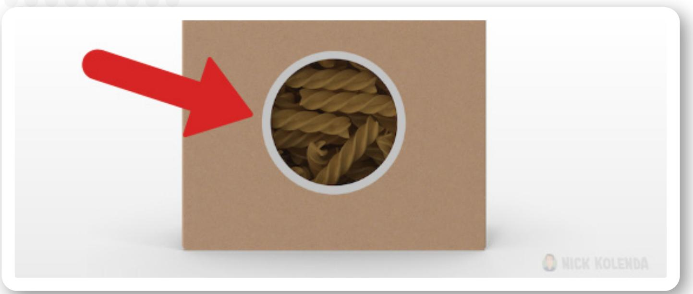

## Transparent Windows Convey Freshness

Customers prefer food packaging with transparent windows because the food seems fresher and higher quality:

“…the ability to see a food product directly through a transparent window would make it more salient in the mind of the consumer (compared to just a printed graphic of the product), thus eliciting greater levels of hunger and food cravings” (Simmonds, Woods, & Spence, 2018)

However, be careful with breakable products (e.g., chips). Allow transparency if you’re confident that products will remain unbroken.

## Siz Shape

## Material

Design

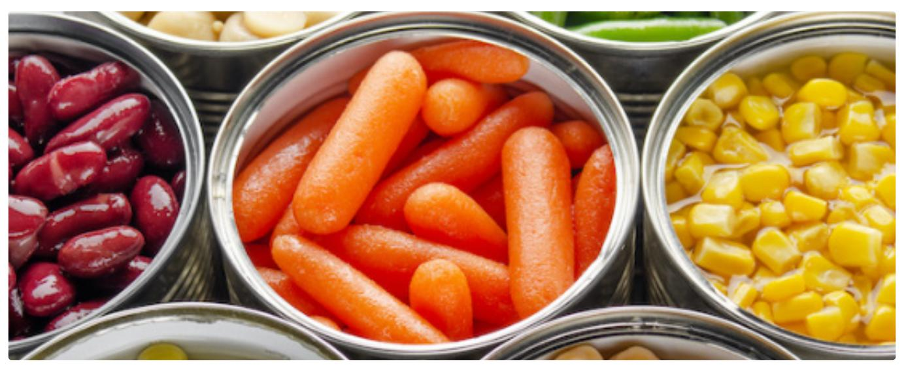

# Remove Packaging From Fresh Products

Do you need packaging at all? Maybe not.

“...packaging acts as a symbolic barrier that separates the product from nature, decreasing perceived product naturalness and leading to less favorable product responses” (Szocs, Williamson, & Mills, 2022)

All else equal, an unbagged assortment of carrots will seem fresher than a bag of carrots – even if both carrots originate from the same source.

If freshness is important, remove your outside packaging.

But if you need packaging, emphasize a connection to nature:

» Sustainable Materials: “Packaged in corn plastic.”

» Physical Connection: “Plucked from the vineyard.”

» Psychological Connection: “Packaged at the vineyard.”

Those statements offset the reduction in freshness.

## Matte Packages Seem Healthy

Glossy packages are shiny, while matte packages are smooth and dull.

Oftentimes, glossy packages contain unhealthy snacks (e.g., chips), while matte packages contain healthier snacks (e.g., crackers). Based on these real-world exposures, customers believe that food in matte packages are healthier and more natural (Ye, Morrin, & Kampfer, 2020; Marckhgott, & Kamleitner, 2019).

Food in a glossy package seems fattier, perhaps because glossiness resembles greasiness (De Kerpel, Kobuszewski Volles, & Van Kerckhove, 2020).

## Rough Textures Seem Masculine

In one study, participants preferred masculine scents on rough paper, yet feminine on smooth paper (Krishna, Elder, & Caldara, 2010).

If your product is masculine, add rough textures across touchpoints (e.g., brand identity, packaging, product material).

# USE ROUGH TEXTURE FORMASCULINE PRODUCTS

LOGO

branding

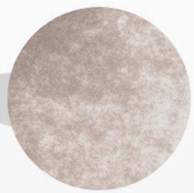

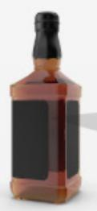  
packaging

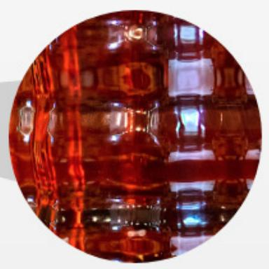

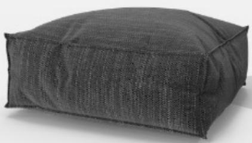  
material

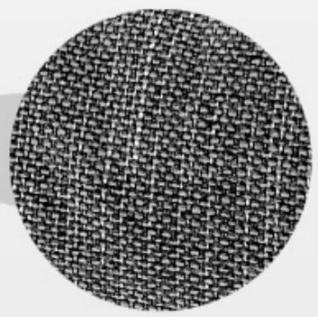

## Glass Seems Better Than Plastic

Customers prefer products in glass (vs. plastic) packaging (Balzarotti, Maviglia, Biassoni, & Ciceri, 2015).

Perhaps you can measure the increase in preference (and whether it would offset the extra cost of glass).

## Size Shape Material Design

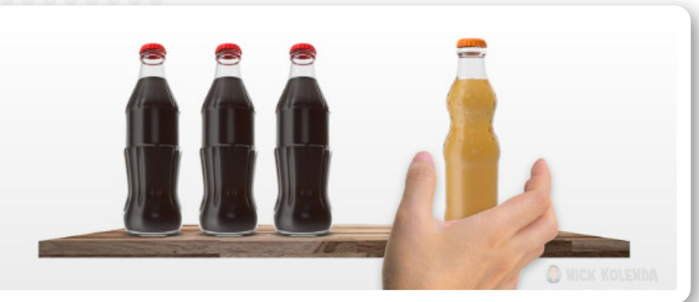

# Unknown Brands Should Invest in Packaging

Suppose that your new brand will compete with cheaper, well-known brands. Do you stand a chance?

Turns out, yes—if you develop the right packaging. Research confirms that customers will select a new (and more expensive brand) if the packaging is beautiful and attentiongrabbing (Reimann et al., 2010).

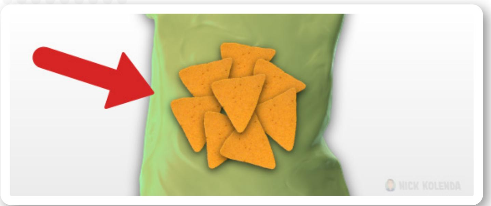

## Show More Product Units on the Package

Research shows that customers equate the imagery on a package with the contents inside: More units on the outside? More units on the inside (Madzharov & Block, 2010).

However, be careful with organic products. Customers are drawn toward organic products with minimalist packaging because they believe it’s more natural, as if this food is free from chemical preservatives (Margariti, 2021).

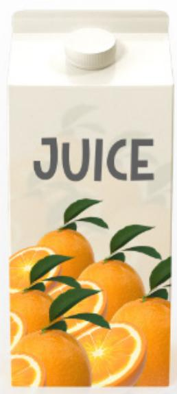

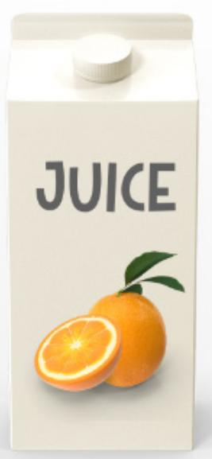  
seems ORGANIC

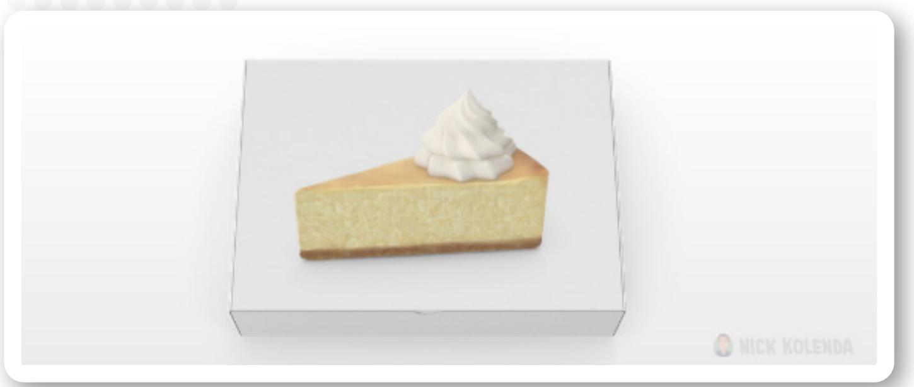

# Display Realistic Images for Emotional Products

Some products evoke strong emotions (e.g., desserts).

In these contexts, realistic photogaphs are more persuasive because they depict the product experience more vividly (Ketron, Naletelich, & Migliorati, 2021).

Do the opposite for negative product experiences (e.g., vegetables, exercise). Use symbolic or digital images to obscure this potentially harmful mental imagery.

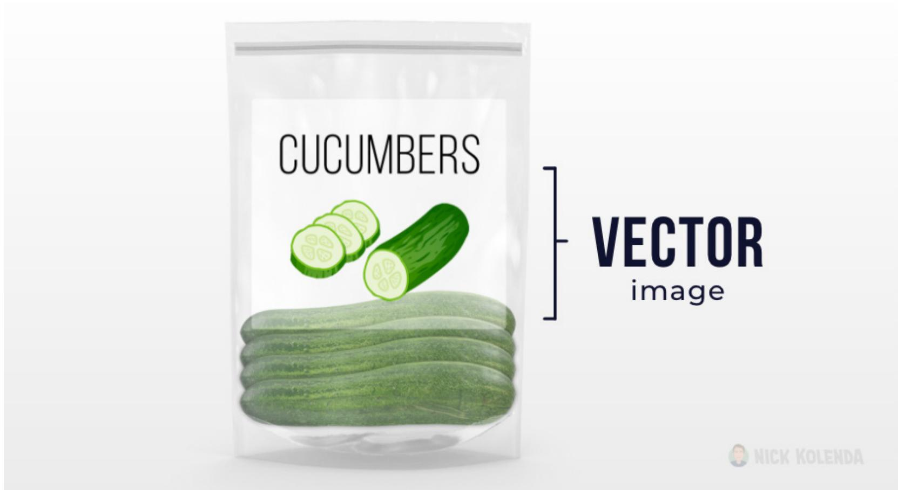

## Place Heavy Products in the Bottom or Right

Do your customers want a heavy product? Then place images in the bottom or right of the package (Deng & Kahn, 2009).

» Why Bottom? Heavy objects sink to the bottom.

» Why Right? Visual canvases are conceptualized like a teeter-totter. Objects on the right seem heavier because they “pull” downward (Arnheim, 1997).

Conversely, choose the left side for light products. Food seems healthier when it appears on the left, and these locations influence the flavor and amount eaten (Romero & Biswas, 2016; Togawa, Park, Ishii, & Deng, 2019).

# Choose Light and Natural Colors for Healthy Products

Dark colors seem heavy, while light colors seem…light. In other words, they seem easier to lift (Arnheim, 1997).

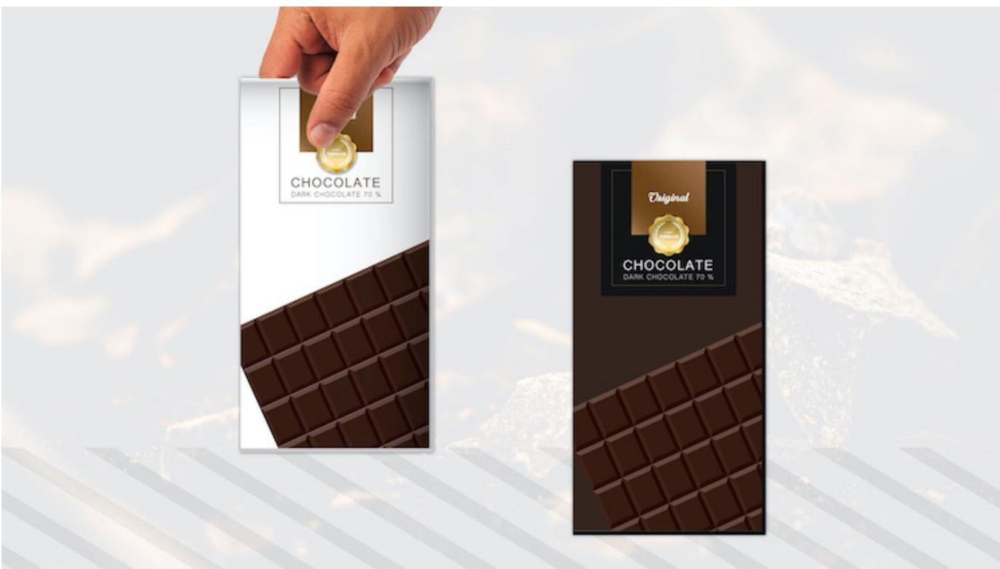

Customers attribute this heaviness to the product. Chocolate in dark packaging seems rich and filling, but chocolate in light packaging seems lighter and healthier.

Light colors seem natural, too:

...au naturel colors are defined as undyed, nonartificial, untreated, and unprocessed colors, that bring to mind something earthy, genuine, unadulterated, and expressing authenticity. Hues of beige (e.g., cream, sandy beiges, and mellow browns) belong to this color family (Marozzo, Raimondo, Miceli, & Scopelliti, 2020)

Customers prefer healthy food in natural packaging. Researchers compared beige and orange packaging for rice and carrots, and beige outperformed orange for both foods (including carrots that are typically orange; Marozzo, Raimondo, Miceli, & Scopelliti, 2020).

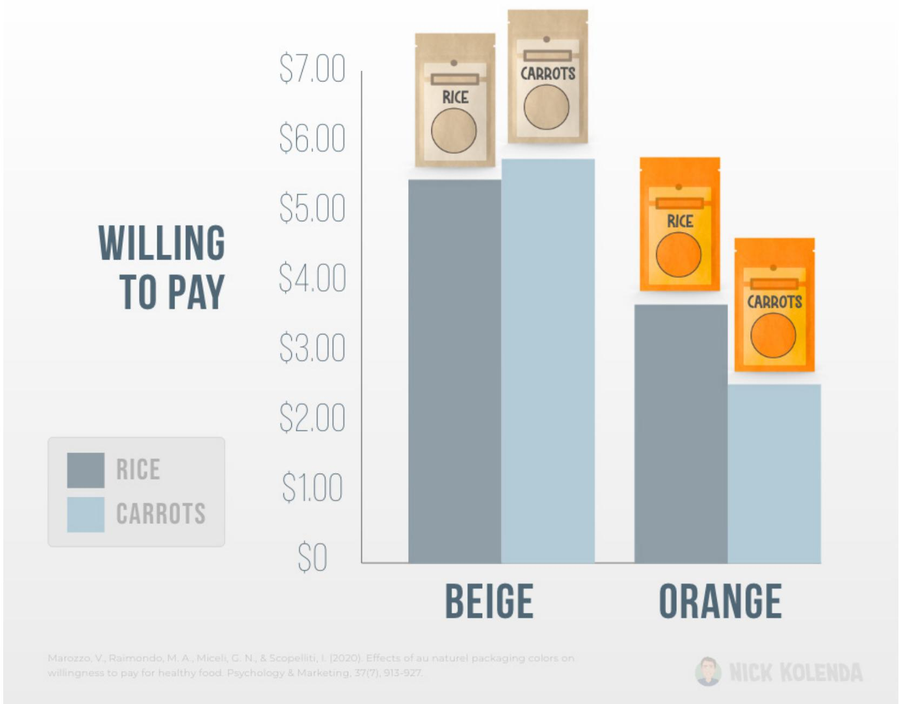

Indeed, food seems less healthy in brightly saturated packaging (Mead & Richerson, 2018). If you sell healthy food, choose a muted and natural color for your package.

## References

Arnheim, R. (1997). Visual thinking. Univeristy of California Press.

Balzarotti, S., Maviglia, B., Biassoni, F., & Ciceri, M. R. (2015). Glass vs. plastic: Affective judgments of food packages after visual and haptic exploration. Procedia Manufacturing, 3, 2251-2258.

Chen, H., Pang, J., Koo, M., & Patrick, V. M. (2020). Shape matters: package shape informs brand status categorization and brand choice. Journal of Retailing, 96(2), 266-281.

De Kerpel, L., Kobuszewski Volles, B., & Van Kerckhove, A. (2020). Fats are glossy but does glossiness imply fatness? The influence of packaging glossiness on food perceptions. Foods, 9(1), 90.

Deng, X., & Kahn, B. E. (2009). Is your product on the right side? The “location effect” on perceived product heaviness and package evaluation. Journal of Marketing Research, 46(6), 725-738.

Ilyuk, V., & Block, L. (2016). The effects of single-serve packaging on consumption closure and judgments of product efficacy. Journal of Consumer Research, 42(6), 858-878.

Ketron, S., Naletelich, K., & Migliorati, S. (2021). Representational versus abstract imagery: Effects on purchase intentions between vice and virtue foods. Journal of Business Research, 125, 52-62.

Krishna, A., Elder, R. S., & Caldara, C. (2010). Feminine to smell but masculine to touch? Multisensory congruence and its effect on the aesthetic experience. Journal of Consumer Psychology, 20(4), 410-418.

Madzharov, A. V., & Block, L. G. (2010). Effects of product unit image on consumption of snack foods. Journal of Consumer Psychology, 20(4), 398-409.

Marckhgott, E., & Kamleitner, B. (2019). Matte matters: When matte packaging increases perceptions of food naturalness. Marketing Letters, 30(2), 167-178.

Margariti, K. (2021). “White” Space and Organic Claims on Food Packaging: Communicating Sustainability Values and Affecting Young Adults’ Attitudes and Purchase Intentions. Sustainability, 13(19), 11101.

Marozzo, V., Raimondo, M. A., Miceli, G. N., & Scopelliti, I. (2020). Effects of au naturel packaging colors on willingness to pay for healthy food. Psychology & Marketing, 37(7), 913-927.

Mead, J. A., & Richerson, R. (2018). Package color saturation and food healthfulness perceptions. Journal of Business Research, 82, 10-18.

Pang, J., & Ding, Y. (2021). Blending package shape with the gender dimension of brand

image: How and why?. International Journal of Research in Marketing, 38(1), 216-231.

Raghubir, P., & Krishna, A. (1999). Vital dimensions in volume perception: Can the eye fool the stomach?. Journal of Marketing research, 36(3), 313-326.

Reimann, M., Zaichkowsky, J., Neuhaus, C., Bender, T., & Weber, B. (2010). Aesthetic package design: A behavioral, neural, and psychological investigation. Journal of consumer psychology, 20(4), 431-441.

Romero, M., & Biswas, D. (2016). Healthy-left, unhealthy-right: Can displaying healthy items to the left (versus right) of unhealthy items nudge healthier choices?. Journal of Consumer Research, 43(1), 103-112.

Sevilla, J., & Kahn, B. E. (2014). The completeness heuristic: Product shape completeness influences size perceptions, preference, and consumption. Journal of Marketing Research, 51(1), 57-68.

Simmonds, G., Woods, A. T., & Spence, C. (2018). ‘Show me the goods’: Assessing the effectiveness of transparent packaging vs. product imagery on product evaluation. Food quality and preference, 63, 18-27.

Szocs, C., Williamson, S., & Mills, A. (2022). Contained: why it’s better to display some products without a package. Journal of the Academy of Marketing Science, 50(1), 131- 146.

Togawa, T., Park, J., Ishii, H., & Deng, X. (2019). A packaging visual-gustatory correspondence effect: using visual packaging design to influence flavor perception and healthy eating decisions. Journal of Retailing, 95(4), 204-218.

Van Doorn, G., Woods, A., Levitan, C. A., Wan, X., Velasco, C., Bernal-Torres, C., & Spence, C. (2017). Does the shape of a cup influence coffee taste expectations? A cross-cultural, online study. Food Quality and Preference, 56, 201-211.

van Ooijen, I., Fransen, M. L., Verlegh, P. W., & Smit, E. G. (2017). Signalling product healthiness through symbolic package cues: Effects of package shape and goal congruence on consumer behaviour. Appetite, 109, 73-82.

Van Tilburg, M., Lieven, T., Herrmann, A., & Townsend, C. (2015). Beyond “pink it and shrink it” perceived product gender, aesthetics, and product evaluation. Psychology & Marketing, 32(4), 422-437.

Velasco, C., Salgado-Montejo, A., Marmolejo-Ramos, F., & Spence, C. (2014). Predictive packaging design: Tasting shapes, typefaces, names, and sounds. Food Quality and Preference, 34, 88-95.

Yan, D., Sengupta, J., & Wyer Jr, R. S. (2014). Package size and perceived quality: The intervening role of unit price perceptions. Journal of Consumer Psychology, 24(1), 4-17.

Yang, Lu, Dengfeng Yan, and Priya Raghubir, “The Stability Heuristic for Weight Judgment” under review at the Journal of Marketing Research. MSI Working paper

Yang, S., & Raghubir, P. (2005). Can bottles speak volumes? The effect of package shape on how much to buy. Journal of Retailing, 81(4), 269-281.

Ye, N., Morrin, M., & Kampfer, K. (2020). From glossy to greasy: The impact of learned associations on perceptions of food healthfulness. Journal of Consumer Psychology, 30(1), 96-124.

## Next Step .

If you enjoyed this guide, you’d enjoy my other (free) guides on psychology and marketing.

www.NickKolenda.com