## T H E SCIENCE O F VIRAL MARKETING

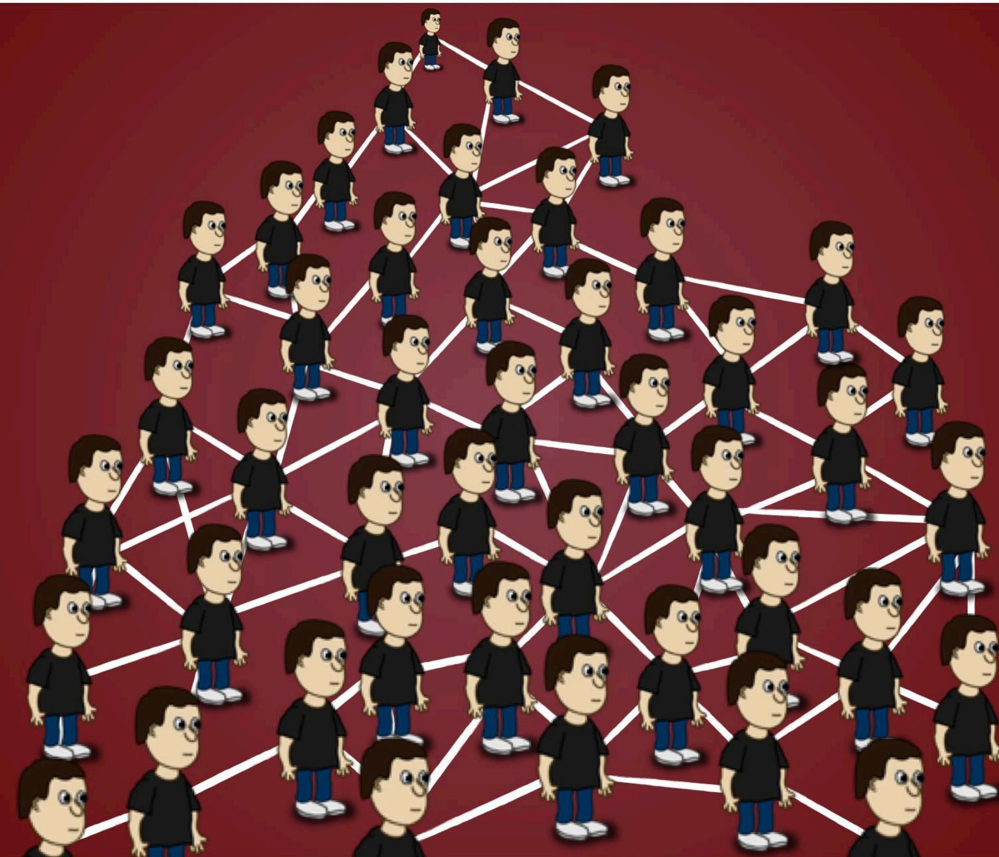

Nick KOLENDA

# The Science of Viral Marketing

Nick Kolenda

Grab free marketing articles at

www.nickkolenda.com

Problems	With	the	Common	Strategy	....   
Problem	#1:	Low	Interconnectivity 8   
Problem	#2:	Secondary	Susceptibility	.. 10...   
Problem	#3:	Weak	Connections	.. 14.   
Why	Micronetworks	Are	the	Solution	....... 15..   
What	is	a	Micronetwork?	.   
The	Role	of	Micronetworks	in	Virality 15.   
How	to	Use	Micronetworks	in	Viral	Marketing	 17 .............   
Strategy	#1:	Target	a	Microsegment,	Then	Scale	Outward	 17......................   
Strategy	#2:	Use	Maven	Groups	to	Promote	Content	. 22...   
Strategy	#3:	Target	Customers	With	High	Interconnectivity	 26 ..................   
Final	Thoughts	......... 30.....

Viral	marketing	is	the	holy	grail.

AI Everybody	wants	it.

V Nobody	knows	how	to	do	it.

But	imagine	if	you	COULD	achieve	it.

Just	target	a	few	central	hubs.	Then	bam:	exponential	growth.

…but	it’s	not	THAT	easy,	right?

Viral	marketing	has	mysteries:

V Why	do	people	share	messages?

How	do	you	gain	initial	traction?

V Which	“seeds”	maximize	diffusion?

## Those	questions	irked	me.

If	I	could	solve	those	mysteries,	then	maybe	—	just	maybe	—	I	could reverse	engineer	virality.

So	I	spent	weeks	combing	through	academic	research.

I	read	everything	I	could	bind.	From	network	theory.	To	epidemiology.   
To	other	bields	with	complicated-sounding	names.

Stuff	like	this:

$$
1 - \mathrm { e } ^ { - s _ { j } y _ { j } } \geq \left( 1 - \mathrm { e } ^ { - y _ { j } \cdot \left( \mathbf { x } ^ { \top } M \right) _ { j } } \right) / \left( 1 + \varepsilon \right) .
$$

trivial. For $y _ { j } = 1$ , since $\begin{array} { r } { ( 1 + \varepsilon ) s _ { j } \ge \left( { \bf x } ^ { \top } M \right) _ { j } , } \end{array}$ we have $\mathrm { e } ^ { - ( 1 + \varepsilon ) s _ { j } } \leq \mathrm { e }$ enough to show that $\left( 1 - \mathrm { e } ^ { - s _ { j } } \right) \geq \left( 1 - \mathrm { e } ^ { - \left( 1 + \varepsilon \right) \bar { s } _ { j } } \right) / \left( 1 + \varepsilon \right)$ , namely,

$$
\frac { \varepsilon + \mathrm { e } ^ { - ( 1 + \varepsilon ) s _ { j } } } { 1 + \varepsilon } \geq \mathrm { e } ^ { - s _ { j } } .
$$

bove inequality holds due to Weighted AM-GM inequality ${ \frac { a x + b y } { a + b } } \geq x$ y letting $a = \varepsilon , x = 1 , b = 1 , y = \mathrm { e } ^ { - ( 1 + \varepsilon ) s _ { j } }$

…which	led	to	this:

  
Article 327 of 500

But	in	the	end	—	and	500+	articles	later	—	the	headaches	were	worth it.

I	had	an	epiphany:	It	IS	possible	to	control	virality.

This	article	explains	how.

# PROBLEMS	WITH	THE COMMON	STRATEGY

Typically,	marketers	target	“inbluencers”	with	many	connections.

  
And	it	CAN	work.

However,	it	restricts	virality	for	3	reasons:

Those	people	aren’t	connected	to	each	other.

Sure,	they’re	connected	to	the	source	—	the	inbluencer.	But	that’s	not enough.	To	maximize	diffusion,	networks	need	interconnectivity (Lerman	&	Ghosh,	2010).

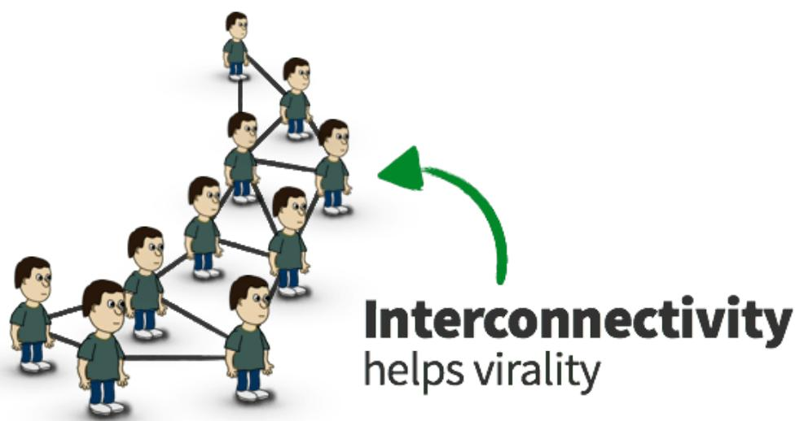

When	nodes	are	interconnected,	infection	builds	WITHIN	the network.

Suppose	that	Node	A	shares	a	message.	Then	Node	B	reshares	it.

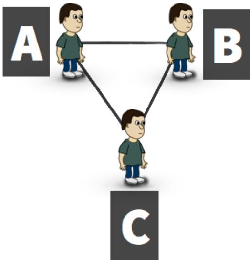  
In	that	network,	Node	C	is	exposed	to	the	message	twice.

Those	repetitions	trigger	a	snowball	effect.	With	more	exposures,	there’s more	infection.	With	more	infection,	there	are	more	exposures.

Similarly…

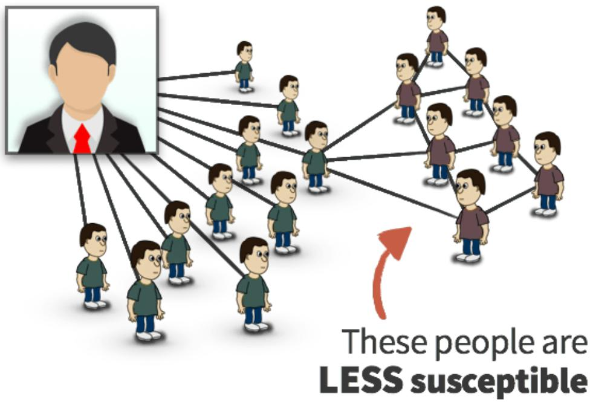

Without	interconnectivity,	nodes	transmit	messages	OUTSIDE	the network.

That	might	seem	helpful	—	because	your	message	is	reaching	new networks.	But	it’s	usually	detrimental.	Those	secondary	recipients	are often	less	susceptible.

Consider	a	photographer.

What’s	the	typical	social	circle	for	a	photographer?	Maybe	this:

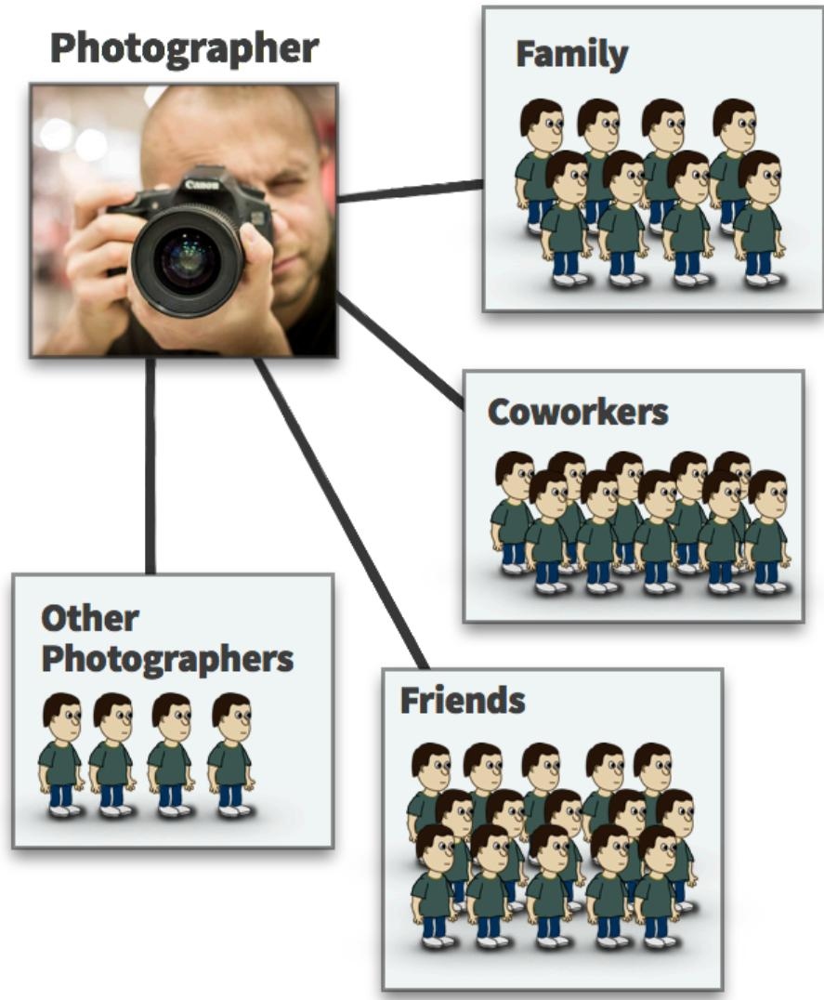

Now,	suppose	that	you	need	to	reach	photographers	for	your	business.   
So	you	write	an	article	on	photography.

And	suppose	that	you	convince	an	inbluencer	—	who	has	a	following	of photographers	—	to	share	it.

That’s	great,	right?

Well,	it’s	good.	But	it’s	not	great.	The	virality	is	limited.

When	those	photographers	share	the	article,	they’re	sharing	it	with their	social	circle.	And	—	as	we	just	saw	—their	circle	only	has	a	few photographers.

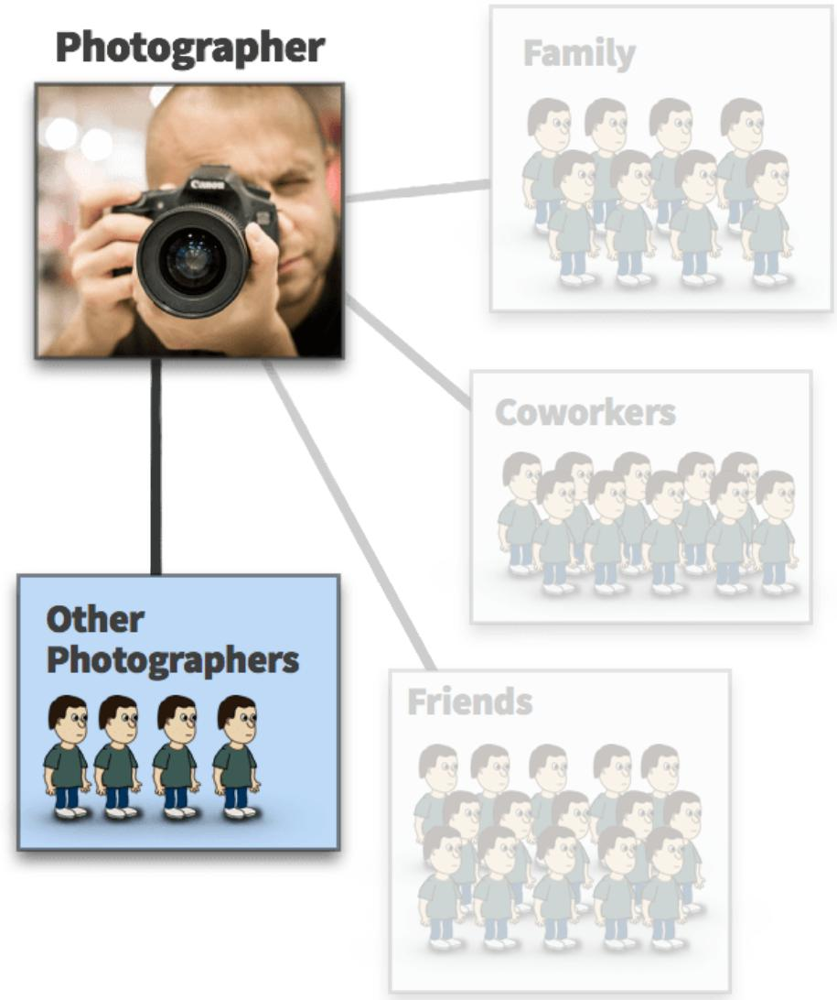  
Thus,	only	a	few	people	are	susceptible.

Now,	imagine	if	the	inbluencer’s	network	were	interconnected.	If	a photographer	shares	the	article,	then	other	photographers	are	exposed to	it.

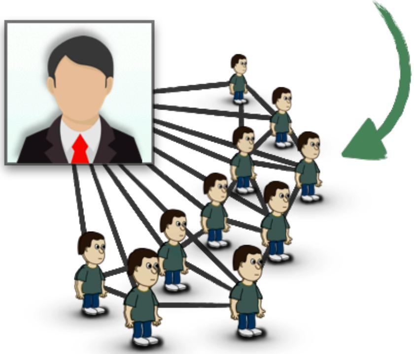  
Those	nodes	ARE	susceptible.	So	infection	builds	WITHIN	the	network.

## Which email are you more likely to open?

Inbluencers	have	MANY	connections.	But	those	connections	are	weak.

It’s	not	the	end	of	the	world	if	you	ignore	a	blogger's	email.

(except	my	emails,	of	course)

To	maximize	virality,	you	need	strong	connections	(Reagans	&	McEvily, 2003).

Those	three	problems	—	low	interconnectivity,	secondary susceptibility,	and	weak	connections	—	can	be	resolved	through micronetworks.

# WHY	MICRONETWORKS ARE	THE	SOLUTION

In	my	research,	I	kept	encountering	a	theme.	I	eventually	called	this theme	a	“micronetwork.”

## WHAT	IS	A	MICRONETWORK?

MICRONETWORK — A dense network with strong interconnections

My	debinition	has	three	pieces:

INTERCONNECTED:	People	know	each	other.

V DENSE:	It’s	small.	Most	people	know	everyone	in	the	network.

V STRONG:	People	frequently	interact.	And	the	communication	is important.

## THE	ROLE	OF	MICRONETWORKS	IN	VIRALITY

Viral	messages	usually	originate	from	micronetworks.

And	that	makes	sense.	Based	on	epidemiology,	widespread	epidemics originate	from	small	networks	—	like	families	(Ball,	1997).

When	one	person	becomes	infected,	the	immediate	family	becomes susceptible.	Infection	spreads	easily	because	they	live	in	the	same house.

Then	it	triggers	a	snowball	effect.

Once	the	family	becomes	infected,	adjacent	networks	—	like	families across	the	street	—	become	infected.

And	it	keeps	spreading	outward.

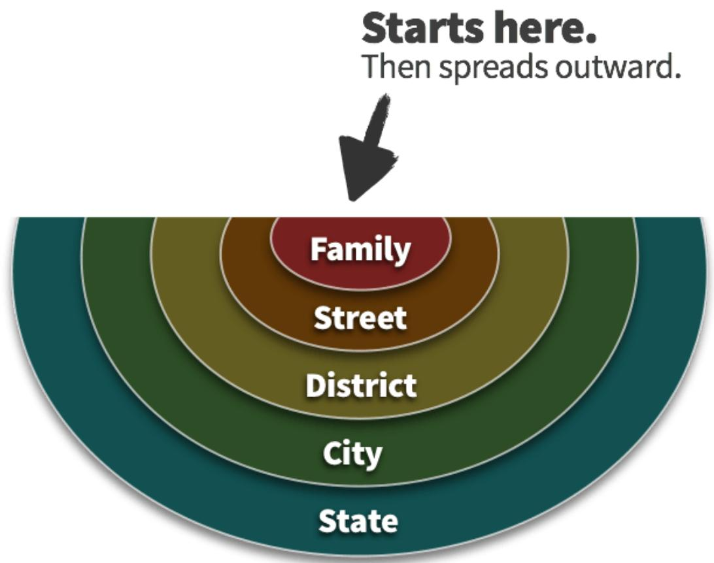  
Suddenly	the	whole	region	becomes	infected.	And	it	all	started	from	a micronetwork.

# HOW	TO	USE MICRONETWORKS	IN VIRAL	MARKETING

Viral	marketing	is	a	HUGE	topic.	I	compiled	all	my	research	into	an online	course.	If	you’re	subscribed	to	my	blog,	I’ll	send	you	a	message when	I	open	enrollment.

This	article	explains	3	strategies.

## STRATEGY	#1:	TARGET	A	MICROSEGMENT, THEN	SCALE	OUTWARD

Most	marketers	target	large	segments	within	their	target	market.

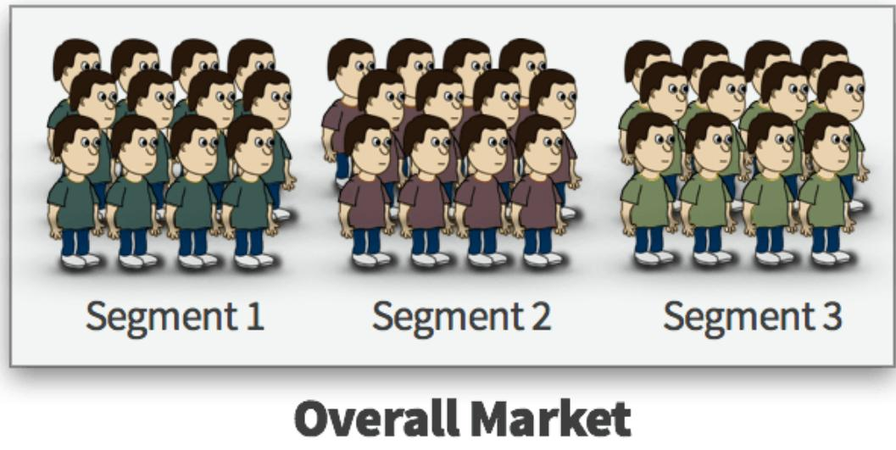  
However,	those	“best	practices”	are	restricting	growth.

In	large	segments,	most	customers	are	disconnected.	Infection	builds separately	within	those	segments.

Instead,	epidemics	originate	from	tight	clusters.	So	don't	target	random people	throughout	a	segment.	Target	a	small	cluster	within	your segment.	Then	scale	outward.

Target a micronetwork in your customer segment

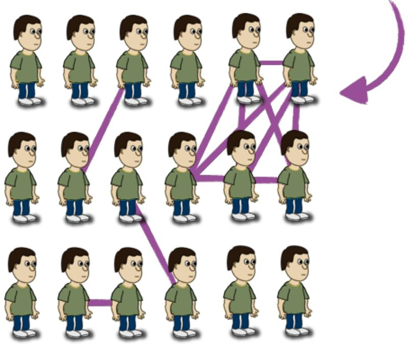  
Let’s	see	a	real	example…

## CASE STUDY: FACEBOOK

Micronetworks	caused	the	explosive	growth	of	Facebook

When	Zuckerberg	launched	Facebook,	he	didn’t	target	everyone.	In	fact, he	didn’t	target	a	“big”	market.

Instead,	he	targeted	a	micronetwork.	He	targeted	a	small	network	with strong	interconnections.	He	targeted	Harvard	students.

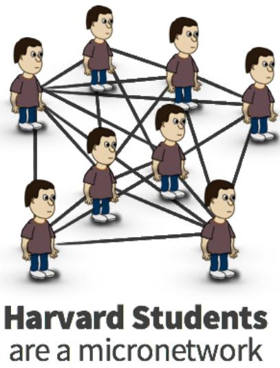

That	decision	changed	everything.

By	targeting	a	micronetwork,	word-of-mouth	could	spread	quickly WITHIN	that	network.	In	24	hours,	half	of	Harvard	signed	up	(The Guardian,	2007).

But	here’s	the	key:

Micronetworks	are	connected	to	external	networks.

Harvard	students	aren’t	separated	from	the	world.	They	have	other friends.

When	Facebook	diffused	among	Harvard,	other	schools	became susceptible.

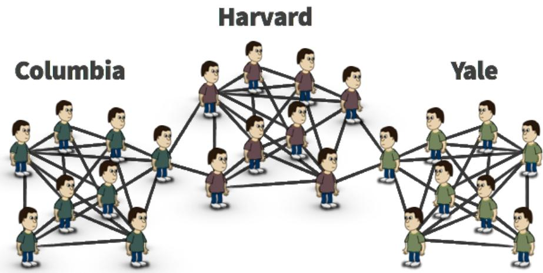  
Hmm,	other	schools?	Aren’t	those	micronetworks	too?

Aha.	They	are.	Zuckerberg	could	replicate	the	strategy	in	new	schools.

And	he	did.

Facebook	scaled	their	company	by	dominating	an	overlapping series	of	micronetworks.

On	a	broad	scale…

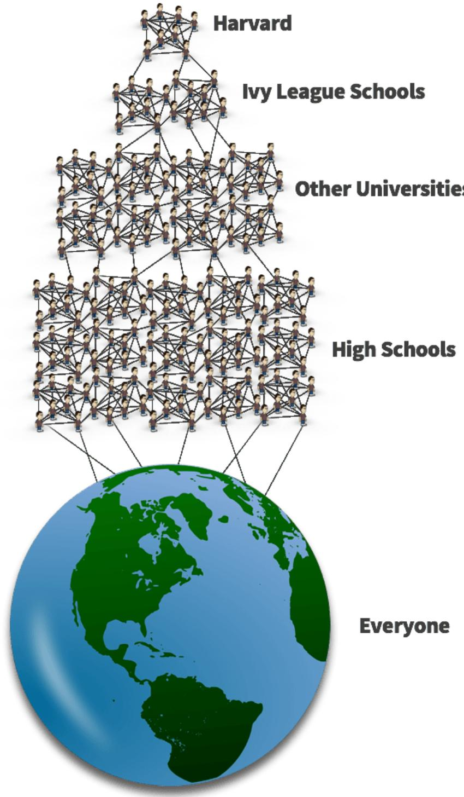  
20 of 30

Facebook	was	an	epidemic.	It	infected	the	entire	planet.

And	it	all	started	from	a	tiny	micronetwork.

# STRATEGY	#2:	USE	MAVEN	GROUPS	TOPROMOTE	CONTENT

In	The	Tipping	Point,	Malcolm	Gladwell	debines	a	maven.

MAVEN — Knowledgeable person with a passion for ideas and information

I’m	extending	that	debinition	to	groups.

MAVEN GROUP — A small group of people that crave knowledge in a domain

Examples	include…

W Small	companies	centered	around	a	topic

Small	organizations	that	share	a	mission

V Small	teams	in	a	large	organization

Essentially,	maven	groups	are	micronetworks.	And	they	can	trigger virality.

## CASE STUDY: HOW MY PRICING ARTICLE GAINED 325K VISITORS

In	2015,	I	launched	my	article	on	pricing.

I	had	just	launched	my	blog.	So	I	was	desperate	for	trafbic.	Any	trafbic.

To	get	visitors,	I	looked	for	small	businesses	that	sold	pricing	software and	services.	And	I	sent	them	my	article.

No	catch.	No	hard	sell.	I	was	just	giving	value.

Since	these	companies	were	small,	I	aimed	for	300	visitors.	Maybe	400, if	I	was	lucky.

In	two	days:	the	article	surpassed	20,000	visitors.

Today,	it’s	accumulated	over	325,000	visitors.

And	I	never	understood	why.	It	never	clicked	until	researching	this article	on	viral	marketing.	Only	two	years	later.	Whoops.

Here’s	what	I	surmised:	those	pricing	companies	were	maven groups.

Essentially,	the	companies	were	micronetworks.

Everyone	shared	the	same	connection:	pricing.

The	companies	were	small.	Everybody	knew	each	other.

Employees	interacted	frequently.

Everyone	lived	and	breathed	pricing.	They	craved	new	and	interesting ideas.

And	that’s	what	I	gave	them.

I	infected	a	critical	node	with	new	information.	And	—	thanks	to	the structure	of	micronetworks	—my	message	propagated.

  
A maven group studying my pricing article

I	sent	my	article	to	Arie	Shpanya,	the	co-founder	of	Wiser.	And	he	sent me	a	picture	of	his	team	discussing	my	article.

Wiser	was	a	maven	group.	And	I	contacted	MANY	similar	companies.

After	infecting	those	tight-knit	groups,	the	infection	spread	to	nearby networks.

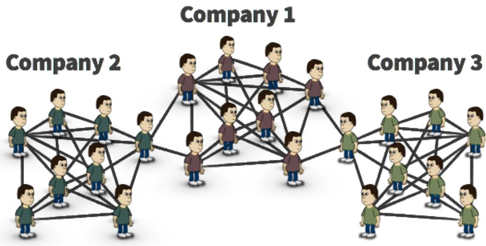

This	concept	is	the	polar	opposite	of	the	"standard"	approach.

Most	marketers	target	LARGE	audiences	with	their	outreach.	It’s almost	a	no-brainer.

But	is	it	really	the	best	strategy?

Maven	groups	are	more	susceptible	to	infection.	Therefore,	you might	gain	more	traction	by	pitching	a	larger	quantity	of	small networks	in	your	domain.	Then	scale	outward.

# STRATEGY	#3:	TARGET	CUSTOMERS	WITH HIGH	INTERCONNECTIVITY

I	explained	the	importance	of	interconnectivity.	When	nodes	are interconnected,	infection	builds	WITHIN	a	network.

This	concept	applies	to	customer	segments.

Your	customers	should	interact.	Frequently.	Those	interactions trigger	word-of-mouth.

And	this	applies	to	content	marketing.

Marketers	create	content	to	attract	specibic	segments.	However,	topics vary	in	interconnectivity.

For	example,	I	noticed	a	trend	on	my	blog.	Broad	topics	perform	worse than	concrete	topics:

Broad Topics  
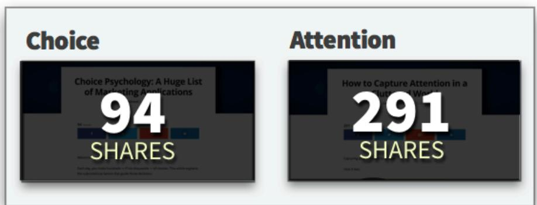

Concrete Topics  

Now,	you	can’t	make	conclusions	from	that	data.	There	are	many factors	at	play.

But	indulge	me.

I	want	to	propose	2	categories	of	content:

W HORIZONTAL	TOPICS	—	Topics	that	spread	across	domains

V VERTICAL	TOPICS	—	Topics	in	a	single	domain

## MARKETING

Choice

Attention

Horizontal	topics	span	across	different	domains.	So	they	have	lower interconnectivity.

Sure,	those	topics	might	have	search	volume:

<table><tr><td>Search term</td><td>Avg. monthly searches</td></tr><tr><td>choice psychology</td><td>1,400</td></tr></table>

However,	you	need	to	consider	the	interconnectivity	among	those people.

People	searching	for	"choice	psychology"	have	different	needs.	So they’re	disconnected.

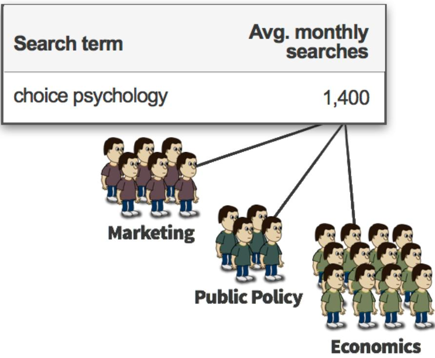

Thus,	infection	builds	separately.

In	vertical	topics,	however,	most	people	share	the	same	need.	People searching	for	"pricing	techniques"	are	more	connected.

<table><tr><td>Search term</td><td>Avg. monthly searches</td></tr><tr><td>pricing techniques</td><td>1,200</td></tr></table>

  
28 of 30

Not	everyone	will	be	interconnected.	But	the	degree	of interconnectivity	is	much	higher.	So	word	of	mouth	is	easier	(and	your content	is	more	likely	to	spread).

Thus,	when	choosing	topics	—or	debining	customer	segments	— always	consider	interconnectivity.	Infection	should	build	within	a segment.

## FINAL THOUGHTS

I	usually	pack	a	ton	of	information	into	my	articles.

For	this	article,	though,	I	wanted	to	focus	on	a	central	theme:	small networks	can	make	large	impacts.

That	concept	is	the	secret	to	viral	marketing.	And	that	concept	changes the	"best	practices"	in	entrepreneurship.

However,	that	concept	is	only	scratching	the	surface.

I	packaged	my	leftover	research	into	a	large	online	course.	If	you subscribe	to	my	blog,	I’ll	send	you	a	message	when	I	open	enrollment