NICK KOLENDA

## — D U − PSYCHOLOGY HOW TO CHOOSE, FRAME AND PRESENT THE OPTIMAL PRICE

Pricing Psychology: How to Choose, Frame, and Present the Optimal Price

Nick Kolenda © Copyright 2015, 2022

More Free Guides:

www.NickKolenda.com

## Conten - -..

THEORY   
Reference Prices 6   
Sensory Origin 7   
VISUALS   
Show Prices in Small Fonts 9   
Position Prices Near the Top or Left 10   
Remove the Comma From Prices 13   
Group Small Elements With the Price 14   
Insert Alliteration Into Prices 15   
Show Two Multiples of the Price Nearby 16   
Display Red Prices to Men 18   
Deemphasize the Price of Emotional Products 19   
Remove the Currency Symbol When Possible 21   
FRAMING   
Expose People to Any High Number 2325   
Place a Large Number on the Left   
Show Higher Prices Before Lower Prices 26   
Distinguish the Most Expensive Option 2829   
Offer a Similar (Yet Expensive) Version   
Mention the Daily Equivalence 30   
Don’t Bundle Cheap and Expensive Items 31   
Create a Payment Medium 33   
Attribute Discounts to Emotional Products 34   
Charge Customers Before They Consume 35   
Describe the Costs of Your Product 36   
Encourage Customers to Budget Early 37   
NUMERALS   
Reduce the Left Digit By One 39   
Choose Prices With Fewer Syllables 40   
Divide Price Into Smaller Units 41   
Be Precise With Large Prices 43   
Place Low Numerals After Right-Facing Digits 44   
Tailor Prices Toward Names or Birthdays 45   
Use Round Prices in the Right Context 47   
Add Slight Price Differences in Your Assortment 49   
Raise Your Price in Small Increments 51   
Downsize a Feature Besides Price 52   
DISCOUNTS   
Make Sale Prices Look Different 54   
Add Space Between Discounted Prices 55   
Place Sale Prices Below Original Prices 56   
Reduce Every Digit in the Discounted Price 57   
Offer Discounts With Low Right Digits 58   
Follow the Rule of 100 59   
Mention the Increase From Discounted Prices 60   
Provide a Reason for the Discount 61   
Offer Discounts in Round Numbers 62   
Give Two Discounts in Ascending Order 63   
Offer Discounts Toward the End of the Month 64   
Arrange Discounts in Tiered Amounts 65   
End Discounts Gradually 66   
Don’t Discount Premium Products 67

## Introduction

“All our knowledge has its origin in our perceptions.” –Leonardo da Vinci

Nothing in this world has concrete meaning.

At the end of the day, price is merely a perception. Nothing more. Nothing less.

That’s great news—while large companies can afford expensive market research, you can optimize your pricing with psychology.

In this guide, you’ll learn why innocent factors—fonts, colors, numerals—can be deviously persuasive. A few small adjustments could make your price seem cheaper or more appealing, boosting the sales of your product.

You can read this guide from beginning to end. Or pick and choose whichever principles fascinate you.

Later, this guide can be your reference manual whenever you need to adjust your prices.

## —Nick Kolenda

## Theory Visuals Framing Numerals Discounts

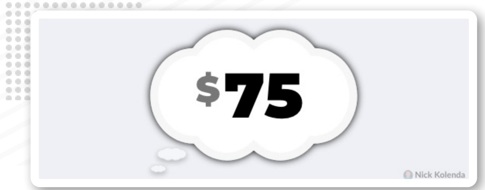

## Reference Prices

You see a carton of eggs for \$3.

Is \$3 a good deal? How can you tell?

Turns out, you compare \$3 to a “standard” price that you derive from multiple sources:

» Previous Prices. How much were eggs last time?

» Advertised Prices. What price were you promised?

» Estimated Price. What price were you expecting?

» Adjacent Prices. How much are competing eggs?

» » Nearby Numbers. Any numbers in the vicinity?

You merge those sources into a single price, and you compare this “reference price” to the price of the product.

Briesch, R. A., Krishnamurthi, L., Mazumdar, T., & Raj, S. P. (1997). A comparative analysis of reference price models. Journal of Consumer Research, 24(2), 202-214.

Mazumdar, T., Raj, S. P., & Sinha, I. (2005). Reference price research: Review and propositions. Journal of marketing, 69(4), 84-102.

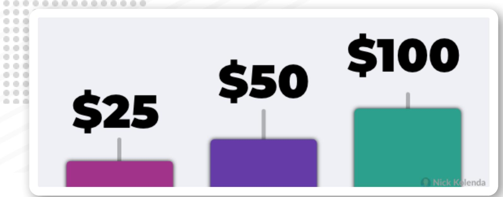

## Sensory Origin

In order to learn abstract concepts, like numbers, your brain needed a sensory foundation.

Today, numbers are endowed with a sensory structure, influencing your perception of prices.

It’s pretty fascinating. You can refer to my video on The Origin of Numbers.

## Theory Visuals Framing Numerals Discounts

\$50

## Show Prices in Small Fonts

Your brain confuses visual size for numerical size.

If you see \$50 in a large font, you think: Hmm, how big is this price? Something feels big. The price must be high.

Generally, you should display prices in a small font so that they seem numerically smaller (Coulter & Coulter, 2005).

Caveat: This tactic might only work with single products. Large fonts might work better for multiple products because customers judge the difference between those prices: Hmm, how big is the price difference? Something feels big. The difference must be big.

Coulter, K. S., & Coulter, R. A. (2005). Size does matter: The effects of magnitude representation congruency on price perceptions and purchase likelihood. Journal of Consumer Psychology, 15(1), 64-76.

# Position Prices Near the Top or Left

## Why the Left?

In visual design, objects on the right seem heavier because they pull downward:

...because our eyes enter a visual field from the left, the left naturally becomes the anchor point or ‘visual fulcrum.’ Thus, the further an object is placed away from the left side (or the fulcrum), the heavier the perceived weight (Deng & Kahn, 2009, p. 9).

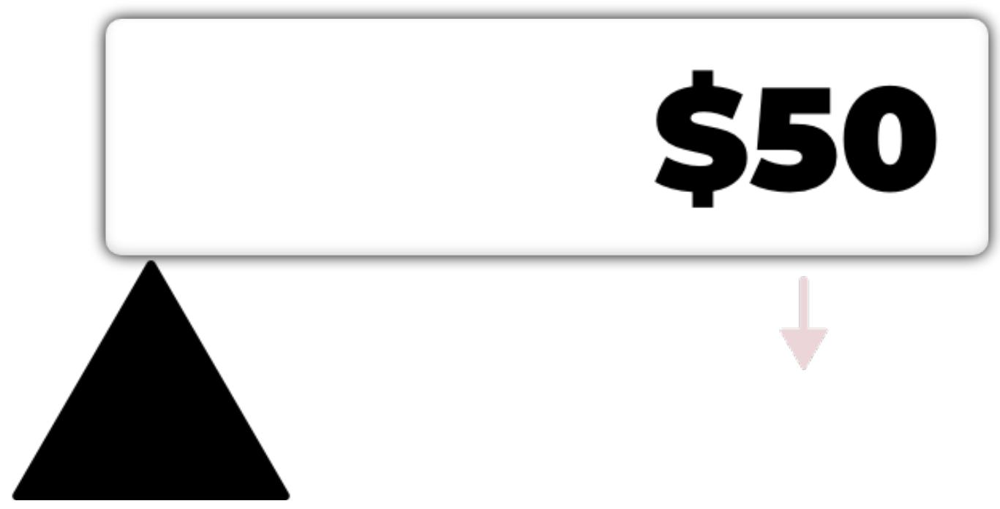

Plus, we conceptualize numbers on a horizontal ruler — they get larger from left to right (assuming that you read from left to right). Thus, small numbers are associated with the left:

...people typically see small numbers to the left of larger ones, [so] they are likely to associate small numerical values with locations on the left (Cai, Shen, & Hui, 2012, p. 723)

## Why the Top?

In one study, researchers studied food packaging. Cookies seemed lighter when they were located toward the top of the package (Deng & Kahn, 2009).

Subconsciously, it felt like the cookies were lifted to this location — so, naturally, they must have been lighter.

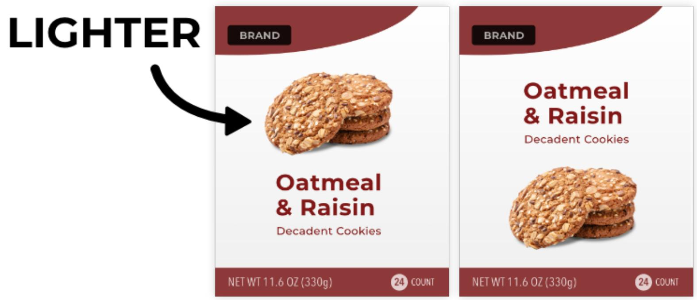

Same with prices: They seem expensive in the bottom-right (Park & Ma, 2019; though see Barone, Coulter, & Li, 2020 for conflicting results).

Barone, M. J., Coulter, K. S., & Li, X. (2020). The Upside of Down: Presenting a Price in a Low or High Location Influences How Consumers Evaluate It. Journal of Retailing, 96(3), 397-410.

Cai, F., Shen, H., & Hui, M. K. (2012). The effect of location on Price estimation: understanding number– location and number–order associations. Journal of Marketing Research, 49(5), 718-724.

Casasanto, D. (2009). Embodiment of abstract concepts: good and bad in right-and left-handers. Journal of Experimental Psychology: General, 138(3), 351.

Coulter, K. S. (2002). The influence of print advertisement organization on odd-ending price image effects. Journal of Product & Brand Management.

Deng, X., & Kahn, B. E. (2009). Is your product on the right side? The “location effect” on perceived product heaviness and package evaluation. Journal of Marketing Research, 46(6), 725-738.

Park, J., & Ma, Y. J. (2019). Number-location bias: do consumers correctly process the number on the product package?. Journal of Product & Brand Management.

# Remove the Comma From Prices

Prices seem cheaper without commas (e.g., \$1499; Coulter, Choi, and Monroe, 2012).

Sure, the written length is shorter. But more importantly, the phonetic size is also shorter:

» \$1,499 - One-thousand four-hundred and ninety-nine (10 syllables)

» \$1499 - Fourteen ninety-nine (5 syllables)

Coulter, K. S., Choi, P., & Monroe, K. B. (2012). Comma N’cents in pricing: The effects of auditory representation encoding on price magnitude perceptions. Journal of Consumer Psychology, 22(3), 395-407

# Group Small Elements With the Price

Be careful with any words near your price. Choose words that depict a small size (e.g., “low,” “small,” “tiny”).

In one study, an inline skate seemed cheaper when “Low Friction” appeared near the price. The price seemed higher with “High Performance” (Coulter & Coulter, 2005).

The reason is complex, but you can refer to Chapter 4 of my book The Tangled Mind to learn the details.

## Insert Alliteration Into Prices

Alliteration feels good.

Something just “feels right” — and we misattribute this pleasant sensation to the context.

Research confirms that alliterative prices are effective: Customers were more likely to buy two t-shirts for \$25 because of the matching “t” sounds (Davis, Bagchi, & Block, 2016)

Davis, D. F., Bagchi, R., & Block, L. G. (2016). Alliteration alters: Phonetic overlap in promotional messages influences evaluations and choice. Journal of Retailing, 92(1), 1-12.

# Show Two Multiples of the Price Nearby

Compare these two pizza advertisements:

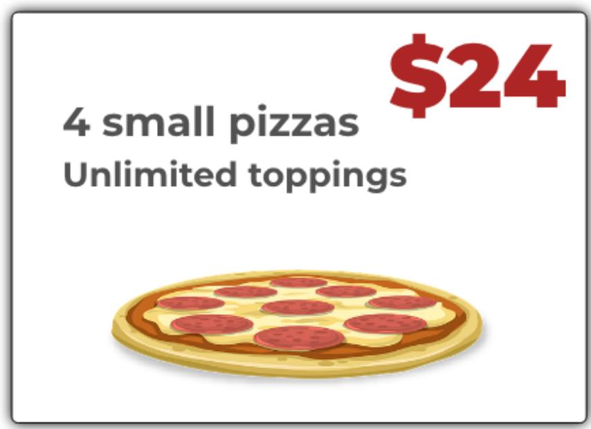

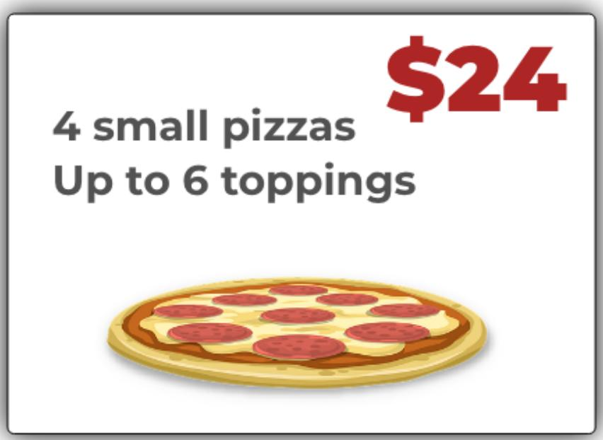

Economically, the first ad is superior because it offers “unlimited” toppings. Psychologically, however, people were more likely to buy the deal with “6” toppings (King & Janiszewski, 2011).

See the culprit?

It involves multiples of the price:

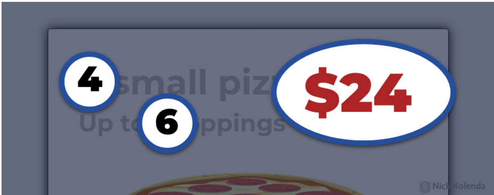

Your brain stores common arithmetic problems:

Over time, we develop associations between operands (e.g., 2 x 6) and results (e.g., 12). These associations are called “number facts” (Baroody 1985).

Exposure to two numbers (e.g., 2 and 6) immediately activates the sum (e.g., 8) and product (e.g., 12).

In the pizza ads, the price of \$24 seemed better when the ad was showing two multiples (e.g., 6 and 4). Customers misattributed this sensation: Hmm, something feels right. I must want to buy this deal.

When possible, show two multiples of your price:

» \$15: 3-Day Sale for \$5 Off

» \$120: Get 4 Weekly 30-Minute Coaching Calls

» \$500: Get 5 Bonus PDFs for Free (\$100 Value)

King, D., & Janiszewski, C. (2011). The sources and consequences of the fluent processing of numbers. Journal of Marketing Research, 48(2), 327-341.

## Display Red Prices to Men

Men prefer prices in red fonts.

Men make decisions quickly, and they assume that red implies savings (Puccinelli et al., 2013 ; see Van Droogenbroeck, Van Hove, & Cordemans, 2018 for a replication).

Caveat: All prices need to be red. Changing the color of one price could backfire (Ye, Bhatt, Jeong, & Zhang, 2020).

Van Droogenbroeck, E., Van Hove, L., & Cordemans, S. (2018). Do red prices also work online?: An extension of Puccinelli et al.(2013). Color Research & Application, 43(1), 110-113.

Ye, H., Bhatt, S., Jeong, H., Zhang, J., & Suri, R. (2020). Red price? Red flag! Eye-tracking reveals how one red price can hurt a retailer. Psychology & Marketing, 37(7), 928-941.

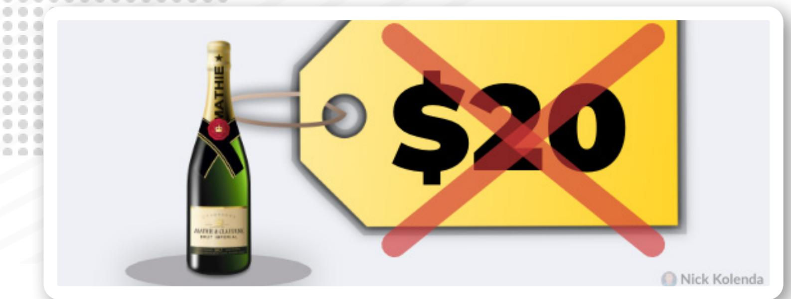

# Deemphasize the Price of Emotional Products

Emotional products have strong benefits, but weak economic value. Therefore, orient customers toward the benefits instead of the price.

How? Here are some ideas.

## 1. Reduce the Saliency of Prices

Do you sell jewelry? Shrink the visual size of prices.

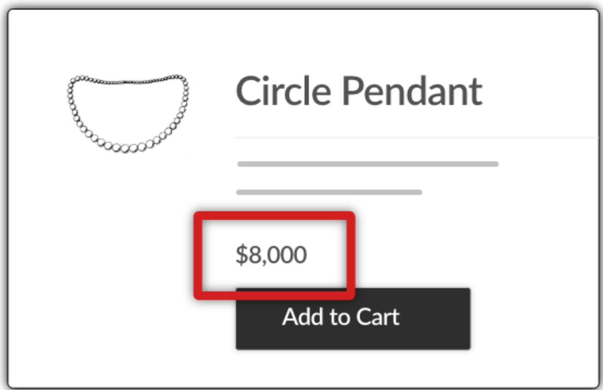

## 2. Show Products Before the Price

According to fMRI of shoppers, the first exposure — price vs. product — dictates our decision criteria:

» Product first? We focus on benefits.

» Price first? We focus on economic value.

Show emotional products before prices so that customers focus on the benefits (Karmarkar, Shiv, & Knutson, 2015).

Do the opposite for rational products. Show prices so that customers focus on the economic and rational value.

## 3. Focus on Time and Usage

Avoid references to money. Instead, emphasize the duration of time that customers will spend.

Researchers alternated three signs for a lemonade stand:

» Time: “Spend a little time and enjoy C & D’s lemonade”

» Money: “Spend a little money and enjoy C & D’s lemonade”

» Neutral: “Enjoy C & D’s lemonade”

The “time” sign attracted twice as many people (who paid twice as much; Mogilner & Aaker, 2009).

Karmarkar, U. R., Shiv, B., & Knutson, B. (2015). Cost conscious? The neural and behavioral impact of price primacy on decision making. Journal of Marketing Research, 52(4), 467- 481.

Mogilner, C., & Aaker, J. (2009). “The time vs. money effect”: Shifting product attitudes and decisions through personal connection. Journal of Consumer Research, 36(2), 277-291.

# Remove the Currency Symbol When Possible

You should typically include the currency symbol in your prices — these symbols help customers understand when a number is, indeed, a price.

But if your number is clearly a price, perhaps you could remove the symbol (Yang, Kimes, & Sessarego, 2009). Removing this symbol reduces the pain of paying, distracting people from the cost.

This tactic might work best in luxury contexts, (e.g., high-end restaurants).

Yang, S. S., Kimes, S. E., & Sessarego, M. M. (2009). Menu price presentation influences on consumer purchase behavior in restaurants. International Journal of Hospitality Management, 28(1), 157-160.

## Theory Visuals Framing Numerals Discounts

# Expose People to Any High Number

In one study, researchers sold music CDs on a boardwalk in West Palm Beach. Every 30 minutes, an adjacent vendor switched the price of a sweatshirt between \$10 or \$80.

Turns out, the \$80 sweatshirt boosted sales of CDs because they seemed cheaper (Nunes & Boatwright, 2004).

But surprisingly, this anchoring effect works with any number. In another study, people reflected on the last two digits of their social security number. If those digits were high, they were willing to pay a higher amount for products.

<table><tr><td rowspan=1 colspan=1>SS NUMBER</td><td rowspan=1 colspan=1>WILLING TO PAY</td></tr><tr><td rowspan=1 colspan=1>00 - 19</td><td rowspan=1 colspan=1>$16.09</td></tr><tr><td rowspan=1 colspan=1>20 - 39</td><td rowspan=1 colspan=1>$26.82</td></tr><tr><td rowspan=1 colspan=1>40 - 59</td><td rowspan=1 colspan=1>$29.27</td></tr><tr><td rowspan=1 colspan=1>60 - 79</td><td rowspan=1 colspan=1>$34.55</td></tr><tr><td rowspan=1 colspan=1>80 - 99</td><td rowspan=1 colspan=1>$55.64</td></tr></table>

Ariely, D., Loewenstein, G., & Prelec, D. (2003). "Coherent arbitrariness": Stable demand curves without stable preferences. The Quarterly journal of economics, 118(1), 73-106.

This anchoring effect occurs subconsciously — it even happened when researchers subliminally exposed people to a high number (Adaval & Monroe, 2002).

Therefore, show high numbers near your price:

» Join 5,487 happy customers

» Invoice #8986

» We donated \$100,000 to charity

Those large numbers raise the reference price, which makes your actual price seem cheaper.

Adaval, R., & Monroe, K. B. (2002). Automatic construction and use of contextual information for product and price evaluations. Journal of Consumer Research, 28(4), 572-588.

Ariely, D., Loewenstein, G., & Prelec, D. (2003). “Coherent arbitrariness”: Stable demand curves without stable preferences. The Quarterly journal of economics, 118(1), 73-106.

Nunes, J. C., & Boatwright, P. (2004). Incidental prices and their effect on willingness to pay. Journal of Marketing Research, 41(4), 457-466.

## Place a Large Number on the Left

Displaying a sale price?

Place the original price (the larger number) on the left. It’s called the subtraction principle: Customers can subtract these numbers more easily, which makes the difference seem larger (Biswas et al., 2013).

Follow this technique for quantities, too. Which order is better:

» \$29 for 70 items

» 70 items for \$29

Answer: The second sequence (Bagchi & Davis, 2012).

The large quantity (e.g., 70) makes the subsequent price seem cheaper.

Bagchi, R., & Davis, D. F. (2012). 29 for 70 items or 70 items for 29? How presentation order affects package perceptions. Journal of Consumer Research, 39(1), 62-73.

Biswas, A., Bhowmick, S., Guha, A., & Grewal, D. (2013). Consumer evaluations of sale prices: role of the subtraction principle. Journal of Marketing, 77(4), 49-66.

# Show Higher Prices Before Lower Prices

Customers are more likely to choose an expensive option when you sort prices from high to low.

Over an 8-week span, researchers alternated beer prices on a menu. They maximized revenue when prices were sorted from highest to lowest (Suk, Lee, & Lichtenstein, 2012).

Two reasons.

Customers use these initial prices to evaluate subsequent prices. Higher initial prices? Subsequent prices seem cheaper.

Second, loss aversion. While scanning products that are increasing in price, customers lose the ability to pay a lower price. They feel more pressure to pounce on a cheaper item.

<table><tr><td rowspan=1 colspan=1>LOW → HIGH</td></tr><tr><td rowspan=1 colspan=1>BEER 1      $4</td></tr><tr><td rowspan=1 colspan=1>BEER 2     $4</td></tr><tr><td rowspan=1 colspan=1>BEER 3     $4</td></tr><tr><td rowspan=1 colspan=1>BEER 4     $5</td></tr><tr><td rowspan=1 colspan=1>BEER 5     $6</td></tr><tr><td rowspan=1 colspan=1>BEER 6     $7</td></tr><tr><td rowspan=1 colspan=1>BEER 7      $7</td></tr><tr><td rowspan=1 colspan=1>BEER 8     $7</td></tr><tr><td rowspan=1 colspan=1>BEER 9     $7</td></tr><tr><td rowspan=1 colspan=1>BEER 10   $8</td></tr><tr><td rowspan=1 colspan=1>BEER 11    $8</td></tr><tr><td rowspan=1 colspan=1>BEER 12    $9</td></tr><tr><td rowspan=1 colspan=1>BEER 13  $10</td></tr></table>

<table><tr><td rowspan=1 colspan=1>HIGH → LOW</td></tr><tr><td rowspan=1 colspan=1>BEER 1    $10</td></tr><tr><td rowspan=1 colspan=1>BEER 2      $9</td></tr><tr><td rowspan=1 colspan=1>BEER 3     $8</td></tr><tr><td rowspan=1 colspan=1>BEER 4     $8</td></tr><tr><td rowspan=1 colspan=1>BEER 5      $7</td></tr><tr><td rowspan=1 colspan=1>BEER 6     $7</td></tr><tr><td rowspan=1 colspan=1>BEER 7     $7</td></tr><tr><td rowspan=1 colspan=1>BEER 8     $7</td></tr><tr><td rowspan=1 colspan=1>BEER 9     $6</td></tr><tr><td rowspan=1 colspan=1>BEER 10    $5</td></tr><tr><td rowspan=1 colspan=1>BEER 11    $4</td></tr><tr><td rowspan=1 colspan=1>BEER 12   $4</td></tr><tr><td rowspan=1 colspan=1>BEER 13    $4</td></tr></table>

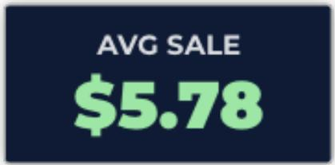

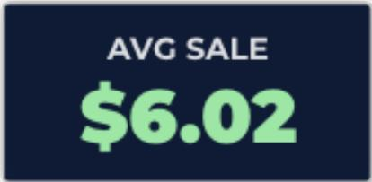

In a sequence that decreases in price, each new product feels like a loss in quality. Customers feel pressured to pounce on an option before they lose too much quality.

Suk, K., Lee, J., & Lichtenstein, D. R. (2012). The influence of price presentation order on consumer choice. Journal of Marketing Research, 49(5), 708-717.

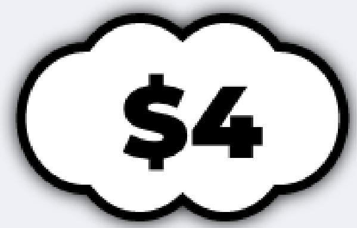

LOW → HIGH

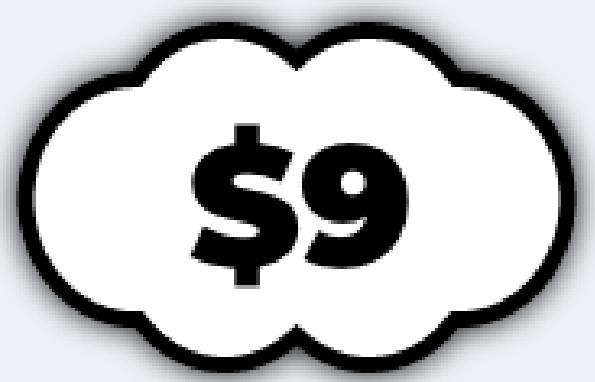

HIGH → LOW

BEER1 \$4

BEER1 \$10

BEER 2 \$4

BEER 2 \$9

BEER3 \$4

BEER3 \$8

BEER 4 \$5

BEER 5 \$6

BEER 4 \$8

BEER 5 \$7

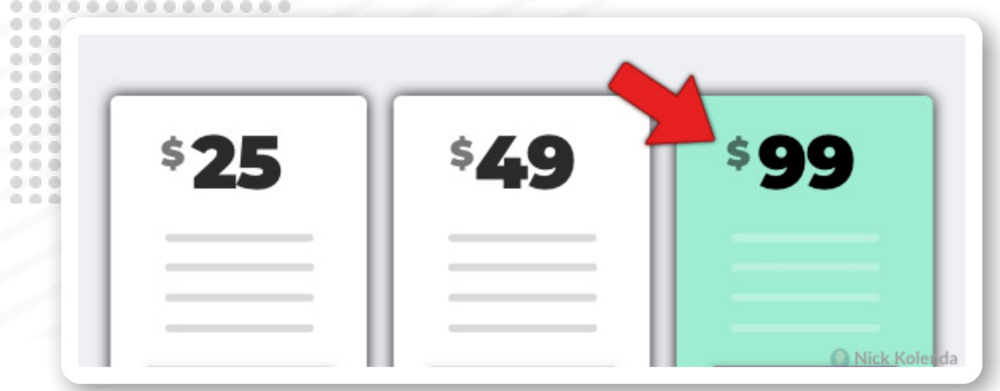

## Distinguish the Most Expensive Option

I just argued that you should sort prices from high to low.

But it’s not necessary. The real effect stems from the order in which prices are evaluated.

You could achieve the same effect by adding a visual distinction to the most expensive option. If customers evaluate this product first, it establishes a higher reference price that makes subsequent prices seem cheaper.

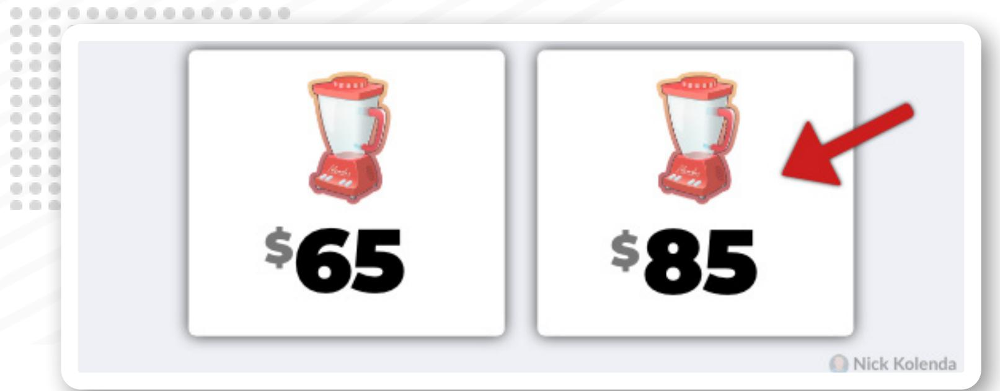

# Offer a Similar (Yet Expensive) Version

You might be familiar with a popular study involving three subscriptions to Economist magazine:

» \$59 — Digital

» \$125 — Print

» \$125 — Print and Digital

At first glance, it seems wrong: The digital and print subscription is the same price as the print only subscription.

But alas, it’s not a mistake.

Nobody chooses the “print” subscription, yet this “decoy” option shifts demand toward the “print and digital” subscription, a more expensive subscription. Consider adding a similar, yet more expensive version of your product.

## Mention the Daily Equivalence

Frame your price in daily terms (e.g., \$1.60/day; Gourville, 1998). Customers compare this small value to the reference price.

Or you could achieve the same effect by comparing the daily price to a petty cash expense, such as a cup of coffee (Gourville, 1999).

Gourville, J. T. (1998). Pennies-a-day: The effect of temporal reframing on transaction evaluation. Journal of Consumer Research, 24(4), 395-408

Gourville, J. T. (1999). The effect of implicit versus explicit comparisons on temporal pricing claims. Marketing Letters, 10(2), 113-124.

# Don’t Bundle Cheap and Expensive Items

Selling a \$500 home gym? Don’t bundle it with a \$5 fitness DVD (Brough & Chernev, 2012).

Customers don’t sum these values. They average them.   
Therefore, cheap items detract the value of expensive items.

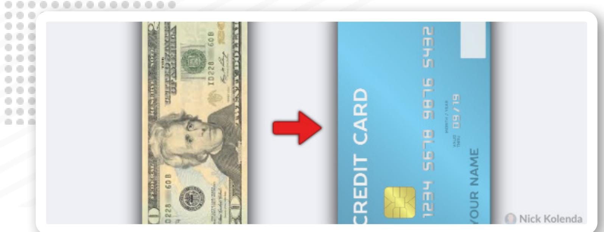

## Create a Payment Medium

You can transform the payment into a separate medium (e.g., monthly credits, gift cards).

Customers are more likely to spend money from a separate medium because the payment feels less painful (Nunes & Park, 2003).

Perhaps you could require new customers to deposit a refundable \$10 into their account. Customers will be more willing to spend this money because it resides in a separate medium.

Nunes, J. C., & Park, C. W. (2003). Incommensurate resources: Not just more of the same. Journal of Marketing Research, 40(1), 26-38.

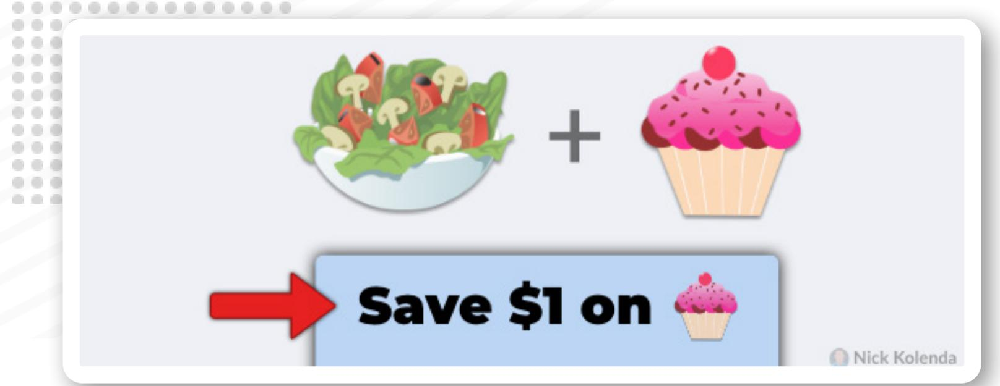

# Attribute Discounts to Emotional Products

We want to buy emotional products, but we feel guilty (Khan & Dhar, 2006).

Therefore, in product bundles, attribute a discounted price to the emotional product.

...framing the discount on the hedonic item provides a justification required to reduce the guilt associated with the purchase of such items. (Khan & Dhar, 2010, p. 18)

Khan, U., & Dhar, R. (2006). Licensing effect in consumer choice. Journal of marketing research, 43(2), 259-266.

Khan, U., & Dhar, R. (2010). Price-framing effects on the purchase of hedonic and utilitarian bundles. Journal of Marketing Research, 47(6), 1090-1099.

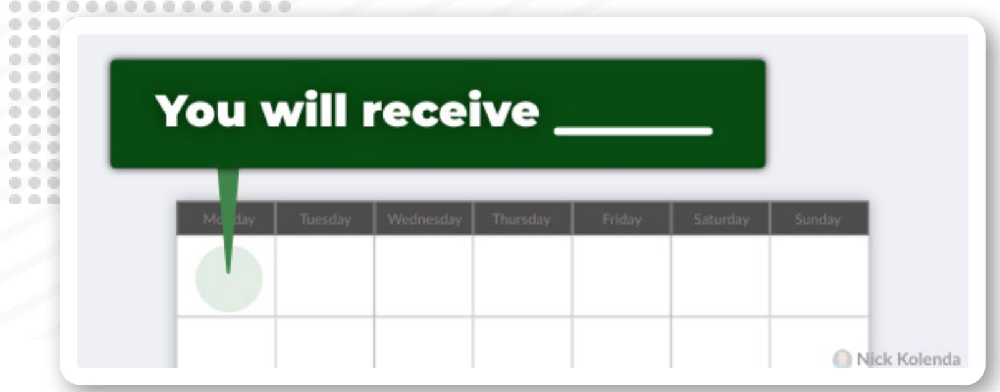

# Charge Customers Before They Consume

Customers should pay before using your product.

For one, you’re more likely to get paid. Always nice.

Second, customers will be happier. While prepaying, they can look forward to the benefits. If they already consumed those benefits, nothing will numb the pain of paying (Prelec & Lowenstein, 1998).

If you charge customers every month, charge them at the beginning of the month.

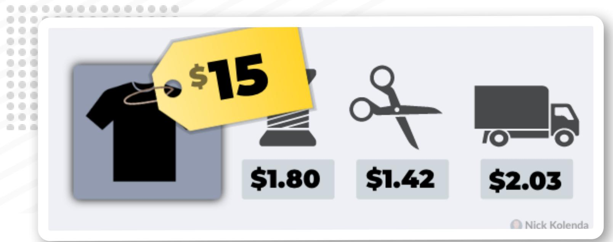

## Describe the Costs of Your Product

Customers prefer prices that are determined by material costs, rather than supply and demand (Xia, Monroe, & Cox, 2004).

Perhaps you can describe your costs:

...consumers have little knowledge of a seller’s actual costs and profit margins...Therefore, sellers making the relevant cost and quality information transparent helps (Xia, Monroe, & Cox, 2004, pp. 9).

Update (2020): Researchers at Harvard tested this claim. And, indeed, it works (Mohan, Buell, & John, 2020). A retailer boosted sales in an email blast by describing the costs for their wallet (e.g., leather - \$14.68, construction - \$38.56, duties - \$4.26).

Mohan, B., Buell, R. W., & John, L. K. (2020). Lifting the veil: The benefits of cost transparency. Marketing Science, 39(6), 1105-1121.

Xia, L., Monroe, K. B., & Cox, J. L. (2004). The price is unfair! A conceptual framework of price fairness perceptions. Journal of marketing, 68(4), 1-15.

# Encourage Customers to Budget Early

Budgeting is good, right?

Not always. Sometimes it increases spending.

Why? Early budgeting separates you from this money. As you move further away from these funds, payments feel less painful. In one study, students spent more money on a class ring when they budgeted early (Chloe & Kan, 2021).

Perhaps hotels and rental car agencies should offer upgrades to customers who make reservations in advance. Or perhaps overly frugal customers should budget for a vacation farther in advance to reduce the pain of spending money.

## Theory Visuals Framing Numerals

Discounts

## Reduce the Left Digit By One

Why do marketers use “charm” prices, like \$2.99 or \$49.95? Why not \$3 or \$50?

Answer: The leftmost digit is smaller.

Your brain encodes prices before you finish reading the digits. Therefore, a one-cent difference between \$2.99 and \$3.00 can feel like a one-dollar difference:

...while evaluating “2.99,” the magnitude encoding process starts as soon as our eyes encounter the digit “2.” Consequently, the encoded magnitude of \$2.99 gets anchored on the leftmost digit (i.e., \$2) and becomes significantly lower than the encoded magnitude of \$3.00 (Thomas & Morwitz, 2005, p. 55).

Thomas, M., & Morwitz, V. (2005). Penny wise and pound foolish: the left-digit effect in price cognition. Journal of Consumer Research, 32(1), 54-64.

# Choose Prices With Fewer Syllables

Prices seem cheaper with fewer syllables (Coulter, Choi, and Monroe, 2012).

Consider two prices:

» \$27.82 - Twenty-seven eighty-two (7 syllables)

\$28.16 - Twenty-eight sixteen (5 syllables)

Intriguingly, \$28.16 feels numerically smaller because of the smaller phonetic size. You don’t need to say the price out loud — your brain encodes the phonetic version regardless (Dehaene, 1992).

Coulter, K. S., Choi, P., & Monroe, K. B. (2012). Comma N’cents in pricing: The effects of auditory representation encoding on price magnitude perceptions. Journal of Consumer Psychology, 22(3), 395-407.

Dehaene, S. (1992). Varieties of numerical abilities. Cognition, 44(1-2), 1-42.

## Divide Price Into Smaller Units

Reduce your “primary” price as much as possible. Perhaps you can divide this number into smaller units (e.g., fees).

These “partitioned prices” generally work better (Morwitz, Greenleaf, & Johnson, 1998).

Here are some examples.

## 1. Separate the Shipping Cost

Researchers tested bidding structures in online auctions:

» \$0.01 with \$3.99 shipping

» \$4 with free shipping

Auctions with separate shipping generated more revenue (Hossain & Morgan, 2006). Other research confirmed those results (Ward & Clark, 2002).

Caveat: Those studies might be outdated. Today, many customers expect free shipping.

## 2. Offer Prices in Installments

Instead of selling a course for \$1,250, sell the course for 12 payments of \$115. Customers will compare the installment price (\$115) to the reference price.

Hossain, T., & Morgan, J. (2006). ... plus shipping and handling: Revenue (non) equivalence in field experiments on ebay. Advances in Economic Analysis & Policy, 5(2).

Ward, S. G., & Clark, J. M. (2002). Bidding behavior in on-line auctions: An examination of the eBay Pokemon card market. International Journal of Electronic Commerce, 6(4), 139-155.

\$365,0€ . . .   
\$365,478

# Be Precise With Large Prices

Based on 27,000 real estate transactions, specific prices (e.g., \$362,978) are more effective than rounded prices (\$350,000; Thomas, Simon, & Kadiyali, 2007).

Why? Maybe buyers are less likely to negotiate?

That’s what I thought — but nope. We just associate precise numbers with small values.

Think about it. You’re more likely to use specific numbers when dealing with small numbers (e.g., 1, 2, 3). These prices just feel smaller.

Thomas, M., Simon, D. H., & Kadiyali, V. (2007). Do consumers perceive precise prices to be lower than round prices? Evidence from laboratory and market data. Evidence from Laboratory and Market Data (September 2007). Johnson School at Cornell University Research Paper, (09-07).

# Place Low Numerals After Right-Facing Digits

Human bodies guide attention.

You instinctively look in whichever direction a body is facing (Langton, Watt, & Bruce, 2000).

A similar effect happens with digits (Coulter, 2007). Digits can face particular directions:

» Left: 2, 3, 4, 7, 9

» Center: 1, 8, 0

» Right: 5, 6

...and these orientations guide attention.

Prices with rightward digits (e.g., 5, 6) guide attention toward the right. Customers will fixate on the later digits, and they’ll be more likely to round up or down accordingly. Therefore, place small numerals after rightward digits so that customers round down to a lower price.

Conversely, leftward digits (e.g., 2, 3, 4, 7, 9) keep attention toward the left. In prices, these digits push attention away from the later digits. You can place large numerals at the ends of these prices because customers will ignore them.

Coulter, K. S. (2007). The effects of digit-direction on eye movement bias and price-rounding behavior. Journal of Product & Brand Management.

Langton, S. R., Watt, R. J., & Bruce, V. (2000). Do the eyes have it? Cues to the direction of social attention. Trends in cognitive sciences, 4(2), 50-59.

# Tailor Prices Toward Names or Birthdays

Customers prefer prices that contain the same letters in their name or birthday:

…consumers like prices (e.g., “fifty-five dollars”) that contain digits beginning with the same first letter (e.g., “F”) as their own name (e.g., “Fred,” “Mr. Frank”) more than prices that do not. Similarly, prices that contain cents digits (e.g., \$49.15) that correspond to a consumer’s date of birth (e.g., April 15) also enhance pricing liking and purchase intentions. (Coulter and Grewal, 2014, p. 102)

Based on implicit egotism, we prefer things that resemble us — including our name or birthday (Pelham, Carvallo, & Jones, 2005). Some researchers argue that this principle dictates our lives (e.g., people named Dennis are more likely to become dentists; Pelham, Mirenberg, & Jones, 2002).

# Giving a quote? Perhaps you could adjust the numerals to match their name or birthday (after a quick glance at Facebook).

Coulter, K. S., & Grewal, D. (2014). Name-letters and birthday-numbers: Implicit egotism effects in pricing. Journal of Marketing, 78(3), 102-120.

Pelham, B. W., Carvallo, M., & Jones, J. T. (2005). Implicit egotism. Current Directions in Psychological Science, 14(2), 106-110.

Pelham, B. W., Mirenberg, M. C., & Jones, J. T. (2002). Why Susie sells seashells by the seashore: implicit egotism and major life decisions. Journal of personality and social psychology, 82(4), 469.

# Use Round Prices in the Right Context

Round prices (e.g., \$50) are easier to process than specific prices (e.g., \$49.63). Thus, round prices work better in these scenarios.

## 1. Emotional Purchases

Round prices just “feel right” — a sensation that matches the nature of emotional products. Customers preferred champagne with a round price (\$40), yet preferred a calculator with a sharp price (\$39.72 and \$40.29; Wadhwa and Zhang, 2015).

## 2. Convenience Purchases

Round prices trigger an “easy” sensation, and customers misattribute this feeling to the transaction — the purchase seems faster and easier (Wieseke, Kolberg, & Schons, 2016). Therefore, use round prices when customers prefer a fast checkout.

## 3. Social Benefits

Round prices are divisible by other numbers. Customers prefer round prices for social products (e.g., conference tickets) because they confuse the numerical connectivity for social connectivity (Yan & Sengupta, 2021).

Wadhwa, M., & Zhang, K. (2015). This number just feels right: The impact of roundedness of price numbers on product evaluations. Journal of Consumer Research, 41(5), 1172-1185.

Janiszewski, C., & Uy, D. (2008). Precision of the anchor influences the amount of adjustment. Psychological Science, 19(2), 121-127.

Wieseke, J., Kolberg, A., & Schons, L. M. (2016). Life could be so easy: The convenience effect of round price endings. Journal of the Academy of Marketing Science, 44(4), 474-494.

Yan, D., & Sengupta, J. (2021). The Effects of Numerical Divisibility on Loneliness Perceptions and Consumer Preferences. Journal of Consumer Research, 47(5), 755-771.

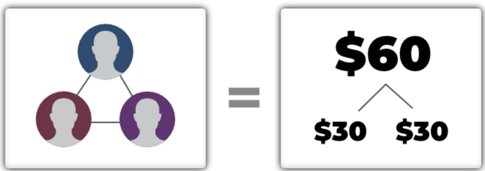

# Add Slight Price Differences in Your Assortment

You prefer assortments with similar options (Sagi & Friedland, 2007). In this scenario, you receive the same benefits from every option — so you don’t lose any benefits by choosing an option.

In one study, researchers asked two groups if they wanted to buy gum. Each group had two options:

» A: Same price (e.g., 63 cents)

» B: Different price (62 cents vs. 64 cents)

Turns out, different prices boosted purchases (Kim, Novemsky, & Dhar, 2012).

But why? Shouldn’t similar prices perform better?

Surprisingly, no.

Paradoxically, the packs seemed less similar with the same price. Customers struggled to distinguish these packs so they searched harder for differences.

# However, slightly different prices can reduce this urge. Customers remained focused on product similarities, so they are more likely to choose an option because they won’t lose benefits by choosing an option.

Kim, J., Novemsky, N., & Dhar, R. (2013). Adding small differences can increase similarity and choice. Psychological science, 24(2), 225-229.

Sagi, A., & Friedland, N. (2007). The cost of richness: The effect of the size and diversity of decision sets on post-decision regret. Journal of personality and social psychology, 93(4), 515.

# Raise Your Price in Small Increments

Adjust prices based on the just noticeable difference (i.e., the difference that’s just noticeable)

If your price is \$11, an increase to \$20 will be more noticeable than an increase to \$12.

Duh.

It seems obvious, but many businesses fail here. They are scared to raise their price, so they wait until it’s absolutely necessary. By that point, however, they need to raise their price by a wide margin.

So, what should you do?

Use frequent (yet smaller) prices changes. Avoid waiting until the moment of desperation.

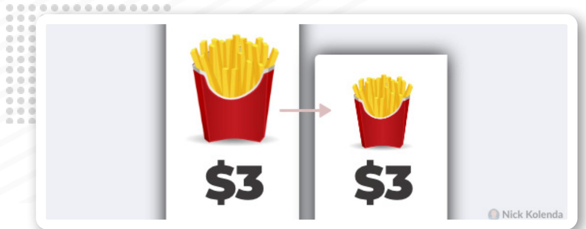

## Downsize a Feature Besides Price

You can change prices without changing the numerals.

If customers are highly price sensitive, adjust a feature that is less noticeable, like physical size. Lower costs will increase your margins without alerting people to the negative change.

If you downsize physical size, reduce the size by all three dimensions — height, width, length — which becomes less noticeable (Chandon & Ordabayeva, 2009).

But obviously, be transparent and use your judgment. Don’t take advantage of customers.

Chandon, P., & Ordabayeva, N. (2009). Supersize in one dimension, downsize in three dimensions: Effects of spatial dimensionality on size perceptions and preferences. Journal of Marketing Research, 46(6), 739-753.

Theory Visuals Framing Numerals

Discounts z

# Make Sale Prices Look Different

Your sale price should look visually different than your original price (e.g., color, size, font; Coulter and Coulter, 2005).

During infomercials, viewers typically see the problem in black-and-white, yet the solution in vibrant color:

I call it contrast fluency. Your brain misattributes these visual distinctions to abstract distinctions: Hmm, something seems different. This product must make a big difference.

Likewise, with numbers: Hmm, this sale price feels different. It must be numerically different.

Coulter, K. S., & Coulter, R. A. (2005). Size does matter: The effects of magnitude representation congruency on price perceptions and purchase likelihood. Journal of Consumer Psychology, 15(1), 64-76.

# Add Space Between Discounted Prices

You conceive numbers along a horizontal ruler.

Thanks to this cognitive structure, you confuse visual distance for numerical distance: Numbers seem numerically further when they are visually further from each other (Coulter & Norberg, 2009).

Add space between your original and sale prices so that the numerical gap seems larger.

Coulter, K. S., & Norberg, P. A. (2009). The effects of physical distance between regular and sale prices on numerical difference perceptions. Journal of Consumer Psychology, 19(2), 144-157.

## Place Sale Prices Below Original Prices

When possible, arrange discounts vertically (Feng, Suri, Chao, & Koc, 2017).

Vertical numbers are easier to subtract because of the digitby-digit comparison. And easy calculations enlarge the gap between numbers (Thomas & Morwitz, 2009).

Caveat: Horizontal formats work better for small discounts because they impede the calculation.

Feng, S., Suri, R., Chao, M. C. H., & Koc, U. (2017). Presenting comparative price promotions vertically or horizontally: Does it matter?. Journal of Business Research, 76, 209-218.

Thomas, M., & Morwitz, V. G. (2009). The ease-of-computation effect: The interplay of metacognitive experiences and naive theories in judgments of price differences. Journal of Marketing Research, 46(1), 81-91.

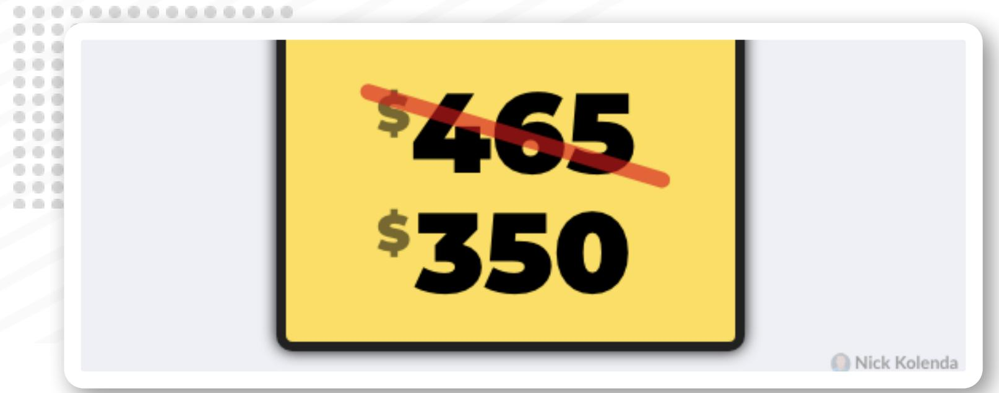

# Reduce Every Digit in the Discounted Price

Customers compare numbers in a digit-by-digit manner, so you should reduce every digit in your sale price (Korvorst & Damian, 2008).

If your price is \$465, aim for a lower numeral in every digit. Though perhaps keep the rightmost digit the same to ease the subtraction of the leftmost digits (Hung et al., 2021).

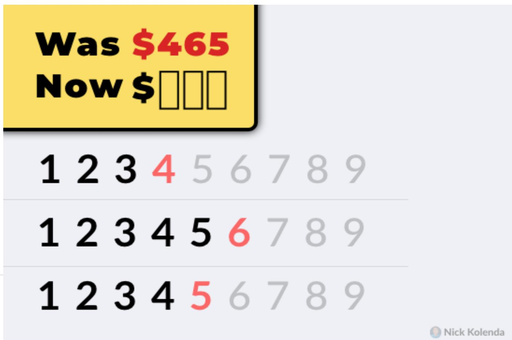

# Offer Discounts With Low Right Digits

Show small numerals in the rightmost digits of your sale price. Small digits enlarge the perceived gap:

...because 3 is 50% greater than 2, and 8 is 14% greater than 7, the absolute difference between 2

and 3 is perceived to be greater than that between 7 and 8, even though their absolute differences are identical. (Coulter & Coulter, 2007, p. 163)

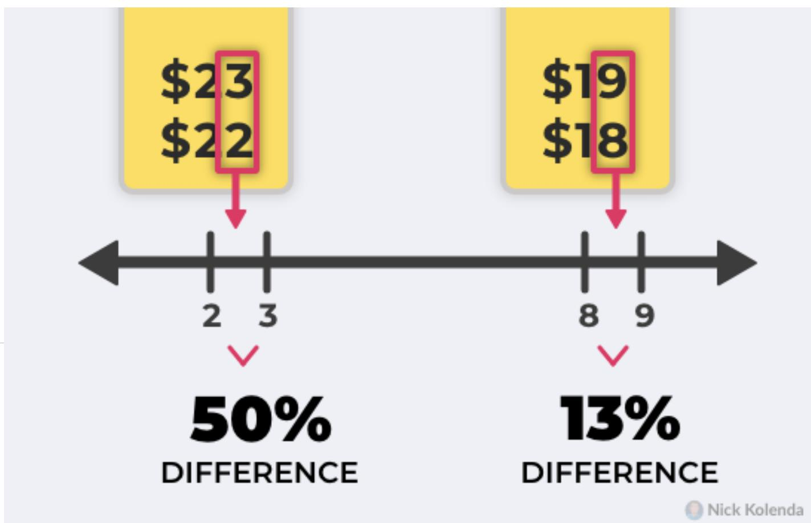

## Follow the Rule of 100

Should discounts be percentages or absolutes?

Consider a \$150 blender. Should you offer 20% off? Or an equivalent \$30 off?

Answer:

» Over \$100? Give absolutes (e.g., \$30)

» Under \$100? Give percents (e.g., 20%)

In both cases, you show the higher numeral. For a \$50 blender, 20% off is the same as \$10 off — yet 20% is more persuasive because it’s a higher numeral. For a \$150 blender, the absolute discount (\$30 off) is a higher numeral (González, Esteva, Roggeveen, & Grewal, 2016).

González, E. M., Esteva, E., Roggeveen, A. L., & Grewal, D. (2016). Amount off versus percentage off—when does it matter?. Journal of Business Research, 69(3), 1022-1027.

# Mention the Increase From Discounted Prices

Most discounts emphasize the decrease in price: “Now 20% off.”

But the reverse framing — “Was 25% higher” — is more persuasive because it shows a higher numeral (Guha et al., 2018).

Guha, A., Biswas, A., Grewal, D., Verma, S., Banerjee, S., & Nordfält, J. (2018). Reframing the discount as a comparison against the sale price: does it make the discount more attractive?. Journal of Marketing Research, 55(3), 339-351.

## Provide a Reason for the Discount

Explain why you’re offering a discount.

This discount will seem temporary, so it won’t impact the customer’s long-term reference price. Without this reason, your discount will make future prices seem more expensive.

Plus, if the discount seems temporary, customers will be more apt to pounce on it. Perhaps you could mention a “clearance” sale. Or you could refer to supplier price cuts:

[some stores] often convey the message that additional cost savings they are able to obtain from suppliers are being passed on to customers... presumably to minimize the negative effects of promotions (Mazumdar, Raj, & Sinha, 2005, p. 88)

Mazumdar, T., Raj, S. P., & Sinha, I. (2005). Reference price research: Review and propositions. Journal of marketing, 69(4), 84-102.

# Offer Discounts in Round Numbers

Recall that specific prices (e.g., \$21.87) seem smaller (Thomas, Simon, & Kadiyali, 2007).

Follow the opposite approach for discounts. Since you want to enlarge discounts, choose round numerals.

Plus, it will be easier to calculate — which will make your discount seem larger (Thomas & Morwitz, 2009).

Thomas, M., Simon, D. H., & Kadiyali, V. (2007). Do consumers perceive precise prices to be lower than round prices? Evidence from laboratory and market data. Evidence from Laboratory and Market Data (September 2007). Johnson School at Cornell University Research Paper, (09-07).

# Give Two Discounts in Ascending Order

Two gains are often preferred to a single lump sum (Kahneman & Tversky, 1979).

Therefore, double discounts can be helpful: Perhaps offer 10% then an extra 40%.

If possible, arrange these discounts in ascending order: 10% then 40%. Ascending momentum makes the total discount seem larger (Gong, Huang, & Goh, 2019).

# Offer Discounts Toward the End of the Month

Payments are more painful when they come from a small budget (Soster, Gershoff, & Bearden, 2014).

Discounts are more effective toward the ends of months because people have depleted their monthly budgets, and they are seeking ways to save money.

Or give free trials at the beginnings of months when budgets are higher:

[free trials] might be better timed at the beginning of the month, or immediately after consumers receive tax refunds, in order to ensure that budgets are not approaching exhaustion at the time of purchase (Soster, Gershoff, & Bearden, 2014, pp. 672-673).

Soster, R. L., Gershoff, A. D., & Bearden, W. O. (2014). The bottom dollar effect: the influence of spending to zero on pain of payment and satisfaction. Journal of Consumer Research, 41(3), 656-677.

# Arrange Discounts in Tiered Amounts

Some business offer tiered discounts in tiered amounts.

» \$50 off \$200

» \$25 off \$150

» \$10 off \$50

» \$5 off \$20

Customers might struggle to imagine the \$200 threshold, but the lowest tier — \$20 — is easy to imagine.

Then, once they imagine spending \$20, it becomes easier to imagine the next threshold of \$50. Then \$150. Then \$200.

You can pick up my book Imagine Reading This Book to learn this mechanism of “simulation fluency.”

## End Discounts Gradually

Consider the price of a television. Most businesses choose one of two pricing strategies:

» Hi-Lo Pricing. \$999...then \$799...then \$999.

» Everyday Low Pricing. \$919 every week.

But recently, there’s a new strategy called steadily decreasing discounts. You gradually retract a discount:

\$999...then \$799...then \$899...then \$999

Over a 30-week span, researchers tested all three pricing strategies for a \$24.95 wine bottle stopper. Revenue was highest with the gradual retraction (Tsiros & Hardesty, 2010).

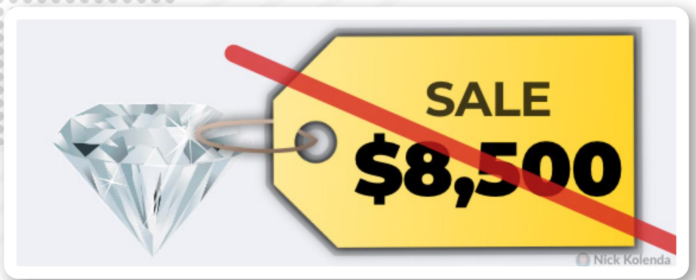

# Don’t Discount Premium Products

Retracting discounts can be harmful. Customers might wait for the next discount or choose a competitor.

This detriment is particularly common for premium products (Wathieu, Muthukrishnan, & Bronnenberg, 2004).

Discounts on premium products are less common, so this scenario pushes attention toward prices — which doesn’t help when your price is already high.

If you sell premium products, avoid discounts. Keep emphasizing the quality of your product.

## Next Step .

If you enjoyed this guide, you’d enjoy my other (free) guides on psychology and marketing.

www.NickKolenda.com