# VISUAL ATTENTION ,

A GUIDE FOR MARKETERS AND MANAGERS

NICK KOLENDA

## Hello...

I’m Nick Kolenda.

In this guide, you’ll learn which stimuli capture attention (and why).

This PDF is free for everyone, so share it with your team or colleagues.

Download my other guides here:

www.NickKolenda.com

## Contents

or use as checklist

## INTRO

About this Guide

6

1. We’re surrounded by a lot of stimuli

2. Our ancestors needed to see important stimuli quickly

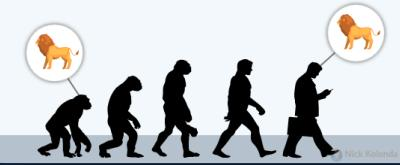

3. We inherited those mechanisms

10

## SALIENCE

Color

13

Orientation

14

Size

15

## MOTION

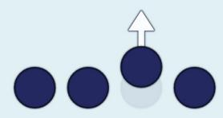

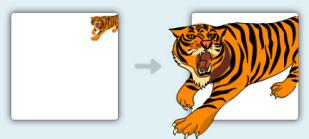

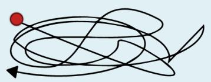

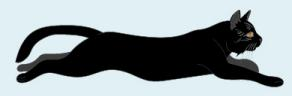

Motion Onset 17   
  
Looming Motion 18   
Animate Motion 19   
Dynamic Imagery 20   
Motion Capacity 21   
X Biological Motion 23

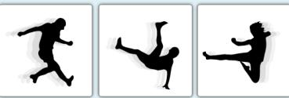

## AGENTS

Faces 25   
Bodies 28   
Body Parts 29   
Animals 30

## SPATIAL CUES

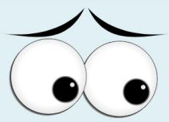

Eye Gaze 32   
Body Orientation 34   
Pointing 35   
Arrows 37   
Down Directional Words 38

## HIGH AROUSAL

<table><tr><td>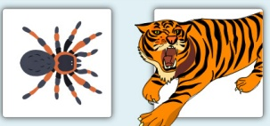</td><td>Threat</td><td>40</td></tr><tr><td></td><td>Sex</td><td>44</td></tr></table>

## UNEXPECTEDNESS

<table><tr><td>Incest</td><td>Taboo</td><td>46</td></tr><tr><td>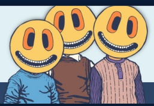</td><td>Novelty</td><td>47</td></tr></table>

## SELF-RELEVANCE

HELLO   
my name is   
Nick

Your Name

Your Face

## GOAL-RELEVANCE

No Goal 54   
Goal-Directed 55

## About This Guide

Capturing attention used to be easy.

How it was:

How it is today:

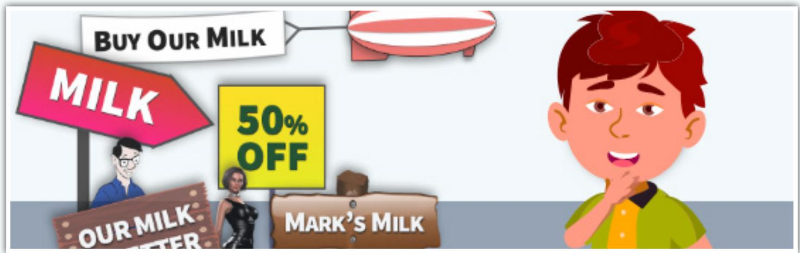

Today, it’s pretty tough.

So I read hundreds of journal articles to answer the question: What captures attention?

Everything in this guide is a stimulus that captures attention automatically.   
They capture attention because of the following three factors.

## 1) We’re surrounded by a lot of stimuli

We can’t see everything, so we use selective attention: We only perceive a fraction of stimuli that enter our consciousness (Moran & Desimone, 1985).

In fact, that’s the mechanism behind subconscious influence. Our eyes perceive more stimuli than we can process. Many stimuli enter our brain without being detected consciously — yet they’re still in our brain. Thus, they influence our perception and behavior.

# 2) Our ancestors needed to see important stimuli quickly

In order to survive, our ancestors needed to see life-threatening stimuli.

…reproductive potential of individuals, therefore, was predicated on the ability to efficiently locate critically important events in the surroundings. (Öhman, Flykt, & Esteves, 2001, p. 466)

And that’s what happened. Our ancestors developed brain regions that monitored the surrounding environment for critical stimuli:

…there should be systems that incidentally scan the environment for opportunities and dangers; when there are sufficient cues that a more pressing adaptive problem is at hand — an angry antagonist, a stalking predator, a mating opportunity — this should trigger an interrupt circuit on volitional attention (Cosmides & Tooby, 2013, p. 205)

Our brain alerted us whenever it detected a threat.

## 3) We inherited those mechanisms

Today, our brain alerts us toward threats.

But here’s the funny thing. We developed these mechanisms millions of years ago. Stimuli that were considered “life-threatening” are less severe today.

Consider vehicles and animals.

Today, vehicles threaten our survival more than animals. But we’re wired to notice animals more than vehicles.

We are more likely to fear events and situations that provided threats to the survival of our ancestors, such as potentially deadly predators, heights, and wide open spaces, than to fear the most frequently encountered potentially deadly objects in our contemporary environment (Öhman & Mineka, 2001, p. 483)

Humans might detect “vehicle” features thousands of years into the future, but hopefully we’ll be teleporting by then.

Here’s the point: We’re wired to notice stimuli that helped our ancestors survive. Even today. Even with stimuli that seem harmless. If you want to capture attention, you need to display stimuli that threatened the survival of our ancestors.

## SALIENCE

## Color

Color might be the most salient dimension (Milosavljevic & Cerf 2008).

Females are more likely to notice red stimuli because they were foragers. They needed to detect red stimuli among green plants (Regan et al., 2001).

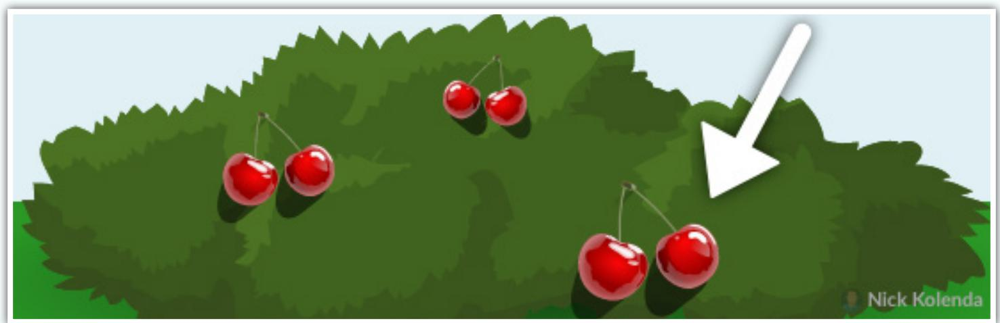

Want people to notice your YouTube video? Look at surrounding thumbnails. Which color are they? Choose a contrasting color that stands out.

## Orientation

We also notice misalignment (Treisman & Gormican, 1988).

Want people to notice your Facebook post? Add white rectangles at the top and bottom so that it appears tilted.

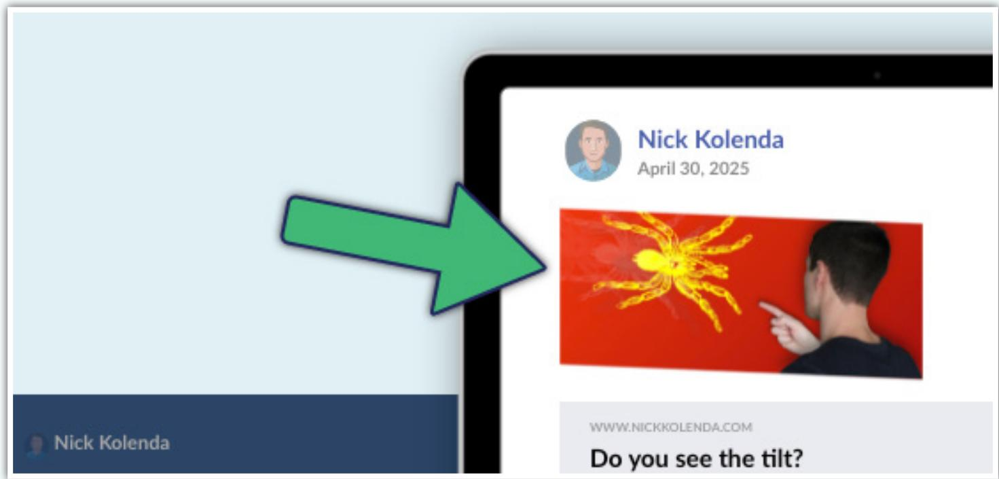

## Size

Contrasting size captures attention (Huang & Pashler, 2005). Especially with lengths and numbers (Treisman & Gormican 1988).

Submitting an article to Reddit or Hacker News? Check the length of recent submissions — are they short or long?

Short? Write a long headline.

• Long? Write a short headline.

A contrasting size will capture more attention.

new | comments | show | ask | jobs | submit

Short Headline 1

Short Headline 2

An example of a really long headline. Like, REALLY long.

Short Headline 3

##

## MOTION

## Motion Onset

Motion onsets are the beginning of motion — and these movements capture attention (Abrams & Christ, 2003).

Want people to notice the button on your website? Add a subtle motion onset, like pulsing.

## Looming Motion

Looming motion occurs when stimuli get larger:

…looming objects are more likely than receding objects to require an immediate reaction, we speculated that the potential behavioral urgency of a stimulus might contribute to whether or not it captures attention. (Franconeri & Simons, 2005, p. 962)

Perhaps you could start a video by zooming inward — this looming motion is more likely to capture and sustain attention.

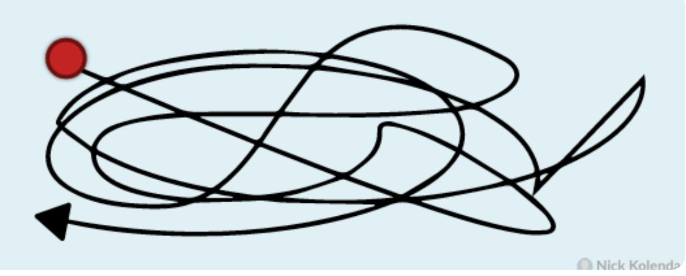

## Animate Motion

Animate motion is unpredictable motion (Pratt, Radulescu, Guo, & Abrams, 2010).

Our ancestors needed to detect this motion to survive predators that attacked without warning.

## Dynamic Imagery

Motion doesn’t need literal movement. Images capture more attention when they depict motion (Cian, Krishna, & Elder, 2015).

Designing an app thumbnail? Add motion

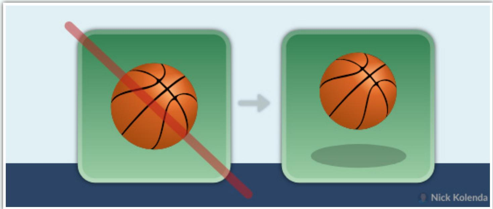

Designing a traffic sign? Add motion.

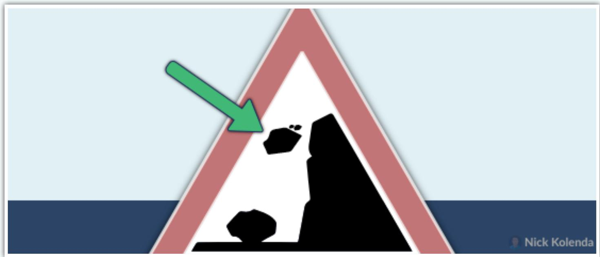

## Motion Capacity

People can find a “V” faster than a “Λ” shape:

Find V

AA

Find

VVVVVVVV VVVVVVVV VΛVVVVVV VVVVVVVV

In that study, researchers argued that we’re more likely to notice V-shape because it resembles the eyebrows of an angry person (Larson, Aronoff, & Stearns, 2007). Supposedly, this ability helped us survive.

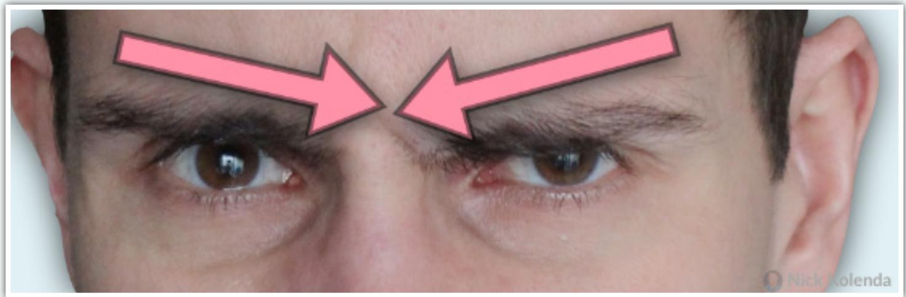

Perhaps… but I’m skeptical. It took me dozens of photos to capture the downward shape in my eyebrows above. And there are many theoretical issues with the “universality” of emotions (which is beyond the scope of this guide).

Instead, I suspect a more plausible explanation: motion capacity.

A V-shape can easily move — it tilts from side to side. However, a Λ-shape remains stable. Thus, we’re more likely to notice stimuli that possess the capacity for motion. This ability helped our ancestors survive.

## Biological Motion

Finally, humans are wired to detect motion of our species (Troje, 2008).

…the right pSTS, revealed an enhanced response to human motion relative to dog motion. This finding demonstrates that the pSTS response is sensitive to the social relevance of a biological motion stimulus. (Kaiser, Shiffrar, & Pelphrey, 2012, p. 1)

Biological motion requires natural body movements. For example, newly hatched chicks prefer natural body movements of a hen, rather than an artificially rotating hen (Vallortigara, Regolin, & Marconato, 2005).

Humans are the same. We notice biological motion:

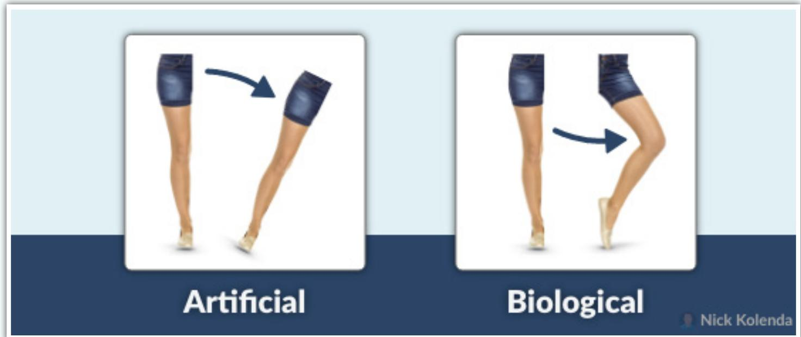

## AGENTS

## Faces

Images of people activate a designated region of our brain, called the superior temporal sulcus (STS; Allison, Puce, & McCarthy, 2000).

In particular, faces activate the fusiform gyrus (Puce et al., 1996).

In other studies, researchers found that people detect changes in faces more easily than in other objects (e.g., clothes; Ro, Russell, & Lavie, 2001).

However, faces need to be upright (Eastwood, Smilek, & Merikle, 2003). Thanks to the face inversion effect, we’re slower to detect inverted faces (Epstein et al., 2006).

Also, here’s a question. What makes a face…well…a face? When does our brain stop recognizing a face?

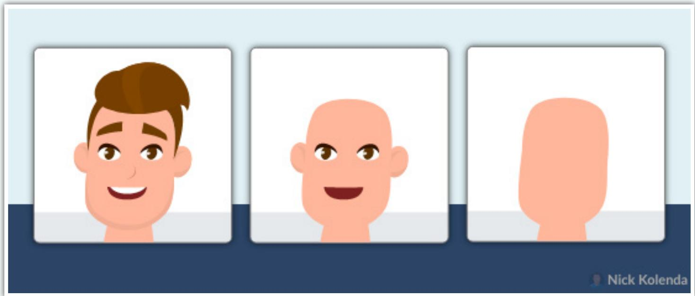

Turns out, our brain looks for underlying geometric patterns:

…our first study indicated that the overall geometric configuration provided by the facial features, rather than individual features, was how a culture defined the emotional representation. (Aronoff, 2006, p. 85)

Ironically, schematic faces can be more attention-grabbing than realistic faces because they are built with geometric shapes.

## Bodies

Our brain can also detect the human body:

…a distinct cortical region in humans that responds selectively to images of the human body, as compared with a wide range of control stimuli. This region was found in the lateral occipitotemporal cortex (Downing, Jiang, Shuman, & Kanwisher, 2001, p. 2470)

In one study, blobs captured more attention when they resembled a human body (Downing et al., 2004).

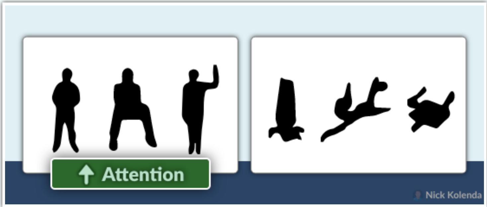

However, we allocate more attention when faces and bodies are present (Bindemann et al., 2010).

## Body Parts

Finally, our brain regions that detect individual body parts (Peelen & Downing, 2007)

For example, researchers found a direct relationship between brain activation and hand realism: Activation was greater with realistic hands (Desimone et al., 1984).

## Animals

If you want to go viral, you just need cute cats.

Seriously. Our ancestors needed to detect animals for survival:

Information about non-human animals was of critical importance to our foraging ancestors. Non-human animals were predators on humans; food when they strayed close enough to be worth pursuing; dangers when surprised or threatened by virtue of their venom, horns, claws, mass, strength, or propensity to charge (New, Cosmides, & Tooby, 2007, p. 16598)

They developed brain regions that detected animals in their periphery. And modern humans inherited those mechanisms.

Your brain looks for geometric patterns:

The monitoring system responsible appears to be category driven, that is, it is automatically activated by any target the visual recognition system has categorized as an animal. (Cosmides & Tooby, 2013, p. 206)

## SPATIAL CUES

## Eye Gaze

Eye gaze captures attention automatically.

Sure, it helped us locate objects and people (Emery, 2000). But there’s another reason behind this trait: social dominance.

Each society, including animals, has a dominance hierarchy (Chance, 1967). Some creatures are more important than others. In order to survive, our ancestors needed to understand their position in this hierarchy. And they needed to identify the most dominant creature.

How? They relied on social attention.

Everyone in a society looks at the most dominant creature more often.

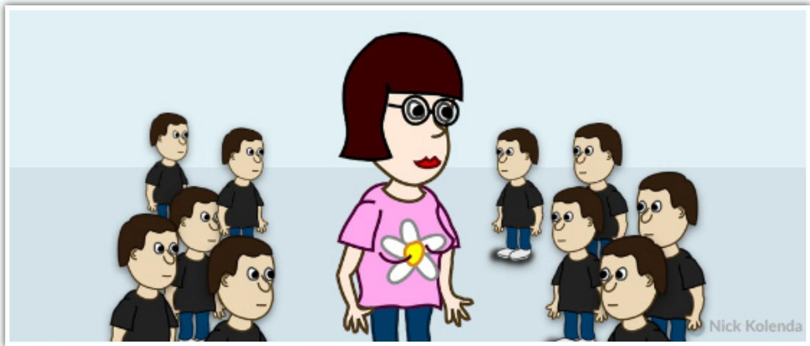

Ancestors who failed to notice these gazes (and thus identify the most dominant creature) would have picked a fight with the wrong beast. And they died. Whoops.

In particular we developed two mechanisms:

1. We developed the ability to detect eyes more easily. Gaze following became “hard-wired” in our brain via the superior temporal sulcus, amygdala, and orbitofrontal cortex (Emery, 2000).

2. Our eyes became more salient. Indeed, “the physical structure of the eye may have evolved in such a way that eye direction is particularly easy for our visual systems to perceive.” (Langton, Watt, & Bruce, 2000, p. 52)

## Body Orientation

Bodies imply the direction of gaze, too.

This effect is additive with eye gaze (Langton & Bruce, 2000). Incorporate as many spatial cues as possible.

## Pointing

Pointing also captures attention.

Researchers compared multiple gestures — turns out, an isolated index finger captured that most attention (Ariga & Watanabe, 2009).

What’s important about the index finger? My guess: It has the optimal ease and accuracy.

It has only one adjacent finger, so we can extend this finger faster than other fingers. Therefore, it’s the best finger for pointing.

Fast forward to today, parents are teaching their kids about the

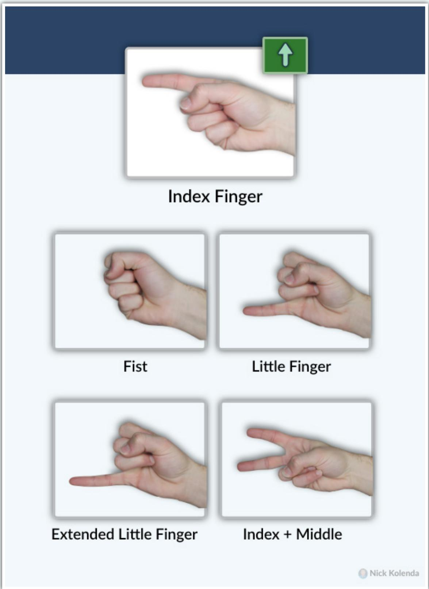

world by pointing. Enough exposures will instill an automatic response. When we see a pointing gesture, we instinctively look.

If that explanation is correct, then other spatial cues (e.g., arrows) should capture attention, too.

## Arrows

Indeed, arrows capture attention, too (Ristic & Kingstone, 2006).

## Directional Words

Spatial words capture attention (Hommel, Pratt, Colzato, & Godijn, 2001).

Don’t ask people to submit the yellow form. Some people are colorblind.   
Instead, ask them to submit the yellow form below the instructions.

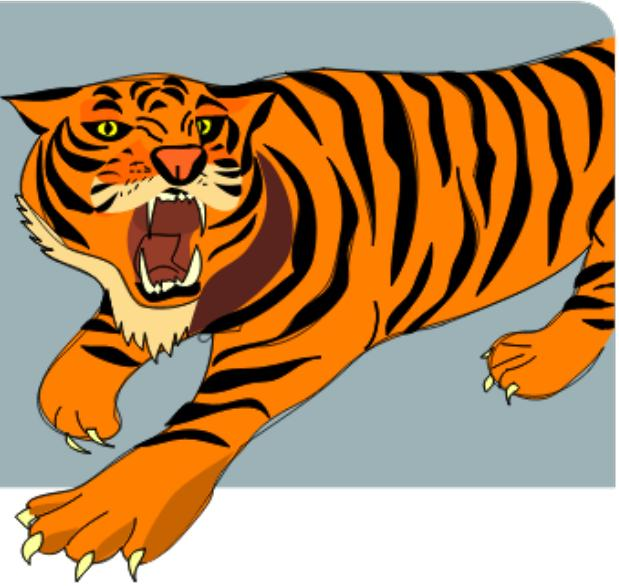

## HIGH-AROUSAL

## Threat

Emotion has two dimensions (Barrett & Russell, 1999):

1. Arousal: Degree of activation

2. Valence: Degree of pleasantness

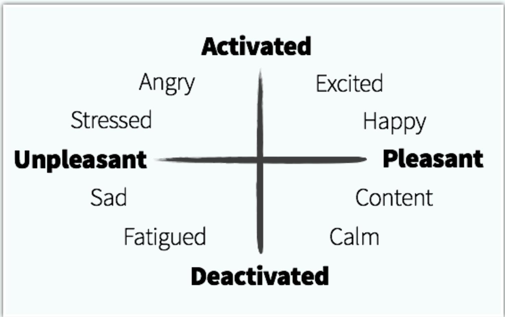  
High arousal emotions capture attention (Anderson, 2005).

For example, below are random words. Don’t read them. Just mentally say the color of the text:

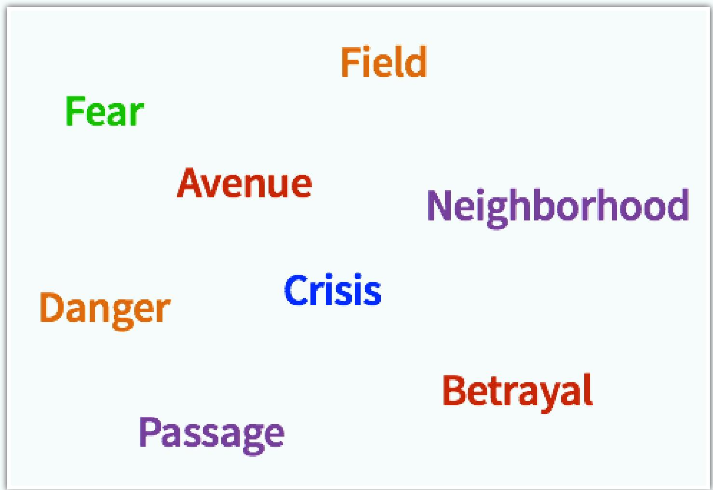

Turns out, we’re slower to name a color if the word is emotional (e.g., fear) because those words capture more attention (Algom, Chajut, & Lev, 2004).

Threats are particularly attention-grabbing. If our brain detects a threat, it triggers a defense mechanism before we consciously notice it (Öhman & Mineka, 2001).

And that’s great. Imagine if we stopped to evaluate threats:

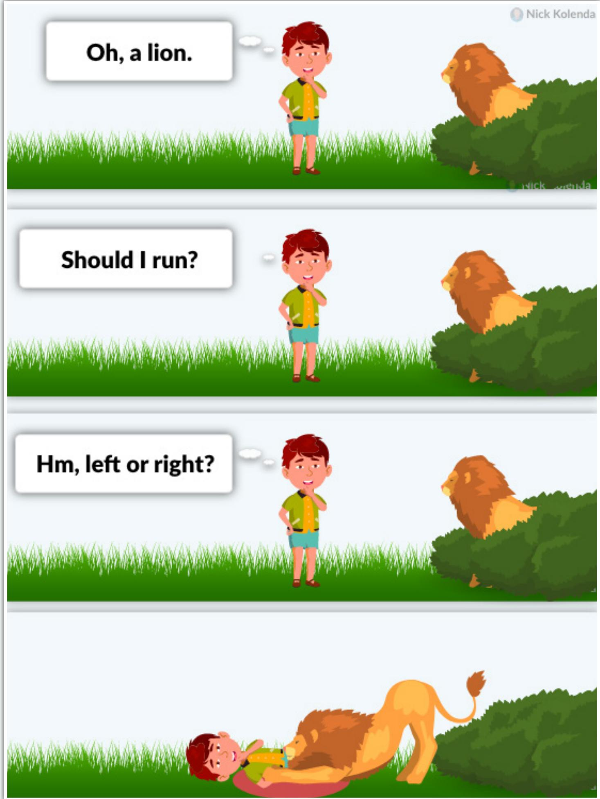

Your attention system is based on conditions that existed millions of years ago. There’s a reason why so many people are afraid of snakes and reptiles — even though we rarely see them today:

…the predatory defense system has its evolutionary origin in a prototypical fear of reptiles in early mammals who were targets for predation by the then dominant dinosaurs. (Öhman & Mineka, 2001, p. 486)

Your brain doesn’t detect the snake itself — it detects the curvilinear shape (LoBue, 2014).

## Same with spiders:

…the reflexive capture of attention and awareness by spiders does not even require their categorization as animals. Performance was often comparable between identifiable spiders and stimuli which technically conformed to the spider template but that were otherwise categorically ambiguous (rectilinear spiders; New & German, 2015, p. 21)

## Sex

Our ancestors were more likely to reproduce when they found a mating partner. Therefore, sexual stimuli are hard-wired into our attention system (Most et al., 2007).

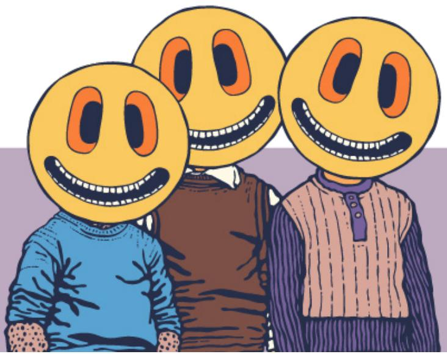

## UNEXPECTED

## Taboo

Taboo words are more attention-grabbing than emotional words (Mathewson, Arnell, & Mansfield, 2008).

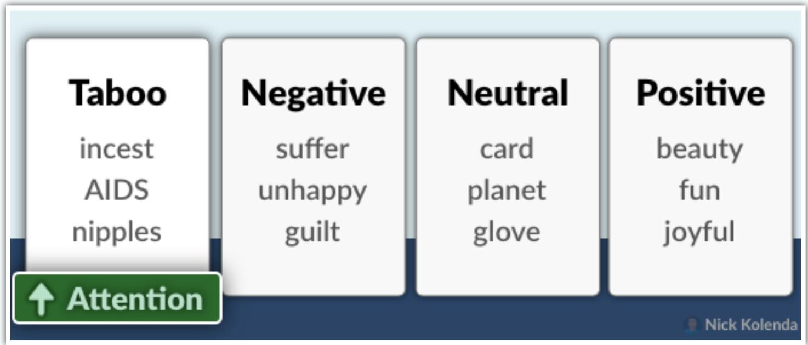

Some speakers (e.g., Tony Robbins) sustain the audience’s attention with profanity.

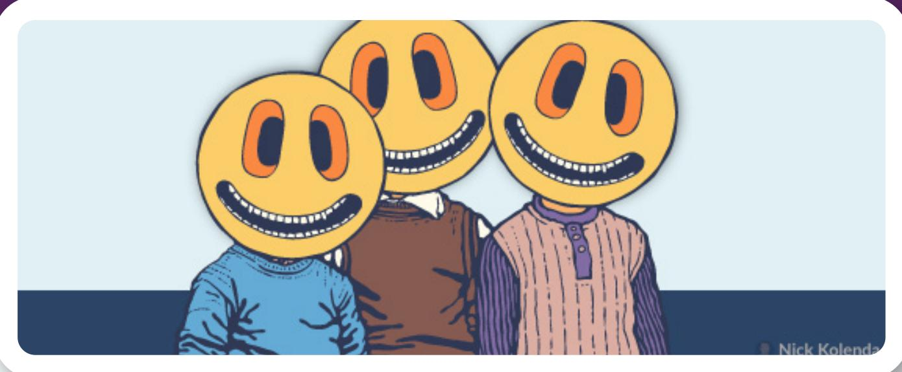

## Novelty

Infants look at novel patterns more than familiar patterns (Fantz, 1964).

Why? Our ancestors were more likely to survive if they detected new stimuli:

…novel popout would appear to have a great deal of survival value because it would allow organisms to quickly perceive and prepare to deal with novel intrusions into their familiar surroundings. (Johnston et al., 1990, p. 3)

Perhaps you could try the pique technique: Researchers received more money when they ask for an unusual amount (e.g., 37 cents), rather than a standard amount (e.g., 25 cents, 50 cents; Santos, Leve, & Pratkanis, 1994). Novelty prevents a mindless refusal by forcing people to evaluate the request.

But any novelty can work. Some websites show a popup as people are leaving:

Perhaps you can make it more novel:  

## SELF-RELEVANCE

## Your Name

You probably experienced the cocktail party effect (Moray, 1959).

You could be engulfed in a conversion. But if someone nearby mentions your name, your attention system slaps you in the face.

…automatic attentional capture ensures that self- related information is not missed and it is effectively encoded when present in one’s nearby environment (Alexopoulos, Muller, Ric, & Marendaz, 2012, p. 777)

Hearing our name activates the medial prefrontal cortex (Perrin et al., 2005). Babies develop that ability at roughly 4.5 months (Mandel, Jusczyk, & Pisoni, 1995).

It also happens with subliminal exposures to our written name (Alexopoulos et al., 2012).

Personalization can be a powerful marketing tool, but be cautious — it can also be creepy:

Participants reported being more likely to notice ads with their photo, holiday destination, and name, but also increasing levels of discomfort with increasing personalization. (Malheiros et al., 2012, p. 1)

Researchers don’t have a name for it. Maybe we could call it the how-the-f\*ckdid-they-know-that effect.

## Your Face

Your face is equally as powerful as your name (Tacikowski & Nowicka, 2010).

A complex bilateral network, involving frontal, parietal and occipital areas, appears to be associated with self-face recognition, with a particularly high implication of the right hemisphere. (Devue & Brédart, 2011, p. 2)

Do you sell clothing online? Perhaps you could create an interactive fitting room. Let users upload their picture to see how the clothing looks on them.

##

## GOAL-RELEVANCE

## No Goal

People notice stimuli when they don’t have an active goal (Cartwright- Finch & Lavie, 2007).

Why? Their cognitive load is lower, which leaves spare room for attention.

For example, shoppers were less likely to notice a banner ad when searching for specific products (Resnick & Albert, 2014). Shoppers who are browsing are more likely to notice advertisements.

To capture attention, advertise in contexts with low cognitive load.

## Goal-Directed

When you search for a blue stimulus, you don’t notice red stimuli (see Baluch & Itti, 2011).

Want people to notice your stimulus? Make it similar to whatever they are monitoring.

During a commercial break on TV, viewers subconsciously monitor for cues from their show to know when it returns. Clever advertisers will hire a celebrity from that TV show, and then air this commercial during a break. Viewers will hear this person’s voice and snap their attention to the TV.

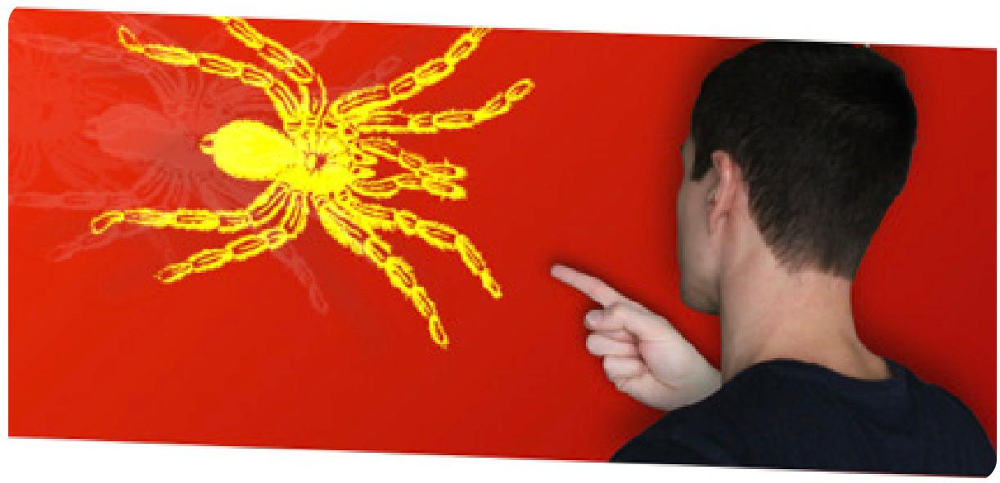

## Conclusion

The previous image contains ALL stimuli from this guide:

1. Salience. The background is a saturated red. It’s salient against the white background of this page. I also tilted the image.

2. Motion. I added a motion blur to the spider.

3. Agents. My body and hand are present.

4. Spatial Cues. I’m pointing to the spider.

5. High Arousal. The spider is an evolutionary threat.

6. Unexpectedness. The image makes no sense. It has novelty.

7. Self-Relevance. My body is facing forward. You can immerse yourself in my shoes.

8. Goal-Relevance. You were already reading this article, so this image lies inside your top-down attention.

## References

Abrams, R. A., & Christ, S. E. (2003). Motion onset captures attention. Psychological Science, 14(5), 427- 432.

Alexopoulos, T., Muller, D., Ric, F., & Marendaz, C. (2012). I, me, mine: Automatic attentional capture by self‐related stimuli. European Journal of Social Psychology, 42(6), 770-779.

Algom, D., Chajut, E., & Lev, S. (2004). A rational look at the emotional stroop phenomenon: a generic slowdown, not a stroop effect. Journal of experimental psychology: General, 133(3), 323.

Allison, T., Puce, A., & McCarthy, G. (2000). Social perception from visual cues: role of the STS region. Trends in cognitive sciences, 4(7), 267-278.

Anderson, A. K. (2005). Affective influences on the attentional dynamics supporting awareness. Journal of experimental psychology: General, 134(2), 258.

Ariga, A., & Watanabe, K. (2009). What is special about the index finger?: The index finger advantage in manipulating reflexive attentional shift 1. Japanese Psychological Research, 51(4), 258-265.

Aronoff, J. (2006). How we recognize angry and happy emotion in people, places, and things. Crosscultural research, 40(1), 83-105.

Baluch, F., & Itti, L. (2011). Mechanisms of top-down attention. Trends in neurosciences, 34(4), 210-224.

Barrett, L. F., & Russell, J. A. (1999). The structure of current affect: Controversies and emerging consensus. Current directions in psychological science, 8(1), 10-14.

Bindemann, M., Scheepers, C., Ferguson, H. J., & Burton, A. M. (2010). Face, body, and center of gravity mediate person detection in natural scenes. Journal of Experimental Psychology: Human Perception and Performance, 36(6), 1477.

Cartwright-Finch, U., & Lavie, N. (2007). The role of perceptual load in inattentional blindness. Cognition, 102(3), 321-340.

Chance, M. R. (1967). Attention structure as the basis of primate rank orders. Man, 2(4), 503-518.

Cian, L., Krishna, A., & Elder, R. S. (2015). A sign of things to come: behavioral change through dynamic iconography. Journal of Consumer Research, 41(6), 1426-1446.

Cosmides, L., & Tooby, J. (2013). Evolutionary psychology: New perspectives on cognition and motivation. Annual review of psychology, 64, 201-229.

Desimone, R., Albright, T. D., Gross, C. G., & Bruce, C. (1984). Stimulus-selective properties of inferior temporal neurons in the macaque. Journal of Neuroscience, 4(8), 2051-2062.

Devue, C., & Brédart, S. (2011). The neural correlates of visual self-recognition. Consciousness and cognition, 20(1), 40-51.

Downing, P. E., Bray, D., Rogers, J., & Childs, C. (2004). Bodies capture attention when nothing is expected. Cognition, 93(1), B27-B38.

Downing, P. E., Jiang, Y., Shuman, M., & Kanwisher, N. (2001). A cortical area selective for visual processing of the human body. Science, 293(5539), 2470-2473.

Eastwood, J. D., Smilek, D., & Merikle, P. M. (2003). Negative facial expression captures attention and disrupts performance. Perception & psychophysics, 65(3), 352-358.

Emery, N. J. (2000). The eyes have it: the neuroethology, function and evolution of social gaze. Neuroscience & biobehavioral reviews, 24(6), 581-604.

Epstein, R. A., Higgins, J. S., Parker, W., Aguirre, G. K., & Cooperman, S. (2006). Cortical correlates of face and scene inversion: a comparison. Neuropsychologia, 44(7), 1145-1158.

Fantz, R. L. (1964). Visual experience in infants: Decreased attention to familiar patterns relative to novel ones. Science, 146(3644), 668-670.

Franconeri, S. L., & Simons, D. J. (2005). The dynamic events that capture visual attention: A reply to Abrams and Christ (2005). Perception & psychophysics, 67(6), 962-966.

Hommel, B., Pratt, J., Colzato, L., & Godijn, R. (2001). Symbolic control of visual attention. Psychological science, 12(5), 360-365.

Huang, L., & Pashler, H. (2005). Attention capacity and task difficulty in visual search. Cognition, 94(3), B101-B111.

Johnston, W. A., Hawley, K. J., Plewe, S. H., Elliott, J. M., & DeWitt, M. J. (1990). Attention capture by novel stimuli. Journal of Experimental Psychology: General, 119(4), 397.

Kaiser, M. D., Shiffrar, M., & Pelphrey, K. A. (2012). Socially tuned: Brain responses differentiating human and animal motion. Social neuroscience, 7(3), 301-310.

Langton, S. R., & Bruce, V. (2000). You must see the point: automatic processing of cues to the direction of social attention. Journal of Experimental Psychology: Human Perception and Performance, 26(2), 747.

Langton, S. R., Watt, R. J., & Bruce, V. (2000). Do the eyes have it? Cues to the direction of social attention. Trends in cognitive sciences, 4(2), 50-59.

Larson, C. L., Aronoff, J., & Stearns, J. J. (2007). The shape of threat: Simple geometric forms evoke rapid and sustained capture of attention. Emotion, 7(3), 526.

LoBue, V. (2014). Deconstructing the snake: The relative roles of perception, cognition, and emotion on threat detection. Emotion, 14(4), 701.

Malheiros, M., Jennett, C., Patel, S., Brostoff, S., & Sasse, M. A. (2012, May). Too close for comfort: A study of the effectiveness and acceptability of rich-media personalized advertising. In Proceedings of the SIGCHI conference on human factors in computing systems (pp. 579-588).

Mandel, D. R., Jusczyk, P. W., & Pisoni, D. B. (1995). Infants’ recognition of the sound patterns of their own names. Psychological science, 6(5), 314-317.

Mathewson, K. J., Arnell, K. M., & Mansfield, C. A. (2008). Capturing and holding attention: The impact of emotional words in rapid serial visual presentation. Memory & Cognition, 36(1), 182-200.

Milosavljevic, M., & Cerf, M. (2008). First attention then intentionMilosavljevic, M., & Cerf, M. (2008). First attention then intention: Insights from computational neuroscience of vision. International Journal of advertising, 27(3), 381-398.

Moran, J., & Desimone, R. (1985). Selective attention gates visual processing in the extrastriate cortex. Science, 229(4715), 782-784.

Moray, N. (1959). Attention in dichotic listening: Affective cues and the influence of instructions. Quarterly journal of experimental psychology, 11(1), 56-60.

Most, S. B., Smith, S. D., Cooter, A. B., Levy, B. N., & Zald, D. H. (2007). The naked truth: Positive, arousing distractors impair rapid target perception. Cognition and Emotion, 21(5), 964-981.

New, J., Cosmides, L., & Tooby, J. (2007). Category-specific attention for animals reflects ancestral priorities, not expertise. Proceedings of the National Academy of Sciences, 104(42), 16598-16603.

New, J. J., & German, T. C. (2015). Spiders at the cocktail party: An ancestral threat that surmounts inattentional blindness. Evolution and Human Behavior, 36(3), 165-173.

Nothdurft, H. C. (2000). Salience from feature contrast: additivity across dimensions. Vision research, 40(10-12), 1183-1201.

Öhman, A., Flykt, A., & Esteves, F. (2001). Emotion drives attention: detecting the snake in the grass. Journal of experimental psychology: general, 130(3), 466.

Öhman, A., & Mineka, S. (2001). Fears, phobias, and preparedness: toward an evolved module of fear and fear learning. Psychological review, 108(3), 483.

Peelen, M. V., & Downing, P. E. (2007). The neural basis of visual body perception. Nature reviews neuroscience, 8(8), 636-648.

Puce, A., Allison, T., Asgari, M., Gore, J. C., & McCarthy, G. (1996). Differential sensitivity of human visual

cortex to faces, letterstrings, and textures: a functional magnetic resonance imaging study. Journal of neuroscience, 16(16), 5205-5215.

Pratt, J., Radulescu, P. V., Guo, R. M., & Abrams, R. A. (2010). It’s alive! Animate motion captures visual attention. Psychological science, 21(11), 1724-1730.

Regan, B. C., Julliot, C., Simmen, B., Viénot, F., Charles–Dominique, P., & Mollon, J. D. (2001). Fruits, foliage and the evolution of primate colour vision. Philosophical Transactions of the Royal Society of London. Series B: Biological Sciences, 356(1407), 229-283.

Resnick, M., & Albert, W. (2014). The impact of advertising location and user task on the emergence of banner ad blindness: An eye-tracking study. International Journal of Human-Computer Interaction, 30(3), 206-219.

Ristic, J., & Kingstone, A. (2006). Attention to arrows: Pointing to a new direction. Quarterly journal of experimental psychology, 59(11), 1921-1930.

Ro, T., Russell, C., & Lavie, N. (2001). Changing faces: A detection advantage in the flicker paradigm. Psychological science, 12(1), 94-99.

Santos, M. D., Leve, C., & Pratkanis, A. R. (1994). Hey Buddy, Can You Spare Seventeen Cents? Mindful Persuasion and the Pique Technique 1. Journal of Applied Social Psychology, 24(9), 755-764.

Tacikowski, P., & Nowicka, A. (2010). Allocation of attention to self-name and self-face: An ERP study. Biological psychology, 84(2), 318-324.

Treisman, A., & Gormican, S. (1988). Feature analysis in early vision: evidence from search asymmetries. Psychological review, 95(1), 15.

Troje, N. F., & Basbaum, A. (2008). Biological motion perception. The senses: A comprehensive reference, 2, 231-238.

Vallortigara, G., Regolin, L., & Marconato, F. (2005). Visually inexperienced chicks exhibit spontaneous preference for biological motion patterns. PLoS biology, 3(7), e208.

## Next Step...

You learned the science of attention.

But how do you apply this knowledge in a real-world design context?

For this next step, you can peek over my shoulder while I tweak the design of websites and interfaces.

View my course on Website Behavior:

www.NickKolenda.com/video-courses